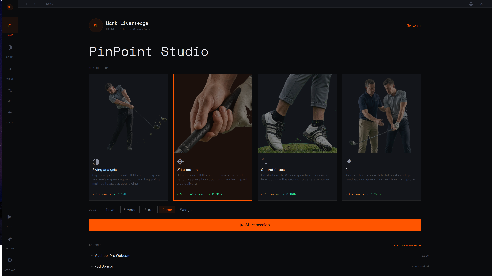
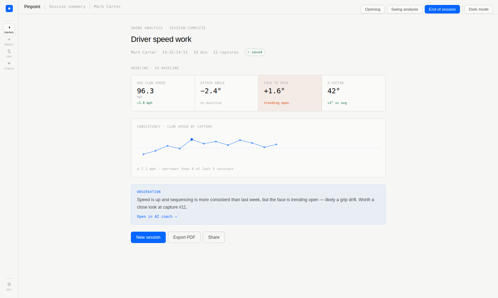

<p align="left">
    
  </p>

# PinPoint Studio

PinPoint Studio is a free, open source and cross-platform desktop application for serious golf swing analysis. It combines high-speed industrial cameras, Bluetooth IMUs, and on-device AI to build a complete picture of the swing — without sending data to the cloud unless you configure it to.

The app is currently in active prototyping. The core capture and analysis pipeline is functional; the coaching and session-history layers are in development.



The long term goal is to exploit computer vision and wearables to analyse golf movements and mechanistically determine your kinematic sequence aka Lateral-Rock-Twist-Jump, extract key golf swing metrics like X-Factor and tilt, working with the full swing or specialist shots such as pitching and in the sand, wrist angles to examine cupping, cocking and flipping, estimated ground forces to support the kinematic sequence analysis. 

Our ambition is to be a platform that can be used by golfers, coaches and researchers to improve everyone's golfing ability and understanding of the golf swing.

## Documentation

The `docs/` folder is organised by audience: **user**, **design**, **developer**, and **reference** (internal build/implementation plans live in `docs/implementation/`).

- [Building Instructions](BUILDING.md) — How to resolve dependencies and build PinPoint Studio.

**User & UX** — [`docs/user/`](docs/user)
- [UX Design](docs/user/pinpoint-ux-design.md) — UI structure, navigation, and interaction design rationale.
- [User Personas](docs/user/personas.md) — Definitions of the three primary user archetypes (club golfer, coach, researcher).
- [Persona UX Assessment](docs/user/pinpoint-persona-assessment.md) — UX evaluation against three user archetypes; identifies gaps and design priorities.
- [Wrist Calibration Guide](docs/user/wristcalibration.md) — How to mount the IMUs and run the two-pose wrist-motion calibration.

**Design** — [`docs/design/`](docs/design)
- [EventBuffer Design](docs/design/event_buffer_design.md) — Architecture and design rationale for the lock-free EventBuffer.
- [Shot Analyzer Design](docs/design/shot_analyzer_design.md) — Post-shot analysis pipeline: phase segmentation, metric extraction, scoring, and the per-session-type analyzer interface.
- [IMU Frame Contract](docs/design/imu_frame_contract.md) — The device-agnostic orientation boundary every IMU consumer depends on.
- [Calibrated Ball Detection](docs/design/ball_detection_calibration.md) — Environment-calibrated stationary-ball detection with a user-in-the-loop calibration protocol.
- [QML Design System](docs/design/pinpoint_qml_design_system.md) — Token system, typography rules, and component patterns; read before writing any QML.
- [Aesthetic Design Concepts](docs/design/aesthetic/pinpoint-aesthetic-concepts.md) — Three visual design directions (Editorial, Instrument, Studio) across light and dark themes.

**Developer guides** — [`docs/developer/`](docs/developer)
- [EventBuffer Developer Guide](docs/developer/event_buffer_developer_guide.md) — Tutorial covering usage, threading model, and integration patterns.
- [Swing Export Developer Guide](docs/developer/swing_export_developer_guide.md) — Per-swing MP4 + swing.json export: pipeline, resume gating, encoder, and sidecar schema.
- [Shot Detector Developer Guide](docs/developer/shot_detector_developer_guide.md) — Multi-modal shot detection: IMU impact + acoustic onset detectors, the arbiter, and latency-aware timestamping.
- [Shot Analyzer Developer Guide](docs/developer/shot_analyzer_developer_guide.md) — The post-shot pipeline: from frozen SwingWindow through analysis to score, metrics, and the unified swing.json.

**Reference** — [`docs/reference/`](docs/reference)
- [Wrist Metrics Reference](docs/reference/wristmetrics.md) — Lead-arm wrist-angle metrics: sign conventions, coaching names, and research-backed bands.
- [WT901BLE67 Protocol Reference](docs/reference/wt901ble67_protocol.md) — Packet formats, register map, and BLE transport details for the Witmotion IMU.

---

## UI shell

The interface uses a left-side navigation rail with an athlete avatar at the top, five mode buttons, and utility buttons at the bottom.

| Mode | Status | Description |
|---|---|---|
| **Home** | Active | Session type selection, device readiness, club selector, and Start button |
| **Swing** | Active | Multi-camera capture with pose estimation, manual + automatic SHOT triggers, and on-stage shot review |
| **Wrist** | Active | Live video tile per session-enabled camera (skeleton overlay) + live lead-arm wrist-angle metrics; SHOT runs the wrist analyzer — the first real one — and adds each shot to the session carousel for on-stage review (requires an athlete) |
| **GRF** | Placeholder | Ground reaction force analysis (requires an athlete) |
| **Coach** | Placeholder | AI coaching output (requires an athlete) |

Wrist, GRF, and Coach redirect to the Welcome screen until at least one athlete has been created.

### Session modes

Every session screen (Swing, Wrist, GRF, Coach) runs in one of three **modes**, chosen from the toolbar's mode switch. The active mode re-lays the centre stage:

| Mode | Stage |
|---|---|
| **Capture** | Live camera tiles with overlays, the SHOT trigger, and the filling shot carousel — the recording surface |
| **Review** | A captured swing promoted onto the stage: its own video with the analyzed overlay, metric charts, and a scrubbable phase timeline |
| **Analyse** | The swing's charts and data table — for reading the numbers rather than the footage |

Mode is the **layout/activity** axis, and it is *orthogonal* to the **data source** — whether you are looking at the *live* session or a *loaded* past one. The two compose: a single click on any carousel card promotes that swing onto the stage and enters Review, and from a live session capture keeps running in the background while you review. See [Shot review — the session stage](#shot-review--the-session-stage).

Each session screen carries a persistent **session toolbar** — clock, Capture control, central SHOT trigger, End Session, the mode switch and View control, and Cameras/IMUs device pills with in-panel device management and calibration. See [Session toolbar](#session-toolbar).

Three utility buttons sit at the bottom of the rail:

| Button | Description |
|---|---|
| **Play ▶** | Developer hatch — direct access to legacy tab pages during prototyping |
| **System ◈** | Opens the resource monitor (buffer, camera, and IMU diagnostics) |
| **Settings ⚙** | Opens the full Settings screen (see [Settings](#settings)) |

The **Settings** screen selects from eight visual themes — four aesthetics (Instrument, Editorial, Studio, Vector) × two modes (light, dark) — and the selected theme is persisted across restarts. See [Aesthetic Design Concepts](docs/design/aesthetic/pinpoint-aesthetic-concepts.md).

| Editorial | Instrument | Studio |
|---|---|---|
|  |  |  |

---

## Features

### Home screen

The Home screen is the default landing page and the starting point for every session.

- **Session type cards** — Four modes displayed as selectable cards, each showing a description, required device counts, and live readiness indicators:

  | Mode | Cameras | IMUs | Description |
  |---|---|---|---|
  | **Swing analysis** | 2 required | 3 required | Sequencing and key swing metrics via spine IMUs |
  | **Wrist motion** | 1 optional | 2 required | Wrist angle and club delivery analysis |
  | **Ground forces** | 2 required | 3 required | Ground use and power generation via hip IMUs |
  | **AI coach** | 2 required | 3 required | Shot-by-shot feedback from an AI coach |

- **Device readiness** — Each card shows a live `✓ / ⚠` status for cameras and IMUs independently. Cameras require at least the stated number to be enumerated; Wrist motion shows the camera as optional (amber tick when absent, green when present).
- **Club selector** — Choose the club in play before starting; recorded with the session.
- **Start session** — Opens the session wizard once device requirements are met.

### Session wizard

A five-step guided flow that prepares a session before recording begins. Steps are shown as a horizontal progress rail; Back/Continue navigation is available at each step.

| Step | Name | Description |
|---|---|---|
| 0 | **Goals** | Confirm the session type and set an optional speed target for the session |
| 1 | **Cameras** | Review discovered cameras; assign face-on / down-the-line / other perspective; toggle mirroring |
| 2 | **IMUs** | Connect sensors; assign body placement slots (A–D); Continue is locked until all required IMUs are connected |
| 3 | **Calibration** | Two-phase IMU calibration (see below); Continue is locked until calibration is complete |
| 4 | **Ready** | Confirm the session summary; Start begins capture |

Pressing Back from any step returns to the previous one. Navigating back to the Calibration step retains a completed calibration for the life of the current `ImuInstance`; starting a new wizard session with the same connected device also restores it. The **Recalibrate** button is always available to restart the sequence.

### Session toolbar

A persistent toolbar pinned to the top of every mode screen (Swing, Wrist, GRF, Coach), built as a single reusable component shared across all four. It carries the session clock, one global capture control, a SHOT trigger, End Session, the mode switch and View control, and two device pills.

- **Capture** — anchored at the far left with the session clock alongside it. It is the **single owner of the EventBuffer state**: Capture/Stop toggles the user capture intent (`resumeBuffer` / `pauseBuffer`) and starts the session clock on first capture. Nothing else changes the net buffer state — ball detection is signal-only (it drives overlays, never capture).
- **SHOT** — centred trigger that funnels every shot source through a single `ShotController`: the manual button always, plus the automatic IMU-impact and acoustic-onset detectors when *Auto-detect swing* is on (pose/ball later). Armed only while the buffer is capturing and the shot processor is idle; firing it runs the post-shot pipeline (see [Shot capture & analysis](#shot-capture--analysis)). A **DETECT** cluster of per-modality dots (IMU / Acoustic / Ball) sits alongside — each glows while its detector is armed and flashes green on a firing.
- **Mode switch** — a three-segment **Capture / Review / Analyse** control, the primary layout control of the stage. Selecting a mode re-lays the centre stage to that mode's saved layout; choosing Review with no swing focused shows a "select a swing" prompt rather than blocking. Switching mode never stops live capture (that is the data-source axis — see [Session modes](#session-modes)).
- **View** — a pill showing the current mode; tapping it opens the View panel, which edits *that mode's* layout: which panels are shown (camera, charts, table, timeline, carousel — plus a dashboard placeholder) and how the stage packs them (**tabs / split / stage**). Edits apply live and persist per mode; there are no named presets.
- **End Session** — ghost button (visible while a session runs) with a small confirm popup; ends the session clock, stops capture, and unlocks navigation.
- **Device pills** — Cameras and IMUs, each with a connected-count badge and aggregate state. A pill turns amber and reads **"calibrate"** when a connected device still needs calibration; the IMU pill instead warns **"battery N%"** (amber, or red below 20%) when any connected sensor drops below 50%.
- **Drop-down panels** — Tapping a pill opens a panel beneath it with a scoped action row (**Scan / Connect / Calibrate**) and a per-device list. Opening one panel closes the other; click-away or Esc dismisses.
  - **Per-device enable toggles** — Session-local enable/disable per camera and IMU, seeded from the Settings-level exclusion list but never written back (global enablement stays owned by the Settings screen). Camera session enablement lives in `CameraManager` so every toolbar and mode screen shares one list — the mode screens show a video tile per session-enabled camera, and toggling a camera off removes its tile. Connect connects every enabled, not-yet-connected device and starts the camera capture pipeline (the screens' video tiles stream from it); disabling a connected device disconnects it.
  - **Live pose toggle** — An all-cameras switch in the camera panel that gates pose inference itself (not just the overlay); ball detection and the shot replay pipeline are unaffected.
  - **IMU rows** — Live connection-state LED (grey idle · flashing grey/green connecting · green connected · red failed), battery and data-rate, and the configured body placement.
  - **Camera rows** — Connection-state dot, perspective, serial, and interface.
- **In-panel calibration** — The Calibrate action runs the calibration flow *inside* the panel; it never opens the full-screen wizard or leaves the mode screen. The IMU flow is the exact same state machine as the session wizard's Calibration step — extracted into a shared `ImuCalibrationFlow` component rendered compactly — so calibration is single-sourced. The Calibrate action and pill stay framed in call-to-action amber until calibration is *successful* (mount validation passes). Camera (stereo) calibration is a placeholder pending the calibration pipeline.

### Athlete management

Every session belongs to an athlete. The athlete management flow is the entry point to the app.

- **Create athlete** — Required fields: name, handedness. Recommended: height, weight, handicap, primary club. Optional: driver speed target, notes/tags.
- **Athlete picker** — Shows the three most-recently-active athletes as cards, plus a full searchable list. The selected athlete's initials appear in the rail avatar.
- **Delete athlete** — Destructive action available in the picker with a single click on the highlighted athlete.
- **Persistence** — All athlete records stored in `QSettings` (INI format); survives restarts. Heights stored in ft, weights in lb regardless of entry unit.
- **Navigation guard** — Wrist, GRF, and Coach modes require at least one athlete; selecting them from the Home screen redirects to the Welcome screen if the roster is empty.

### Swing — multi-camera video analysis

- **Multi-camera support** — Select any combination of discovered cameras; each gets its own side-by-side view with independent pose estimation. Start/Stop controls all cameras simultaneously.
- **Shared video view** — Every screen renders cameras through one component (`PpCameraFrame`) with per-screen configurable overlays (skeleton, hitting area, badges). Each `CameraInstance` *publishes* its frames to all subscribed views — any number of views can show the same camera at once, across screens.
- **Camera backends** — UVC webcams, Aravis (GenICam industrial cameras), Spinnaker (Teledyne/FLIR).
- **Spinnaker pipeline** — Raw Bayer bytes captured with no CPU demosaic on the hot path; a custom `QQuickRhiItem` runs a bilinear GPU Bayer demosaic shader at display rate while the pose estimator receives OpenCV-demosaiced frames at its already-throttled rate.
- **Pose estimation** — MoveNet SinglePose Lightning and Thunder via ONNX Runtime — real-time skeleton overlay on each live feed, switchable per camera.
- **Ball detection** — Drives the hitting-area overlay and ball-present indicator only. It is signal-only and never starts, stops, or replays capture (the buffer is owned solely by the Capture control).
- **GPU acceleration** — CoreML (Apple Silicon), CUDA 12/13 (NVIDIA on Linux/Windows).

### Shot capture & analysis

A shot is the unit of analysis. Every shot source funnels through one `ShotController`, and a single `ShotProcessor` owns the post-shot pipeline. Shots fire **manually** (the toolbar SHOT button) or **automatically**: with *Auto-detect swing* on — the default — an IMU-impact detector and an acoustic-onset detector each report candidates to an arbiter that fuses them (commit when two modalities agree within 40 ms, or on a lone high-confidence candidate) and back-dates the timestamp to true impact. Pose- and ball-based detectors join later.

- **Trigger → post-roll** — On a shot, the buffer keeps capturing for a short post-roll so the follow-through lands in the ring, then pauses and freezes the trailing ~5 s as an immutable `SwingWindow`.
- **Analyse ∥ export** — The frozen window feeds two concurrent workers reading it zero-copy: the per-session-type **shot analyzer** (Swing / Wrist / GRF / Coach) and the **swing exporter** (per-camera MP4 + thumbnail). The Wrist analyzer is the first real one — it segments swing phases, extracts lead-arm wrist metrics, and produces a banded swing score.
- **¼-speed auto-replay (Capture)** — Immediately after a shot, its camera footage replays in-place at ¼ speed on the live tiles with a `REPLAY ¼×` overlay and a pulsing badge — a transient confirmation that reads the frozen window's frames directly, independent of whether analysis or disk export succeeded. Press **Esc** to skip it. (Full, scrubbable review happens on the stage — see [Shot review — the session stage](#shot-review--the-session-stage).)
- **Persistence** — Each shot is written as one unified `swing.json` (raw frames + analysis) plus its MP4/thumbnail. Shots reload from disk on startup, so a session's history survives restarts; the analysing indicator on the toolbar shows when the pipeline is busy.

### Shot review — the session stage

A captured (or loaded) shot is reviewed by promoting it onto the main session **stage** — the same camera/charts/timeline panels the live session uses — rather than a pop-over. The shot **carousel** at the foot of every session screen is the filmstrip that drives it.

- **Single click promotes** — Clicking a card makes that swing the focused swing, loads it onto the stage, and enters **Review** mode. Clicking another card swaps the focused swing in place (Lightroom-style filmstrip → loupe). The carousel stays hot during Capture, so you can drop into review mid-session — and on a live session, capture keeps recording in the background while you do.
- **Cross-machine safe** — The stage enumerates the *reviewed swing's own* camera streams from its `swing.json`, never the local rig, so a swing recorded on a different setup (different camera count, perspectives, aspect ratios) still plays back, degrading gracefully when streams or analysis are missing.
- **Stage panels** — In Review the camera tiles render the swing's video with the analyzed skeleton/club overlay (face-on stream); the **charts** panel draws its metric traces; the **timeline** panel carries a scrub slider and bold, clickable phase pills — all locked to one playhead. An always-on **transport** (play/pause, frame-step, speed) keeps working even when the timeline panel is hidden. *Analyse* mode swaps the footage for the swing's charts and a read-only data table.
- **Shot cards** — Thumbnail, swing score, and a tappable star rating; cards persist their rating and free-text note back to `swing.json` (rating is editable directly on the card, no pop-over).
- **Exit** — Leave Review via the mode switch, the Capture control, or **Esc**; from a live session that returns you to the running capture.
- **Sessions & trash** — A sessions drawer opens past sessions from disk for review; shots move to trash (recoverable, with an Undo toast) rather than being deleted outright, and bulk export/trash act on the filtered selection.

### IMU — wrist motion capture

- **Device** — Witmotion WT901BLE67 BLE 6-axis IMU (accelerometer, gyroscope, Euler angles, quaternion).
- **Multi-device support** — Select any number of discovered IMUs simultaneously; each gets its own side-by-side 3D visualiser, state label, battery badge, rate selector, and Zero button. Mirrors the multi-camera chip pattern.
- **Device chips** — One toggle chip per enumerated IMU at the top of the Play → IMU tab; tap to connect/disconnect. Devices appear as soon as the BLE scan finds them.
- **3D orientation visualiser** — Labelled cube driven by the corrected quaternion; matches the physical device orientation in real time. The `ImuVizView` component is shared between the capture page (per-instance) and the settings test panel.
- **Auto-initialisation** — Sets vertical mounting, 6-axis algorithm, 100 Hz output rate, and zeros orientation to current position on every connect.
- **Orientation fusion** — Orientation is re-derived on-host from the raw gyroscope + accelerometer stream by a selectable software filter (Madgwick or ESKF), used by the wrist-kinematics calibration path. Chosen globally in Settings → IMUs and applied to all connected devices immediately.
- **Two-phase session calibration** — The session wizard Calibration step captures two reference quaternions for the lead-arm IMU (slot A):
  - *Phase 1 — arm at rest:* an animated guide demonstrates the resting position; once the IMU is stable for 3 cumulative seconds the arm-down quaternion is captured.
  - *Phase 2 — T-pose:* the guide raises to T-pose; another 3-second stable hold captures the T-pose quaternion.
  - Both quaternions are stored in memory on the `ImuInstance` for the duration of the session. They are not persisted to disk; reconnecting or deselecting the device clears them. The Recalibrate button restarts the sequence at any time.
- **Zero button** — Re-zeroes orientation on demand for mid-session repositioning, per device.
- **Rate selector** — Adjustable output rate per device (10 / 20 / 50 / 100 / 200 Hz).
- **Live data rate** — 2-second rolling Hz average shown per device.
- **Battery indicator** — Colour-coded BAT: N% badge per device, polled via register 0x64 every 60 s. The session toolbar's IMU pill also surfaces the lowest connected level, warning **"battery N%"** when any sensor drops below 50%.
- **Auto-retry** — One automatic retry after a 45-second cooldown on failed connections (device requires ~40 s to exit cooldown after a rejected attempt).
- **Session log** — Timestamped per-record diagnostics per device; Save Log writes to `~/imu_log_<MAC>_<timestamp>.txt`.

### Audio — speech interface

- **Speech-to-text** — Whisper.cpp (local, Vulkan/CUDA GPU-accelerated) with Azure Speech REST fallback for CPU-only systems. Backend badge in the UI shows GPU / Cloud / Apple; clickable to toggle when cloud fallback is available.
- **Text-to-speech** — Kokoro TTS (local, ONNX Runtime) with Azure Neural Voice fallback for CPU-only systems. Same badge/toggle pattern.
- **Latency display** — Per-request latency shown next to each badge (e.g. `523 ms`).
- **Acoustic shot detection** — The selected microphone also feeds an onset detector that auto-triggers shots on club-impact sound (one of the multi-modal detectors above); gated and tuned in Settings → Microphone, independent of voice/STT. See [Shot capture & analysis](#shot-capture--analysis).

### Settings

The Settings screen uses a sidebar navigation with full-text search (Ctrl/Cmd+F) and panel-level organisation.

| Panel | Status | Contents |
|---|---|---|
| **General** | Active | Language, measurement units, session behaviour (auto-detect swing, AI coaching), update and diagnostics preferences |
| **Appearance** | Active | Theme selector (8 options), font scale, UI density, reduce motion, pose overlay opacity |
| **Displays** | Active | Main display placement, window geometry memory, secondary display output, post-shot content and delay, UI frame-rate cap, hardware acceleration |
| **Cameras** | Active | Per-camera enable/disable, view assignment (Face-on / Down-the-line / Other), mirrored image toggle, frame-rate chips, trigger mode (Free-run / HW sync), ROI crop with live preview; global pre-roll buffer and camera-sync toggle |
| **IMUs** | Active | Per-device enable/disable, body placement assignment (A–D), output rate chips, save-to-flash, live test panel with 3D viz and Euler angles; global auto-connect, auto-reconnect, save-calibration-to-flash, and orientation-fusion algorithm (Madgwick / ESKF) |
| **Microphone** | Active | Single-active input-device selection; "use microphone for shot detection" toggle (acoustic modality only — voice/STT unaffected); live calibration view with a dB level trace, trigger-threshold line, per-detection markers + chime, and a sensitivity slider |
| **Launch Monitor** | Placeholder | External launch monitor integration (not yet implemented) |
| **Storage** | Active | Athlete library path, session folder naming, auto-save; video codec/resolution/quality/container; sensor data export format |
| **Archiving** | Placeholder | Session archive path and retention policy (not yet implemented) |

The Cameras panel shows sensor info (vendor/model, resolution, pixel format, bit depth) and a real-time storage estimate (per-frame MB and ring-buffer slot count) that updates as the ROI is adjusted.

### Film — video annotation

- **YouTube download** — Bundled yt-dlp fetches videos from YouTube (Premium quality, browser cookie auth) to a local cache; no re-download on repeat analysis.
- **On-demand annotation** — Pause on a frame, click Annotate: runs a person segmentation model (u2netp) to isolate the golfer, blurs the background, then runs MoveNet for a clean pose estimate.
- **Skeleton overlay** — Background-blurred frame displayed with the MoveNet skeleton drawn on top.
- **Scrubbing** — Live frame preview while dragging the seek slider.

---

## Device lifecycle

Every physical device — camera or IMU — passes through the same four stages. New code must respect this contract; violating it corrupts the EventBuffer or leaks ring-buffer memory.

### Stages

```
Enumerated → Selected → Recording → Deselected
     ↑            ↓                      ↓
  (scan)    registerSource()      deregisterSource()
```

| Stage | Camera | IMU |
|---|---|---|
| **Enumerated** | `VideoInputFactory::enumerateDevices()` at `CameraManager` construction. Device appears in `cameraList`; no `CameraInstance` exists. | `DeviceEnumerator::scanImu()` starts async BLE scan at `ImuManager` construction. Device appears in `imuList` as discovered; no `ImuInstance` exists. |
| **Selected** | User taps chip → `CameraManager::setSelected(i, true)` → `CameraInstance` constructed → `EventBuffer::registerSource()`. | User taps chip → `ImuManager::setSelected(i, true)` → `ImuInstance` constructed → `EventBuffer::registerSource()`, then `start()` begins the async BLE connection. |
| **Recording** | `CameraManager::startAll()` → `CameraInstance::startRecording()` on each selected instance. The buffer enters Capturing when the user presses Capture (the session-global capture intent) — independent of ball detection. | IMU writes data continuously once the BLE connection is established; the EventBuffer's Capturing/Paused state gates whether the merger reads from the ring. |
| **Deselected** | User taps chip → `CameraManager::setSelected(i, false)` → `stopRecording()` if active → `deregisterFromBuffer()` → `deleteLater()`. | User taps chip → `ImuManager::setSelected(i, false)` → `stop()` (BLE disconnect) → `deregisterFromBuffer()` → deferred `deleteLater()`. |

### Invariants

These invariants must hold at all times:

1. **No registration at startup.** Neither manager creates instances or registers sources in its constructor. The first registration always follows an explicit user selection.

2. **Register on selection, deregister on deselection.** `registerSource()` is called exactly once — in the device instance constructor, which runs inside `setSelected(…, true)`. `deregisterSource()` is called exactly once — in `deregisterFromBuffer()`, which runs inside `setSelected(…, false)` and in the manager destructor.

3. **Buffer is paused around every register/deregister call.** `setSelected()` snapshots `wasCapturing`, calls `pause()` before touching sources, then restores the buffer state after. This prevents the EventBuffer merger from reading a half-initialised or already-freed source.

4. **`deregisterFromBuffer()` is called before `deleteLater()`.** The instance pointer is nulled and `instancesChanged()` emitted first so QML delegates are torn down while the object is still live; deregistration happens next; only then is the object queued for deletion.

5. **Excluded ≠ deselected.** The `excluded` flag is a Settings-level preference (applied via `setExcluded()`). Setting `excluded = true` on a currently-selected device triggers an explicit `setSelected(…, false)` call, which follows invariant 4 above. Clearing `excluded` on a deselected device triggers `setSelected(…, true)`.

6. **Re-enumeration is safe.** Calling `enumerateDevices()` again (e.g. after a settings scan) only adds new entries to `DeviceEnumerator`; it never removes or invalidates live instances or registered sources.

### Buffer state machine

The EventBuffer's net state is owned **solely by the session-global capture intent** (the toolbar Capture/Stop). Ball detection is signal-only and never moves it. `CameraManager` applies the intent; `ShotProcessor` owns the post-shot `SwingWindow` lifecycle.

```
Idle ──Capture──▶ Capturing ──SHOT──▶ post-roll ──▶ pause + freeze SwingWindow
  ▲                  ▲                                analyse ∥ export ──▶ ¼× replay
  └──── Stop ────────┴───────────── restore capture intent ◀── window destroyed
```

- **Idle** — before the first Capture (and with no registered sources).
- **Capturing** — capture intent is on; the merger reads all registered sources and builds the merged timeline. This is the steady state of a live session.
- **Paused** — capture intent is off (after Stop), or held transiently while the shot pipeline owns a `SwingWindow`. The merger does not advance the timeline; ring memory stays live.
- A SHOT keeps capturing through a short post-roll, then pauses and freezes the trailing ring as a `SwingWindow`. `resume()` is blocked while that window is live; once it is destroyed the user capture intent is re-applied (back to Capturing if the session is still capturing).

### Applying this to new device types

To add a new device type (e.g. a launch monitor, a force plate):

1. Create a `DeviceEnumerator` scan path; populate results with `DeviceType::YourType`.
2. Create a manager class (e.g. `LaunchMonitorManager`) following the `ImuManager` pattern: constructor scans only, no instances created.
3. Create an instance class (e.g. `LaunchMonitorInstance`) that calls `registerSource()` in its constructor and exposes `deregisterFromBuffer()`.
4. In `setSelected(…, true)`: pause buffer → construct instance (registers source) → re-apply the capture intent.
5. In `setSelected(…, false)`: pause buffer → stop → `deregisterFromBuffer()` → null the pointer → emit changed → `deleteLater()` → re-apply the capture intent.
6. In the manager destructor: repeat the deselection teardown for all live instances.

---

## Technology

Built with **Qt 6.11** and **C++20**.

| Component | Technology |
|---|---|
| UI | Qt Quick / QML (Qt 6.11) |
| Speech-to-text | whisper.cpp (Vulkan / CUDA) + Azure Speech REST |
| Text-to-speech | Kokoro ONNX Runtime + Azure Neural Voice |
| Pose estimation | MoveNet Lightning / Thunder, ViTPose-B (ONNX Runtime) |
| Person segmentation | u2netp (ONNX Runtime) |
| Video download | yt-dlp (bundled binary) |
| GPU acceleration | Vulkan, CUDA 12 + 13, CoreML (Apple Silicon) |
| Image processing | OpenCV 3.0+ |
| IMU | Witmotion WT901BLE67 via Qt Bluetooth LE |
| Athlete data | QSettings (INI format, `~/.config/PinPointStudio/PinPointStudio.ini`) |

---

## Local files

PinPoint Studio reads and writes files in several locations. Platform paths shown for Linux; macOS and Windows equivalents are noted in brackets.

### Application data directory
`~/.local/share/PinPointStudio/` (macOS: `~/Library/Application Support/PinPointStudio/`, Windows: `%APPDATA%\PinPointStudio\`)

| Path | What | When |
|---|---|---|
| `models/whisper/<model>.bin` | Whisper STT model | Copied from the CMake build cache at build time |
| `models/kokoro/` | Kokoro TTS ONNX model + voice data | Downloaded from HuggingFace on first launch when a GPU is detected |
| `film-cache/<video_id>.mp4` | Downloaded YouTube videos | Written by yt-dlp on demand; never auto-deleted |

### Application settings
`~/.config/PinPointStudio/PinPointStudio.ini` (macOS: `~/Library/Preferences/com.PinPointStudio.PinPointStudio.plist`, Windows: `%APPDATA%\PinPointStudio\PinPointStudio.ini`)

The app forces `QSettings::IniFormat` (see `src/Core/pp_settings.h`), so on Windows settings are an INI file, **not** registry keys.

**Status key** — ✅ wired (read by app code; drives behaviour) · ⚙️ live (applied interactively but not restored on next startup/reconnect) · 📋 planned (persisted; not yet consumed outside settings)

**UI**

| Key | Default | Status | What |
|---|---|---|---|
| `ui/themeIndex` | `0` | ✅ | Selected visual theme (0–7: Instrument light/dark, Editorial light/dark, Studio light/dark, Vector light/dark) |
| `ui/windowWidth` | `1120` | ✅ | Main window width in pixels; updated on every resize |
| `ui/windowHeight` | `700` | ✅ | Main window height in pixels; updated on every resize |
| `ui/windowX` | `-1` | ✅ | Saved window X position (`-1` = not saved) |
| `ui/windowY` | `-1` | ✅ | Saved window Y position (`-1` = not saved) |
| `ui/windowMaximized` | `false` | ✅ | Whether window was last maximised/full-screen |
| `ui/fontScale` | `-1.0` | ✅ | Font scale multiplier (`-1.0` = auto from display DPI) |
| `ui/density` | `"default"` | ✅ | UI density (`"default"`, `"compact"`, or `"spacious"`) |
| `ui/reduceMotion` | `false` | ✅ | Disable animated transitions |
| `ui/overlayOpacity` | `0.7` | ✅ | Opacity of the pose skeleton overlay (0.0–1.0) |

**General**

| Key | Default | Status | What |
|---|---|---|---|
| `General/language` | `"en_GB"` | ✅ | UI language tag (e.g. `"en_US"`, `"fr_FR"`, `"ja_JP"`); restart required |
| `General/units` | `"mph"` | ✅ | Speed/distance unit (`"mph"` or `"kmh"`); used in session goals |
| `General/autoDetectSwing` | `true` | ✅ | Master toggle for automatic shot detection — when on, the IMU-impact and acoustic-onset detectors feed the arbiter during a live capture; when off, only the manual SHOT button fires |
| `General/swingDetectionSensitivity` | `"Medium"` | ✅ | IMU impact-detector threshold scale (`"Low"` = 1.5×, `"Medium"` = 1.0×, `"High"` = 0.7×) |
| `General/audioDeviceLatencyUs` | `20000` | ✅ | Microphone capture-chain latency (µs) used to back-date acoustic onsets to true impact |
| `General/audioInputDevice` | _(empty)_ | ✅ | Persistent id of the selected microphone (empty = system default) |
| `General/acousticShotDetectionEnabled` | `true` | ✅ | Gate for the acoustic shot-detection modality; independent of voice/STT |
| `General/acousticSensitivity` | `0.5` | ✅ | Acoustic onset sensitivity (`0.0` least … `1.0` most); maps to the absolute amplitude gate |
| `General/aiCoachingOnSessionEnd` | `true` | 📋 | Auto-generate a Claude coaching observation after each session |
| `General/checkForUpdates` | `true` | 📋 | Check on launch for a newer release |
| `General/sendDiagnostics` | `false` | 📋 | Send anonymous crash/performance data |

**Display**

| Key | Default | Status | What |
|---|---|---|---|
| `display/mainDisplayMode` | `"primary"` | ✅ | Where to open the main window (`"primary"`, `"cursor"`, `"screen:<n>"`) |
| `display/rememberWindowGeometry` | `true` | ✅ | Restore exact window position and size from previous session |
| `display/secondaryDisplayMode` | `"none"` | 📋 | Secondary output for post-shot replay (`"none"` or `"screen:<n>"`) |
| `display/postShotContent` | `"replay"` | 📋 | What to show on the secondary display after a shot |
| `display/postShotDelay` | `0.5` | 📋 | Seconds before post-shot content is shown |
| `display/postShotMirror` | `false` | 📋 | Mirror the post-shot image horizontally |
| `display/uiFrameRateCap` | `"display"` | 📋 | UI render rate cap (`"display"` = match monitor refresh, or explicit Hz) |
| `display/hardwareAcceleration` | `true` | 📋 | Use GPU-accelerated rendering |

**Camera** — per-camera values are maps keyed by the camera's persistent serial-number key

| Key | Default | Status | What |
|---|---|---|---|
| `camera/excluded` | _(empty list)_ | ✅ | Serial-number keys of cameras excluded from capture |
| `camera/targetFps` | _(empty map)_ | ✅ | Per-camera frame-rate target; key → fps value |
| `camera/triggerMode` | _(empty map)_ | ✅ | Per-camera trigger mode; key → `"freerun"` or `"hwsync"` |
| `camera/roi` | _(empty map)_ | ✅ | Per-camera ROI; key → normalised `{x, y, w, h}` rect |
| `camera/perspective` | _(empty map)_ | ✅ | Per-camera view assignment; key → `0` (unassigned), `1` (down-the-line), `2` (face-on), `3` (other) |
| `camera/isMirrored` | _(empty map)_ | ✅ | Per-camera mirror flag; key → `true` when the camera delivers a horizontally mirrored image (typical webcam); absent for non-mirrored industrial cameras. Controls x-axis convention in `BodyPoseAdapter`. |
| `camera/fixedInPlace` | _(empty map)_ | ✅ | Per-camera wall-mount flag; a non-fixed connected camera drives the session toolbar's "calibrate" attention. Read by the session wizard and toolbar; not yet by capture |
| `camera/preroll` | `1.0` | 📋 | Pre-roll buffer in seconds (0.5 / 1.0 / 2.0); ring buffer still sized at fixed 5 s |
| `camera/syncEnabled` | `true` | 📋 | Lock frame timing across all enabled cameras |

**IMU** — per-device values are maps keyed by the device MAC address / UUID

| Key | Default | Status | What |
|---|---|---|---|
| `imu/excluded` | _(empty list)_ | ✅ | MAC addresses of IMUs excluded from the device list and auto-connect |
| `imu/orientationFilter` | `"Madgwick"` | ✅ | Global software orientation-fusion filter (`"Madgwick"` or `"ESKF"`); applied to all connected IMUs immediately |
| `imu/outputRateHz` | _(empty map)_ | ⚙️ | Per-device output rate; applied immediately when chip is tapped, not restored on reconnect |
| `imu/placement` | _(empty map)_ | ✅ | Per-device body placement; read by session wizard and resource monitor |
| `imu/defaultFusionMode` | `"9axis"` | 📋 | Unused — backing key for the removed per-device fusion chips; superseded by `imu/orientationFilter` |
| `imu/fusionMode` | _(empty map)_ | 📋 | Unused — backing key for the removed per-device fusion chips |
| `imu/mountOrientation` | _(empty map)_ | 📋 | Unused — backing key for the removed per-device mount chips; connect always forces vertical mount |
| `imu/autoConnect` | `true` | 📋 | Connect all enabled IMUs automatically before recording begins |
| `imu/autoReconnect` | `true` | 📋 | Attempt reconnect if the BLE link drops during a session |
| `imu/saveCalibrationToFlash` | `false` | 📋 | Persist zero-orientation and mag calibration to device flash |

**Session**

| Key | Default | Status | What |
|---|---|---|---|
| `session/goalsByType` | _(empty map)_ | ✅ | Per-session-type speed goals; key → target mph value |
| `session/lastType` | `0` | ✅ | Index of the last-used session type; pre-selects on next wizard open |

**Storage** — honored by the swing exporter (each shot writes one `swing.json` + per-camera clips into the session folder); see the [Swing Export Developer Guide](docs/developer/swing_export_developer_guide.md)

| Key | Default | Status | What |
|---|---|---|---|
| `storage/sessionNamingPattern` | `"date-name-type"` | ✅ | Session-folder name format (`"date-name-type"`, `"date-type-name"`, `"name-date-type"`, `"date-only"`); composed by `SwingPaths` |
| `storage/videoResolutionMode` | `"native"` | ✅ | Export-time resolution (`"4k"`, `"1080p"`, `"native"`, `"half"`); downscale only — never upscales |
| `storage/videoCodec` | `"h264"` | ✅ | Encoding codec (`"h264"` → libx264, `"h265"` → libx265); a legacy `"prores"`/`"raw"` value is coerced to `"h264"` on load |
| `storage/videoQuality` | `"medium"` | ✅ | Encoding quality → CRF (`"low"`=28, `"medium"`=23, `"high"`=18, `"lossless"`=0) |
| `storage/videoContainer` | `"mp4"` | ✅ | Container / clip extension (`"mp4"`, `"mov"`, `"mkv"`); selects the muxer |
| `storage/saveRawFrames` | `false` | ✅ | Also dump undecoded sensor payloads to an `<alias>.raw` sidecar per camera |
| `storage/savePoseKeypoints` | `true` | ✅ | Gate is wired — the exporter serialises pose streams when present, but no pose producer exists yet, so nothing is written today |
| `storage/saveImuStreams` | `true` | ✅ | Embed IMU quaternion/accelerometer streams in `swing.json` |
| `storage/imuDataFormat` | `"json"` | ✅ | IMU export format (`"json"` inline, or `"csv"`/`"binary"` sidecar) |
| `storage/saveLaunchMonitorData` | `true` | 📋 | Save ball-flight data from a connected launch monitor (no launch-monitor source yet) |

**Athletes** — one group per athlete, keyed by UUID (`athletes/<uuid>/…`)

| Key | Default | What |
|---|---|---|
| `currentAthleteUuid` | _(none)_ | UUID of the currently selected athlete |
| `athletes/<uuid>/name` | — | Full display name |
| `athletes/<uuid>/handedness` | `"Right"` | `"Right"` or `"Left"` |
| `athletes/<uuid>/heightValue` | `0.0` | Height stored in ft regardless of entry unit |
| `athletes/<uuid>/heightUnit` | `"ft"` | Unit used when the value was entered (`"ft"` or `"cm"`) |
| `athletes/<uuid>/weightValue` | `0.0` | Weight stored in lb regardless of entry unit |
| `athletes/<uuid>/weightUnit` | `"lb"` | Unit used when the value was entered (`"lb"` or `"kg"`) |
| `athletes/<uuid>/handicap` | `-1.0` | Golf handicap index (`-1.0` = not set) |
| `athletes/<uuid>/primaryClub` | `"Driver"` | Default club |
| `athletes/<uuid>/speedTarget` | `0.0` | Driver speed target in mph (`0.0` = not set) |
| `athletes/<uuid>/notes` | _(empty)_ | Free-text notes/tags |
| `athletes/<uuid>/createdAt` | — | Unix epoch seconds; set once at creation |
| `athletes/<uuid>/lastSessionAt` | `0` | Unix epoch seconds; updated after each session |
| `athletes/<uuid>/sessionCount` | `0` | Running count of completed sessions |

**STT**

| Key | Default | What |
|---|---|---|
| `stt/modelPath` | _(empty)_ | Manual override for the Whisper model path; takes priority over the platform app-data and executable-adjacent locations |

**Secrets** — all loaded at startup from env vars and persisted so subsequent launches work without the original env var

| Key | Env var | What |
|---|---|---|
| `secrets/assemblyaiApiKey` | `ASSEMBLYAI_API_KEY` | AssemblyAI streaming STT key (also settable via cmake `-DASSEMBLYAI_API_KEY=`) |
| `secrets/azureTtsApiKey` | `AZURE_TTS_API_KEY` | Azure Cognitive Services key for TTS (also covers STT if no dedicated STT key is set) |
| `secrets/azureSttApiKey` | `AZURE_STT_API_KEY` | Azure Cognitive Services key for STT (overrides `azureTtsApiKey` when present) |

> **Note:** Keys written to settings persist even after the env var is removed. To clear a key, delete the relevant `secrets/` entry from the settings file directly (see `SecretsManager` in `src/Secrets/`).

### Next to the executable
`<install dir>/models/`

| File | What |
|---|---|
| `movenet_singlepose_lightning.onnx` | MoveNet Lightning pose model (~9 MB) |
| `movenet_singlepose_thunder.onnx` | MoveNet Thunder pose model (~30 MB) |
| `vitpose-b-wholebody.onnx` | ViTPose-B whole-body pose model (~330 MB) — present when `WITH_VITPOSE=ON` |
| `u2netp.onnx` | Person segmentation model (~4.7 MB) |
| `yt-dlp` / `yt-dlp.exe` | Bundled yt-dlp binary for YouTube download |

These are copied from the CMake build cache automatically — no manual placement needed.

### User home directory (on demand)

| File | What | Trigger |
|---|---|---|
| `~/pinpoint_audio_<timestamp>.wav` | Recorded audio session | Save Audio button |
| `~/imu_log_<MAC>_<timestamp>.txt` | IMU session log (one per device) | Save Log button |

### External network activity
The app only contacts external services when explicitly configured:
- **Azure Speech** (STT / TTS) — if an Azure Cognitive Services key is present
- **AssemblyAI** (STT) — if an AssemblyAI API key is present
- **YouTube** (via yt-dlp) — when downloading a video in the Film tab, using your browser's stored cookies

---

## Roadmap

- **Session recording** — attach the persisted per-shot history to the selected athlete and session model (per-shot capture, analysis, and `swing.json` persistence are already in place)
- **Two-camera 3D pose reconstruction** — triangulate occluded joints from a second viewpoint (multi-camera capture is already in place)
- **Kinematic metric extraction** — extend beyond the Wrist analyzer (live lead-arm wrist angles already shipped) to club head speed, hip/shoulder rotation, and lag angle from pose sequences and IMU data
- **AI coach integration** — session-aware coaching output in the Coach mode
- **GRF mode** — connect hip-IMU data to the athlete and session model (Home screen entry point and device requirements already in place)
- **Smartphone companion** — once core concepts are proven on desktop

It will be published as an open-source desktop application for use in golf studios and coaching facilities.
