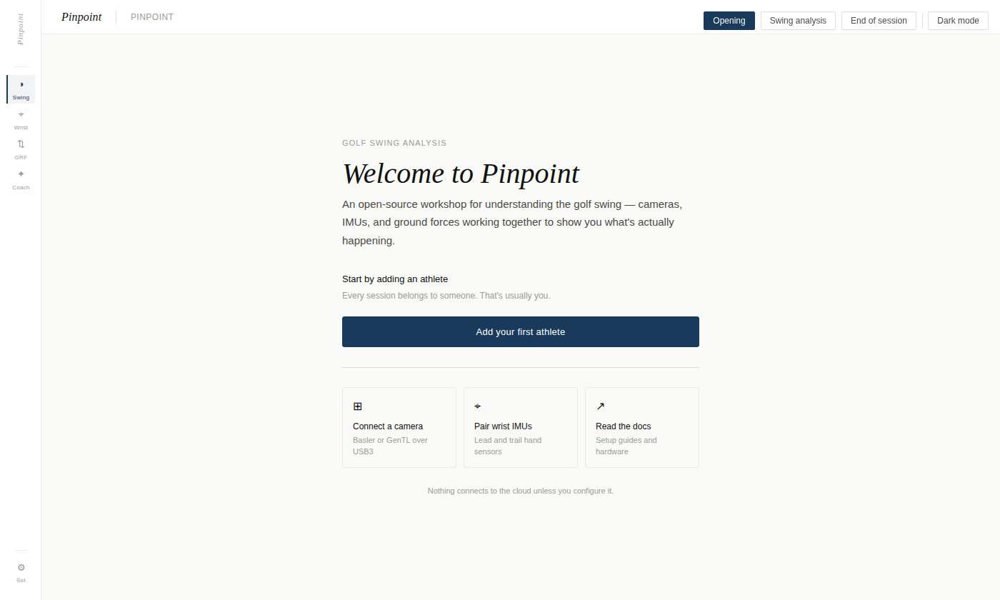
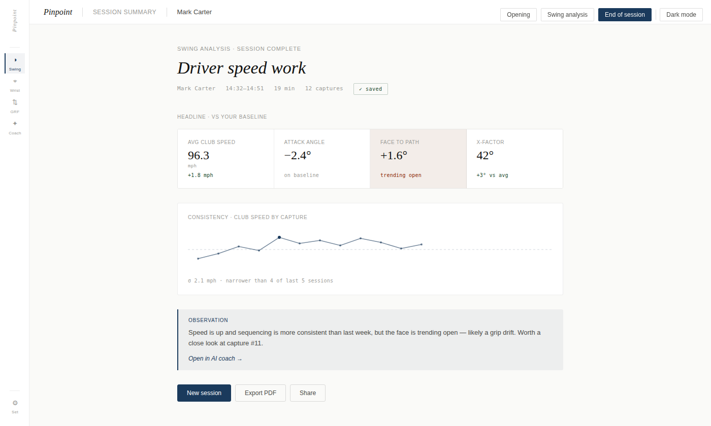
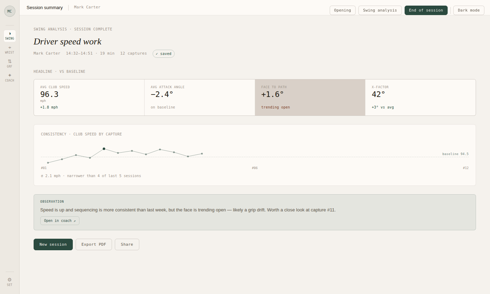

<p align="left">
    
  </p>

# PinPoint

PinPoint is a free, open source and cross-platform desktop application for serious golf swing analysis. It combines high-speed industrial cameras, Bluetooth IMUs, and on-device AI to build a complete picture of the swing — without sending data to the cloud unless you configure it to.

The app is currently in active prototyping. The core capture and analysis pipeline is functional; the coaching and session-history layers are in development.



The long term goal is to exploit computer vision and wearables to analyse golf movements and mechanistically determine your kinematic sequence aka Lateral-Rock-Twist-Jump, extract key golf swing metrics like X-Factor and tilt, working with the full swing or specialist shots such as pitching and in the sand, wrist angles to examine cupping, cocking and flipping, estimated ground forces to support the kinematic sequence analysis. 

Our ambition is to be a platform that can be used by golfers, coaches and researchers to improve everyone's golfing ability and understanding of the golf swing.

## Documentation
- [Building Instructions](BUILDING.md) — How to resolve dependencies and build PinPoint.
- [UX Design](docs/pinpoint-ux-design.md) — UI structure, navigation, and interaction design rationale.
- [User Personas](docs/PERSONAS.md) — Definitions of the three primary user archetypes (club golfer, coach, researcher).
- [Persona UX Assessment](docs/pinpoint-persona-assessment.md) — UX evaluation against three user archetypes; identifies gaps and design priorities.
- [EventBuffer Design](docs/event_buffer_design.md) — Architecture and design rationale for the lock-free EventBuffer.
- [EventBuffer Developer Guide](docs/event_buffer_developer_guide.md) — Tutorial covering usage, threading model, and integration patterns.
- [WT901BLE67 Protocol Reference](docs/WT901BLE67_Protocol.md) — Packet formats, register map, and BLE transport details for the Witmotion IMU.
- [Aesthetic Design Concepts](docs/aesthetic/pinpoint-aesthetic-concepts.md) — Three visual design directions (Editorial, Instrument, Studio) across light and dark themes.
- [QML Design System](docs/PINPOINT_QML_DESIGN_SYSTEM.md) — Token system, typography rules, and component patterns; read before writing any QML.

---

## UI shell

The interface uses a left-side navigation rail with an athlete avatar at the top, five mode buttons, and utility buttons at the bottom.

| Mode | Status | Description |
|---|---|---|
| **Home** | Active | Session type selection, device readiness, club selector, and Start button |
| **Swing** | Active | Multi-camera capture, pose estimation, and ¼-speed swing replay |
| **Wrist** | Placeholder | IMU-based wrist kinematics (requires an athlete) |
| **GRF** | Placeholder | Ground reaction force analysis (requires an athlete) |
| **Coach** | Placeholder | AI coaching output (requires an athlete) |

Wrist, GRF, and Coach redirect to the Welcome screen until at least one athlete has been created.

Three utility buttons sit at the bottom of the rail:

| Button | Description |
|---|---|
| **Play ▶** | Developer hatch — direct access to legacy tab pages during prototyping |
| **System ◈** | Opens the resource monitor (buffer, camera, and IMU diagnostics) |
| **Settings ⚙** | Opens the full Settings screen (see [Settings](#settings)) |

The **Settings** screen selects from eight visual themes — four aesthetics (Instrument, Editorial, Studio, Vector) × two modes (light, dark) — and the selected theme is persisted across restarts. See [Aesthetic Design Concepts](docs/aesthetic/pinpoint-aesthetic-concepts.md).

| Editorial | Instrument | Studio |
|---|---|---|
|  |  |  |

---

## Features

### Home screen

The Home screen is the default landing page and the starting point for every session.

- **Session type cards** — Four modes displayed as selectable cards, each showing a description, required device counts, and live readiness indicators:

  | Mode | Cameras | IMUs | Description |
  |---|---|---|---|
  | **Swing analysis** | 2 required | 3 required | Sequencing and key swing metrics via spine IMUs |
  | **Wrist motion** | 1 optional | 2 required | Wrist angle and club delivery analysis |
  | **Ground forces** | 2 required | 3 required | Ground use and power generation via hip IMUs |
  | **AI coach** | 2 required | 3 required | Shot-by-shot feedback from an AI coach |

- **Device readiness** — Each card shows a live `✓ / ⚠` status for cameras and IMUs independently. Cameras require at least the stated number to be enumerated; Wrist motion shows the camera as optional (amber tick when absent, green when present).
- **Club selector** — Choose the club in play before starting; recorded with the session.
- **Start session** — Enabled once device requirements are met; session begins on the first ball detected.

### Athlete management

Every session belongs to an athlete. The athlete management flow is the entry point to the app.

- **Create athlete** — Required fields: name, handedness. Recommended: height, weight, handicap, primary club. Optional: driver speed target, notes/tags.
- **Athlete picker** — Shows the three most-recently-active athletes as cards, plus a full searchable list. The selected athlete's initials appear in the rail avatar.
- **Delete athlete** — Destructive action available in the picker with a single click on the highlighted athlete.
- **Persistence** — All athlete records stored in `QSettings` (INI format); survives restarts. Heights stored in ft, weights in lb regardless of entry unit.
- **Navigation guard** — Wrist, GRF, and Coach modes require at least one athlete; selecting them from the Home screen redirects to the Welcome screen if the roster is empty.

### Swing — multi-camera video analysis

- **Multi-camera support** — Select any combination of discovered cameras; each gets its own side-by-side view with independent pose estimation, stats, and model selector. Start/Stop controls all cameras simultaneously.
- **Camera backends** — UVC webcams, Aravis (GenICam industrial cameras), Spinnaker (Teledyne/FLIR).
- **Spinnaker pipeline** — Raw Bayer bytes captured with no CPU demosaic on the hot path; a custom `QQuickRhiItem` runs a bilinear GPU Bayer demosaic shader at display rate while the pose estimator receives OpenCV-demosaiced frames at its already-throttled rate.
- **Pose estimation** — MoveNet SinglePose Lightning and Thunder via ONNX Runtime — real-time skeleton overlay on each live feed, switchable per camera.
- **Swing replay** — On ball-lost, the last 5 seconds of captured footage replay automatically at ¼ speed with a `REPLAY ¼×` overlay; a pulsing badge marks the replaying camera view. Ball detection drives buffer capture so the replay always covers the full swing.
- **GPU acceleration** — CoreML (Apple Silicon), CUDA 12/13 (NVIDIA on Linux/Windows).

### IMU — wrist motion capture

- **Device** — Witmotion WT901BLE67 BLE 6-axis IMU (accelerometer, gyroscope, Euler angles, quaternion).
- **Multi-device support** — Select any number of discovered IMUs simultaneously; each gets its own side-by-side 3D visualiser, state label, battery badge, rate selector, and Zero button. Mirrors the multi-camera chip pattern.
- **Device chips** — One toggle chip per enumerated IMU at the top of the Play → IMU tab; tap to connect/disconnect. Devices appear as soon as the BLE scan finds them.
- **3D orientation visualiser** — Labelled cube driven by the corrected quaternion; matches the physical device orientation in real time. The `ImuVizView` component is shared between the capture page (per-instance) and the settings test panel.
- **Auto-initialisation** — Sets vertical mounting, 6-axis algorithm, 100 Hz output rate, and zeros orientation to current position on every connect.
- **Zero button** — Re-zeroes orientation on demand for mid-session repositioning, per device.
- **Rate selector** — Adjustable output rate per device (10 / 20 / 50 / 100 / 200 Hz).
- **Live data rate** — 2-second rolling Hz average shown per device.
- **Battery indicator** — Colour-coded BAT: N% badge per device, polled via register 0x64 every 60 s.
- **Auto-retry** — One automatic retry after a 45-second cooldown on failed connections (device requires ~40 s to exit cooldown after a rejected attempt).
- **Session log** — Timestamped per-record diagnostics per device; Save Log writes to `~/imu_log_<MAC>_<timestamp>.txt`.

### Audio — speech interface

- **Speech-to-text** — Whisper.cpp (local, Vulkan/CUDA GPU-accelerated) with Azure Speech REST fallback for CPU-only systems. Backend badge in the UI shows GPU / Cloud / Apple; clickable to toggle when cloud fallback is available.
- **Text-to-speech** — Kokoro TTS (local, ONNX Runtime) with Azure Neural Voice fallback for CPU-only systems. Same badge/toggle pattern.
- **Latency display** — Per-request latency shown next to each badge (e.g. `523 ms`).

### Settings

The Settings screen uses a sidebar navigation with full-text search (Ctrl/Cmd+F) and panel-level organisation.

| Panel | Status | Contents |
|---|---|---|
| **General** | Active | Language, measurement units, session behaviour (auto-detect swing, AI coaching), update and diagnostics preferences |
| **Appearance** | Active | Theme selector (8 options), font scale, UI density, reduce motion, pose overlay opacity |
| **Displays** | Active | Main display placement, window geometry memory, secondary display output, post-shot content and delay, UI frame-rate cap, hardware acceleration |
| **Cameras** | Active | Per-camera enable/disable, view assignment (Face-on / Down-the-line / Other), frame-rate chips, trigger mode (Free-run / HW sync), ROI crop with live preview; global pre-roll buffer and camera-sync toggle |
| **IMUs** | Active | Per-device enable/disable, body placement assignment (A–D), output rate and fusion-mode chips, mount orientation, live test panel with 3D viz and Euler angles; global auto-connect, auto-reconnect, save-to-flash, and default fusion mode |
| **Launch Monitor** | Placeholder | External launch monitor integration (not yet implemented) |
| **Storage** | Active | Athlete library path, session folder naming, auto-save; video codec/resolution/quality/container; sensor data export format |
| **Archiving** | Placeholder | Session archive path and retention policy (not yet implemented) |

The Cameras panel shows sensor info (vendor/model, resolution, pixel format, bit depth) and a real-time storage estimate (per-frame MB and ring-buffer slot count) that updates as the ROI is adjusted.

### Film — video annotation

- **YouTube download** — Bundled yt-dlp fetches videos from YouTube (Premium quality, browser cookie auth) to a local cache; no re-download on repeat analysis.
- **On-demand annotation** — Pause on a frame, click Annotate: runs a person segmentation model (u2netp) to isolate the golfer, blurs the background, then runs MoveNet for a clean pose estimate.
- **Skeleton overlay** — Background-blurred frame displayed with the MoveNet skeleton drawn on top.
- **Scrubbing** — Live frame preview while dragging the seek slider.

---

## Device lifecycle

Every physical device — camera or IMU — passes through the same four stages. New code must respect this contract; violating it corrupts the EventBuffer or leaks ring-buffer memory.

### Stages

```
Enumerated → Selected → Recording → Deselected
     ↑            ↓                      ↓
  (scan)    registerSource()      deregisterSource()
```

| Stage | Camera | IMU |
|---|---|---|
| **Enumerated** | `VideoInputFactory::enumerateDevices()` at `CameraManager` construction. Device appears in `cameraList`; no `VideoController` exists. | `DeviceEnumerator::scanImu()` starts async BLE scan at `ImuManager` construction. Device appears in `imuList` as discovered; no `ImuInstance` exists. |
| **Selected** | User taps chip → `CameraManager::setSelected(i, true)` → `VideoController` constructed → `EventBuffer::registerSource()`. | User taps chip → `ImuManager::setSelected(i, true)` → `ImuInstance` constructed → `EventBuffer::registerSource()`, then `start()` begins the async BLE connection. |
| **Recording** | `CameraManager::startAll()` → `VideoController::startRecording()` on each selected controller. Buffer transitions to Capturing once a ball is detected. | IMU writes data continuously once the BLE connection is established; the EventBuffer's Capturing/Paused state gates whether the merger reads from the ring. |
| **Deselected** | User taps chip → `CameraManager::setSelected(i, false)` → `stopRecording()` if active → `deregisterFromBuffer()` → `deleteLater()`. | User taps chip → `ImuManager::setSelected(i, false)` → `stop()` (BLE disconnect) → `deregisterFromBuffer()` → deferred `deleteLater()`. |

### Invariants

These invariants must hold at all times:

1. **No registration at startup.** Neither manager creates instances or registers sources in its constructor. The first registration always follows an explicit user selection.

2. **Register on selection, deregister on deselection.** `registerSource()` is called exactly once — in the device instance constructor, which runs inside `setSelected(…, true)`. `deregisterSource()` is called exactly once — in `deregisterFromBuffer()`, which runs inside `setSelected(…, false)` and in the manager destructor.

3. **Buffer is paused around every register/deregister call.** `setSelected()` snapshots `wasCapturing`, calls `pause()` before touching sources, then restores the buffer state after. This prevents the EventBuffer merger from reading a half-initialised or already-freed source.

4. **`deregisterFromBuffer()` is called before `deleteLater()`.** The instance pointer is nulled and `instancesChanged()` emitted first so QML delegates are torn down while the object is still live; deregistration happens next; only then is the object queued for deletion.

5. **Excluded ≠ deselected.** The `excluded` flag is a Settings-level preference (applied via `setExcluded()`). Setting `excluded = true` on a currently-selected device triggers an explicit `setSelected(…, false)` call, which follows invariant 4 above. Clearing `excluded` on a deselected device triggers `setSelected(…, true)`.

6. **Re-enumeration is safe.** Calling `enumerateDevices()` again (e.g. after a settings scan) only adds new entries to `DeviceEnumerator`; it never removes or invalidates live instances or registered sources.

### Buffer state machine

The EventBuffer moves between states under `CameraManager` control:

```
Idle ──startAll()──▶ Paused ──ball present──▶ Capturing
                        ▲                          │
                        └────────ball lost──────────┘
                                  (after replay)
```

- **Idle** — before the first `startAll()` and after `stop()`.
- **Paused** — recording is active but no ball is in the ROI; the merger does not advance the timeline. Ring memory is live.
- **Capturing** — ball is present; the merger reads all registered sources and builds the merged timeline.
- Replay (`SwingWindow`) runs during Paused; the buffer must remain Paused for the duration. `resume()` is called only after the `SwingWindow` is destroyed.

### Applying this to new device types

To add a new device type (e.g. a launch monitor, a force plate):

1. Create a `DeviceEnumerator` scan path; populate results with `DeviceType::YourType`.
2. Create a manager class (e.g. `LaunchMonitorManager`) following the `ImuManager` pattern: constructor scans only, no instances created.
3. Create an instance class (e.g. `LaunchMonitorInstance`) that calls `registerSource()` in its constructor and exposes `deregisterFromBuffer()`.
4. In `setSelected(…, true)`: pause buffer → construct instance (registers source) → resume buffer.
5. In `setSelected(…, false)`: pause buffer → stop → `deregisterFromBuffer()` → null the pointer → emit changed → `deleteLater()` → resume buffer.
6. In the manager destructor: repeat the deselection teardown for all live instances.

---

## Technology

Built with **Qt 6.11** and **C++20**.

| Component | Technology |
|---|---|
| UI | Qt Quick / QML (Qt 6.11) |
| Speech-to-text | whisper.cpp (Vulkan / CUDA) + Azure Speech REST |
| Text-to-speech | Kokoro ONNX Runtime + Azure Neural Voice |
| Pose estimation | MoveNet Lightning / Thunder (ONNX Runtime) |
| Person segmentation | u2netp (ONNX Runtime) |
| Video download | yt-dlp (bundled binary) |
| GPU acceleration | Vulkan, CUDA 12 + 13, CoreML (Apple Silicon) |
| Image processing | OpenCV 3.0+ |
| IMU | Witmotion WT901BLE67 via Qt Bluetooth LE |
| Athlete data | QSettings (INI format, `~/.config/Pinpoint/Pinpoint.ini`) |

---

## Local files

PinPoint reads and writes files in several locations. Platform paths shown for Linux; macOS and Windows equivalents are noted in brackets.

### Application data directory
`~/.local/share/PinPoint/` (macOS: `~/Library/Application Support/PinPoint/`, Windows: `%APPDATA%\PinPoint\`)

| Path | What | When |
|---|---|---|
| `models/whisper/<model>.bin` | Whisper STT model | Copied from the CMake build cache at build time |
| `models/kokoro/` | Kokoro TTS ONNX model + voice data | Downloaded from HuggingFace on first launch when a GPU is detected |
| `film-cache/<video_id>.mp4` | Downloaded YouTube videos | Written by yt-dlp on demand; never auto-deleted |

### Application settings
`~/.config/Pinpoint/Pinpoint.ini` (macOS: `~/Library/Preferences/Pinpoint.plist`, Windows: Registry `HKCU\Software\Pinpoint`)

**Status key** — ✅ wired (read by app code; drives behaviour) · ⚙️ live (applied interactively but not restored on next startup/reconnect) · 📋 planned (persisted; not yet consumed outside settings)

**UI**

| Key | Default | Status | What |
|---|---|---|---|
| `ui/themeIndex` | `0` | ✅ | Selected visual theme (0–7: Instrument light/dark, Editorial light/dark, Studio light/dark, Vector light/dark) |
| `ui/windowWidth` | `1120` | ✅ | Main window width in pixels; updated on every resize |
| `ui/windowHeight` | `700` | ✅ | Main window height in pixels; updated on every resize |
| `ui/windowX` | `-1` | ✅ | Saved window X position (`-1` = not saved) |
| `ui/windowY` | `-1` | ✅ | Saved window Y position (`-1` = not saved) |
| `ui/windowMaximized` | `false` | ✅ | Whether window was last maximised/full-screen |
| `ui/fontScale` | `-1.0` | ✅ | Font scale multiplier (`-1.0` = auto from display DPI) |
| `ui/density` | `"default"` | ✅ | UI density (`"default"`, `"compact"`, or `"spacious"`) |
| `ui/reduceMotion` | `false` | ✅ | Disable animated transitions |
| `ui/overlayOpacity` | `0.7` | ✅ | Opacity of the pose skeleton overlay (0.0–1.0) |

**General**

| Key | Default | Status | What |
|---|---|---|---|
| `general/language` | `"en_GB"` | ✅ | UI language tag (e.g. `"en_US"`, `"fr_FR"`, `"ja_JP"`); restart required |
| `general/units` | `"mph"` | ✅ | Speed/distance unit (`"mph"` or `"kmh"`); used in session goals |
| `general/autoDetectSwing` | `true` | 📋 | Start capture automatically when motion exceeds threshold |
| `general/swingDetectionSensitivity` | `"Medium"` | 📋 | Trigger threshold (`"Low"`, `"Medium"`, `"High"`) |
| `general/aiCoachingOnSessionEnd` | `true` | 📋 | Auto-generate a Claude coaching observation after each session |
| `general/checkForUpdates` | `true` | 📋 | Check on launch for a newer release |
| `general/sendDiagnostics` | `false` | 📋 | Send anonymous crash/performance data |

**Display**

| Key | Default | Status | What |
|---|---|---|---|
| `display/mainDisplayMode` | `"primary"` | ✅ | Where to open the main window (`"primary"`, `"cursor"`, `"screen:<n>"`) |
| `display/rememberWindowGeometry` | `true` | ✅ | Restore exact window position and size from previous session |
| `display/secondaryDisplayMode` | `"none"` | 📋 | Secondary output for post-shot replay (`"none"` or `"screen:<n>"`) |
| `display/postShotContent` | `"replay"` | 📋 | What to show on the secondary display after a shot |
| `display/postShotDelay` | `0.5` | 📋 | Seconds before post-shot content is shown |
| `display/postShotMirror` | `false` | 📋 | Mirror the post-shot image horizontally |
| `display/uiFrameRateCap` | `"display"` | 📋 | UI render rate cap (`"display"` = match monitor refresh, or explicit Hz) |
| `display/hardwareAcceleration` | `true` | 📋 | Use GPU-accelerated rendering |

**Camera** — per-camera values are maps keyed by the camera's persistent serial-number key

| Key | Default | Status | What |
|---|---|---|---|
| `camera/excluded` | _(empty list)_ | ✅ | Serial-number keys of cameras excluded from capture |
| `camera/targetFps` | _(empty map)_ | ✅ | Per-camera frame-rate target; key → fps value |
| `camera/triggerMode` | _(empty map)_ | ✅ | Per-camera trigger mode; key → `"freerun"` or `"hwsync"` |
| `camera/roi` | _(empty map)_ | ✅ | Per-camera ROI; key → normalised `{x, y, w, h}` rect |
| `camera/perspective` | _(empty map)_ | ✅ | Per-camera view assignment; key → `0` (unassigned), `1` (down-the-line), `2` (face-on), `3` (other) |
| `camera/fixedInPlace` | _(empty map)_ | 📋 | Per-camera wall-mount flag; read by session wizard but not yet by capture |
| `camera/preroll` | `1.0` | 📋 | Pre-roll buffer in seconds (0.5 / 1.0 / 2.0); ring buffer still sized at fixed 5 s |
| `camera/syncEnabled` | `true` | 📋 | Lock frame timing across all enabled cameras |

**IMU** — per-device values are maps keyed by the device MAC address / UUID

| Key | Default | Status | What |
|---|---|---|---|
| `imu/excluded` | _(empty list)_ | ✅ | MAC addresses of IMUs excluded from the device list and auto-connect |
| `imu/defaultFusionMode` | `"9axis"` | ✅ | Fallback fusion algorithm shown in per-device chips when no override is set |
| `imu/outputRateHz` | _(empty map)_ | ⚙️ | Per-device output rate; applied immediately when chip is tapped, not restored on reconnect |
| `imu/fusionMode` | _(empty map)_ | ⚙️ | Per-device fusion algorithm; applied immediately when chip is tapped, not restored on reconnect |
| `imu/placement` | _(empty map)_ | ✅ | Per-device body placement; read by session wizard and resource monitor |
| `imu/mountOrientation` | _(empty map)_ | 📋 | Per-device mount; key → `"horizontal"` or `"vertical"` |
| `imu/autoConnect` | `true` | 📋 | Connect all enabled IMUs automatically before recording begins |
| `imu/autoReconnect` | `true` | 📋 | Attempt reconnect if the BLE link drops during a session |
| `imu/saveCalibrationToFlash` | `false` | 📋 | Persist zero-orientation and mag calibration to device flash |

**Session**

| Key | Default | Status | What |
|---|---|---|---|
| `session/goalsByType` | _(empty map)_ | ✅ | Per-session-type speed goals; key → target mph value |
| `session/lastType` | `0` | ✅ | Index of the last-used session type; pre-selects on next wizard open |

**Storage** — recording pipeline not yet built; all keys persisted for future use

| Key | Default | Status | What |
|---|---|---|---|
| `storage/sessionNamingPattern` | `"date-name-type"` | 📋 | Folder name format (`"date-name-type"`, `"date-type-name"`, `"name-date-type"`, `"date-only"`) |
| `storage/videoResolutionMode` | `"native"` | 📋 | Recording resolution (`"4k"`, `"1080p"`, `"native"`, `"half"`) |
| `storage/videoCodec` | `"h264"` | 📋 | Encoding codec (`"h264"`, `"h265"`, `"prores"`, `"raw"`) |
| `storage/videoQuality` | `"medium"` | 📋 | Encoding quality (`"low"`, `"medium"`, `"high"`, `"lossless"`); ignored when codec is `"raw"` |
| `storage/videoContainer` | `"mp4"` | 📋 | Container format (`"mp4"`, `"mov"`, `"mkv"`) |
| `storage/saveRawFrames` | `false` | 📋 | Save unprocessed Bayer frames alongside encoded clips |
| `storage/savePoseKeypoints` | `true` | 📋 | Save MoveNet skeleton data as JSON per clip |
| `storage/saveImuStreams` | `true` | 📋 | Save full IMU quaternion/accelerometer data |
| `storage/imuDataFormat` | `"json"` | 📋 | IMU export format (`"json"`, `"csv"`, `"binary"`) |
| `storage/saveLaunchMonitorData` | `true` | 📋 | Save ball-flight data from connected launch monitor |

**Athletes** — one group per athlete, keyed by UUID (`athletes/<uuid>/…`)

| Key | Default | What |
|---|---|---|
| `currentAthleteUuid` | _(none)_ | UUID of the currently selected athlete |
| `athletes/<uuid>/name` | — | Full display name |
| `athletes/<uuid>/handedness` | `"Right"` | `"Right"` or `"Left"` |
| `athletes/<uuid>/heightValue` | `0.0` | Height stored in ft regardless of entry unit |
| `athletes/<uuid>/heightUnit` | `"ft"` | Unit used when the value was entered (`"ft"` or `"cm"`) |
| `athletes/<uuid>/weightValue` | `0.0` | Weight stored in lb regardless of entry unit |
| `athletes/<uuid>/weightUnit` | `"lb"` | Unit used when the value was entered (`"lb"` or `"kg"`) |
| `athletes/<uuid>/handicap` | `-1.0` | Golf handicap index (`-1.0` = not set) |
| `athletes/<uuid>/primaryClub` | `"Driver"` | Default club |
| `athletes/<uuid>/speedTarget` | `0.0` | Driver speed target in mph (`0.0` = not set) |
| `athletes/<uuid>/notes` | _(empty)_ | Free-text notes/tags |
| `athletes/<uuid>/createdAt` | — | Unix epoch seconds; set once at creation |
| `athletes/<uuid>/lastSessionAt` | `0` | Unix epoch seconds; updated after each session |
| `athletes/<uuid>/sessionCount` | `0` | Running count of completed sessions |

**STT**

| Key | Default | What |
|---|---|---|
| `stt/modelPath` | _(empty)_ | Manual override for the Whisper model path; takes priority over the platform app-data and executable-adjacent locations |

**Secrets** — all loaded at startup from env vars and persisted so subsequent launches work without the original env var

| Key | Env var | What |
|---|---|---|
| `secrets/assemblyaiApiKey` | `ASSEMBLYAI_API_KEY` | AssemblyAI streaming STT key (also settable via cmake `-DASSEMBLYAI_API_KEY=`) |
| `secrets/azureTtsApiKey` | `AZURE_TTS_API_KEY` | Azure Cognitive Services key for TTS (also covers STT if no dedicated STT key is set) |
| `secrets/azureSttApiKey` | `AZURE_STT_API_KEY` | Azure Cognitive Services key for STT (overrides `azureTtsApiKey` when present) |

> **Note:** Keys written to settings persist even after the env var is removed. To clear a key, delete the relevant `secrets/` entry from the settings file directly (see `SecretsManager` in `src/Secrets/`).

### Next to the executable
`<install dir>/models/`

| File | What |
|---|---|
| `movenet_singlepose_lightning.onnx` | MoveNet Lightning pose model (~9 MB) |
| `movenet_singlepose_thunder.onnx` | MoveNet Thunder pose model (~30 MB) |
| `u2netp.onnx` | Person segmentation model (~4.7 MB) |
| `yt-dlp` / `yt-dlp.exe` | Bundled yt-dlp binary for YouTube download |

These are copied from the CMake build cache automatically — no manual placement needed.

### User home directory (on demand)

| File | What | Trigger |
|---|---|---|
| `~/pinpoint_audio_<timestamp>.wav` | Recorded audio session | Save Audio button |
| `~/imu_log_<MAC>_<timestamp>.txt` | IMU session log (one per device) | Save Log button |

### External network activity
The app only contacts external services when explicitly configured:
- **Azure Speech** (STT / TTS) — if an Azure Cognitive Services key is present
- **AssemblyAI** (STT) — if an AssemblyAI API key is present
- **YouTube** (via yt-dlp) — when downloading a video in the Film tab, using your browser's stored cookies

---

## Roadmap

- **Session recording** — attach captured swing data to the selected athlete; build session history
- **Two-camera 3D pose reconstruction** — triangulate occluded joints from a second viewpoint (multi-camera capture is already in place)
- **Kinematic metric extraction** — derive club head speed, hip/shoulder rotation, lag angle from pose sequences and IMU data
- **AI coach integration** — session-aware coaching output in the Coach mode
- **Wrist / GRF modes** — connect IMU data to the athlete and session model (Home screen entry points and device requirements already in place)
- **Smartphone companion** — once core concepts are proven on desktop

It will be published as an open-source desktop application for use in golf studios and coaching facilities.
