# Pinpoint — Aesthetic design concepts

**Version:** 0.1 (draft)
**Screens:** Opening · Swing analysis · End of session
**Themes:** Light and dark for each aesthetic

Three distinct visual directions are presented. Each is a fully working HTML prototype with interactive screen and theme switching. The screenshots below document all states. No direction is recommended here — that judgement belongs in context, ideally with the personas from the assessment document alongside.

---

## How to read these

Each aesthetic is shown across six states: opening screen in light and dark, swing analysis in light and dark, and end-of-session summary in light and dark. The structural elements (rail, header, borders) are intentionally kept as quiet as possible in all three directions — the aim in each case is for the *content* (video feeds, data values, charts) to be the dominant visual element, with chrome that recedes.

The three directions differ in personality, not in principle. All three share the same information architecture from the UX design document. What changes is the typographic register, the colour temperature, and the degree of warmth versus restraint.

---

## Aesthetic 1 — Instrument

**Character:** Precision scientific instrument. Warm parchment grounds, monospaced data values, hairline rules, deep forest green accent. Inspired by high-end audio equipment and Swiss laboratory instruments from the 1970s. Quiet authority without coldness.

**Typography:** DM Serif Display for the wordmark and session titles. DM Mono for all numeric data, labels, and status elements. DM Sans for body and structural copy.

**Palette:** Warm off-whites (#F5F2ED, #EDE9E2) in light mode; deep warm darks (#161412, #1E1C19) in dark mode. Single accent: deep forest green (#2B4A3F light / #7EBFAA dark). Warns in muted terracotta.

**Best suited to:** Teaching pro persona. The instrument aesthetic communicates professional seriousness without technical aggression. The monospaced data values feel like readouts from a trusted device.

---

### Opening screen

| Light | Dark |
|-------|------|
| 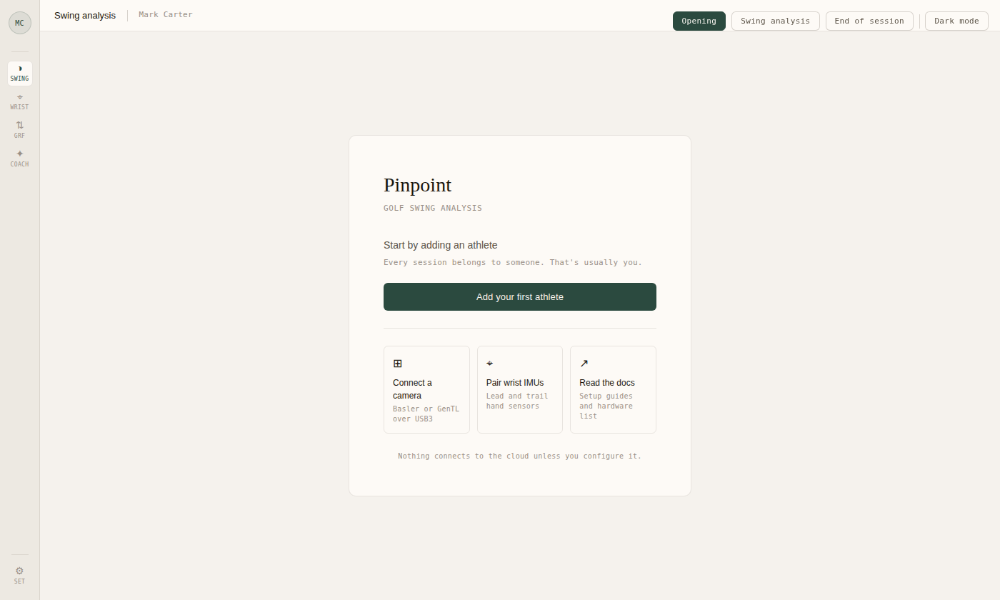 | 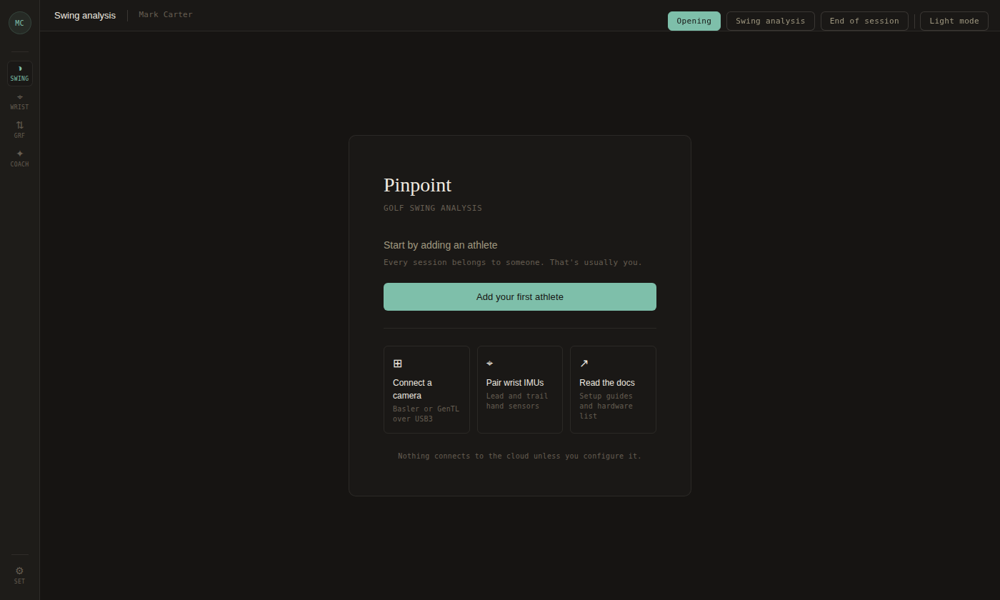 |

The welcome card sits centred on the warm ground with a single primary action and three quiet secondary entry points. The wordmark uses the serif display font in roman weight; the subtitle below it is in small-caps mono. Privacy statement in tiny mono at the foot of the card.

---

### Swing analysis

| Light | Dark |
|-------|------|
| 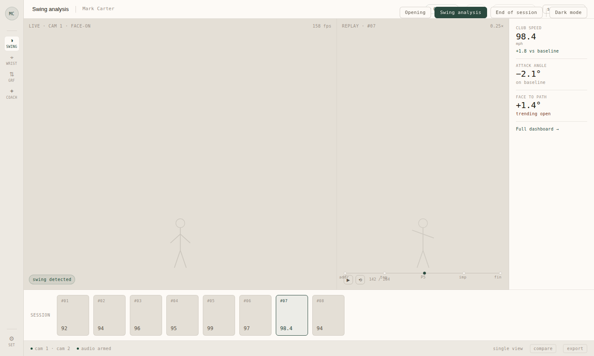 | 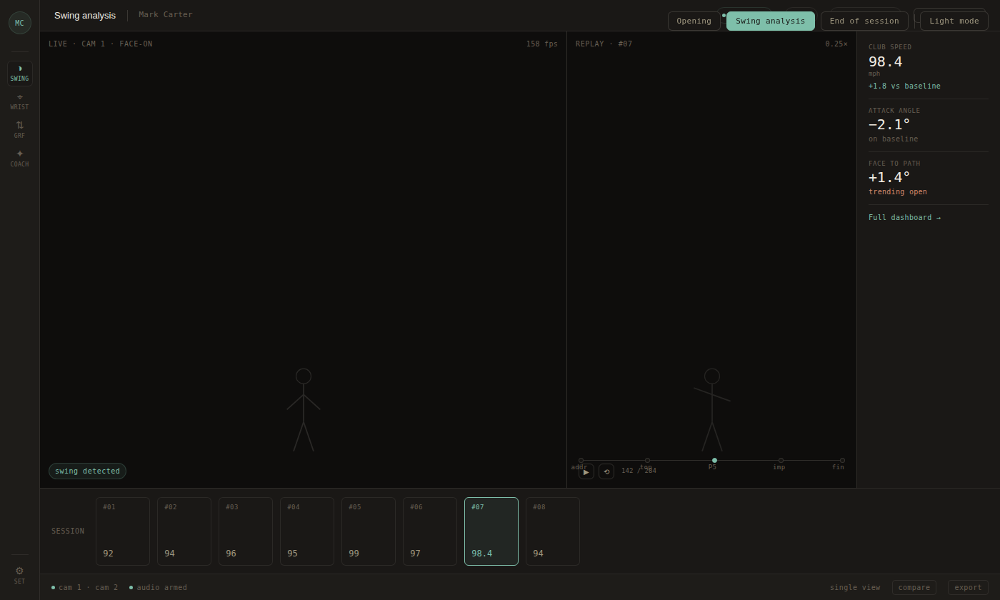 |

Video panels use the warm neutral ground as the camera placeholder — in production these fill with live frames. Data values in the metrics rail are set large in DM Mono light weight, giving them the feel of instrument readouts. The selected carousel tile (#07) is tinted with the forest green accent. Status elements in the footer bar use hairline dots in green.

---

### End of session

| Light | Dark |
|-------|------|
|  | 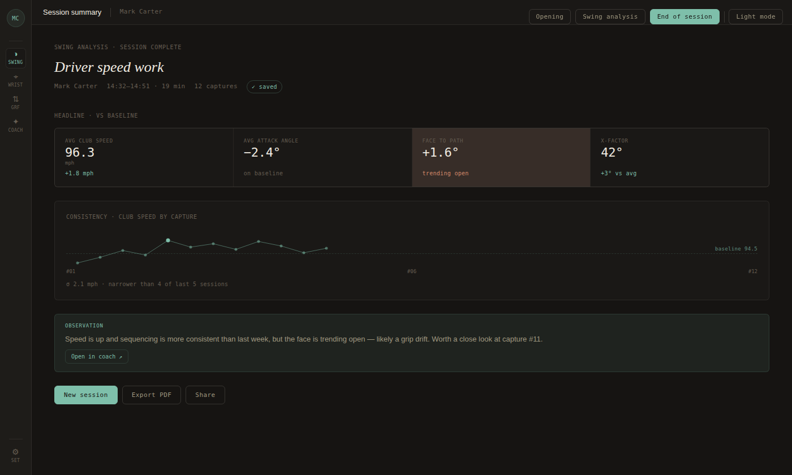 |

The session title renders in DM Serif Display italic — the first time the display typeface appears at size in the session flow, giving the summary a sense of occasion. Metric cells use the same hairline-bordered grid seen throughout. The flagged metric (face to path) is highlighted with a very subtle terracotta wash rather than a bold colour block. The Claude observation sits in a quiet green-tinted strip. Actions are minimal: three buttons, one filled.

---

## Aesthetic 2 — Editorial

**Character:** Premium golf print media meets long-form digital journalism. Playfair Display in italic for all display text. Strong vertical rhythm, asymmetric composition in the summary view. The session title is typeset as a chapter heading. Accent is deep navy — closer to a masthead than a brand colour.

**Typography:** Playfair Display (italic and roman) for headings, session titles, and metric values. Instrument Sans in light and regular weights for all structural and body copy. JetBrains Mono for status data, fps readouts, and timestamps.

**Palette:** Near-white off-whites (#FAFAF8) in light mode; near-blacks with a warm undertone (#141412) in dark mode. Deep navy accent (#1A3A5C light / #A8C4E0 dark). The rail carries a vertical italic "Pinpoint" wordmark — the only instance of the brand name in the navigation chrome.

**Best suited to:** All three personas but resonates particularly with the teaching pro and the wealthy newcomer. The editorial register communicates that this is a tool for people who take their golf seriously, without requiring technical literacy to feel at home.

---

### Opening screen

| Light | Dark |
|-------|------|
|  | 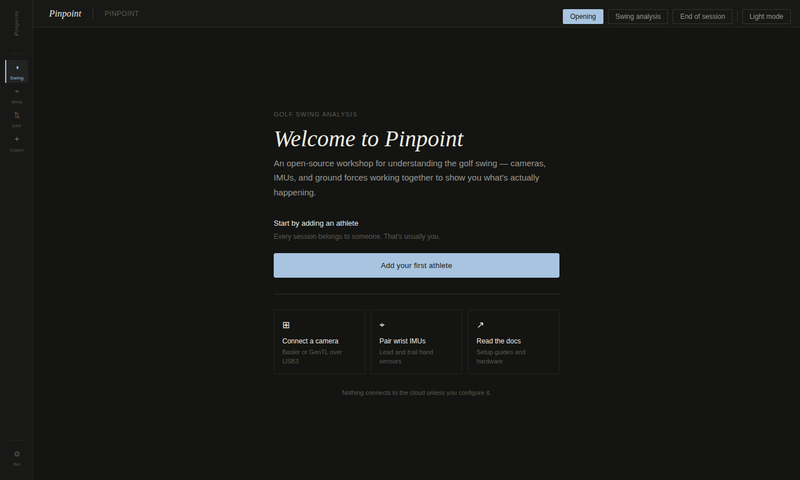 |

The welcome uses a large italic serif heading at 40px — the most typographically assertive moment in any of the three aesthetics. Below it, body copy in Instrument Sans light weight at 15px with generous line-height. The three secondary cards use plain weight titles and light-weight descriptions, maintaining the hierarchy. The rail's vertical italic wordmark is visible on the left edge.

---

### Swing analysis

| Light | Dark |
|-------|------|
| 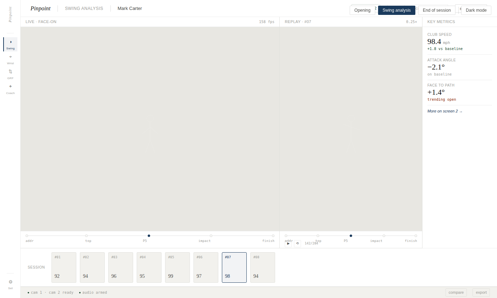 | 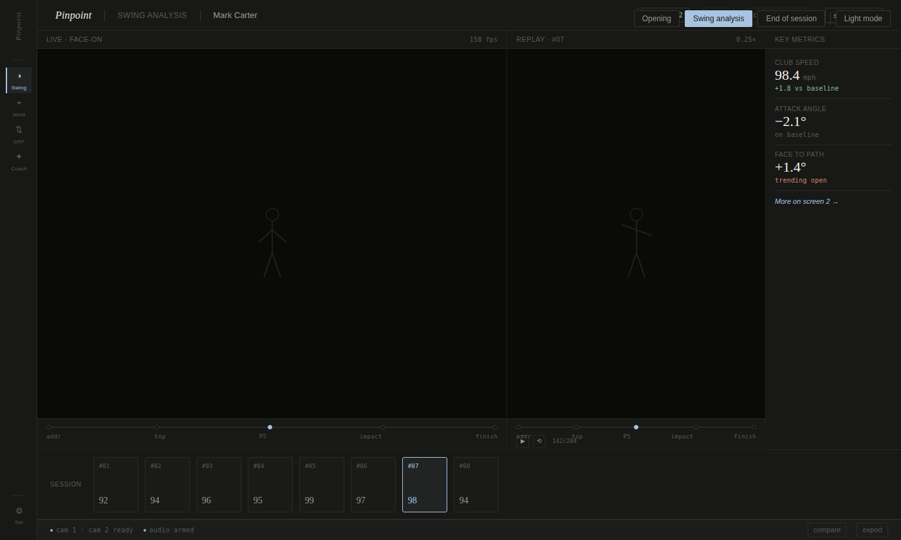 |

Panel labels sit in a dedicated bar above each video area, styled in small uppercase Instrument Sans light. Metric values in the side rail use Playfair Display — the large italic serif numerals give the data a considered, editorial quality. The carousel thumbnails use the same serif for the metric value in each tile. The active-mode left-border accent on the rail item is the only strongly coloured structural element.

---

### End of session

| Light | Dark |
|-------|------|
|  | 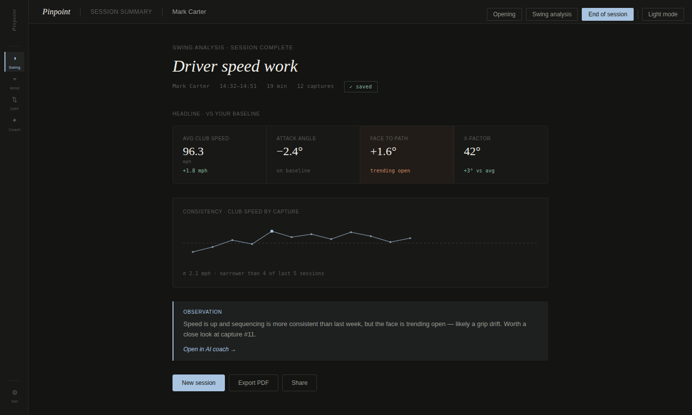 |

"Driver speed work" as the session title renders at 34px Playfair italic — the summary is framed as a document worth reading. Metric cells use the serif for values and light sans for labels, maintaining the editorial hierarchy throughout. The Claude observation uses a left-border accent (2px navy) and light-tinted background — an editorial pull-quote gesture. The consistency chart uses navy for the trend line and data points.

---

## Aesthetic 3 — Studio

**Character:** Professional creative software with the density removed. Geist throughout (geometric sans, very low visual weight). Single blue accent used sparingly — selected states, primary CTAs, the observation strip. Everything else is neutral. The UI is designed to disappear.

**Typography:** Geist in weights 200–400 only. Geist Mono for all data values, labels, timestamps, and status. No serif anywhere. Size hierarchy achieved through weight and opacity changes, not large size jumps.

**Palette:** Near-neutral light (#F6F6F5) and dark (#111110) grounds with minimal surface differentiation. A single accent blue (#0066FF light / #4D90FF dark) used as a point colour. Green and red used only for good/warn semantic signals. The rail mark is a small blue square with a white dot — the brand's only distinctive visual element.

**Best suited to:** Enthusiastic amateur persona. The studio aesthetic reads as serious tooling — the kind of thing you'd expect from Figma or Linear. It signals that the software respects your intelligence and gets out of your way.

---

### Opening screen

| Light | Dark |
|-------|------|
| 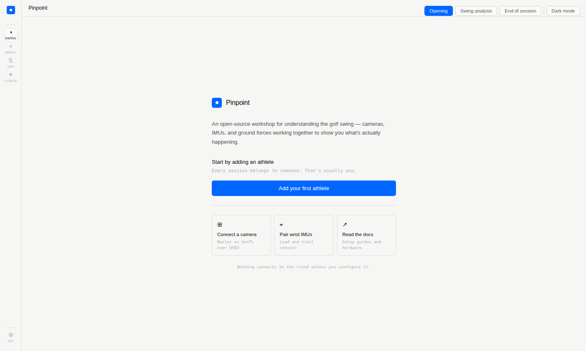 | 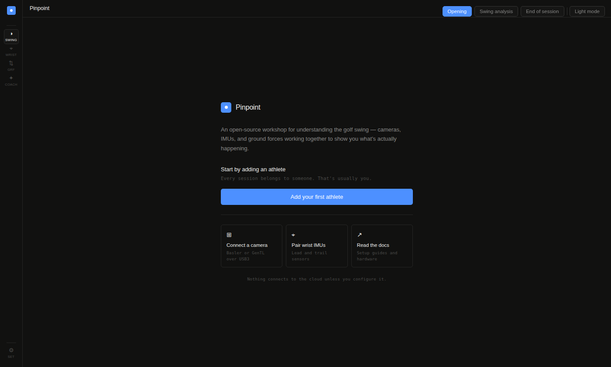 |

The welcome card is anchored by the small blue mark logo rather than a typographic wordmark. Body copy at 13px light weight with generous leading. The three secondary cards use a subtle border on hover only — completely invisible at rest. The privacy statement in tiny mono at the foot. The entire welcome screen uses three text colours (primary, secondary, tertiary) and no decorative elements.

---

### Swing analysis

| Light | Dark |
|-------|------|
| 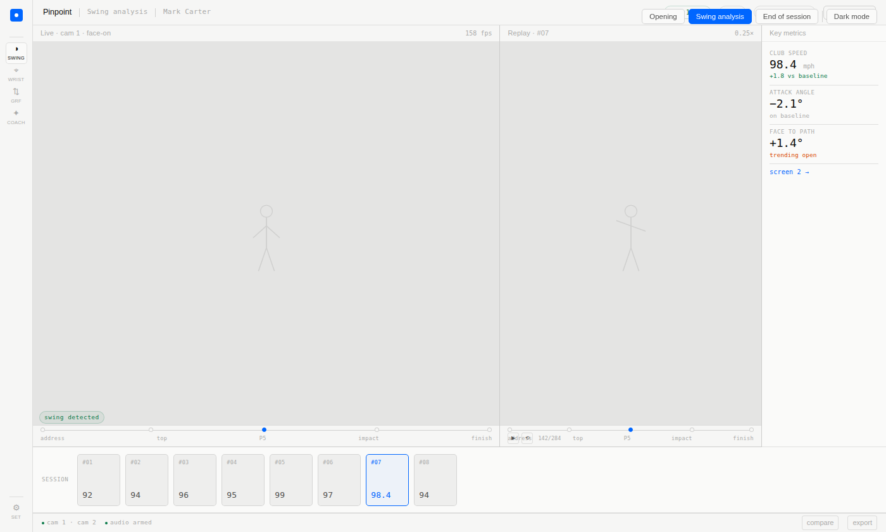 | 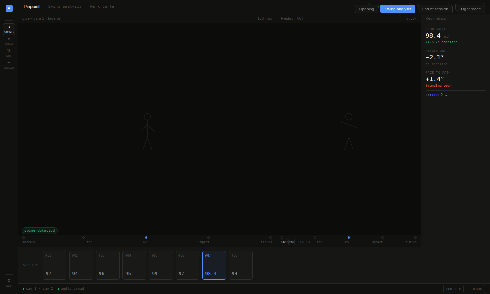 |

Panel labels in a 26px header strip above each video area — the smallest typographic presence of any aesthetic. Data values in Geist Mono light at 18px. The timeline beneath the replay panel shows the P-positions in the smallest readable mono size. Carousel thumbnails are the plainest of the three aesthetics — number and value in mono, nothing else. The selected tile (#07) takes the blue border and tinted background.

---

### End of session

| Light | Dark |
|-------|------|
|  | 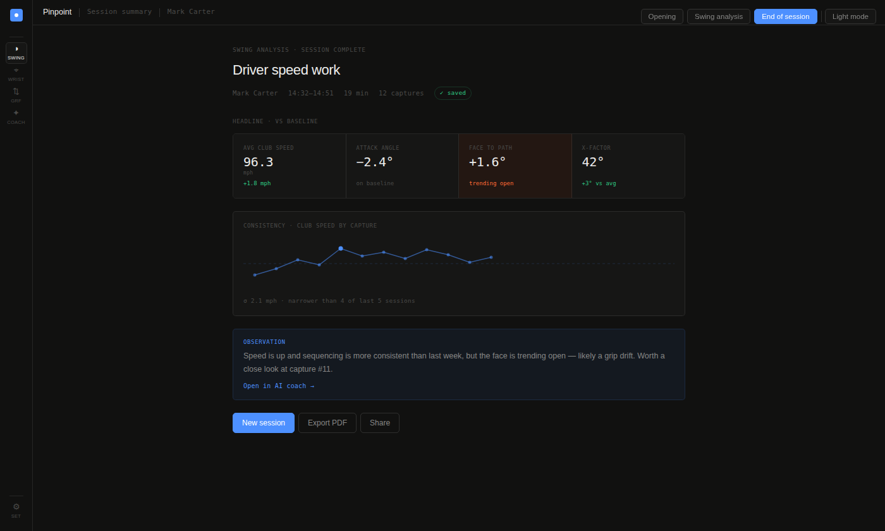 |

The session title at 22px Geist light — deliberately restrained compared to the editorial direction's italic serif. Metric values in Geist Mono light at 20px. The flagged metric cell (face to path) carries the same subtle warm wash as the other two aesthetics. The Claude observation uses the blue accent border and light blue tint — the most colourful element in the summary view. The consistency chart renders with the same blue for trend line and data points, the dashed baseline in faded blue.

---

## Comparative notes

### What all three share

The structural elements — rail, header bar, carousel, status strip — are held to the same visual weight across all three directions. None of them competes with the content. In all three, the video panels are the dominant visual mass, the metric values are the dominant typographic elements, and everything else recedes.

All three dark modes are genuinely dark rather than colour-inverted — they use separate warm-undertoned neutrals rather than simply flipping the light palette.

### Where they differ

| | Instrument | Editorial | Studio |
|---|---|---|---|
| Display type | DM Serif Display | Playfair Display | none |
| Data type | DM Mono | JetBrains Mono | Geist Mono |
| Colour temperature | Warm (parchment / forest) | Cool–neutral (off-white / navy) | Neutral (pure grey / blue) |
| Session title treatment | Serif italic, modest size | Serif italic, large | Sans light, restrained |
| Metric value treatment | Large mono, instrument-like | Large serif, editorial | Medium mono, precise |
| Strongest personality signal | Scientific instrument | Golf magazine | Creative software |
| Warmth | Highest | Medium | Lowest |
| Approachability | Medium | Highest | Medium |

### Considerations for selection

The teaching pro persona is most likely to respond to Instrument — it reads like a trusted piece of professional equipment, which is the right frame for a tool they will use in front of clients. The warmth is reassuring without being decorative.

The wealthy newcomer is most likely to respond to Editorial — the magazine register signals quality and seriousness in terms they already understand from golf print media, and the large serif type feels premium rather than technical.

The enthusiastic amateur could work well with any of the three but is probably best served by Studio — it signals that Pinpoint is serious tooling in the same category as the professional software they already use, which is the frame that will make them trust the data.

None of these should be treated as exclusive. The direction chosen should work for all three personas; the considerations above are about which register each will find *most* natural on first encounter.

---

*Screenshots captured at 1400 × 840px viewport. Fonts loaded from Google Fonts. All screens interactive in the accompanying HTML prototypes.*
