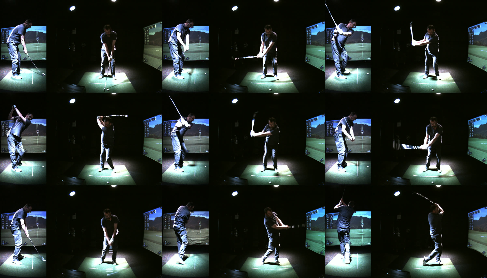
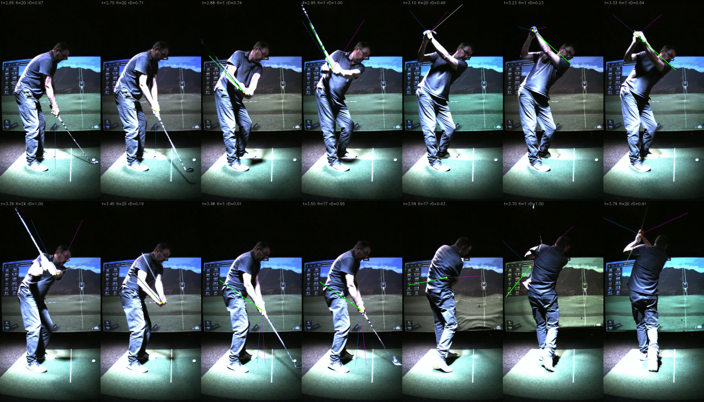

# Down-the-line shaft tracker — design

**Status: prototype built and graded, 2026-09-20. Results:
[`docs/research/data/dtl/dtl_tracker_results_20260920.md`](../research/data/dtl/dtl_tracker_results_20260920.md)**
— dev six, held-out six, and a nine-swing transfer to a second rig, against a
truth instrument that is not the one §6 asks for. Read §5's "As built" for every
departure and §6 and §8 as revised. The design text below is unchanged except
where a dated note says otherwise: it is the reasoning that produced the
prototype, not a description of it.

*Originally: design, 2026-09-20, nothing built. One feasibility run made while
writing it (§2), on one swing, judged by eye — it sized the problem, it did not
grade anything.* Successor context: the corpus audit is
`dtl_shaft_tracking_corpus_assessment.md` (21 named swings, what they can and cannot
grade); the face-on tracker is `club_tracking_v3_design.md` and
`markerless_club_tracker_design.md`; the history of what worked and what did not is
`docs/research/club_detection_from_video.md`. This document assumes all three and
repeats only what it changes.

Premise, from Mark: the first DTL tracker may **depend on the face-on tracker** —
knowing the shaft's orientation from face-on should shrink the DTL search — and a
standalone DTL tracker comes later. The design takes that literally and then asks
what, exactly, face-on knows that DTL can use. The answer turned out to be larger
than "a narrower angle search", and different in kind.

Deliverable of this session: this document. Deliverable of the work it describes: a
DTL shaft track, dark in the app, produced by `swinglab_run` on the 12 taped 07-04
swings and graded against the DTL band lock on the same frames (§6, §7). No DTL
*metric* is in scope — the assessment's §4 stands.

---

## 0. Summary

Five findings drive the design.

1. **The face-on tracker does not transfer, and fails in the way the programme
   exists to prevent.** Pointed at the DTL stream unmodified it reports coverage
   0.77 and VALID, publishes a measured-tier line along the *lead forearm* for the
   whole top of the backswing and along the *trail forearm* through impact — while
   the real shaft is sharp and in plain view — and builds a P-ladder that is wrong
   at P1 and P7 by about 160°. Confidently wrong, Phase 1's disease. §2.

2. **The reason is structural, not tuning: the one-reversal law is a face-on law.**
   Face-on looks along the swing plane's normal, so θ(t) is a clean single-reversal
   arc and that arc carries the search-space collapse (research §8, "C3, not C4").
   DTL looks *along* the plane. The club passes end-on to the camera three times
   before impact — at P2, at the top, at P6 — and at each the projected shaft
   shrinks to a stub, θ is undefined, and whatever long line is near the hands (a
   forearm) wins. There is no monotone θ law to lean on in this view.

3. **What face-on can tell DTL robustly is not the angle. It is the *schedule*.**
   With target-line component `u_x = ρ_F·cos θ_F` from the face-on track, the DTL
   projected length is `ρ_D = √(1 − u_x²)`. On the feasibility swing that one line
   predicts ρ_D = 0.97 / 0.16 / 1.00 / 0.23 / 0.98 / 0.00 / 0.98 at P1…P7, and the
   frames agree at every one: long, stub, long, stub, long, stub, long. Face-on
   knows *when the club is visible down the line and how long it should look*. A
   forearm lock at the top is then not out-scored, it is impossible: the club
   cannot be 300 px long when it is pointing at the lens.

4. **The angle prior is real but has a hole exactly where it is least needed.**
   In the mid-backswing, the face-on (θ, length) predicts the DTL direction to
   5.6° p50 / 10.8° p90 of where the DTL line was actually found (n = 27, one
   swing, reference is the unmodified tracker's on-shaft frames — a sanity check,
   not a grade). At address and impact it fails outright — it predicts vertical
   where the shaft is at 52–55° — because perspective magnification cancels the
   foreshortening it depends on. But at address and impact DTL has its own ball,
   and grip→ball is a direct DTL measurement. The two priors are complementary.

5. **DTL is sighted where face-on is blind.** At impact the clubhead's velocity is
   along the DTL optical axis, so the shaft is a sharp line in the DTL frame at the
   instant it is a 15–20° fan face-on. The research record calls bare-club impact
   "unmeasurable"; from this view it is one of the four best-seen moments of the
   swing. That is the prize that justifies the work, and the reason the coupling
   must be one-directional (§5.10).

The design therefore is: **inherit time from face-on** (phases, impact, the
P-ladder — never re-derived in DTL); **inherit the visibility schedule** (solve only
inside sighted bands, never bridge an end-on gap); **constrain direction softly** by
a face-on corridor whose width is measured, not assumed, with the DTL ball as the
address/impact anchor; **keep the evidence engines and the post-solve segment
probe as built**; and **rewrite the body constraints for this view**, with both
elbows inside the tracker from day one. Band-lock truth in DTL is generated
*without* any face-on input, so the instrument that grades the coupling does not
depend on it.

---

## 1. What the DTL view looks like

All from `2026-07-04_…_Wrist_01/swing_0006`, DTL 512×1024 BayerRG8, 150.7 fps,
frames extracted at the face-on P-ladder instants on the shared clock. Figure 1
pairs each with its face-on frame.



***Figure 1.** Matched frames. Read the DTL column as a visibility pattern: long
shaft at P1, stub at P2, long at P3, nothing at P4, long at P5, a thin
foreshortened line across the torso at P6, long and sharp at P7, hidden at P8,
visible again above the head at P10.*

### 1.1 Visibility is banded

| Position | DTL appearance | Face-on at the same instant | ρ_D predicted from face-on |
|---|---|---|---|
| P1 address | full length, bands resolved, hands → ball, ~52° below horizontal | long, near vertical | 0.97 |
| P2 shaft parallel | **stub** below the hands, ~40 px | full length, horizontal | 0.16 |
| P3 lead arm parallel | full length, up-left, **head at the top-left corner of the frame** | long, vertical | 1.00 |
| P4 top | **not visible** — end-on, behind the hands and head | full length, horizontal | 0.23 |
| P5 | full length, up-left, moderate blur, bands resolved | long, near vertical | 0.98 |
| P6 shaft parallel | thin foreshortened line **across the torso** | full length, horizontal, blurred | 0.00 |
| P7 impact | full length, **sharp**, bands resolved, head at the ball, ~55° | fan | 0.98 |
| P8 | hands and club **hidden behind the body** | long | 0.63 |
| P10 finish | short section above the head, thin | short, foreshortened | 0.91 |

Four sighted bands before and through impact — address→pre-P2, P2½→P3½, P4½→P5½,
P6½→just past P7 — then an occlusion the geometry does not predict (the golfer's
back turns to the camera and the body covers the hands), then the finish. The
end-on gaps are physics: the shaft is parallel to the target line, which is the
optical axis. The sighted bands are exactly the positions a coach reads from this
view (shaft plane at address, P3, P5, and the return at impact); the gaps are the
positions a coach reads face-on. Nothing is lost that anyone looks at.

### 1.2 The background is the simulator screen

Face-on has a dark room behind the golfer. DTL has the lit screen from roughly
row 280 to row 650 across the whole width: mid-grey, textured, with a HUD panel of
text on the left, a vertical white flag line near x ≈ 405, and — after impact — a
ball-flight animation that redraws the whole thing (Figure 1, P8 and P10 differ
from P1–P7). Below it the mat is lit and carries a white alignment stick lying
along the target line, which images as a **bright, thin, straight, near-vertical
line** at x ≈ 350, rows 740–900, a few tens of pixels from where the clubhead sits
at address and impact. The club's shadow on the mat is a moving dark blob that
tracks the club (Figure 1, P2 and P5).

Consequences, each taken up in §5:

- Over the screen the shaft is mid-grey on mid-grey — the regime the markerless
  work already names: "bare steel over a lit but unclipped mat has no contrast."
  Bands still show; bare steel may not. The motion channel
  (`|frame − sceneMedian|`) is the primary instrument there, not the raw ridge.
- A whole-clip scene median **contains the address club** — the golfer stands at
  address for half the clip — and the club returns to within 3° of that line at
  impact. This is the research record's permanence-snapshot error (§17.2: "contained
  the address club and therefore silently vetoed the whole downswing") waiting to be
  made again. §5.4.
- After impact the median is invalid over the screen.
- The alignment stick, the flag line and the HUD text are static; the shadow is
  not.

### 1.3 Blur is lower where it matters

The assessment inferred it; the frames show it. At P7 the DTL shaft is as sharp as
at address, because the club's speed is along the optical axis. The fastest
*apparent* motion in DTL is through P5½→P6½, where the projected shaft is
collapsing anyway. The blur wedge engine (E3) is expected to be idle in this view;
that is a measurement for Stage 0, not an assumption.

### 1.4 Framing

07-04 DTL is 512 px wide and the club reaches the top-left corner at P3. The
segment probe's image-edge guard (a run ending within 25 px of the edge has no
terminus) and `ShaftHeadOffFrame` both apply as built; direction is unaffected.

---

## 2. The transfer experiment

The assessment's open question 3 — "does the face-on tracker transfer at all?" —
was costed as cheap once stream selection landed. It is cheaper than that: the
tracker keys off `pose.camera` (`shaft_tracker.cpp:118-134`), and
`swinglab_run --face-on <alias substring>` already lets the tool name any stream as
the face-on one. So:

```
swinglab_run <07-04 swing_0006> --out <run> --face-on DTL --trace     # 13.6 s wall
```

runs the entire production pipeline on the DTL stream as though it were face-on.
Binary of 18 Sept; no code changed.

| | face-on (recorded) | same pipeline on DTL |
|---|---|---|
| pose | — | 215 frames posed, **209 with both wrists > 0.3** |
| measured samples / 745 | 419 (+13 wedge) | **118** (+2 wedge) |
| coasted | 312 | **624** |
| `coverage`, `valid` | 0.995, true | **0.769, true** |
| address ball length (`ballPx`) | 260 px | none (−1) |
| P1 θ | 104° | **215°** (the shaft is at ~52°) |
| P7 θ | 103° | **214°** (the shaft is at ~55°) |
| swing-plane "delta" | 0.1° | 29° |



***Figure 2.** 14 DTL frames, address to finish. Yellow dot = pose grip anchor;
green = a sample the tracker flags **measured**, grey = coasted; the two thin lines
are the face-on prediction of §4 under each sign of the unknown depth component,
drawn at the predicted projected length. Top row, frames 3–4: measured and on the
shaft. Top row, frames 6–7 (top of the backswing): **measured, and lying along the
lead forearm**, while the prediction lines are short. Bottom row, frames 3–4
(impact): **measured, pointing up-left across the trail forearm and hip**, with
the real shaft sharp and unclaimed below the hands.*

What the run says, by eye on one swing:

1. **The pose anchor transfers.** The grip dot sits on the hands in every frame
   from address through impact. It is lost only from about P8, where the hands are
   behind the body and the estimator invents them near the torso's centre.
   The wholebody model's hand confidence is known not to be trustworthy, and it
   will not say so.
2. **The evidence engines transfer.** Where the club is long and the body is not
   competing (mid-backswing), the line is found and sits on the shaft.

> **Corrected, 2026-09-20.** This finding originally ended "; E1 locked
> (`bandPx` 185)". **E1 did not lock — it never ran.** `frameBandMatch()`
> returns nothing when `bandsMm.size() < 2`, `bandsMm` comes from
> `job.bandCentersMm`, and that is populated from `capture.club.bandCentersMm`
> in swing.json. These 07-04 swings carry **no `capture.club` block at all**, so
> E1 was disabled and both views ran ray-only; Stage 0 measured zero band locks
> on all six dev swings in both views. `lengths.bandPx` is non-zero regardless,
> because it is the length ladder's rung computed from the **SEGMENT** lock's
> scale — a different measurement wearing a similar name. Reading it as evidence
> that an engine had run is the second tooling error this work contributed to
> the research record's §17.2.
>
> The club record can now be injected — `swinglab_run --bands
> 308,362,560,758,808,854 --club-length-mm 940 --hosel-mm 882` — and with it E1
> locks on **0–4 DTL frames per swing**. The cause is optical: the DTL camera
> has **no ring light**, so the tape images as ordinary white paint between
> black tape rather than the saturated retro-reflective blobs the face-on
> matcher was built on. The rest of finding 2 stands: the ridge evidence does
> transfer, and it is E2 that carries this view.
3. **The decision layer does not.** Two of the four pre-finish sighted bands are
   confidently wrong. The arm at the top is the FO daylight-session counterfeit
   ("a parallel bright ridge … with the same line confidence") promoted from a
   tail to the main event, because here the true shaft is *absent* and the arm is
   the only long line from the hands. At impact the solve, holding downswing
   kinematics that do not exist in this projection, arrives pointing the wrong way
   and the measured tier follows it.
4. **The phase model does not.** The hands-only model is tuned on the face-on hand
   path; on the DTL path it produced a ladder ~330 ms late at P2 with P3 and P5
   missing. The DTL tracker should not own a phase model at all while a face-on
   one exists on the same clock.
5. **The ball prior does not.** "Between the feet, below the ankle line" is a
   face-on sentence. In DTL the ball is a stance-width to the *right* of both feet.

Nothing here is a surprise after §1; the value of running it is that each failure
is now a named regression case with a frame number, which is how every guard in the
face-on tracker earned its place.

---

## 3. What carries over, and what does not

The research record's most durable lessons, and their disposition in this view.

| Learned face-on | Disposition for DTL |
|---|---|
| **Honesty by discrimination, not abstention** (§17.1) | Kept, and it is why the visibility schedule matters: "the club cannot be long when face-on says it is end-on" discriminates the forearm from the shaft *inside* the frames where both are plausible lines. The end-on gaps themselves are honest absence by geometry — a hole, not an abstention. |
| **One global solve over per-frame picks** (Phase 5) | Kept, but **per sighted band**, not across the clip. A global path across an end-on gap is the "flatter wrong branch across an evidence-free gap" failure by construction; in DTL θ is *undefined* in the gap, so there is nothing to bridge. |
| **C1 attachment** | Kept unchanged. The club starts at the hands in every view. |
| **C2 free space** | **Rewritten.** In DTL the shaft legitimately crosses the torso (P6) and the thighs (address, impact). The face-on schedule must not be ported; §5.6. |
| **C3 one reversal** | **Does not exist on θ_D.** It is inherited *through* the face-on coupling: θ_F obeys it, and θ_D is constrained relative to θ_F. §5.7. |
| **C4 arm coupling / ψ rail** | **Dropped.** ψ = θ − φ is the wrist angle only in the plane face-on sees. In DTL the forearm–shaft image angle mixes cock, plane and roll. The into-forearm veto survives (it is geometry, not anatomy) and is extended to the trail forearm. |
| **The cone failed because pose φ is noisy** (research §8) | Heeded: the face-on corridor is conditioned on the *face-on track's tier*, not on pose; it is wide; and it is a cost, not a gate. |
| **Strong evidence must anchor the solve** (band well) | Kept for DTL band locks — DTL's own, never face-on's. |
| **"A prior that had quietly become a pin"** (Phase 12) | The face-on corridor is never a well and never publishes a frame. A DTL sample is measured only on DTL evidence; §5.9. |
| **Locate the segment *after* the solve, along its direction** (Phase 13) | Kept as built. No pre-solve pins from 1-D profiles. |
| **The pose anchor is 39 px off the shaft axis; re-register the line** | Kept (`shaft.snap.*`), and the offset re-measured for this view in Stage 0. |
| **The snap's one tail needs the elbow in the tracker** | Not deferred a second time. Both elbows are passed to the DTL decision layer from the first build. |
| **Probe address toward the ball, not along a clamp** | Kept, with a DTL ball (§5.5). |
| **Band frames are left alone by the snap** | Kept. |
| **Measure before designing** (P0 probe); **the band lock is the yardstick, hand marks cannot see 3°** | Stage 0 is a probe; every result is reported beside the DTL band lock on the same frames. |
| **Read a tail per mark before calling it a regression** | Grading reports per-band, per-frame diffs against the previous config. |
| **A diagnostic that re-executes the pipeline is not observing it** | The DTL trace reuses the run's own pose and the run's own face-on track. One inference, one solve. |
| **Corpus club labels lie; declared fps lies** | Classify by evidence; time from `t_us`. |
| **Pose is non-deterministic across hosts; pin it for A/B** | DTL pose is cached per stream (assessment §5.2) and pinned for every comparison. |

---

## 4. Two-view geometry — what face-on knows

### 4.1 Frame and equations

World axes: **X** along the target line toward the target, **Z** up, **Y** from the
ball toward the golfer (away from the face-on camera). Shaft unit vector
`u = (u_x, u_y, u_z)`, butt to head. Image angles are atan2 in pixel coordinates,
y down, as the tracker stores them.

Idealise both cameras as level, orthographic and orthogonal (face-on looks along
+Y, DTL along +X; for a right-handed golfer image-right is +X face-on and −Y in
DTL). Then with ρ the projected length as a fraction of the true length:

```
face-on:   ρ_F (cos θ_F, sin θ_F) = ( u_x, −u_z)
DTL:       ρ_D (cos θ_D, sin θ_D) = (−u_y, −u_z)

u_x = ρ_F cos θ_F          u_z = −ρ_F sin θ_F          |u_y| = √(1 − ρ_F²)

(a)  ρ_D  = √(1 − u_x²)                       projected DTL length   — from θ_F, ρ_F
(b)  sign(sin θ_D) = sign(sin θ_F)            up or down is shared   — from θ_F alone
(c)  θ_D  = atan2(ρ_F sin θ_F, ∓√(1 − ρ_F²))  direction, two-valued  — needs ρ_F well
(d)  ρ_F² + ρ_D² = 1 + u_z²                   a consistency identity — testable on bands
```

Handedness flips the sign of X in the face-on image; take it from the chirality the
face-on tracker already detects, never from a setting.

### 4.2 How well-conditioned each one is

**(a) is robust.** It depends on `u_x = ρ_F cos θ_F`. Where it matters — deciding
between "full length" and "stub" — the face-on shaft is near horizontal and long,
cos θ_F ≈ ±1, and a 10% error in ρ_F moves ρ_D from 0.0 to 0.44 at worst: still a
stub. Feasibility swing: 0.97 / 0.16 / 1.00 / 0.23 / 0.98 / 0.00 / 0.98 / 0.63 /
0.91 at P1–P8, P10, against Figure 1's long / stub / long / gone / long / thin line
/ long / (occluded) / short. Seven for seven before the occlusion.

**(b) is robust** wherever face-on is measured. It halves the circle and makes the
180° flip structurally impossible in DTL for the same reason the one-reversal law
does face-on — by inheritance.

**(c) is conditional.** `|u_y| = √(1 − ρ_F²)` is ill-conditioned as ρ_F → 1, and
face-on ρ_F is the weakest thing the face-on tracker publishes (head p50 21–26 px
on ~290). Worse, the rig is not orthographic: at address the clubhead is ~0.5 m
nearer the face-on camera than the hands, perspective magnifies it, and the
recorded face-on length at address (299 px) is *longer* than at P2 (292 px) where
the shaft truly is in the image plane. (c) then returns |u_y| = 0 and predicts a
vertical DTL shaft; the real one is at 52°. Measured on the feasibility swing:

| band | (c) vs where the DTL line was found |
|---|---|
| mid-backswing, 2.83–3.00 s, 27 frames | **5.6° p50, 10.8° p90**, max 24.5° (sign +, club behind the hands) |
| address, impact | **~35–40° wrong** — predicts ~90°, shaft at 52–55° |
| top, P6 | not applicable — ρ_D < 0.25, θ_D undefined |

By eye on four gridded frames (±3°): P1 61° predicted with a true ρ_F of 0.88
substituted vs 52° seen; P3 −122° vs −113°; P5 −118° vs −120°; P7 61° vs 55.5°.
So with an honest ρ_F the idealised model is good to ~10°; the residual is the
camera's pitch and its offset from the hand line (assessment §2.2), and it is
systematic, which means a fitted camera model can remove most of it (§4.4).

**The sign in (c)** is the side of the face-on image plane the head is on. Golf
fixes it by phase — toward the ball at address and impact, behind the hands
through the backswing and downswing — and the face-on plane fit
(`shaft_plane.h`: "a plane fixes which side of the node line every direction is
on") states the same thing as a model. The prototype does not hardcode the
schedule: it offers both signs and records which the evidence takes, per phase,
over the dev set. If golf is right the table will be boring, and then it can be
hardcoded.

### 4.3 The second anchor: DTL's own ball

At address and impact the head is at the ball in every view. `θ_ball,D =
atan2(B_y − G_y, B_x − G_x)` in DTL pixels is a direct measurement needing no
face-on input at all — the v3 §9 far-end anchor, re-seated in this view, with the
same soft-anchor stance and the same ~3° lean caveat. It covers precisely the two
bands where (c) fails. The golf prior that validates the ball changes: in DTL the
ball is **beyond the toe line on the side the golfer faces, below the ankle line,
and address-stable**; it is not between the feet.

### 4.4 Self-calibrating the second camera (optional, measured first)

Replace the idealised DTL camera with a weak-perspective one: three rotation
parameters and a scale ratio, per rig sub-group. On the taped club both views
produce a band lock with its own `s` on hundreds of frames per swing, so each such
frame gives four numbers (two image vectors) for two unknowns (u on the sphere);
the four camera parameters are overdetermined by a small bundle adjustment, and
identity (d) is the residual to watch. This is *not* the camera calibration thread
(`camera_calibration_design.md`) and produces nothing metric; it produces a better
corridor centre. It is built only if Stage 0 shows the idealised corridor is too
wide to be useful (§7).

### 4.5 Time

The two streams share the host clock (`t_us` in one window timebase) but are not
frame-synchronous: DTL frames lead the nearest face-on frame by a median 3.2 ms
(half a frame). At 2,000–3,000°/s face-on that is 6–10° of θ_F. The face-on track
is therefore **interpolated to each DTL frame's `t_us`** (unwrapped θ, using the
recorded `thetaDot`), never looked up by index. These July streams are
host-stamped (the PC clock at handling, ±0.4 ms jitter), so a constant inter-camera
latency bias is possible; Stage 0 measures it by cross-correlating the grip's
image row in the two views, which both cameras see (§5.2), and the offset becomes
a per-session constant.

---

## 5. Design

### 5.1 Shape

```
face-on pipeline (unchanged)  ──►  FaceOnWitness{ t → θ_F, ρ_F, tier, phase, P-ladder, impact, chirality }
                                          │   read-only, interpolated to DTL t_us
DTL stream ─► PoseRunner(DTL) ─► anchors  ▼
          ─► clean plate (phase-aware) ─► E2 raw + motion, E1 bands      (as built)
          ─► visibility schedule ρ̂_D(t) ─► sighted bands
          ─► per band: emission (E2/E1 + DTL constraints + corridor cost) ─► Viterbi
          ─► post-solve: segment probe, snap (band frames excluded)        (as built)
          ─► tiering ─► DtlShaftTrack2D   (own product; never read by face-on)
```

A new orchestrator, `DtlShaftTracker`, beside `ShaftTracker`, sharing
`shaft_tracker_math.*` (E1, E2, `rayProfile`, `segmentLock`) and the Viterbi and
snap from `shaft_track_assembly.*` through the seams they already have. It does
**not** call `decideTrack()`: that function *is* the face-on decision layer — phase
model, C2 schedule, ψ reconcile, the `verifiable` clause — and §2 is what it does
here. `ShaftTracker` is not touched; face-on output must stay byte-identical with
the DTL tracker on or off, and that is a gate.

### 5.2 Anchors, and a cross-view check on them

DTL pose (same ViTPose wholebody, DTL stream, cached under a stream key) supplies
the grip anchor, **both forearms (elbow→wrist, lead and trail)**, and the body
joints. One cross-view witness is free: both cameras see vertical, so the grip's
image row in DTL is an affine function of its row face-on, `y_D ≈ a·y_F + b`,
fitted per swing over the address-to-impact frames. A DTL anchor whose row
disagrees by more than the fit's p95 residual is quarantined — marked unanchored,
its frame unsolved. This is how the post-impact invented hands are caught without
trusting hand confidence. Hands remain a cross-check, never a measurement.

### 5.3 Time is inherited

Phases, the P-ladder, the impact instant and chirality come from the face-on
analysis of the same swing. The DTL tracker has no phase model. Reasons: the
face-on ladder is the one the research programme spent Phases 12 and 13 making
honest; the hands-only model demonstrably mis-segments on the DTL hand path (§2);
and a second, independent ladder would give every downstream consumer two answers
to "when was P6". 06-11 has no `capture.impactUs`, but it has a face-on analysis
with an impact; the DTL side needs nothing more.

### 5.4 The clean plate is phase-aware

Build the DTL background per region from frames in which the club is known — from
the face-on ladder — to be elsewhere:

| region | built from | valid |
|---|---|---|
| hands-to-ball corridor (rows ≳ 500, the address/impact zone) | median over P2½→P5½ (club above the waist) | address band, impact band |
| upper frame (rows ≲ 500) | median over the address hold | backswing and downswing bands |
| screen rows, after impact + 100 ms | none — raw channel only | finish |

The alignment stick, flag line and HUD then vanish from the motion channel and the
address club does not. This is the one place the face-on coupling changes the
*evidence* rather than the decision, and it is only a choice of which frames enter
a median.

### 5.5 Evidence engines

As built, with three differences.

- **E2** runs on raw and motion channels as today. Over the screen rows the motion
  channel is expected to carry the bare shaft; Stage 0 measures steel evidence by
  background regime (dark ceiling / screen / lit mat / trousers) the way the P0
  probe did face-on.
- **E1** runs unchanged with the club record's band centres. `s` bounds are
  re-derived for the DTL scale (Stage 0: ~1.07× the face-on px/mm on 07-04).
- **The DTL ball.** Prototype: a static bright blob inside the DTL ball prior
  (§4.3), median over the late address hold, with the as-built cluster check and
  ≥ 5-sample abstention floor. The production ball detector's DTL calibration is
  out of scope; `setup.ballDetection.calibrated` is false on every corpus stream.
- **E3 wedge** off until Stage 0 shows a frame that needs it.

### 5.6 Constraints for this view

| | Rule |
|---|---|
| **D1 attachment** | C1 unchanged: evidence must terminate within `r0 ≤ 260 mm` behind the anchor; reverse-ray test as built. |
| **D2 forearm vetoes** | A candidate within 12° of *either* forearm's direction **and** whose ray passes within `armLatPx` of that elbow is vetoed. Distance-to-elbow is the test the research record found the counterfeit fails and the shaft does not. Both arms, all phases. |
| **D3 length consistency** | The visibility law as a per-frame discriminator: a candidate whose evidenced run `rEnd` exceeds `1.25 × ρ̂_D × L̂_D` costs `wLen`; in a frame with ρ̂_D < `rhoSolveMin` (0.35) nothing is solved at all. `L̂_D` is the DTL full length: address grip→ball over ρ̂_D(address), then band/segment `s`, the as-built ladder. One-sided — a short run is always allowed (occlusion, dim steel), the markerless work's length-gate lesson. |
| **D4 half-plane** | (b): candidates on the wrong side of horizontal cost `wHalf` while the face-on tier is measured and `|sin θ_F| > 0.25`. |
| **D5 corridor** | §5.7. |
| **D6 ball anchor** | soft θ anchor at address hold and the impact frame, σ as face-on; additive, absent ball ⇒ no-op. |
| body overlap | **no C2.** Body evidence is admitted in every phase. The counterfeits C2 caught face-on (creases, leg lines) are caught here by D3 and D6: at address and impact the true shaft points at the ball and has the predicted length; the trouser line does neither. If Stage 3 shows a body counterfeit surviving, it gets adjudicated and a rule, in that order. |

### 5.7 The face-on corridor

Per DTL frame `t`, from the interpolated face-on witness:

```
centre(s)   θ̂_D± from (c), both signs, unless the sign table has settled the phase
half-width  w(t) = w0(band)  ⊕  ∂θ_D/∂ρ_F · σ_ρ  ⊕  ∂θ_D/∂θ_F · σ_θF(tier)
cost        0 inside; quadratic to wCorr (≈ wE2/2) outside; saturating
gate        OFF when face-on tier ∈ {PRED, RECON, Coasted, Implausible}
            OFF when ρ_F > rhoFMax (0.93) — (c) is degenerate; D6 or nothing
            OFF in the finish
```

`w0` per band is **set from Stage 0's measured residual** (p99 of corridor-centre
vs DTL band-lock θ on the dev swings), not chosen here. Expectation from §4.2:
about ±25° in the two mid bands, i.e. a 7× reduction of the circle on top of D4's
2×. The corridor's cost ceiling is deliberately below E2's weight: clean evidence
outside the corridor wins and is *logged* (`trace->corridorEscape`), because an
escape is either an off-plane swing — the thing a coach wants to see — or a
face-on error, and both are worth a frame number. A corridor that silently wins
every argument is a pin.

### 5.8 The solve

State: θ_D on the 1° grid. One Viterbi per sighted band (maximal run of frames
with ρ̂_D ≥ `rhoSolveMin`, a quarantine-free anchor, and inside the inherited
swing span). Emission = `wE2·(1 − ev)` + D1–D6, DTL band well last, as built.
Transition: quadratic smoothness with a rate bound `ω_max(t) = ω_base / ρ̂_D(t)`
— θ_D legitimately moves fast as the projection shortens toward a gap, so a fixed
per-phase rate (the face-on kernel) would either clip the band edges or be loose
everywhere else. No phase-signed direction term: the sign of dθ_D/dt is not a law
in this view. No ψ reconcile. Bands are solved independently; nothing connects
them, and no sample is emitted in a gap.

**Considered and deferred:** solving for the out-of-plane angle η (with
`u_y = sin η`) instead of θ_D. η is the physically smooth coordinate and is what a
standalone or fused tracker should eventually estimate, but it bakes the camera
model into the state and makes the published DTL angle a function of face-on's.
For the prototype the published quantity stays a DTL image measurement; η is
derived afterwards for inspection (§9).

### 5.9 Tiering and honesty

| tier | condition | published |
|---|---|---|
| BAND | DTL E1 lock within `bandTol` of the solve | θ, s, head |
| SEG | post-solve segment lock along the solve direction | θ, s, terminus |
| RAY | E2 `EV ≥ 0.45`, beats reverse ray 1.15×, `SUP ≥ 0.4`, passes D2 and D3 | θ |
| END-ON | ρ̂_D < `rhoSolveMin` | nothing — absent by geometry, reason recorded |
| OCCLUDED | anchor quarantined (§5.2) | nothing, reason recorded |
| UNSEEN | in a sighted band, no tier met | nothing |

No PRED tier in the prototype: there is no kinematic model of θ_D to predict with,
and inventing one is how §2's impact frames happened. **A frame is never measured
on face-on's word**: the corridor shapes the search, the tier is earned from DTL
pixels alone. `coverage` is reported over sighted-band frames only, and beside it
the fraction of the swing span that is sighted at all — two numbers, so a 0.95
cannot hide that 40% of the swing was end-on.

### 5.10 One direction only

Face-on conditions the DTL *search*. The DTL track never feeds the face-on
tracker, the face-on plane fit, or any face-on metric in this work. This is the
research record's IMU firewall applied to a second camera, for the same reason:
DTL's long-term value is as the witness that owes nothing to face-on — sighted at
impact where face-on is a fan, and the only view that sees the depth component
face-on's foreshortening guesses at. A witness that has been fitted to the thing it
testifies about is not one. Fusion is a later document.

### 5.11 Output and persistence

`DtlShaftTrack2D` — same sample shape as `ShaftTrack2D` plus per-sample `tierD`,
`rhoPred`, `corridorCentre/Width`, `corridorEscape`. Written to
`analysis.clubDtl` by `swinglab_run` only. Nothing in the app reads it; no UI, no
wizard, no metrics. Stage version `kDtlShaftStageVersion = 1` in
`analysis_versions.h` from the first write, so the first change re-analyses.

---

## 5A. As built (2026-09-20)

> **As built, 2026-09-20.** Every departure from §5 above, with the measurement
> that forced it. The section text is left as written; this is what the code
> does. Numbers are from
> [`docs/research/data/dtl/dtl_tracker_results_20260920.md`](../research/data/dtl/dtl_tracker_results_20260920.md),
> which has the per-band tables behind each one. Files:
> `src/Analysis/dtl_shaft_{types,config}.h`,
> `dtl_shaft_{tracker,decide,post}.cpp`, with `shaft_track_shared.h` and
> `shaft_frame_io.h` pulled out of the face-on assembly so both views share one
> scorer and one frame cache.

**The schedule's denominator must come from in-plane face-on frames.** §4.1 (a)
does not say where ρ_F's denominator comes from, and the obvious choice is
wrong. A p95 over *all* measured face-on frames gives 328–351 px where a p95
over frames with |cos θ_F| ≥ 0.94 gives 290–321, on four of six dev swings —
perspective magnifies the club at address, where the head is ~0.5 m nearer the
face-on lens than the hands. With the inflated denominator ρ̂_D at P2 and P6
read **0.51 instead of 0.00 and the end-on gaps never opened**. In-plane frames
only, per swing, never pooled.

**ρ_F := 1 is used as a bound where face-on has no measured length — for the
schedule only.** Face-on coasts through the address hold and reconstructs at
impact, about 96 frames a swing, and those are two of the four best-seen DTL
moments. §5.7's "gate OFF when the face-on tier is not measured" would have
thrown them away as "ρ̂ unknown" over frames where the club is sharp and in
plain view. ρ_F = 1 maximises |u_x| = |cos θ_F| and therefore *minimises*
ρ̂_D = |sin θ_F|, so it is the conservative bound: a near-horizontal face-on
shaft still reads END-ON and only near-vertical ones are admitted. **It moves
the schedule and nothing else** — D4 (half-plane) and D5 (corridor) still
require a measured face-on tier, so this does not breach §5.9's "a frame is
never measured on face-on's word". `DtlRhoSrc` records which of the two every
frame used.

**`rhoSolveMin` 0.35 → 0.50.** At 0.35, swings 0007 and 0008 solved a
610–636 ms band straight through the top of the backswing. The cost is the
P3.9→P4.3 frames, which now read END-ON. Stage 0 had said the *value* inside a
stub is untrustworthy while the *discrimination* is robust, and this is that
warning coming true. **It does not transfer across rigs:** on 06-11 the same
0.50 admits frames at ρ̂_D 0.52–0.69 that carry forearm locks (§8).

**Three evidence channels, and the polarity trap.** §5.5 says "E2 on raw and
motion channels as today". That is not enough here. A signed ridge integral
**cancels along a black-and-white taped shaft over a mid-grey lit screen**, and
the wide bright forearm then out-scores the shaft on a frame where the shaft is
plainly visible. The engine runs three channels — motion against the phase-aware
clean plate, **polarity-free local contrast `|frame − boxblur(31)|`**, and raw
signed — and takes the max after normalisation. Measured on the true shaft: the
contrast channel reads 37–48 grey levels over screen and mat against 1–8 on a
control line. Each channel carries an absolute floor; a channel whose raw p97
misses it is dropped rather than rescaled, because `normScores` would otherwise
promote a frame of pure noise to a full-strength winner. **After shared
percentile normalisation a limb and the shaft tie at EV ≈ 1** — so the
discrimination rests entirely on the constraints, not on an evidence margin.
The snap searches the same contrast image, for the same reason.

**A ball GATE, not §5.6's soft D6 well.** D6 as designed is a 4-deep Gaussian
against a tie, and a tie is exactly what this view offers: the first build
published **113–132°** through the address hold — down-left along the trail leg
and the trouser edge to the feet — where band truth is **58–62°**. So at
still-club frames a candidate more than 20° from DTL's own grip→ball line is
**refused**, expressed as a cost so the trace can show what it refused; and
where there is no ball those frames are **not solved at all**, with the reason
recorded. D6's soft well is still there underneath.

This does not breach §5.10's one-directional rule or §5.9's "never measured on
face-on's word". Only the *timing* of the gate is inherited — the address hold,
and ±20 ms of the face-on impact instant. **The direction is a DTL
measurement**: DTL's own ball, found by DTL's own detector, in DTL pixels. It is
the same sentence face-on already lives by ("probe address toward the ball, not
along a clamp; no ball ⇒ not probed") spoken in this view.

The hold's end also had to move. P1 + 30 ms is face-on's instant for "the
takeaway has begun", which is a claim about the **hands**; the gate wants "the
head has left the ball". On a slow one-piece takeaway the club stays within 5°
of the ball line for ~190 ms after P1, and the frame after a 30 ms window closed
the solve jumped to the trouser/shin edge at 103–132°. The hold now releases
when the inherited θ_F has moved more than 10°, or at a 300 ms cap: measured,
83–224 ms on the dev six, cap never reached. That closed the last 19
confidently-wrong frames.

**The DTL ball detector's own corrections.** Three, all measured. The brief's
`max(230, p99.5)` brightness threshold is wrong on a lit scene — p99.5 of the
address median is **254** and the ball images at 220–236, so the detector
reported "no bright compact blob" about the brightest compact thing in the
frame; it is `min(230, p99.5)`, with the percentile as a floor-*lowering*
escape, which is the only job it can honestly do. Permanence is tested on the
**25th percentile** of the hold, not the minimum: the clubhead is behind the
ball at address and the golfer waggles, so the single darkest hold frame reads
88–173 against a median of 219–236 and a min test refuses the real ball on every
swing. And the golf prior is §4.3's DTL sentence — below the ankle line and
farther from the ankles than the grip is, in the hips→grip direction — never
"between the feet". Found on **all 12** taped swings at about (470–491,
809–818) of 512×1024, L̂_D 319–347 px; found on **none** of the nine 06-11
swings, where the ball is white on a blown-white mat.

**The limb veto is generalised, and unearned.** D2 was extended past the
forearms to hips, knees and ankles — the measured failure is a ray down the
trail leg, which an elbows-only veto says nothing about — with the lateral
distance to the joint as the discriminator, not the angle, and the cost charged
once however many joints of one limb line up. Shoulders and head are
deliberately excluded: at P3 the true shaft passes near them. **On its own it is
a regression**, and in the run it fires at the solved θ on 2 frames of 2,629
(c2) and on **zero** frames of the final dev-six and held-out runs. It also
blocks two adjudicated-good P5 tiles. Kept under review.

**The quarantine is on absolute thresholds, not the fit's p95.** §5.2 proposes
"more than the fit's p95 residual". Stage 0 measured that fit: residual p50
8–20 px, **p95 27–97 px** on a 1024-row frame, and "more than p95" is by
construction 5% of the fitting window. Absolute thresholds are used instead —
80 px in the span, 40 px within 80 ms after impact, where the invented hands
live. The gate does its job (69–180 OCCLUDED frames a swing, concentrated after
P8) but §5.2's stated form is not what shipped and the tighter witness it wants —
both shoulders, or a torso row profile — is still owed.

**D1's reverse-ray test is waived on most published frames.** §5.6 keeps C1's
reverse-ray test "as built". That test assumes **free space behind the butt**,
and down the line there is none: the lead arm is near-collinear with the shaft
at address and impact, and the forearms sit on the opposite side of the grip at
P3 and P5, so *"the reverse ray is as strong" is the normal condition of a
correct frame here*. Measured: 126 in-span frames refused on it across the dev
six, four of them ladder tiles already adjudicated right. It is now waived where
the reverse direction lies within 25° of grip→elbow or grip→shoulder of either
arm, or at a ball-gated frame. Refusals 126 → 12 — but the waiver then covers
**85% of published dev-six frames and 82% of held-out ones**, so **D1 is
effectively off in this view**. A lateral-proximity form ("must run *along* the
arm, not merely parallel to it") is the replacement and is not built.

**The snap's extent decides which part of the club it scores.** `snapSearch`'s
objective is a **mean** over r ∈ [rLo, drawnLen). With drawnLen = the DP's
`rEnd` — short, for the next reason — the snap scored the near half of the club
only, where a brighter ridge than the club lives, and sat about +3° off.
`drawnLen := max(rEnd, ρ̂_D · L̂_D)` — the visibility law's own predicted
projected length, which is D3's ceiling and costs nothing new to know — took
swing 0004's thirteen address frames from 55.0–58.0° to 54.0–54.5° against a
truth of 50.75°, and the dev six's pooled address error from 3.5°/6.5° to
**0.38°/3.50°**, with not one frame more than 2° worse. `max()`, not replace:
scoring a line over less than its own drawn length credits a ray for the part of
it nobody looked at.

**Length is measured along the snapped line, never along a ray from the pose
anchor.** The DTL pose grip is a wrist midpoint and sits 17–22 px off the shaft
axis, so a ray from it leaves the thin shaft early; `ridgeSweep`'s `rEnd` then
reports **exactly `rLo` + `minLenPx` = 98 px** whatever the club is doing — a
floor wearing a length's clothes, on 51–101 refused frames a swing. Measuring
the evidenced run along the re-registered line took published frames 498 → 1023
and ladder tiles 12/24 → 17/24. Where the snap declined, seven lateral origin
offsets stand in, and `DtlLenSrc` records which. The published run is the longer
of the two, and only where `rEnd` is a length at all: a bloomed blurred shaft
reads evidence-free to the thin-line profile and breaks early (0006 P3: 326 px
from `rEnd`, 130 px from the snapped line, with the shaft visible to the corner
in both).

About **+3.7°** of what remained of the address error on 0004 is **convention**,
not error: band truth is the full shaft axis, the tracker's line starts at the
pose grip.

**Output is a sibling file, not `analysis.clubDtl`.** §5.11 says
`analysis.clubDtl`. The tracker writes `club_dtl.json` beside `result.json`
instead, with `pose_dtl.json` and `trace_dtl.jsonl`, and **`result.json` is not
touched by a `--dtl` run**. That is what makes §5.1's byte-identity gate a
property of the file system rather than of a diff. `kDtlShaftStageVersion` was
not added to `analysis_versions.h`, because nothing in the persisted analysis
changed — when the track moves into `analysis`, it must be.

**The tiers actually emitted are RAY, almost exclusively.** BAND fires on 0–4
frames a swing (see §2's correction). **SEG was deliberately not built** — the
segment probe along the solved direction is the one deferred item, and a
half-built SEG publishing a terminus it had not earned would be worse than none,
so the tier is reachable through `dtlTierName` and nothing emits it. Of 1,150
published dev-six frames, 1,142 are RAY and 8 BAND; of 1,129 held-out, 1,127 RAY
and 2 BAND. The three absences — END_ON, OCCLUDED, UNSEEN — stay distinct, and
`publishedInEndOn` is counted rather than asserted (0 everywhere).

**The `lineConf`-for-EV rule is inert on the dev set.** Where the snap was
accepted, the support under the re-registered line may stand in for the ray's
own EV, because EV is read along the same off-axis ray `DtlLenSrc` is a record
of and reads 0.37–0.40 against a 0.45 gate on frames adjudicated right. It fires
on **0** dev-six frames, 4 held-out frames and 2 transfer frames. It was carried
through the whole dev iteration doing nothing.

**No clock offset is applied.** Stage 0's grip-row cross-correlation reads
+2,726 to +6,866 µs across six swings — a spread comparable to the value — so
nothing is applied and `clockOffsetUs` is 0. The ~3.2 ms of §4.5 is frame
*phase*, exact arithmetic on the recorded timestamps, and interpolating the
witness removes it; a constant shift on top would be a second correction for one
effect. §8's inter-camera-latency risk stays open.

**The corridor's `w0` is a placeholder.** 25° in every band, because Stage 0
could size it only where the corridor is degenerate. The depth **sign** is not
settled by any data here: both centres are offered, the cost is the min over the
two, and the taken-sign column splits about 60/40 inside the long mid bands. The
sign schedule §4.2 hoped would turn out boring has not been established.

### 5A.1 As built, continued (2026-09-20, evening)

> Two packages after the block above, both against §8A of the results note — the
> defect it calls the most serious. Numbers and the per-P tables are in
> [`dtl_tracker_results_20260920.md` §14](../research/data/dtl/dtl_tracker_results_20260920.md).
> **Read the caveat there first: both were developed with 06-11 in the loop, by
> the owner's explicit decision, so 06-11 is no longer a clean transfer set.**
> The config hash moved at each — c4/held-out `6d49771b0a9cf28c`, C5
> `194731185cd3e119`, C6 `0fc7c3613ef16e0f` — so the §7 held-out result belongs
> to the first of the three and to no other.

**§4.3's "DTL's own ball" now has two cues, and the second one is a shadow.** On
06-11 the mat under the ball is blown to 253 and a white ball on it has no edge:
the bright cue was not failing, it was looking at a ball that is not there. The
second cue takes the crescent the ball casts at its own lower rim — 51–79 px of
area, 2.4–3.2:1 elongated, 77–110 grey against a 253 local median — and the
discriminator is the **launch**: the same pixels must have lost their darkness
once the ball has gone, +113…+124 at the true crescent against −30…+1 at the
static marks that survive the shape gates. The ball centre is one radius above
the centroid, a 6.2–7.3 px correction on a 310–353 px grip→ball distance.
`shadowMatMin` 200, `shadowDrop` 60 and `shadowLaunchRise` 40 sit in the middle
of those gaps; each default's justification is beside it in
`dtl_shaft_config.h:203-234`.

**Ordering, and it is a constraint rather than a preference.** The bright cue is
unchanged and answers first; the shadow is measured on every swing but consulted
only where brightness found nothing. The evidence for the ordering is negative:
on 07-04, where the mat under the ball is a dim 90–100, the shadow cue alone
picks a dark patch by the golfer's foot some 200 px from the ball. **It is not a
standalone detector on a partly-lit mat** and §4.3 should not be read as
promoting it to one.

**The address hold is the wrong place to look.** §5.4's plate window and §4.3's
ball prior both start from address, and at address the clubhead and its own
shadow sit on the ball. The cue medians the **club-away** frames instead.

**One club-away window, named, with a fallback ladder.** §5.4's clean-plate low
region and the shadow cue want the same frames, so `clubAwayWindowOf`
(`dtl_shaft_decide.cpp`) is the single definition and `summary.clubAwayWindow`
records which rule ran: P2 + 40 % of (P2→P4) → P5, else half way from the top to
impact, else P4 + 120 ms, else 35–80 % of P1→impact. 06-11 swing_0003 has **no
P5 rung**, so under C5 both consumers lost their source on the same swing for the
same reason; under C6 it falls back to `P4P7` and the ball is found. A rung the
face-on ladder did not name is a statement about the ladder.

**Result on 06-11, c4 → C6:** ball 0/9 → 9/9, P1 **0/9 → 9/9** at 58.5–60.0°,
P7 **0/9 → 7/9** at 64.5–68.5° (the two absences are END-ON at ρ̂ 0.28 and 0.38,
refused by the schedule and not by the ball), published frames 716 → 1,633,
sighted fraction 0.26–0.35 → 0.57–0.72, `publishedInEndOn` still 0. P3 and P5
move by at most 0.5°, which is the grid. On the 07-04 twelve, C5 changes **no
ladder tile, no angle, no refusal reason and none of the 425 truth pairs.**

**A published length equal to `ridgeSweep`'s own floor is refused.** §5A already
named this — "a floor wearing a length's clothes", `rLo + minLenPx` = 98 px
reported to the digit whenever the ray leaves the club early — and it is now a
rule rather than an observation: `len.floorSlackPx` = 14 px, applied only where
`DtlLenSrc` is `Rend` and never against a BAND lock. It asks a different question
from the minimum-length rule: not "is this run long enough for the schedule" but
"was a run measured at all", which is why the false P4 tiles clear the first and
fail the second. On 06-11 it refuses 67 frames and leaves **no** floor-class
frame published, including both false P4 tiles (0001 θ 210°, 0007 θ 292°). On
07-04 it costs **85 published frames of 2,279 — 3.7 %** — with every ladder tile
and every truth number unchanged, because all 85 lie after the truth span. The
stated cost is that **30 of those 85 agree to within 3° with a surviving
neighbour**: right angles, thrown away because the length behind them was not
earned.

**What neither rule reaches.** 06-11 swing_0002's P2 forearm lock — θ 225°, a
real 238 px run, ρ̂_D 0.52 — publishes under C6 exactly as it did under c4. Its
length is a measurement and its ρ̂_D clears `rhoSolveMin`, so only §8's
per-rig-threshold item can touch it.

---

## 6. Truth, and how results are reported

> **Revised, 2026-09-20 — the instrument below does not exist, and what replaced
> it covers one band of four.** Two findings, in the order they were made.
>
> **E1 could not be the instrument.** Stage 0 measured **zero** band locks on the
> dev six in both views, because these swings carry no `capture.club` block (see
> §2's correction). With the geometry injected — `swinglab_run --bands
> 308,362,560,758,808,854 --club-length-mm 940 --hosel-mm 882` — E1 locks on
> **0–4 DTL frames per swing**: the DTL camera has no ring light, so the tape is
> ordinary white paint between black tape, not saturated retro blobs. An
> instrument that fires four times a swing cannot grade a coupling.
>
> **What replaced it** is `tools/shaftlab/dtl_band_truth.py`: a zero-mean signed
> band-**template** match that correlates on the white/black *alternation*
> rather than on brightness — bare steel is as bright as the bands here — using
> **no face-on input of any kind**. It accepts **506** frames on the dev six and
> **620** on the held-out six; 204 tiles were adjudicated by eye with 0 wrong;
> its own self-consistency is **0.155° p50 / 0.375° p90** (n = 224). It is a
> real 0.3°-class reference and it was built adversarially, as the research
> record requires.
>
> **But it covers the ADDRESS REGION ONLY** — about 1.7 s before P1 to 50–190 ms
> after it — and abstains through the whole swing: at 6.5 ms exposure the 25 mm
> bands smear along the shaft, the three-group template has nothing to correlate
> with, and every candidate that still scores is a body line. Loosening the gates
> produced adjudicated-false locks on the torso and trouser seam. So **there is
> no automatic truth in the mid-backswing, downswing or impact bands**, the
> gates below are graded on the address band alone, and every mid-band claim in
> the results note rests on montage adjudication by eye.
>
> The second referee has changed too, and is now buildable rather than sparse: a
> **DTL markup capability exists in the app** — side-by-side Face-On | DTL panes
> on one playhead, marks written to `truth_dtl.json` and never to `truth.json`.
> **No marks have been made yet.** Making them at P3, P5 and P7 on the dev six
> is the single highest-value owed item in this whole document.

**The instrument is the DTL band lock, generated without face-on.** E1 on the DTL
stream of the 12 taped swings, unconditioned — no corridor, no schedule, no
inherited phases — accepted per frame under E1's own gates, then adjudicated by
montage at full resolution before it is trusted (research rule 4; and §17.2, "truth
generators must be validated adversarially"). It will exist only where bands
resolve, which by §1.1 is the sighted bands. That is sufficient: those are the only
frames the tracker claims.

**Second referee: Mark's hand marks**, sparse, on the dev six — grip and head at
the face-on ladder's P1, P3, P5, P7 and P10 instants, where DTL is sighted. They
are too coarse to see a 3° defect and are not asked to; they are there to catch
the instrument being wrong in kind.

Every result is a table with these columns, per sighted band, never pooled:

| column | why |
|---|---|
| frames in band / frames published, by tier | coverage, honestly denominated |
| θ vs DTL band lock, p50 / p90 / % > 15° | the 0.3° yardstick |
| **confidently wrong**: published frames > 15° from band lock or mark | the one unacceptable state; target 0 |
| corridor residual (centre vs band lock), p50 / p99 | sizes `w0`; tests §4 |
| corridor escapes, count and adjudication | is the prior a pin? |
| same run with the corridor **off** (schedule and D3 kept) | what the angle prior buys |
| same run with the schedule **off** too | what face-on buys in total |
| published frames in END-ON/OCCLUDED spans | must be 0 |

The two ablation rows are the design's own test. If the corridor-off row matches
the corridor-on row, the angle prior is dead weight and should be removed before
it costs anything; §0 finding 3 predicts most of the gain is in the schedule.

> **As built, 2026-09-20 — the two ablation rows were NOT run on the final
> configuration, and they are owed.** Early configurations cannot stand in: the
> rules changed underneath them. §0 finding 3's prediction therefore has no
> measurement behind it. Of the other report columns: the corridor residual
> exists for the address band only; escapes are **counted** (9–20 a dev swing,
> 10–20 held-out, 2–18 transfer) but only the transfer escapes were adjudicated
> individually; and published frames in END-ON/OCCLUDED spans came out 0 on all
> 21 swings.

**Gates** for "the prototype works", on the held-out six (07-04 s0010–s0015), run
once: zero confidently-wrong published frames; θ vs band lock p50 ≤ 1.5°, p90 ≤ 5°
in each of the four pre-finish bands; sighted-band coverage ≥ 0.80 in the address,
mid-backswing and impact bands, ≥ 0.60 in the downswing band; zero published
frames in END-ON spans; face-on `result.json` byte-identical with the DTL tracker
on and off; deterministic re-run. **Transfer** (06-11, nine bare-shaft swings, run
once, last): no band lock exists, so the report is tier mix and sighted coverage
beside 07-04's, plus hand marks on three swings — a finding, not a gate.

> **As built, 2026-09-20 — the gates, with verdicts.** Full table in the results
> note §9; the short form:
>
> | gate | verdict |
> |---|---|
> | zero confidently-wrong published frames | **MET** — 0 of 425 truth-paired held-out frames over 15°, address region only |
> | p50 ≤ 1.5°, p90 ≤ 5°, address band | **MET** — p50 0.25° on all six, p90 0.50–0.75° |
> | …mid-backswing, downswing, impact bands | **NOT GRADABLE** — no truth exists there |
> | coverage ≥ 0.80 address / impact | **MET** — 1.00 on both, all six |
> | coverage ≥ 0.80 mid-backswing | **MISSED on three of six** — 0.71, 0.71, 0.73 against 0.84, 0.88, 0.85 |
> | coverage ≥ 0.60 downswing | **MET** — 0.72–0.93 |
> | zero published frames in END-ON spans | **MET** — counted, 0 on all 21 swings |
> | face-on `result.json` byte-identical with `--dtl` on and off | **MET on a 6-swing pinned-pose control** across five sessions; the 61-swing pass is separate |
> | deterministic re-run | **NOT RUN** — owed |
> | transfer, a finding not a gate | **DELIVERED, partial** — see §8 |
>
> The accuracy gates are address-only because the truth is address-only. That is
> the honest reading of a run in which every pre-finish band met its coverage
> bar but only one of four could be graded for angle at all.

---

## 7. Plan

Build economy applies: one build per stage, affected test targets only, once.
GOLFSIMPC is not needed until a full 12-swing sweep; a swing runs in ~14 s on the
Mac.

> **As built, 2026-09-20.** Stages 0–5 all ran, on one day, on the Mac; a
> `--dtl` swing costs ~2.2 s of analysis on top of the face-on run, not the 14 s
> estimated, so GOLFSIMPC was never needed. The "done when" column was met as
> marked in the new first column. Stage 6 is untouched.

| Done | Stage | Deliverable | Done when |
|---|---|---|---|
| **✓** | 0 — measure | ran; results in `docs/research/data/dtl/stage0_probe_summary.md`. Decision recorded: **idealised corridor**, kept as a soft cost with a placeholder `w0`, no fitted camera (§4.4 not built). Tables (iii)–(vi) came back untestable or uninformative against the stand-in; a later addendum re-ran what it could against real band truth | a results note with the six tables on the dev six |
| **✓** | 1 — plumbing | `--dtl` runs face-on as today, then poses the DTL stream and writes `pose_dtl.json`; `--dtl-pose` pins it | face-on byte-identical on a 6-swing five-session pinned control; 61-swing pass separate |
| **✓** | 2 — tracker v0 | built; the dev-six table of §6 was produced and every §2 failure frame is now END-ON, OCCLUDED or correct | — |
| **✓** | 3 — adjudicate and iterate | three iterations, c2 → c3 → c4, each against montage-adjudicated frames; the rules added are in §5A | dev six meets the §6 gates it can be graded on |
| **✓** | 4 — held-out | 07-04 s0010–s0015, run once on `configHash 6d49771b0a9cf28c` | gates met except mid-backswing coverage on three swings; written up before any commit of tuned defaults |
| **✓** | 5 — transfer | 06-11 bare wedge, nine swings, run once, last | finding recorded; the research report gains Phase 14 |
| — | 6 — standalone | §9 | separate design |

*Original plan table, unchanged:*

| Stage | Deliverable | Done when |
|---|---|---|
| **0 — measure** | `tools/shaftlab/dtl_probe.py`, no C++ change. Inputs: recorded face-on `analysis.club` + a `--face-on DTL --trace` run per swing for DTL pose anchors and E1/E2 evidence. Outputs to `docs/research/data/dtl/`: (i) inter-camera clock offset per session from grip-row cross-correlation; (ii) DTL pose anchor continuity and its offset from the band-locked shaft axis; (iii) ρ̂_D schedule vs observed evidenced run length; (iv) corridor residual vs unconditioned DTL band lock, idealised model, both signs → the sign table and `w0`; (v) steel evidence by background regime; (vi) identity (d) residual | a results note with the six tables on the dev six; **decision recorded**: idealised corridor, fitted camera (§4.4), or no corridor |
| **1 — plumbing** | assessment §5 items 1–2: `CameraPlacement::DownTheLine` populated (perspective name, alias fallback for 06-11), the never-populated invariant in `analysis_stage_test.cpp` retired, stream-keyed pose cache; `swinglab_run --dtl` runs face-on as today, then poses the DTL stream | face-on output byte-identical on the 61 pinned swings; DTL pose cached for the 21 |
| **2 — tracker v0** | `DtlShaftTracker`: witness interpolation, anchor quarantine, phase-aware clean plate, schedule, per-band solve with D1–D4 + D6, tiering, trace; corridor behind `shaft.dtl.corridor.enabled` (default from Stage 0); unit tests on synthetic two-view swings with a planted forearm at the top and a planted alignment stick | dev-six table of §6 produced; every §2 failure frame now END-ON or correct |
| **3 — adjudicate and iterate** | montage review of every confidently-wrong and every corridor-escape frame on the dev six; rules added only against adjudicated counterfeits | dev six meets the §6 gates |
| **4 — held-out** | 07-04 s0010–s0015, run once | gates met or the misses written up; results to Mark **before** any commit of tuned defaults |
| **5 — transfer** | 06-11 bare wedge, run once | finding recorded; research paper gains the DTL phase |
| **6 — standalone** | §9 | separate design |

Stage 0 and Stage 1 are independent and can run in parallel.

---

## 8. Risks and open questions

> **Revised, 2026-09-20 — what the prototype did to each risk.**
>
> - **One golfer, one rig, twelve swings.** *Confirmed, and now measured on a
>   second rig.* The structure transferred to 06-11 — P3 and P5 publish at
>   242–247° and 239–243° with rails on the shaft by eye, and
>   `publishedInEndOn` is 0 — but the **numbers did not**. `rhoSolveMin` = 0.50
>   admits frames at ρ̂_D 0.52–0.69 there that carry **one confirmed confident
>   forearm lock** (swing 0002, P2, θ 225°, flagged `corridorEscape` and
>   published anyway) and two probable ones at P4 on a 98–100 px run, which is
>   `ridgeSweep`'s own floor. Nothing here should be frozen as a default.
>   Worse: the 06-11 ball is white on a blown-white mat and is not found on any
>   of the nine, so the still-club rule refuses address and impact and **P1
>   publishes 0/9 and P7 publishes 0/9** — the two moments this view exists for.
>   That is the most serious open defect in the prototype. Either the ball
>   detector works on that mat, or the still-club frames need a second
>   DTL-native witness that is not the ball.
> - **Face-on errors propagate.** Untested: no swing in these 21 presented a
>   collapsed face-on phase model, and the `scheduleConflict` check the risk
>   proposes as the mitigation **was not built**.
> - **The ρ̂_D schedule near band edges.** *Realised, and the trade was taken.*
>   `rhoSolveMin` went 0.35 → 0.50 for exactly this reason, and D2 is not what
>   separated them — it fires at the solved θ on zero frames of the final runs.
>   Coverage was the thing traded, as predicted.
> - **Bare steel over the screen.** *Partly answered, and by a different route.*
>   The problem was not contrast but **polarity**: a signed ridge integral
>   cancels along a black-and-white taped shaft, so a polarity-free local
>   contrast channel was added (§5A). On 06-11's bare wedge in a dark room the
>   mid bands publish at 0.60–0.94 coverage, so bare steel is findable here; the
>   lit-screen case for a bare club is still untested, because 06-11 is a dark
>   room.
> - **The occlusion after impact is not predicted by geometry.** *Confirmed.*
>   The quarantine catches it — 69–180 OCCLUDED frames a swing, concentrated
>   after P8 — but **not in the form §5.2 designed**: the row-fit residual p95 is
>   27–97 px, too loose to be a threshold, so absolute thresholds are used
>   instead. The report's row for leaked P8–P9 publishes reads 0.
> - **Inter-camera latency.** *Open, unchanged.* Stage 0's grip-row
>   cross-correlation is not constant across swings (+2,726…+6,866 µs) and a
>   grip row will not settle it; no offset is applied.
> - **Open — for Mark: marks before or after Stage 2.** *Answered by events:
>   after, and it cost nothing, because the band-template instrument arrived
>   instead and turned out to cover one band of four.* The question is now
>   sharper and more urgent: the DTL markup panel exists, no marks have been
>   made, and **three of the four gates on angle cannot be graded until they
>   are.**
>
> **Two new risks the prototype created.**
>
> - **D1 is effectively off** (§5A): the reverse-ray waiver covers 82–85% of
>   published frames. The test that catches "this is a scene line, not a club"
>   is not currently doing much, and the 06-11 forearm lock is the shape of what
>   that costs.
> - **The corridor's `w0` is a placeholder and the depth sign is unsettled.** A
>   25° half-width in every band was chosen because nothing sized it. If it is
>   too wide the corridor buys nothing; if too narrow it becomes the pin §5.7
>   exists to prevent. The ablations that would tell us apart were not run.
>
> **Revised again, 2026-09-20 evening, after the two packages of §5A.1.**
>
> - **"P1 and P7 publish 0/9 on the second rig" — CLOSED, at a cost to the
>   claim.** The shadow cue takes P1 to 9/9 and P7 to 7/9 on 06-11
>   (results §14.4). But it was developed **on 06-11**, so that session is no
>   longer a transfer set and the closure is a development result, not a
>   transfer one. The null control is the 07-04 twelve, where nothing moved.
>   **A session neither package has seen is now owed before any transfer claim
>   is made again.**
> - **NEW: a detector that is right for a reason that does not generalise.** The
>   shadow cue works because the 06-11 mat is blown to 253. On 07-04's dim mat it
>   picks a dark patch by the golfer's foot ~200 px from the ball, and only the
>   bright cue answering first keeps that out of the result. **Two cues ordered
>   by preference is a scene assumption in disguise**: a rig whose mat is bright
>   enough to hide the ball but where the bright cue nonetheless finds *something*
>   would take the wrong answer silently. Nothing in the code detects that case.
>   `summary.ball.source` is the only place it would show.
> - **NEW: two L̂_D estimates that now disagree, with no tie-breaker.** With the
>   ball found, L̂_D comes from the ball rather than the cross-view row scale, and
>   on the nine the two differ by −15 % to +11 %. L̂_D is the schedule's
>   denominator, so this moves band edges. Four of nine agree within 4 % and five
>   do not. Unadjudicated.
> - **NEW: the floor rule's cost is measured but not graded.** 30 of the 85
>   frames it refuses on 07-04 agree to within 3° with a surviving neighbour. No
>   truth covers them, so "30 right angles lost" is a consistency count and not
>   an accuracy one, and the rule's benefit — two false P4 tiles removed — is
>   counted on the session it was developed on. The honest statement of the trade
>   is: **a rule that demonstrably removes the failure class the design exists to
>   prevent, at a 3.7 % frame cost, neither side of which has been graded against
>   truth.**
> - **Gate 5 was not re-measured at the two new hashes.** `build/dtl/control/`
>   predates both packages. What stands in is structural — a `--dtl` run does not
>   write `result.json`, and both packages are confined to the four
>   `dtl_shaft_*` files — and that is weaker than the counted gate it replaces.
>   *Re-measured the same evening on the final binary: 6 of 6 identical with the
>   kinematic-sequence pair route switched off; with it on, only the three
>   DTL-stream swings differ and only in the sequence's own outputs (results
>   note §14.7 item 5).*
> - **The 06-11 address angle, 4–6° above its own ball line on all nine, is
>   unchanged and still unexplained.** It is now attached to nine *published* P1
>   tiles rather than to nine absences, which makes it a live wrong number rather
>   than a suspicion. No truth exists on that session to settle it.

- **One golfer, one rig, twelve swings, and a camera in the wrong place.** Every
  width and threshold fitted here is a property of this rig. The design's
  *structure* (schedule, bands, inherited time) does not depend on placement; its
  numbers do. A correctly placed DTL camera changes the sighted bands' edges and
  should narrow the corridor residual. Nothing here should be frozen as a default
  until the validation capture exists.
- **Face-on errors propagate.** A face-on phase-model collapse (research §16,
  "What was under it") would hand DTL a wrong schedule. Mitigation: the
  schedule is cross-checked against DTL's own evidence — if E2 finds a strong,
  attached, long run in a span the schedule calls END-ON, the swing is flagged
  `scheduleConflict` and the DTL track is withheld. That check is also the seed
  of the standalone tracker.
- **The ρ̂_D schedule near band edges.** Between ρ̂_D 0.35 and 0.6 the projected
  shaft is short, the forearms are long, and D3's one-sidedness admits a short
  true run and a short piece of forearm alike. D2 is what separates them; if it
  does not, raise `rhoSolveMin` and accept narrower bands. Coverage is the thing
  the programme trades.
- **Bare steel over the screen.** May simply have no contrast in the raw channel;
  the motion channel depends on the clean plate being right. If 06-11 shows a hole
  over the screen rows it is a lighting/background finding, not an algorithm one.
- **The occlusion after impact is not predicted by geometry.** It is caught only
  by the anchor quarantine. If the quarantine leaks, the first symptom will be
  published frames between P8 and P9; the report has a row for it.
- **Inter-camera latency** may not be constant on host-stamped streams. If Stage 0
  finds it drifting within a session, the corridor widens by `ω_F · jitter` and
  impact-band claims weaken accordingly.
- **Open — for Mark:** should the sparse DTL hand marks be made before Stage 2
  (so the instrument is cross-checked before anything is tuned against it) or
  after the first montage shows where the band lock is doubtful? The design
  assumes before, on the dev six only.

---

## 9. The path to standalone

Each thing face-on supplies has a DTL-native replacement, and the coupled tracker
is what generates the data to build them:

| Supplied by face-on now | Standalone replacement | What the coupled runs leave behind for it |
|---|---|---|
| phases, impact, ladder | a DTL hands-path phase model (the hands' *vertical* trajectory is common to both views) plus DTL ball launch | per-swing DTL hand paths with a trusted ladder attached |
| visibility schedule ρ̂_D | DTL's own evidence: evidenced run length from the hands collapsing and recovering — the `scheduleConflict` check of §8 turned round | the measured ρ_D(t) profile per swing, which is nearly the same curve for every swing of one golfer |
| corridor | a per-golfer DTL shape model θ_D(phase) learned from coupled sessions — the DTL analogue of the corpus shape model | the published θ_D tracks themselves |
| half-plane | hands above/below the shoulders, from DTL pose | — |
| — | the η-state solve of §5.8, once a fitted camera exists | identity (d) residuals |

Standalone is therefore not a rewrite: it is the same tracker with
`FaceOnWitness` filled from DTL-side estimators, gated against the coupled
tracker's output on the same swings.

---

## 10. Deliberately not done

- **DTL metrics** — plane, path, anything in degrees a golfer would read. The
  camera is off the hand line and above hand height (assessment §4).
- **Stereo lift and metric 3-D.** §4.4 fits a projection to improve a prior; it
  does not calibrate anything.
- **Feeding DTL back into face-on**, including the tempting one: DTL's sharp
  impact-frame θ as the face-on bridge's endpoint. That is fusion, it breaks the
  firewall, and it waits for a camera in the right place.
- **A learned detector.** Same ruling as face-on.
- **App surface.** No capture, wizard, UI or settings change. The tracker is
  reachable from `swinglab_run` only.
- **07-03.** The golfer is out of frame; no algorithm recovers that.

---

## Appendix — provenance

All on 2026-09-20, macOS, `build/tools-parity-ninja/swinglab_run` built 18 Sept,
corpus at `/mnt/swingdata/corpus/swings`, swing
`2026-07-04_Mark-Liversedge_Wrist_01/swing_0006`.

- **Frames** — ffmpeg `select=eq(n,i)`, `i` = nearest `streams[].frames.t_us` to
  each `analysis.club.positions[].t_us` of the recorded face-on analysis.
- **Transfer run** — `swinglab_run <swing> --out <scratch> --face-on DTL --trace`;
  table values from its `result.json` `analysis.club` and the run log. Sample
  tiers from `flags & ShaftMeasured`.
- **ρ̂_D and the corridor centre** — §4.1 (a) and (c) evaluated on the recorded
  face-on `samples` (nearest sample, **not** interpolated — a Stage 0 refinement),
  with `L_full` = 295 px taken as the face-on length at P2/P6. The 27-frame
  residual is against the transfer run's measured-flag samples in 2.82–3.00 s,
  which Figure 2 shows on the shaft in two frames; it is not truth.
- **By-eye angles** — read off a 64 px grid on gamma-lifted native-resolution DTL
  frames; ±3° at best.
- **Frame offset** — DTL `t_us` minus nearest face-on `t_us`, median −3,223 µs,
  frame interval 6,702 µs.

One swing. Every number above is a reason to build Stage 0, and none is a result.
