# PINPOINT — QML DESIGN SYSTEM INSTRUCTIONS

This document instructs Claude Code on how to implement the Pinpoint visual design
system in QML/Qt. Read this file before writing any QML. Every UI component must
conform to the token system, typography rules, and component patterns defined here.

Four aesthetic directions have been designed and prototyped (Instrument, Editorial,
Studio, Vector). The active aesthetic is configured via a single property on the Theme
singleton. All QML must use Theme tokens — never hardcode colours, font sizes, or
spacing values.

---

## 1. FILE STRUCTURE

```
src/
  ui/
    theme/
      Theme.qml            ← singleton, exposes all tokens
      ThemeInstrument.qml  ← Instrument palette + typography
      ThemeEditorial.qml   ← Editorial palette + typography
      ThemeStudio.qml      ← Studio palette + typography
    components/
      PpRail.qml           ← left navigation rail
      PpHeader.qml         ← top header bar
      PpVideoPanel.qml     ← camera / replay panel
      PpMetricCard.qml     ← single metric display
      PpMetricRail.qml     ← right-side metrics column
      PpCarousel.qml       ← capture carousel
      PpCarouselThumb.qml  ← individual carousel tile
      PpStatusBar.qml      ← bottom status strip
      PpPill.qml           ← status pill (connection, REC, etc.)
      PpButton.qml         ← standard button
      PpDivider.qml        ← hairline rule
      PpTimeline.qml       ← P-position scrubber
    screens/
      ScreenEmpty.qml
      ScreenAthletePicker.qml
      ScreenSessionConfigure.qml
      ScreenReadiness.qml
      ScreenSwingAnalysis.qml
      ScreenWristAnalysis.qml
      ScreenGroundForces.qml
      ScreenAiCoach.qml
      ScreenSummary.qml
      ScreenAthleteDetail.qml
      ScreenSettings.qml
    MainWindow.qml
```

---

## 2. THEME SINGLETON

> **The live Theme is table-driven (October 2026) — see section 14.** The sketch below is the
> original instruction and no longer matches `src/Gui/theme/Theme.qml` line for line; the token
> names it introduces are still the ones the app uses.

Declare `Theme.qml` as a QML singleton using `pragma Singleton`. It exposes the
active palette and typography scale. All other QML files import it and reference
`Theme.colorBg` etc. — never hardcoded values.

```qml
// Theme.qml
pragma Singleton
import QtQuick

QtObject {
    id: root

    // Active aesthetic: "instrument" | "editorial" | "studio" | "vector"
    // Set from C++ via QQmlContext or from Settings at startup.
    property string aesthetic: "studio"

    // Dark mode toggle
    property bool dark: false

    // Delegate to the active sub-theme
    readonly property var _t: {
        if (aesthetic === "instrument") return dark ? InstrumentDark : InstrumentLight
        if (aesthetic === "editorial")  return dark ? EditorialDark  : EditorialLight
        if (aesthetic === "vector")     return dark ? VectorDark     : VectorLight
        return dark ? StudioDark : StudioLight
    }

    // ── Colour tokens (all components use these names) ──────────────────────
    readonly property color colorBg:           _t.bg
    readonly property color colorBg2:          _t.bg2
    readonly property color colorBg3:          _t.bg3
    readonly property color colorSurface:      _t.surface
    readonly property color colorBorder:       _t.border
    readonly property color colorBorderMid:    _t.borderMid
    readonly property color colorBorderStrong: _t.borderStrong
    readonly property color colorText:         _t.text
    readonly property color colorText2:        _t.text2
    readonly property color colorText3:        _t.text3
    readonly property color colorAccent:       _t.accent
    readonly property color colorAccentLight:  _t.accentLight
    readonly property color colorAccentMid:    _t.accentMid
    readonly property color colorGood:         _t.good
    readonly property color colorGoodLight:    _t.goodLight
    readonly property color colorWarn:         _t.warn
    readonly property color colorWarnLight:    _t.warnLight

    // ── Typography tokens ────────────────────────────────────────────────────
    // fontBody: primary UI font (menus, labels, body copy)
    // fontData: monospaced font for all numeric values, timestamps, status
    // fontDisplay: display font for headings/session titles
    //              Instrument: DM Serif Display (italic) — fontBody is Georgia (serif)
    //              Editorial:  Source Serif 4 (italic)
    //              Vector:     Space Mono (upright — no italic variant)
    //              Studio:     Geist (same as fontBody, no separate display font)
    readonly property string fontBody:    _t.fontBody
    readonly property string fontData:    _t.fontData
    readonly property string fontDisplay: _t.fontDisplay   // may equal fontBody/fontData

    // ── Spacing & geometry tokens ────────────────────────────────────────────
    readonly property int railWidth:     _t.railWidth      // px
    readonly property int sidenavWidth:  _t.sidenavWidth   // all secondary side panels (settings, athletes, etc.)
    // Content column width helper — use on every centred single-column screen.
    // Returns 70% of availableWidth, floored at sp(800).
    function contentWidth(availableWidth) { ... }
    readonly property int headerHeight:  40                 // fixed across all aesthetics
    readonly property int carouselHeight: _t.carouselHeight
    readonly property int statusBarHeight: _t.statusBarHeight
    readonly property int radius:        _t.radius          // standard corner radius
    readonly property int radiusLg:      _t.radiusLg        // card-level radius

    // ── Animation durations (ms) ─────────────────────────────────────────────
    readonly property int durationFast:   120
    readonly property int durationNormal: 220
    readonly property int durationSlow:   350

    // ── Border widths ────────────────────────────────────────────────────────
    // Qt does not support sub-pixel borders natively.
    // Use 1px borders at opacity 0.5–0.6 to simulate hairline.
    readonly property real borderWidth: 1
    readonly property real borderOpacityNormal: 0.5
    readonly property real borderOpacityStrong: 0.75
}
```

---

## 3. PALETTE DEFINITIONS

### 3.1 Instrument

```qml
// ThemeInstrument.qml — light values
QtObject {
    property color bg:           "#F5F2ED"
    property color bg2:          "#EDE9E2"
    property color bg3:          "#E4DFD6"
    property color surface:      "#FDFAF6"
    property color border:       Qt.rgba(80/255, 70/255, 55/255, 0.12)
    property color borderMid:    Qt.rgba(80/255, 70/255, 55/255, 0.17)
    property color borderStrong: Qt.rgba(80/255, 70/255, 55/255, 0.22)
    property color text:         "#1C1810"
    property color text2:        "#5C5448"
    property color text3:        "#9A9087"
    property color accent:       "#2B4A3F"
    property color accentLight:  Qt.rgba(43/255, 74/255, 63/255, 0.08)
    property color accentMid:    Qt.rgba(43/255, 74/255, 63/255, 0.18)
    property color good:         "#1E4D3A"
    property color goodLight:    Qt.rgba(30/255, 77/255, 58/255, 0.09)
    property color warn:         "#7A3B1E"
    property color warnLight:    Qt.rgba(122/255, 59/255, 30/255, 0.08)
    property string fontBody:    "Georgia"
    property string fontData:    "DM Mono"
    property string fontDisplay: "DM Serif Display"
    property int railWidth:      56
    property int carouselHeight: 120
    property int statusBarHeight: 36
    property int radius:         6
    property int radiusLg:       10
}

// Dark variant — swap these values:
// bg "#161412"  bg2 "#1E1C19"  bg3 "#252220"  surface "#1A1816"
// border Qt.rgba(255/255,248/255,235/255,0.08)
// borderMid Qt.rgba(255/255,248/255,235/255,0.11)
// borderStrong Qt.rgba(255/255,248/255,235/255,0.14)
// text "#F0EBE1"  text2 "#A09880"  text3 "#665E52"
// accent "#7EBFAA"  accentLight Qt.rgba(126/255,191/255,170/255,0.09)
// accentMid Qt.rgba(126/255,191/255,170/255,0.16)
// good "#7EBFAA"  goodLight Qt.rgba(126/255,191/255,170/255,0.09)
// warn "#D4896A"  warnLight Qt.rgba(212/255,137/255,106/255,0.09)
```

### 3.2 Editorial

```qml
// Light:
// bg "#FAFAF8"  bg2 "#F2F1ED"  bg3 "#E8E7E2"  surface "#FFFFFF"
// border Qt.rgba(0,0,0,0.07)  borderMid Qt.rgba(0,0,0,0.10)  borderStrong Qt.rgba(0,0,0,0.13)
// text "#111110"  text2 "#4A4A47"  text3 "#9B9B97"
// accent "#1A3A5C"  accentLight Qt.rgba(26/255,58/255,92/255,0.06)
// accentMid Qt.rgba(26/255,58/255,92/255,0.14)
// good "#1A4A2E"  goodLight Qt.rgba(26/255,74/255,46/255,0.07)
// warn "#8B2500"  warnLight Qt.rgba(139/255,37/255,0,0.06)
// fontBody "Instrument Sans"  fontData "JetBrains Mono"  fontDisplay "Source Serif 4"
// railWidth 58  radius 3  radiusLg 6

// Dark variant:
// bg "#141412"  bg2 "#1C1C1A"  bg3 "#242422"  surface "#181816"
// border Qt.rgba(255/255,255/255,245/255,0.07)
// text "#F0EFE8"  text2 "#9A9A92"  text3 "#5A5A55"
// accent "#A8C4E0"  accentLight Qt.rgba(168/255,196/255,224/255,0.07)
// accentMid Qt.rgba(168/255,196/255,224/255,0.14)
// good "#8ABFA0"  goodLight Qt.rgba(138/255,191/255,160/255,0.07)
// warn "#D4896A"  warnLight Qt.rgba(212/255,137/255,106/255,0.07)
```

### 3.3 Studio

```qml
// Light:
// bg "#F6F6F5"  bg2 "#EEEEED"  bg3 "#E4E4E3"  surface "#FAFAF9"
// border Qt.rgba(0,0,0,0.06)  borderMid Qt.rgba(0,0,0,0.10)  borderStrong Qt.rgba(0,0,0,0.15)
// text "#0A0A09"  text2 "#525251"  text3 "#ABABAA"
// accent "#0066FF"  accentLight Qt.rgba(0,102/255,255/255,0.05)
// accentMid Qt.rgba(0,102/255,255/255,0.12)
// good "#0A7A4A"  goodLight Qt.rgba(10/255,122/255,74/255,0.06)
// warn "#D94A00"  warnLight Qt.rgba(217/255,74/255,0,0.06)
// fontBody "Geist"  fontData "Geist Mono"  fontDisplay "Geist"  (no separate display font)
// railWidth 52  radius 5  radiusLg 8

// Dark variant:
// bg "#111110"  bg2 "#191918"  bg3 "#212120"  surface "#161615"
// border Qt.rgba(255/255,255/255,255/255,0.055)
// borderMid Qt.rgba(255/255,255/255,255/255,0.09)
// borderStrong Qt.rgba(255/255,255/255,255/255,0.13)
// text "#EDEDEC"  text2 "#878786"  text3 "#4A4A48"
// accent "#4D90FF"  accentLight Qt.rgba(77/255,144/255,255/255,0.07)
// accentMid Qt.rgba(77/255,144/255,255/255,0.15)
// good "#30C983"  goodLight Qt.rgba(48/255,201/255,131/255,0.07)
// warn "#FF6B35"  warnLight Qt.rgba(255/255,107/255,53/255,0.08)
```

### 3.4 Vector

F1 telemetry-inspired. Pure near-black grounds, all-monospace typography (Space Grotesk
body, Space Mono data/display), zero border radius, orange accent.

```qml
// Light:
// bg "#F0F1F4"  bg2 "#E4E6EB"  bg3 "#D8DBE3"  surface "#FAFBFC"
// border Qt.rgba(0,0,0,0.07)  borderMid Qt.rgba(0,0,0,0.11)  borderStrong Qt.rgba(0,0,0,0.18)
// text "#0A0B10"  text2 "#4A4E5E"  text3 "#9098B0"
// accent "#CC3300"  accentLight Qt.rgba(204/255,51/255,0,0.06)
// accentMid Qt.rgba(204/255,51/255,0,0.14)
// good "#006B45"  goodLight Qt.rgba(0,107/255,69/255,0.06)
// warn "#7A3800"  warnLight Qt.rgba(122/255,56/255,0,0.06)
// error "#8B0014"  errorLight Qt.rgba(139/255,0,20/255,0.06)
// fontBody "Space Grotesk"  fontData "Space Mono"  fontDisplay "Space Mono"
// railWidth 52  radius 0  radiusLg 0

// Dark variant:
// bg "#0A0B0D"  bg2 "#0F1114"  bg3 "#151719"  surface "#13151A"
// border Qt.rgba(255/255,255/255,255/255,0.059)
// borderMid Qt.rgba(255/255,255/255,255/255,0.102)
// borderStrong Qt.rgba(255/255,255/255,255/255,0.18)
// text "#E8EAF0"  text2 "#8B90A0"  text3 "#484E5E"
// accent "#FF5500"  accentLight Qt.rgba(255/255,85/255,0,0.07)
// accentMid Qt.rgba(255/255,85/255,0,0.14)
// good "#2EE8A0"  goodLight Qt.rgba(46/255,232/255,160/255,0.07)
// warn "#FF8C35"  warnLight Qt.rgba(255/255,140/255,53/255,0.08)
// error "#FF4455"  errorLight Qt.rgba(255/255,68/255,85/255,0.08)
```

---

## 4. FONT LOADING

Load fonts from the `assets/fonts/` directory using `FontLoader` in `main.qml`
before any UI is instantiated. Qt bundles fonts via the Qt resource system (`.qrc`).

```qml
// main.qml — load all fonts before creating the window
FontLoader { id: flDmSans;           source: "qrc:/fonts/DMSans-VariableFont.ttf" }
FontLoader { id: flDmMono;           source: "qrc:/fonts/DMMono-Regular.ttf" }
FontLoader { id: flDmMonoLight;      source: "qrc:/fonts/DMMono-Light.ttf" }
FontLoader { id: flDmSerif;          source: "qrc:/fonts/DMSerifDisplay-Regular.ttf" }
FontLoader { id: flDmSerifItalic;    source: "qrc:/fonts/DMSerifDisplay-Italic.ttf" }
FontLoader { id: flInstrumentSans;   source: "qrc:/fonts/InstrumentSans-VariableFont.ttf" }
FontLoader { id: flJetBrainsMono;    source: "qrc:/fonts/JetBrainsMono-Regular.ttf" }
FontLoader { id: flJetBrainsMonoLt;  source: "qrc:/fonts/JetBrainsMono-Light.ttf" }
FontLoader { id: flPlayfair;         source: "qrc:/fonts/PlayfairDisplay-VariableFont.ttf" }
FontLoader { id: flPlayfairItalic;   source: "qrc:/fonts/PlayfairDisplay-Italic-VariableFont.ttf" }
FontLoader { id: flGeist;            source: "qrc:/fonts/Geist-VariableFont.ttf" }
FontLoader { id: flGeistMono;        source: "qrc:/fonts/GeistMono-VariableFont.ttf" }
FontLoader { id: flSpaceGrotesk;     source: "qrc:/fonts/SpaceGrotesk-Variable.ttf" }
FontLoader { id: flSpaceMonoReg;     source: "qrc:/fonts/SpaceMono-Regular.ttf" }
FontLoader { id: flSpaceMonoBold;    source: "qrc:/fonts/SpaceMono-Bold.ttf" }
```

**Font weight mapping (QML `font.weight` values):**

| CSS weight | QML constant         | Value |
|------------|----------------------|-------|
| 200        | `Font.Thin`          | 100   |
| 300        | `Font.Light`         | 300   |
| 400        | `Font.Normal`        | 400   |
| 500        | `Font.Medium`        | 500   |
| 600        | `Font.DemiBold`      | 600   |

Use `Font.Light` and `Font.Normal` only. Never use `Font.DemiBold` or `Font.Bold`
in Pinpoint UI — it reads as too heavy against the ambient chrome.

When setting weight on a `fontBody` element, use `Theme.fontBodyWeight` instead of
`Font.Light` directly. Georgia (Instrument) has no Light variant; the token returns
`Font.Normal` for Instrument and `Font.Light` for all other aesthetics.

---

## 5. TYPOGRAPHY SCALE

All text in Pinpoint uses one of these roles. Reference the role, not a pixel size,
so the aesthetic switch can rescale without touching components.

| Role | Aesthetic | Size (px) | Weight | Font |
|------|-----------|-----------|--------|------|
| `display` | Instrument | 26 | Normal | DM Serif Display italic |
| `display` | Editorial  | 34 | Normal | Playfair Display italic |
| `display` | Studio     | 22 | Light  | Geist |
| `display` | Vector     | 24 | Normal | Space Mono (upright — no italic) |
| `heading` | all        | 16 | Normal | fontBody |
| `body`    | all        | 13 | Normal | fontBody |
| `body2`   | all        | 12 | `fontBodyWeight` | fontBody |
| `label`   | all        | 11 | `fontBodyWeight` | fontBody, uppercase, tracking +0.06em |
| `data`    | all        | 18–22 | Light | fontData |
| `dataSm`  | all        | 13 | Light  | fontData |
| `micro`   | all        | 10 | Normal | fontData, uppercase, tracking +0.07em |

**Implement as helper properties on Theme:**

```qml
// Add to Theme.qml

// Display — session titles, welcome heading
readonly property int fontSzDisplay: _t.fontSzDisplay   // 22–34 depending on aesthetic
readonly property bool fontDisplayItalic: _t.fontDisplayItalic  // true for Instrument + Editorial only

// Data values — metric readouts, fps, timestamps
readonly property int fontSzData:    20    // large metric values
readonly property int fontSzDataSm:  13    // small data / status
readonly property int fontSzMicro:   10    // uppercase micro labels

// Body
readonly property int fontSzBody:    13
readonly property int fontSzBody2:   12
readonly property int fontSzLabel:   11

// Letter spacing — QML uses em fractions (divide CSS em by font size if needed)
// Use font.letterSpacing property in pixels: 11px * 0.06em = 0.66px ≈ 0.7
readonly property real trackingMicro:  0.8   // uppercase micro labels
readonly property real trackingLabel:  0.6   // uppercase section labels
readonly property real trackingData:   0.3   // data values
readonly property real trackingNormal: 0.0
```

**Text component usage pattern:**

```qml
// ✅ Correct — always use Theme tokens
Text {
    text: "98.4"
    font.family: Theme.fontData
    font.pixelSize: Theme.fontSzData
    font.weight: Font.Light
    color: Theme.colorText
    font.letterSpacing: Theme.trackingData
}

// ❌ Wrong — never hardcode
Text {
    text: "98.4"
    font.family: "Geist Mono"
    font.pixelSize: 20
    color: "#0A0A09"
}
```

---

## 6. BORDER RENDERING

Qt/QML does not render sub-pixel borders. The HTML prototypes use `0.5px` borders
throughout. In QML, simulate this with 1px `Rectangle` borders at reduced opacity,
or use thin `Rectangle` elements as separators.

```qml
// Hairline border on a container — use a Rectangle with border
Rectangle {
    color: Theme.colorSurface
    border.width: 1
    border.color: Qt.rgba(
        Theme.colorBorder.r,
        Theme.colorBorder.g,
        Theme.colorBorder.b,
        Theme.colorBorder.a * 0.6   // reduce to simulate 0.5px
    )
    radius: Theme.radius
}

// Hairline divider (horizontal rule)
Rectangle {
    width: parent.width
    height: 1
    color: Theme.colorBorder
    opacity: 0.6
}

// Hairline divider (vertical separator in header)
Rectangle {
    width: 1
    height: 16
    color: Theme.colorBorderStrong
    opacity: 0.7
}
```

---

## 7. CORE COMPONENT PATTERNS

> For cards, panels and anything a golfer reads, the coaching-card look in section 13 is the
> current target and takes precedence over older patterns here.

### 7.1 Left navigation rail — `PpRail.qml`

```qml
Rectangle {
    id: rail
    width: Theme.railWidth
    color: {
        // Instrument uses bg2 for rail; Editorial and Studio use bg
        if (Theme.aesthetic === "instrument") return Theme.colorBg2
        return Theme.colorBg
    }

    // Right-edge hairline border
    Rectangle {
        anchors { top: parent.top; bottom: parent.bottom; right: parent.right }
        width: 1
        color: Theme.colorBorderMid
        opacity: 0.6
    }

    Column {
        anchors { top: parent.top; horizontalCenter: parent.horizontalCenter }
        topPadding: 14
        spacing: 4

        // Athlete avatar (initials circle)
        PpAthleteAvatar { }

        // Divider
        PpDivider { orientation: Qt.Horizontal; width: 24 }

        // Mode buttons
        Repeater {
            model: modeModel
            PpRailButton { }
        }

        Item { Layout.fillHeight: true }   // spacer

        PpDivider { orientation: Qt.Horizontal; width: 24 }

        PpRailButton { mode: "settings" }
    }
}
```

**Rail button active state — varies by aesthetic:**

```qml
// PpRailButton.qml
Rectangle {
    property bool isActive: false
    property string aesthetic: Theme.aesthetic

    color: isActive ? _activeBg : "transparent"
    radius: Theme.radius

    // Editorial + Vector: left-border accent, no background radius
    // Instrument + Studio: filled background rect with radius
    readonly property color _activeBg: {
        if (aesthetic === "editorial" || aesthetic === "vector") return Theme.colorAccentLight
        if (aesthetic === "instrument") return Theme.colorSurface
        return Theme.colorSurface   // Studio
    }

    // Editorial + Vector use a 2px left accent bar instead of a full background
    Rectangle {
        visible: isActive && (Theme.aesthetic === "editorial" || Theme.aesthetic === "vector")
        anchors { left: parent.left; top: parent.top; bottom: parent.bottom }
        width: 2
        color: Theme.colorAccent
        radius: 0
    }

    // Studio + Instrument: hairline border when active
    border.width: isActive && aesthetic !== "editorial" && aesthetic !== "vector" ? 1 : 0
    border.color: Theme.colorBorderMid
}
```

### 7.2 Header bar — `PpHeader.qml`

```qml
Rectangle {
    height: Theme.headerHeight
    color: {
        if (Theme.aesthetic === "instrument") return Theme.colorSurface
        return Theme.colorBg
    }

    // Bottom hairline
    Rectangle {
        anchors { bottom: parent.bottom; left: parent.left; right: parent.right }
        height: 1
        color: Theme.colorBorderMid
        opacity: 0.6
    }

    Row {
        anchors { verticalCenter: parent.verticalCenter; left: parent.left; leftMargin: 16 }
        spacing: 12

        // Editorial: "Pinpoint" italic serif wordmark
        // Studio: plain weight text
        // Instrument: plain weight text
        Text {
            text: "Pinpoint"
            font.family: Theme.aesthetic === "editorial" ? Theme.fontDisplay : Theme.fontBody
            font.italic: Theme.aesthetic === "editorial"
            font.pixelSize: Theme.aesthetic === "editorial" ? 16 : 13
            font.weight: Font.Normal
            color: Theme.colorText
        }

        PpHeaderSeparator { }

        Text {
            text: currentModeName    // e.g. "Swing analysis"
            font.family: Theme.fontBody
            font.pixelSize: Theme.fontSzLabel
            font.weight: Font.Light
            color: Theme.colorText3
            font.capitalization: Font.AllUppercase
            font.letterSpacing: Theme.trackingLabel
        }
    }
}
```

### 7.3 Video panel — `PpVideoPanel.qml`

```qml
Rectangle {
    color: {
        // Video area background — dark regardless of light/dark mode
        // in production this is replaced by the camera texture
        return Theme.dark ? "#0C0C0B" : Theme.colorBg3
    }

    // Panel label bar (Instrument: overlaid text; Editorial/Studio: dedicated bar)
    PpPanelBar {
        visible: Theme.aesthetic !== "instrument"
        anchors { top: parent.top; left: parent.left; right: parent.right }
        labelText: panelLabel      // e.g. "Live · cam 1 · face-on"
        metaText: panelMeta        // e.g. "158 fps"
    }

    // Instrument: floating labels directly over video
    Text {
        visible: Theme.aesthetic === "instrument"
        anchors { top: parent.top; left: parent.left; topMargin: 10; leftMargin: 12 }
        text: panelLabel
        font.family: Theme.fontData
        font.pixelSize: Theme.fontSzMicro
        font.weight: Font.Normal
        color: Theme.colorText3
        font.capitalization: Font.AllUppercase
        font.letterSpacing: Theme.trackingMicro
    }

    // Timeline strip at bottom
    PpTimeline {
        anchors { bottom: parent.bottom; left: parent.left; right: parent.right }
    }
}
```

### 7.4 Metric value display — `PpMetricCard.qml`

This is the component used in the key metrics rail and in the session summary grid.
The metric value uses `fontData`; the label uses `fontBody` (or `fontData` for Studio
and Instrument, `fontBody` light for Editorial).

```qml
Column {
    spacing: 2

    // Label — uppercase micro
    Text {
        text: metricLabel.toUpperCase()
        font.family: Theme.fontBody
        font.pixelSize: Theme.fontSzMicro
        font.weight: Font.Light
        color: Theme.colorText3
        font.letterSpacing: Theme.trackingMicro
    }

    // Value — the dominant element
    Text {
        text: metricValue
        font.family: Theme.fontData
        font.pixelSize: Theme.fontSzData
        font.weight: Font.Light
        color: Theme.colorText
        font.letterSpacing: -0.2   // slight tightening for large mono numerals
    }

    // Unit — micro, below value
    Text {
        visible: metricUnit.length > 0
        text: metricUnit
        font.family: Theme.fontData
        font.pixelSize: Theme.fontSzMicro
        font.weight: Font.Normal
        color: Theme.colorText3
        font.letterSpacing: Theme.trackingMicro
    }

    // Delta vs baseline
    Text {
        visible: metricDelta.length > 0
        text: metricDelta
        font.family: Theme.fontData
        font.pixelSize: Theme.fontSzDataSm
        font.weight: Font.Normal
        color: deltaPositive ? Theme.colorGood :
               deltaNegative ? Theme.colorWarn :
               Theme.colorText3
        font.letterSpacing: Theme.trackingData
    }
}
```

### 7.5 Metric value in Editorial — display serif override

In the Editorial aesthetic, large metric values use `fontDisplay` (Playfair Display)
rather than `fontData`. Apply this override at the `PpMetricCard` level:

```qml
Text {
    text: metricValue
    font.family: Theme.aesthetic === "editorial" ? Theme.fontDisplay : Theme.fontData
    font.italic: Theme.aesthetic === "editorial"
    font.pixelSize: Theme.fontSzData
    font.weight: Font.Normal
    color: Theme.colorText
}
```

### 7.6 Capture carousel — `PpCarousel.qml`

```qml
Rectangle {
    height: Theme.carouselHeight
    color: Theme.colorSurface

    // Top hairline
    Rectangle {
        anchors { top: parent.top; left: parent.left; right: parent.right }
        height: 1
        color: Theme.colorBorderMid
        opacity: 0.6
    }

    Row {
        anchors { verticalCenter: parent.verticalCenter; left: parent.left; leftMargin: 16 }
        spacing: 10

        Text {
            text: "Session"
            font.family: Theme.fontData
            font.pixelSize: Theme.fontSzMicro
            font.weight: Font.Normal
            color: Theme.colorText3
            font.capitalization: Font.AllUppercase
            font.letterSpacing: Theme.trackingMicro
        }

        // Thumbnails
        ListView {
            orientation: ListView.Horizontal
            model: captureModel
            delegate: PpCarouselThumb { }
            spacing: 8
        }
    }
}
```

### 7.7 Carousel thumbnail — `PpCarouselThumb.qml`

```qml
Rectangle {
    width: 70
    height: Theme.carouselHeight - 24   // vertical padding
    radius: Theme.radius
    color: isSelected ? Theme.colorAccentLight : Theme.colorBg2

    border.width: 1
    border.color: isSelected ? Theme.colorAccent : Theme.colorBorder
    // Simulate 0.5px selected border: use full width but bump opacity
    // Simulate 0.5px unselected border: full width at 0.5 opacity in colorBorder

    // Capture number
    Text {
        anchors { top: parent.top; left: parent.left; topMargin: 6; leftMargin: 7 }
        text: "#" + captureIndex.toString().padStart(2, "0")
        font.family: Theme.fontData
        font.pixelSize: Theme.fontSzMicro - 1   // 9px
        font.weight: Font.Normal
        color: isSelected ? Theme.colorAccent : Theme.colorText3
        font.letterSpacing: Theme.trackingData
    }

    // Primary metric value
    Text {
        anchors { bottom: parent.bottom; left: parent.left; bottomMargin: 6; leftMargin: 7 }
        text: primaryMetric
        font.family: Theme.aesthetic === "editorial" ? Theme.fontDisplay : Theme.fontData
        font.pixelSize: 13
        font.weight: Font.Normal
        color: isSelected ? Theme.colorAccent : Theme.colorText2
    }

    // Hover/press states
    MouseArea {
        anchors.fill: parent
        hoverEnabled: true
        onContainsMouseChanged: parent.border.color =
            containsMouse ? Theme.colorBorderStrong : (isSelected ? Theme.colorAccent : Theme.colorBorder)
        onClicked: captureSelected(index)
    }
}
```

### 7.8 Status pill — `PpPill.qml`

```qml
Rectangle {
    property string pillType: "neutral"  // "neutral" | "live" | "rec" | "warn" | "good"
    property string pillText: ""
    property bool showDot: false

    height: 22
    radius: height / 2   // always a capsule
    color: _bg
    border.width: 1
    border.color: _border

    readonly property color _bg: {
        if (pillType === "live") return Theme.colorGoodLight
        if (pillType === "rec")  return Theme.colorWarnLight
        if (pillType === "good") return Theme.colorGoodLight
        return "transparent"
    }
    readonly property color _border: {
        if (pillType === "live") return Qt.rgba(Theme.colorGood.r, Theme.colorGood.g, Theme.colorGood.b, 0.25)
        if (pillType === "rec")  return Qt.rgba(Theme.colorWarn.r, Theme.colorWarn.g, Theme.colorWarn.b, 0.25)
        if (pillType === "good") return Qt.rgba(Theme.colorGood.r, Theme.colorGood.g, Theme.colorGood.b, 0.25)
        return Theme.colorBorder
    }

    Row {
        anchors.centerIn: parent
        spacing: 5
        leftPadding: 9
        rightPadding: 9

        Rectangle {
            visible: showDot
            width: 5; height: 5
            radius: 2.5
            color: pillType === "rec" ? Theme.colorWarn : Theme.colorGood
            anchors.verticalCenter: parent.verticalCenter

            // Blinking animation for REC pill only
            SequentialAnimation on opacity {
                running: pillType === "rec"
                loops: Animation.Infinite
                NumberAnimation { to: 0.25; duration: 600; easing.type: Easing.InOutSine }
                NumberAnimation { to: 1.0;  duration: 600; easing.type: Easing.InOutSine }
            }
        }

        Text {
            text: pillText
            font.family: Theme.fontData
            font.pixelSize: Theme.fontSzMicro
            font.weight: Font.Normal
            color: {
                if (pillType === "live" || pillType === "good") return Theme.colorGood
                if (pillType === "rec")  return Theme.colorWarn
                return Theme.colorText3
            }
            font.letterSpacing: Theme.trackingData
        }
    }
}
```

### 7.9 Primary button — `PpButton.qml`

```qml
Rectangle {
    property string label: ""
    property bool primary: false
    property bool destructive: false

    height: 34
    radius: Theme.radius
    color: _bg
    border.width: 1
    border.color: _border

    readonly property color _bg: {
        if (primary) return Theme.colorAccent
        if (destructive) return Theme.colorWarnLight
        return "transparent"
    }
    readonly property color _border: {
        if (primary) return Theme.colorAccent
        if (destructive) return Qt.rgba(Theme.colorWarn.r, Theme.colorWarn.g, Theme.colorWarn.b, 0.5)
        return Theme.colorBorderStrong
    }

    Text {
        anchors.centerIn: parent
        text: parent.label
        font.family: Theme.fontBody
        font.pixelSize: Theme.fontSzBody
        font.weight: primary ? Font.Normal : Font.Light
        color: {
            if (primary) return Theme.dark ? Theme.colorBg : "#FFFFFF"
            if (destructive) return Theme.colorWarn
            return Theme.colorText2
        }
    }

    MouseArea {
        anchors.fill: parent
        hoverEnabled: true
        onContainsMouseChanged: parent.opacity = containsMouse ? 0.85 : 1.0
        onPressed: parent.scale = 0.97
        onReleased: parent.scale = 1.0
        onClicked: parent.clicked()
    }

    Behavior on opacity { NumberAnimation { duration: Theme.durationFast } }
    Behavior on scale   { NumberAnimation { duration: Theme.durationFast } }

    signal clicked()
}
```

---

## 8. SCREEN-LEVEL LAYOUT

All screens follow the same shell structure. Build it once in `MainWindow.qml`
and swap only the content area.

```qml
// MainWindow.qml
Rectangle {
    color: Theme.colorBg

    Row {
        anchors.fill: parent

        // Left navigation rail — always visible
        PpRail {
            id: rail
            height: parent.height
        }

        // Main content column
        Column {
            width: parent.width - rail.width
            height: parent.height

            // Top header bar — always visible
            PpHeader {
                width: parent.width
            }

            // Content area — swapped by screen
            Loader {
                id: screenLoader
                width: parent.width
                height: parent.height - header.height
                source: currentScreenSource
            }
        }
    }
}
```

### Session view grid

The swing analysis screen uses a three-column, three-row grid. Use a `GridLayout`
or explicit anchoring — do not use `ColumnLayout`/`RowLayout` for this layout as
the video panels must fill their cells completely.

```qml
// ScreenSwingAnalysis.qml
Item {
    anchors.fill: parent

    // Row 1: video panels + metrics rail (fills all remaining height)
    // Row 2: capture carousel (fixed height)
    // Row 3: status bar (fixed height)

    PpVideoPanel {
        id: livePanel
        anchors { top: parent.top; left: parent.left; bottom: carousel.top }
        width: parent.width * 0.47   // ~45% of content area
    }

    PpVideoPanel {
        id: replayPanel
        anchors { top: parent.top; left: livePanel.right; bottom: carousel.top }
        width: parent.width * 0.31   // ~30% of content area
    }

    PpMetricRail {
        anchors { top: parent.top; left: replayPanel.right; right: parent.right; bottom: carousel.top }
    }

    PpCarousel {
        id: carousel
        anchors { bottom: statusBar.top; left: parent.left; right: parent.right }
        height: Theme.carouselHeight
    }

    PpStatusBar {
        id: statusBar
        anchors { bottom: parent.bottom; left: parent.left; right: parent.right }
        height: Theme.statusBarHeight
    }
}
```

---

## 9. ANIMATION AND TRANSITIONS

Keep animations subtle. The design language is quiet; transitions should reinforce
that, not draw attention.

```qml
// Screen transitions — cross-fade only, no slides
Loader {
    id: screenLoader

    // Fade out old, fade in new
    onSourceChanged: {
        fadeOut.start()
    }

    NumberAnimation {
        id: fadeOut
        target: screenLoader
        property: "opacity"
        to: 0
        duration: Theme.durationNormal
        onFinished: { screenLoader.source = pendingSource; fadeIn.start() }
    }
    NumberAnimation {
        id: fadeIn
        target: screenLoader
        property: "opacity"
        to: 1
        duration: Theme.durationNormal
    }
}

// Theme switch — animate colour changes
// Bind all colors through Theme and add Behavior to the root Rectangle
Behavior on color { ColorAnimation { duration: Theme.durationSlow } }

// Hover states — opacity only, never scale for data panels
// Scale (0.97) is permitted only on PpButton
Behavior on opacity { NumberAnimation { duration: Theme.durationFast } }
```

---

## 10. WHAT TO NEVER DO

These rules are absolute. Do not break them regardless of expediency.

- **Never hardcode a colour** — always use `Theme.color*`
- **Never hardcode a font family string** — always use `Theme.font*`
- **Never hardcode a font pixel size** — always use `Theme.fontSz*`
- **Never use `font.bold: true`** — use `font.weight: Font.Medium` at most
- **Never use `font.weight: Font.Bold` or `Font.DemiBold`** — too heavy
- **Never use gradients, drop shadows, or blur effects** — the design is flat
- **Never use `Image` decoratively** — all visual elements are geometric primitives
- **Never use `border.width` greater than 1** in standard components
  (exception: the active-mode selection indicator in the left rail is 2px in Editorial and Vector)
- **Never use opaque coloured backgrounds on the rail or header** that compete
  with the content area — the structural chrome must always recede
- **Never animate `x`, `y`, `width`, or `height`** on the main layout elements —
  layout shifts are jarring; only opacity transitions are used between screens
- **Never use `Qt.rgba(r, g, b, 1.0)` when `Theme.color*` already provides the value**
- **Never set `font.capitalization: Font.AllUppercase`** except on `label` and `micro`
  role text — body copy and data values are always sentence case
- **Never hardcode a secondary side-panel width** — always use `Theme.sidenavWidth`
  (275 sp). Every secondary navigation panel (settings, athletes, or any future screen
  with a side rail) must bind to this token so all sidebars remain the same width.
- **Never hardcode a centred content column width** — always use `Theme.contentWidth(parent.width)`
  (70% of available width, floored at sp(800)). Every single-column form or wizard screen
  must use this helper so the column scales consistently with the window.

---

## 11. MULTI-MONITOR SUPPORT

The secondary monitor dashboard is a separate `QQuickWindow` instantiated from C++.
It shares the same `Theme` singleton (registered as a QML singleton via C++).
All component imports resolve from the same QML module path.

```cpp
// C++ — creating the dashboard window
auto dashWin = new QQuickWindow();
dashWin->setSource(QUrl("qrc:/ui/screens/ScreenDashboard.qml"));
dashWin->setScreen(QGuiApplication::screens().value(1));
dashWin->show();
```

The dashboard window does not have a rail or header. It fills its screen with the
metrics grid and kinematic sequence chart. It observes the same `SessionModel` as
the primary window via the C++ data layer.

---

## 12. THEME SWITCHING AT RUNTIME

Expose theme switching to QML via C++ properties on the root context:

```cpp
// main.cpp
engine.rootContext()->setContextProperty("AppSettings", &settings);
// AppSettings exposes: aesthetic (string), darkMode (bool)
```

```qml
// Theme.qml — bind to C++ settings
aesthetic: AppSettings.aesthetic
dark: AppSettings.darkMode
```

When `aesthetic` or `dark` changes, all `Theme.color*` bindings update automatically.
Because QML bindings are reactive, every component in the scene re-evaluates its
colour properties without any explicit repaint calls. Add `Behavior on color` to
the root application `Rectangle` to animate the transition.

---

## 13. THE COACHING-CARD LOOK

The home screen's YOUR SWING section and the Swing diagnostics screen (October 2026) set a
look that Mark approved for the whole app: "SO MUCH BETTER", then "it looks excellent". **It is
the target for every panel.** The Wrist session screen carries it (October 2026, 13.11), and the
rest follow it. It is built only from Theme tokens, so it works in every aesthetic. The reference
renders below are Instrument.

The pieces are shared components in `src/Gui/components/` (13.10). Use them; don't redraw them.
The code is the reference implementation. Match it, don't reinvent it:

| File | What it shows |
|---|---|
| `src/Gui/home/HmFocus.qml` | the hero card (YOUR FOCUS) |
| `src/Gui/home/HmSwingSummary.qml` | the standard card, two side by side, the link row, reading and empty states |
| `src/Gui/home/HmWorkOns.qml` | a technical card whose rows open in place (FAULTS) |
| `src/Gui/home/HmGoesTogether.qml` | the strength mark, the connector and the swing timeline |
| `src/Gui/home/ScreenSwingDiagnostics.qml` | a detail screen one link away, with "← Home" |

| Home, dark (the app) | Home, light (the approved mock) |
|---|---|
| 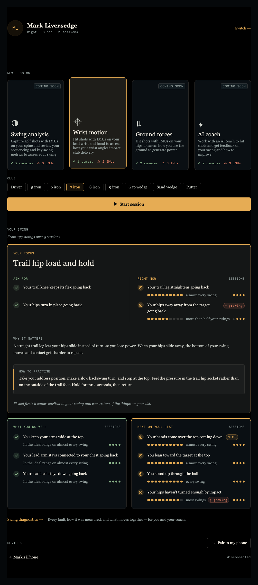 | 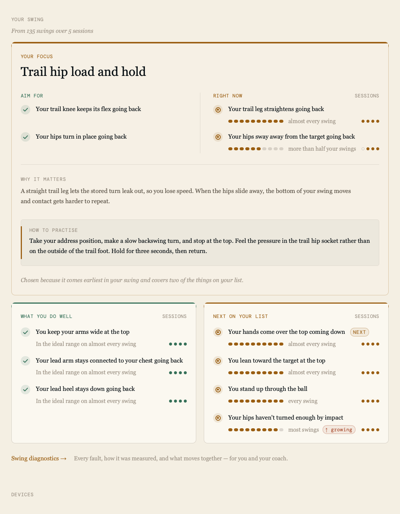 |

| Swing diagnostics, dark (the app) | A fault row opened (mock, then headed WORK ONS) |
|---|---|
| 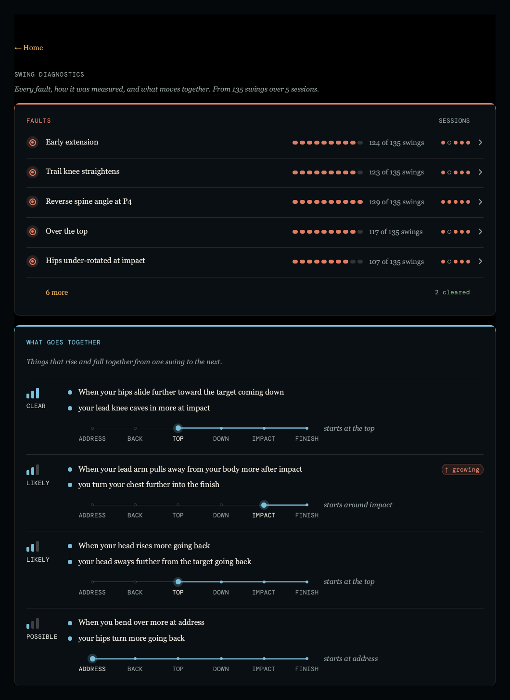 | 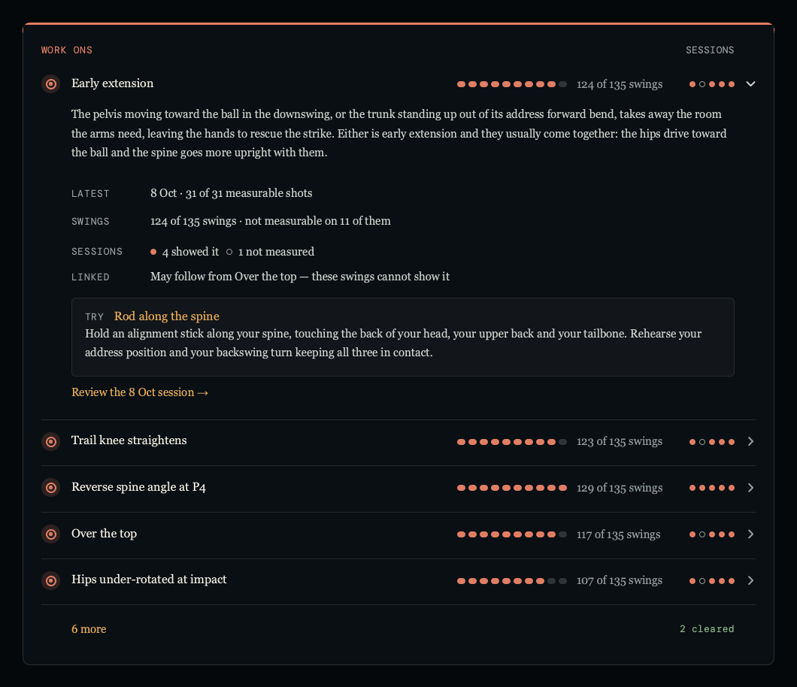 |

The light mock's last line still has the old wording "Chosen because…". The app says "Picked
first: …", because the home screen never uses causal words.

### 13.1 The principle: looked at before it is read

- **Every item has a shape as well as words.** A badge leads the line, a meter says how often and pips say which
  sessions. A glance at the shapes tells the story, and the words confirm it.
- **Colour is never the only channel.** Each tone comes with a shape (tick, target, arrow, dashed
  ring), with words ("almost every swing", "↑ growing"), or both.
- **Weight carries the hierarchy, not size.** At most one hero card per screen, then supporting cards, then a
  quiet link into the detail.
- **It stays flat** (section 10 holds). Tints are alpha washes of the card's tone over `colorSurface`,
  with no gradients, shadows or images.

### 13.2 Tone roles

A card has ONE tone. Its top rule, heading, badges, meter and pips all use it. Choose the tone by
what the content *means*, never by which panel it is in.

| Role | Token | Used for |
|---|---|---|
| Your focus, act on this | `colorAccent` | YOUR FOCUS, NEXT ON YOUR LIST, links, "NEXT" |
| Good, in the ideal range, easing | `colorGood` | WHAT YOU DO WELL, AIM FOR ticks, "↓ easing", "2 cleared" |
| A fault, named technically | `colorWarn` | FAULTS. Not `colorError`: nothing here is an alarm |
| A relation, neither praise nor fault | `gradientCool` | WHAT GOES TOGETHER |
| Quiet, unknown, headings' asides | `colorText3` | SESSIONS, captions, unconfirmed badges |
| Empty marks | `colorBorderMid` / `colorBorderStrong` | unfilled meter segments / unfilled pip rings |

There are two deliberate mixes. AIM FOR's green ticks sit inside the amber focus card, because the ideal is
praise. A trend chip takes `colorWarn` going up and `colorGood` easing, whatever the card's tone.

### 13.3 The card shell

```qml
component Card: Item {
    property color  tone: Theme.colorAccent
    property string title: ""                 // Micro, in the tone
    property string aside: ""                 // Micro, colorText3, right-aligned (e.g. "SESSIONS")
    readonly property int pad: Theme.sp(20)
    default property alias content: body.data

    Rectangle {                               // surface + hairline
        anchors.fill: parent
        radius: Theme.radiusLg
        color: Theme.colorSurface
        border.width: 1; border.color: Theme.colorBorderMid
    }
    // The top rule: a rounded tone shape with its lower part covered by the surface again,
    // so the rule follows the corners. 3 px; 4 px on the hero.
    Rectangle { width: parent.width; height: Theme.radiusLg * 2; radius: Theme.radiusLg; color: tone }
    Rectangle { x: 1; y: 3; width: parent.width - 2; height: Theme.radiusLg * 2; color: Theme.colorSurface }
    // heading row at (pad, pad + sp(2)); body Column sp(18) below it, item spacing sp(18)
}
```

- Cards sit `sp(16)` apart, with two side by side down to `sp(640)`. Below that they stack.
- The SESSIONS aside heads the pips. Every card in a row shares one pip count, so the pips line up on one right edge.

### 13.4 The hero card

There is one per screen at most. It is the card the golfer should act on (`HmFocus.qml`). It differs from the standard card in five ways:
- **The rule** is 4 px.
- **The surface** carries a wash of `Qt.alpha(tone, dark ? 0.045 : 0.05)`, and the hairline is
  `Qt.alpha(tone, dark ? 0.32 : 0.36)` instead of `colorBorderMid`.
- **A display headline** sits under the Micro label: `fontDisplay`, `fontSzDisplay`, `fontBodyWeight`, line height
  1.15. This is the only place display type appears on the page.
- **The body** is sections `sp(24)` apart with a 1 px `colorBorder` divider. Inner columns sit on the same split as the
  cards below, so the page keeps one grid. A hairline runs down the split, and each line on the left faces the
  line it answers on the right.
- **An inset panel** (HOW TO PRACTISE):
  - `radius`, with a fill of `Qt.alpha(colorText, dark ? 0.035 : 0.04)` and a 1 px `colorBorder`;
  - a 3 px bar in the tone down its left edge, inset `sp(14)` top and bottom;
  - a Micro label, then body text.
- **It closes on one italic line** (`fontSzBody2`, `colorText3`) saying honestly why this card is the one.

### 13.5 The marks

**Micro heading.** `fontData`, `fontSzMicro`, `trackingMicro`, with upper-case text in the string itself. In `colorText3`, or in the card's tone for the card title.

**Badges.** These are `sp(20)` circles filled with `Qt.alpha(tone, dark ? 0.16 : 0.12)`.
- The text indents by the badge plus `sp(12)`.
- The badge centres on the FIRST line of its text (`fontSzBody * 1.3 / 2`), not on the block.

| Badge | Drawn as | Means |
|---|---|---|
| Check | a tick (`Shape`, round caps, stroke `max(1.5, sp(1.6))`) | in the ideal, done well |
| Target | a ring (0.56 × size) and a centre dot (0.2 × size) | present, to work on |
| Easing | a down arrow, `colorGood` | getting better |
| Unconfirmed | a dashed ring, untinted grey | seen before, no recent evidence |

**Frequency meter.** Ten capsules, each `sp(9)` × `sp(6)`, spaced `sp(3)`. `round(share × 10)` of them are filled in the tone; the rest are `colorBorderMid`. It is always followed by words: "almost every swing" on the golfer layer, "124 of 135 swings" on the technical one.

**Session pips.** `sp(6)` dots spaced `sp(4)`, oldest first, showing the latest 8.
- A filled dot in the tone means seen (or, in a "do well" card, in the ideal range).
- An outlined `colorBorderStrong` ring means not seen.
- The faults card uses `PpTickRun`'s vocabulary instead: a dot is a pattern, a green dash is a clean session, and a ring means the session could not tell. There is never a gap.

**Chip.** A capsule `sp(18)` high, filled with `Qt.alpha(tone, dark ? 0.12 : 0.09)`, with a 1 px border of `Qt.alpha(tone, 0.45)` and Micro text in the tone.
- Uses: "↑ growing", "↓ easing", "NEXT", "last seen 4 Jul".
- It follows the frequency words. When the line has no room, it moves up to the right edge of the headline's line. It never overlaps the pips.

**Strength mark.** Three rising bars, filled 3, 2 or 1, with CLEAR, LIKELY or POSSIBLE beneath in Micro. It shows how firmly something holds, without a number.

**Swing timeline.** Six stops: ADDRESS, BACK, TOP, DOWN, IMPACT, FINISH.
- A 1 px base track, with a 2 px tone track from the start stop on.
- The start stop is `sp(9)` with a halo; the other stops are `sp(5)`.
- The start label is in `colorText`, the others in `colorText3`.
- The italic words to the right say where it starts ("starts at the top").

**Connector.** One dot per half, and a line between them. It joins two statements that go together.

### 13.6 Text

| Role | Font, size | Colour | Notes |
|---|---|---|---|
| Item headline | `fontBody`, `fontSzBody` | `colorText` | line height 1.3, wraps |
| Supporting words (frequency, caption) | `fontBody`, `fontSzBody2` | `colorText3` | |
| Prose (why it matters) | `fontBody`, `fontSzBody` | `colorText2` | line height 1.45, at most `sp(720)` wide |
| Subtitle, explanation, the closing reason | `fontBody`, `fontSzBody2`, italic | `colorText3` | "From 135 swings over 5 sessions" |
| Hero headline | `fontDisplay`, `fontSzDisplay` | `colorText` | the hero only |
| Link | `fontBody`, `fontSzBody2` | `colorAccent` | "Swing diagnostics →", "← Home", "Review the 8 Oct session →" |

The words are second person, plain and in sentence case.
- **The golfer layer (the home screen):** no figures, no jargon and no claims about cause.
- **The technical layer (Swing diagnostics, and the session screens):** technical names and counts are allowed.

### 13.7 Rows that open in place

A FAULTS row, closed, reads: badge, name, meter, count, pips, then a chevron that turns 90° when open. Rows are separated by 1 px `colorBorder`, and only one is open at a time. It opens in place:
- the prose;
- a label and value grid (Micro labels LATEST, SWINGS, SESSIONS, LINKED; body values);
- an inset TRY panel for the drill;
- a link into the session.

The card's foot holds "6 more" (a link) and "2 cleared" (Micro, `colorGood`).

### 13.8 States

- **Reading:** a Micro "reading your sessions…" sits on the right of the section's heading row. It appears the first time
  only; a recompute leaves the content standing and it simply changes when it lands.
- **Empty:** one quiet line (`fontSzBody2`, `colorText3`), for example "Nothing yet. …", so the card keeps its
  shape.
- **Nothing to say:** the hero is not drawn at all. It is never drawn empty.

### 13.9 Page layout

- The column is `Theme.contentWidth(parent.width)`.
- A section opens with a Micro heading and an italic subtitle, then `sp(16)`, then the hero, then the cards.
- The link row into the detail comes `sp(20)` below the cards: a link, then one line of `colorText3` saying what is behind it.
- There are two layers: the golfer's words on the front and the technical detail one link away. The detail screen opens with "← Home", a Micro heading and an italic subtitle.

### 13.10 Carrying it to other panels

- **Use the shared pieces.** They were lifted out of the `Hm*.qml` files (the home screen renders
  pixel-identical on them), so one change restyles every panel:

  | Component | What it is |
  |---|---|
  | `PpCardShell` | the shell alone: `tone`, `hero` (4 px rule + wash), `floating` (a Popup's, `colorBorderStrong`) |
  | `PpCard` | shell + Micro `title` / `aside` + a body column (`pad`, `itemGap`, `bodyGap`) |
  | `PpStageCard` | a stage panel's card: quiet by default, a `heading` Component replaces the title (tabs) |
  | `PpPopoverCard` | every `Popup`'s `background` |
  | `PpMicro`, `PpCardNote`, `PpLink`, `PpFact` | the text roles of 13.6 and the label/value row |
  | `PpInset` | the inset panel, with an optional tone `bar` |
  | `PpBadge` | `kind` check / target / easing / unconfirmed, `tone`, `size` |
  | `PpMeter`, `PpPips` / `PpPip`, `PpChip` | the meter, pips (`marks` or `ticks`), chips (`trend`, `tinted`) |
  | `PpStrengthMark`, `PpSwingTimeline` | the strength mark and the six-stop timeline |

  `Theme.qualityMark(score)` gives the badge kind that goes with `Theme.qualityColor(score)`.
- **Make each panel a card** with one tone chosen by role (13.2), a Micro title in that tone, and an
  aside where a column needs a heading. A panel inside a frame it does not own draws no frame or
  title of its own (13.11).
- **Keep the numbers on session screens.** They are the technical layer, so values stay in `fontData`.
  But wherever a value is judged against an ideal, give it a mark as well (a badge, meter, pips or a
  glyph) and words, so colour is never the only signal.
- **Keep video, camera tiles and the 3-D view as the dominant mass** (section 8). The card frames a
  panel and does not compete with it. Canvas panels get the quiet card: shell and heading, no marks.
- **Use at most one hero per screen,** and only when there is one thing to act on.
- **Verify by rendering** both themes, dark and light, offscreen (`--probe-qml` with `grabToImage`).
  Check that chips never overlap pips, that columns stack below `sp(640)`, and that empty and
  reading states keep the card's shape. A Popup lives in the window's overlay, so grab the window's
  root item, not its `contentItem`.

### 13.11 The Wrist session screen

| Wrist, Analyse, dark (the app) | Wrist, Analyse, light (the app) |
|---|---|
| 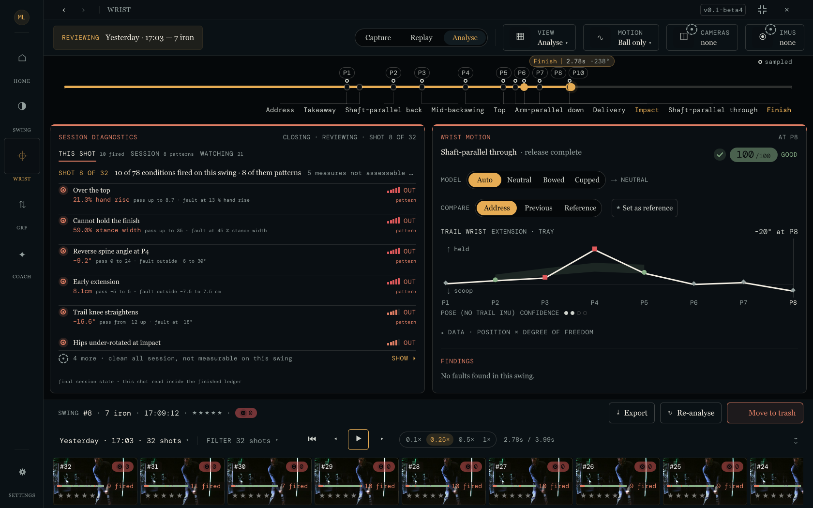 | 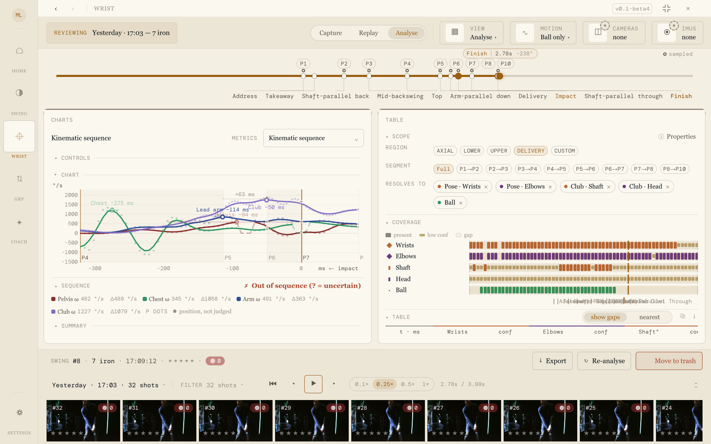 |

- **The stage owns the frame.** `PpModeStage` puts each panel it shows in a `PpStageCard`, titled
  and toned from its definitions: SESSION DIAGNOSTICS and WRIST MOTION in `colorWarn` (they name
  faults); CAMERA, 3-D SWING, LAUNCH MONITOR, CHARTS, TABLE and MARKUP quiet (`colorText3`). In the
  tabs arrangement the tab strip is the card's heading: Micro labels, the selected one in
  `colorText` over a 2 px rule in that panel's tone. A panel may put one more thing on the heading
  row through `readonly property string cardAside`; a panel also shown outside the stage carries
  `property bool framed` and is told it is framed already.
- **No card inside a card.** Inside a panel, sections are hairlines, Micro sub-headings and insets.
- **Faults are `colorWarn` everywhere** (13.2): diagnostics tick runs and verdicts, the carousel's
  pips, the launch monitor's Action readings. The Wrist position grid keeps its ● ▲ ■ glyphs.
- **Provenance has a shape:** a measured or fitted P-position is a solid dot, a sampled one a ring,
  an unavailable one the dashed badge, always with a key in words.
- **Devices** (toolbar pills and panel rows): check = connected and fine; dashed ring = not
  connected; target in `colorAttention` = needs calibration, low battery, partly connected; target
  in `colorError` = failed. The state is always in words too.
- **The toolbar and the carousel stay flat**; their drop-downs, sheets and menus sit on
  `PpPopoverCard`. Marks drawn on footage (camera chips, the stats pill, the markup HUD) keep a dark
  scrim for legibility.

Exceptions to section 10: the top rule (3 px, or 4 px on the hero) and the inset's 3 px tone bar are
filled shapes, not borders, and the tick is a `Shape` path. Borders themselves stay 1 px.

## 14. THEMES AS DATA, AND FOLIO

October 2026. Mark liked the look of a set of repository charts: warm neutral greys, hairline grids,
no boxes, generous whitespace, one neo-grotesk for everything including the numbers, small grey
sentence-case labels, and one restrained blue. **Folio** is that look as a seventh aesthetic. To make
it possible, theming was widened. It used to cover colour, fonts and radii; it now also covers spacing,
heading case, card rules, chart furniture and the app chrome. A theme also became data instead of
code.

| Home, light | Swing diagnostics, light | Swing diagnostics, dark |
|---|---|---|
| 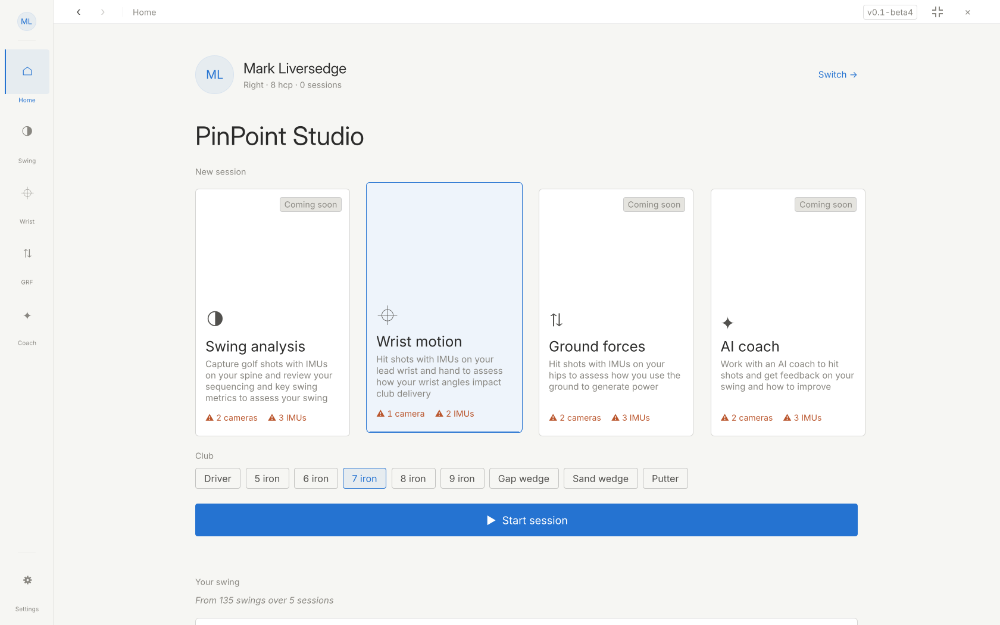 | 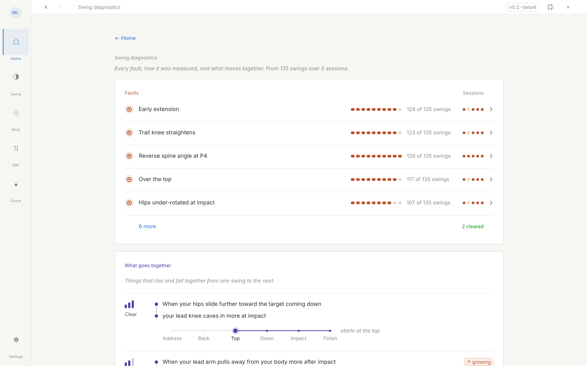 | 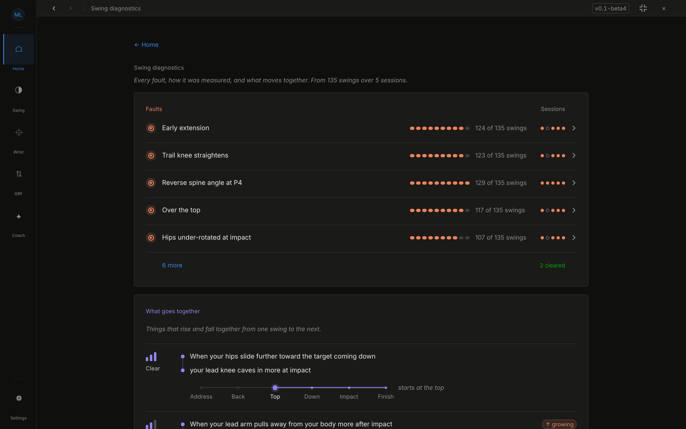 |

| Wrist → Charts, light | Wrist → Charts, dark |
|---|---|
| 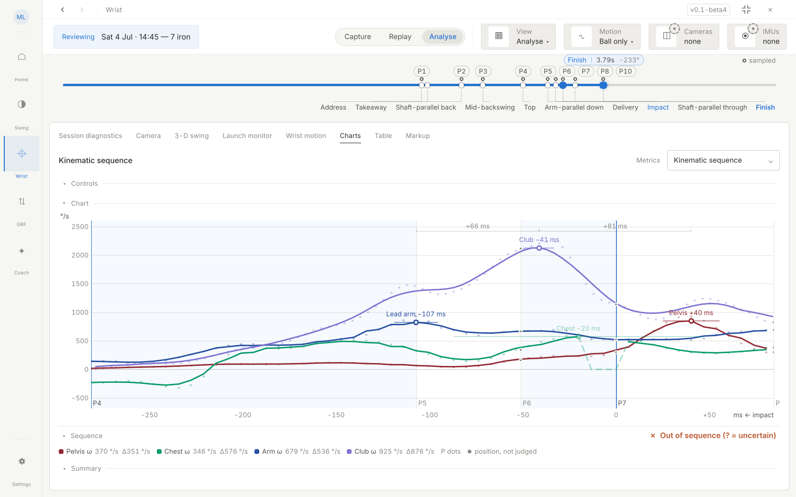 | 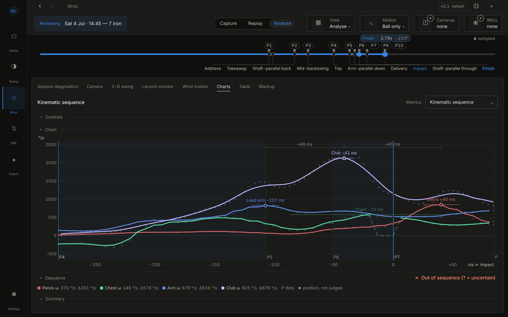 |

| Wrist → Session diagnostics, light | Settings → Appearance (14 tiles) |
|---|---|
| 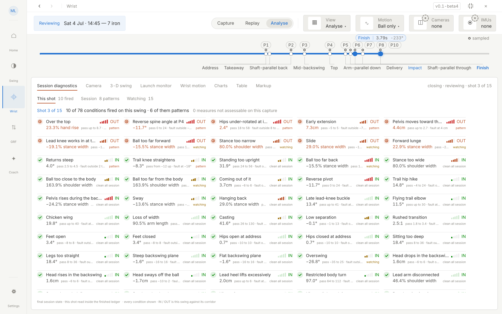 | 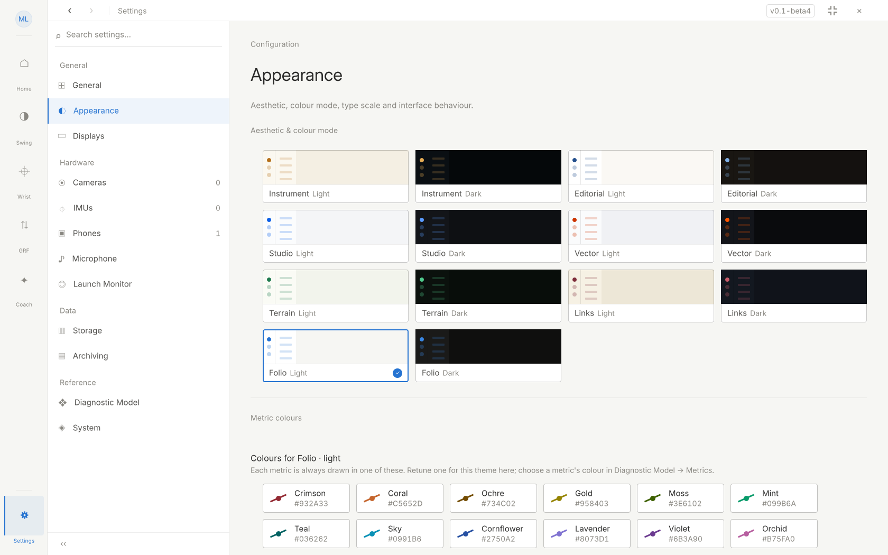 |

### 14.1 A theme is one table entry

`Theme._themes` holds one entry per aesthetic. Each entry has the keys it shares across modes and a
`light` and a `dark` block:

- **Shared keys:** `label`, `swatch` (the Appearance tile's dot), the three font families,
  `fontBodyWeight`, `displayBase`, the display italic and weight, `radius`, `radiusLg` and
  `railWidth`.
- **Mode blocks:** the 26 colours and `chartSeries`.

A token reads `_m.<name>` for a colour every theme defines, or `_v(name, default)` for an
**optional key**. The default is what the six original aesthetics always did, so a theme lists only
where it differs. An optional key may also sit in a mode block, as Folio's chart greys do.

- **themeIndex** is `2 × place in themeOrder (+1 for dark)`. Indices 0–11 never moved, so a saved
  `ui/themeIndex` keeps its meaning. Folio is 12 (light) and 13 (dark). `themeCount` and
  `cycleTheme()` follow `themeOrder`.
- **A new theme** is one entry plus its name in `themeOrder`. `themeInfo(i)` feeds the Appearance
  tiles, and the tile grid sizes itself from `themeCount`. Run `tools/theme/metric_palette.py` with
  the theme added to `THEMES` and `SURF` for its `_metricPalettes` block.
- **No component may branch on `Theme.aesthetic`.** The three that did (the rail, its buttons, the
  session toolbar) now read tokens. `grep "aesthetic ==="` over `src/Gui` is empty.
- **Proof of the restructure:** a probe dumped every token and sampled function for the 12
  original themes, from the old build and the new one. All 2,472 values matched. Whole-window
  renders of home, diagnostics and settings in all 12 themes were pixel-identical before and after.
  `tst_theme_tables.qml` pins indices, completeness, the pass-throughs and the Folio values.

### 14.2 The new token families

| Family | Tokens | Original aesthetics | Folio |
|---|---|---|---|
| Space | `gap(n)`, `spacingScale` | `gap(n)` = `sp(n)` | 1.15× the room between things, not their size |
| Heading case | `caps(s)`, `capsFont`, `capsHeadings` | CAPITALS | as written (sentence case) |
| Tracking | `trackingMicro / Label / Data`, `fontSzMicro` | 0.8 / 0.6 / 0.3, micro 10 | 0.15 / 0.1 / 0, micro 11 |
| Cards | `cardRule`, `heroRule`, `heroTinted` | 3 px / 4 px rule, tinted hero | no rule; the hero is a plain card |
| Charts | `gridColor(c)`, `gridOpacity(o)`, `baselineColor(c)`, `baselineOpacity(o)`, `curveWidth(w)`, `chartFrame`, `chartMarkerHollow` | pass-through: each chart hands in what it drew before | opaque hairlines `#E1E0D9` / `#2C2C2A`, baseline `#C3C2B7` / `#383835`, no plot box, hollow rings on `colorSurface` |
| Chrome | `colorRail`, `colorToolbar`, `railActiveBar` | instrument on `colorBg2`; editorial and vector use the bar | rail on `colorBg`, toolbar on `colorSurface`, accent bar |
| Titles | `fontSzHero`, `gradientTitlesActive` | 2 × display, gradient sweep | 34, flat ink |

The rules for using them:

- **Space vs size.** Spacing, margins, padding, and a card's pad and gaps are `Theme.gap()`. The size of
  a mark (badge, pip, meter capsule, stroke, rule) stays `Theme.sp()`. One exception: where a size is
  computed from a gutter (the resource monitor's bar row), the gutter stays `sp()`.
- **Heading case.** Headings are written in **sentence case** in the source. Set them with
  `Theme.caps(qsTr("Your focus"))`, or with `font.capitalization: Theme.capsFont` on the Text.
  - Acronyms stay capitals in the source: IMU, CPU, DTL, GRF, LM, P1…P10.
  - `.arg()` goes after the case change, `Theme.caps(qsTr("Path %1")).arg(x)`, so the argument keeps
    its own case.
  - Never capitalise inside a shared component: PpMicro carries live values as well as headings.
  - Strings that arrive from C++ already in capitals are lower-cased at the display site before
    `caps()` (`_unshout()` in the session-diagnostics panel).
  - The launch-monitor board abbreviations are sentence case in `launch_monitor_reading.cpp`.
- **Chart furniture is a pass-through.** Hand in the colour and opacity the chart used before.
  - Grid lines and the zero line wear the tokens. Meaning-carrying lines (Top, Impact, the playhead)
    and the phase-band wash do not.
  - Markers whose ring already MEANS something (watch / outside P-dots, the current shot on a
    corridor strip) keep their encoding. Only their fill moves to `colorSurface`.

### 14.3 Folio

- **Type.** Inter for body, "Inter Display" for display and the hero, and **"Inter Tabular"** for
  `fontData`. Inter Tabular is Inter with its tabular figures frozen in as the default digits and
  the family renamed. Every number in the app therefore lines up in columns in the sans, and no call
  site has to ask for `font.features`.
  - The faces are static instances, because CoreText won't interpolate a variable weight axis for an
    application font.
  - They are subset to Latin, Greek, punctuation, arrows, maths and shapes.
  - `tools/theme/make_inter_fonts.py <Inter-4.1 dir>` rebuilds them.
  - OFL-1.1; `Inter-OFL.txt` ships beside them; the licence entry is in `LICENSEDEPS.md`.
- **Colour.**
  - **Light:** ink `#2B2B2A` / `#52514E` / muted `#898781` on page `#F6F6F3`, white surfaces and
    alpha-ink hairlines.
  - **Dark:** `#EDEDEA` / `#C3C2B7` / `#8F8D86` on `#0F0F0E`, with surface `#1A1A19`.
  - **Accent:** `#2573D1` (light) / `#3987E5` (dark).
  - **Status colours** are the reference chart palette's hues, darkened where needed. Every text and
    status colour clears 4.5:1 on its surface; the muted grey, used only for captions, is the charts'
    own at 3.6:1, like the other themes' caption greys.
  - **`chartSeries`** is the validated eight-slot categorical order (blue, orange, aqua, yellow,
    magenta, green, violet, red), and the metric palette comes from the same generator rules as the
    other themes.
- **The look.** No coloured top rules: a card is a hairline box, and its tone lives in its title and
  its marks. There are no gradients, headings are small and sentence case, and there is more air
  between things. The inset keeps its 3 px tone bar (a mark, not chrome).

### 14.4 Known gaps

- A few labels arrive in capitals from data and still show that way in Folio: the metric manifest's
  read-at labels (BACKSWING, DOWNSWING, Δ LIE, Δ PLANE) and the IN/OUT state codes.
- The offscreen renderer draws no gradient titles, so in renders the original themes' page titles
  are blank. They draw in the app.

---

*This document is the single source of truth for Pinpoint visual implementation.
Section 13 matches the app's own code in `src/Gui/home/`; the rest matches the HTML prototypes.
Outside section 13, when in doubt, match the HTML prototypes in `pinpoint-aesthetic-*.html`;
the palette values in sections 3–12 were extracted directly from those prototypes.*
