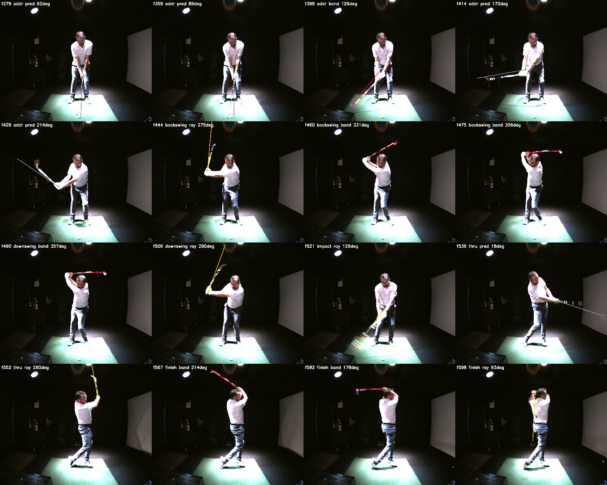
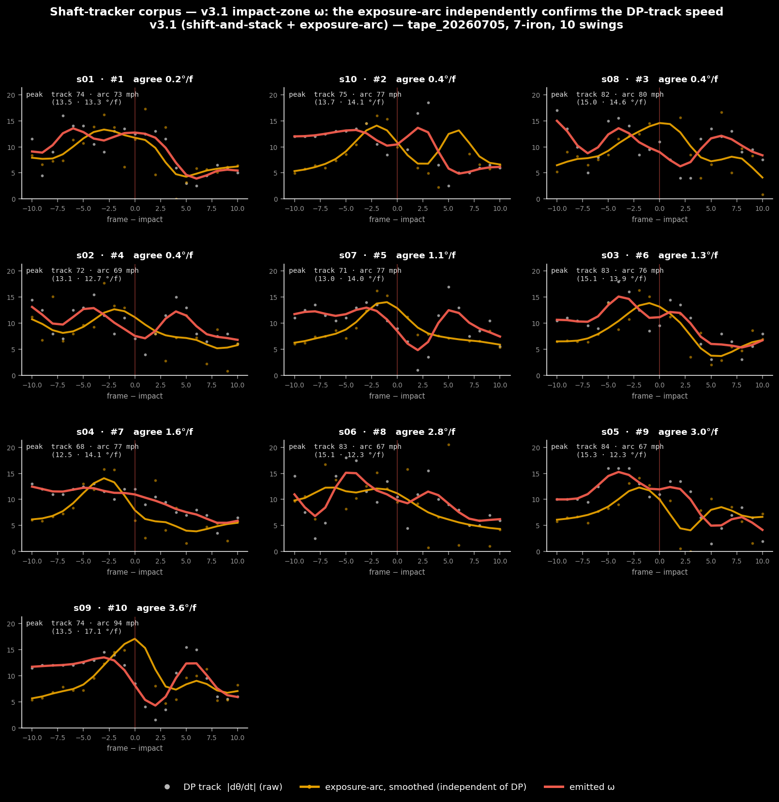
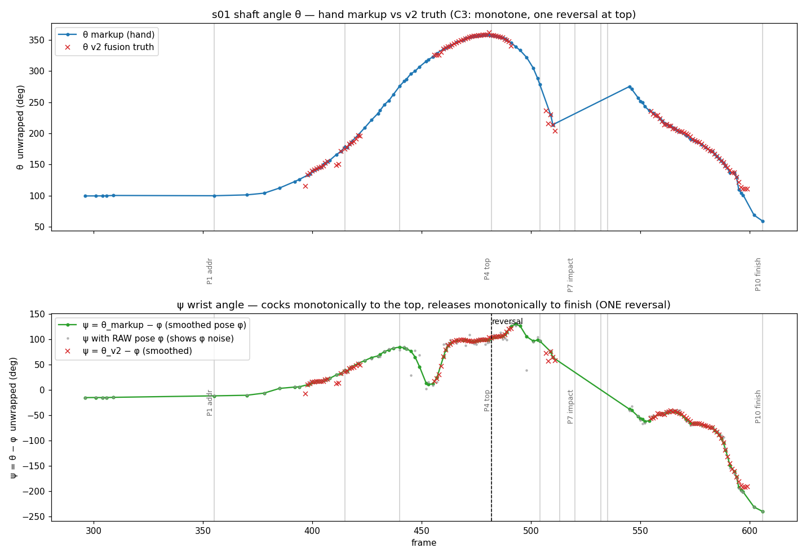
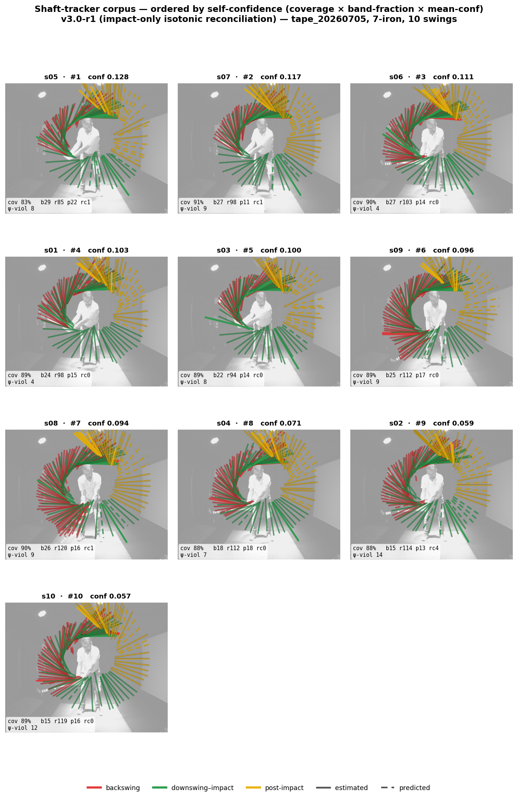
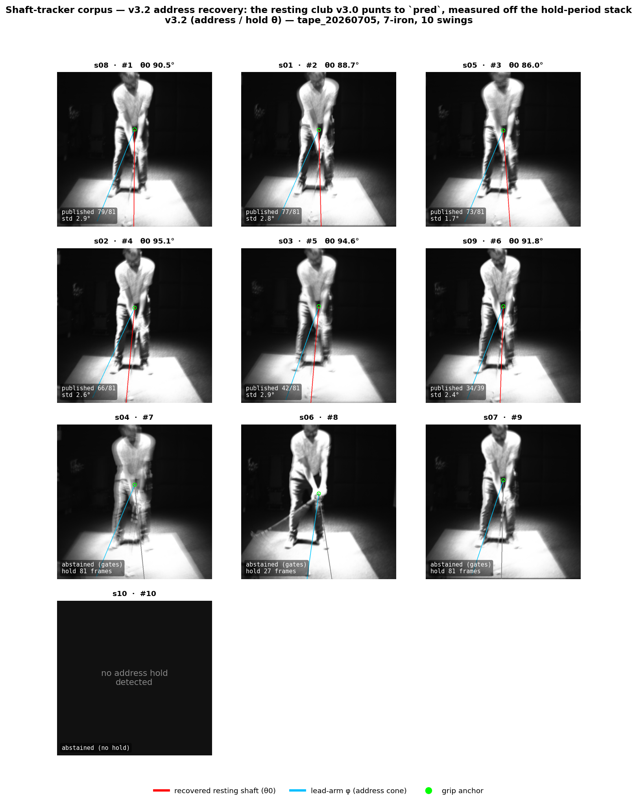

# Physics-Constrained Detection of a Golf Club from Fixed-Environment Video: Honest Measurement Tiers, Instrumented Truth Generation, and an Exposure-Arc Reading of Motion Blur

*PinPoint shaftlab programme — research report, 2026-07-05 (ψ-monotonicity
addendum 2026-07-06), covering the programme from inception. Empirical basis: hand-labelled swings 0008/0009,
the c1 multi-club corpus (100 head labels), the tape_20260704 pilot and
tape_20260705 instrumented corpora; tooling `tools/shaftlab/`; records in
`docs/design/shaft_detection_*`, `clubhead_detection_design.md`,
`stripe_fusion_design.md`, `club_tracking_v3_design.md`, and lab
`tape_20260705/RESULTS.md`.*

## Abstract

We report the full arc of a programme to measure a golf club from a single
fixed, face-on studio camera running at its hardware ceiling (150 fps,
~6.6 ms exposure, a deliberately blown-out hitting area). From that one
view we recover, per frame, the shaft's image-plane direction **θ**, its
projected scale **s** (which shrinks under foreshortening, **ρ**), and the
clubhead position — the raw inputs to the downstream coaching metrics
detailed in §1.

The programme has three parts. (i) A **passive, markerless two-stage
detector** — shaft first, then clubhead along the shaft ray — carried from a
confidently-wrong v1 to a corpus-validated v7 through twenty-one
individually-adjudicated fixes (measured-tier accuracy: median 2.5°, 0% of
frames worse than 30°). (ii) An **instrumented-truth generator** that reads
a known retroreflective band pattern on a taped club, evolving from a
blob-ratio matcher (1.1° median, zero flips, but only in the slow club-up
phases) into a multi-evidence fusion detector (zero adjudicated errors over
a ten-swing corpus; 1,033 truth samples in the fast phases where none
existed before). (iii) A **physics-first redesign (v3)** built on a single
observation: every false detection in either detector's history violates one
of four elementary facts about a golf swing — the club is held in the hands,
does not overlap the body mid-swing, reverses rotation exactly once at the
top, and forms a double pendulum with the lead arm. We argue the passive
detector's whole fix history was a slow, reactive rediscovery of these
facts, and that they belong a priori as constraints rather than as
post-failure guards. A later hand-marked swing sharpened the last of these
into a *dynamical* law we had not encoded: the wrist angle **ψ = θ − φ**
between the club and the lead arm is monotone with a single reversal at the
top, exactly as the shaft angle θ is — recasting the club/arm coupling from
a static reachability cone into a transition rail that turns the
well-tracked lead arm into a witness for the club through the impact blur.

We further contribute an **exposure-arc** reading of motion blur — at the
measured 98% shutter duty cycle, consecutive frames' streaks tile the swing
arc almost gaplessly, turning blur into a continuous angular record
(sub-frame θ at streak edges, single-frame speed from streak length). Built
and graded across the corpus, it yields the impact zone's first physical
velocity measurement — a plausible 71–92 mph clubhead speed on every swing —
that, read from the single-frame streak alone, independently corroborates the
tracker's velocity to within 1.5°/frame; the companion rotation-compensated
shift-and-stack is exact in geometry but, on high-signal taped clubs, adds no
new angle tier, its √N payoff reserved for the passive un-taped path. We also
set out one-directional wrist-IMU conditioning and conformal calibration of
the confidence tiers. Grading the
passive detector against the new dense truth paid off at once: it corrected
a contaminated figure (stage-1's measured tier is 0.6% bad in the fast
phases, not 7%), exposed a genuine failure of that tier and a
label-selection bias that had flattered the clubhead stage, and turned that
stage's honesty failure (7 of 10 swings) into a precise, per-frame tuning
target. *[As of 2026-07-09 that target has been met in the production C++:
the ball-anchored far end of §5.5 was built, corpus-tuned against this same
dense truth, and now passes the honesty clause on 9 of 10 swings — see the
resolution addendum, §5.5a.]*

## 1. Introduction

### What we measure, and why a degree matters

The quantity at the centre of this report is **θ (theta)**: the direction
the club's shaft points *as the face-on camera sees it*, measured as an
angle in the image plane and taken from the **grip** — the point where the
hands hold the club, which a pose estimator locates for us in every frame.
The absolute zero of θ is arbitrary; what matters is θ(t), the shaft angle
traced through the swing, which *is* the swing as far as this one camera is
concerned. Two companion angles travel with it: **α**, the direction of the
lead arm (also from the pose), and their difference **ψ = θ − α**, the
**wrist angle** — how the club is hinged relative to the forearm. Alongside
the angles we recover **s**, the shaft's *projected scale* (how many pixels
correspond to one millimetre of shaft), which shrinks whenever the club
tilts toward or away from the lens — the effect called **foreshortening
(ρ)** — and the **clubhead position** in the image.

None of these is the deliverable a golfer actually sees; they are the
*inputs* to almost everything a coach reads. In PinPoint's shot-analyzer
pipeline
([`docs/design/shot_analyzer_design.md`](../design/shot_analyzer_design.md)),
the shaft direction θ feeds **swing plane, shaft lean, club path, attack
angle, clubhead speed, and a face-angle proxy**; the lead-arm angle α feeds
**lead-arm flexion and the kinematic sequence**; and the wrist angle
ψ = θ − α *is itself* the headline metric of a Wrist session — the
flexion/extension and radial/ulnar deviation a coach diagnoses. Each of
these is then scored against a reference band that is itself only a few
degrees wide, which is exactly why accuracy of a degree or two is not a
nicety but the requirement: an error in θ does not stay contained, it
propagates straight into a number the golfer will act on. A shaft angle
that is casually 10° wrong is not a slightly worse measurement — it is a
*different diagnosis*. Meeting that standard, and being honest about the
frames where it cannot be met, is what the rest of this report is about.

### Why the measurement is hard

A coaching-studio capture system has to recover club motion from video
that — by commercial and physical necessity — is close to a worst case for
ordinary computer vision. It is worth being specific about *why* the scene
is so hostile, because each difficulty below drove a design decision later
in the report.

- **The camera is already at its limit.** 150 frames per second is the
  fastest this camera runs. The exposure — 6.574 ms, recorded per-stream
  in the capture metadata — is essentially as long as the frame allows,
  because there simply is not enough light to shorten it. The studio's
  ceiling downlight has to blow out the hitting area to light the golfer
  properly, and there is a ring light around the lens. None of these are
  bugs to be fixed; they are the fixed reality. There is no hardware knob
  left to turn, so every improvement from here has to be algorithmic.

- **The shaft looks completely different depending on where it is.** Its
  appearance is *regime-dependent*, and this is the single fact that
  defeats naive detectors. Polished steel is a mirror: it reflects light
  *specularly*, throwing a bright highlight only when the angle happens to
  line up, and looking dark otherwise. The reflective bands, by contrast,
  are *retroreflective* — they bounce light straight back toward wherever
  it came from, so under the camera's own ring light they blaze, but only
  within a narrow cone. Put those two facts together with a changing pose
  and a changing background and the same shaft reads, from moment to
  moment, as: a bright line against dark trousers; a *dark* line against
  the blown-out mat (where the white bands sit on white and vanish
  entirely); a row of separate blazing dashes when it is up in the light;
  or a smeared, bloom-merged bright smudge near the grip. A person fuses
  all of these into "that's the club" without effort. A detector built
  around a single brightness threshold cannot — whatever threshold it
  picks is wrong for most of the swing.

- **Near impact the club moves faster than the shutter can freeze.** At
  its peak the shaft sweeps roughly 15–20° *per frame* — about
  2,200–3,000°/s — so within a single exposure it does not appear as a
  line at all but as a smeared arc-shaped sector.

- **The scene is full of things that look like a club but aren't.** We
  call these *counterfeits*. Shadows, the edges of the mat, neon strips, a
  golf-bag shaft rack, creases in the trousers, the lines of the legs,
  highlights running down a sleeve, the quasi-periodic texture of a floral
  shirt (whose repeating bright peaks can even satisfy the band-ratio
  match described later), speckle on the mat — all of these form straight,
  club-shaped structures that persist frame to frame and that sail through
  the obvious sanity checks (a residual test, a flip test, a photometric
  test). The scene does not just add noise; it actively manufactures
  plausible fakes.

Two different detectors serve two different masters, and it is important
to keep them distinct. The **passive detector** uses no markers. It is the
product path — it has to run on whatever club the golfer walks in with,
and when it cannot see the club it has to say so honestly rather than
guess. The **instrumented detector** works on a specially taped club whose
band geometry we know exactly. It is not a product; it is a *measuring
instrument*. Its whole job is to generate ground truth for grading and
tuning the passive path — which means a single wrong entry from it
silently poisons every downstream decision we make about the passive
detector. Because the instrument's errors are so much more costly than a
mere missed frame, both detectors are held to the same governing rules,
which we learned early and paid for dearly (see §3.1):

- Output is split into **tiers** — *measured*, *predicted*, and *absent* —
  and any detection we are not confident in is thrown away rather than
  emitted. (We would rather have a gap we admit to than a number we
  secretly doubt.)
- **Confidence has to track error.** Concretely: at least two-thirds of
  the genuinely-wrong frames must carry low confidence, and no more than
  5% of the high-confidence frames may be wrong. A detector that is
  confidently wrong is worse than useless, because it defeats the human
  review it is supposed to enable.
- Results are always reported as **mean, 90th percentile, and %-bad, split
  by tier** — never as a lone median or a single lumped total, because
  those hide exactly the failures we care about (see §3.1 on "median error
  lies").
- Every numeric conclusion is **checked by eye at full resolution** before
  it is trusted.
- The code is **byte-for-byte deterministic**, which lets us use an exact
  re-run both as a regression test and as the contract for a future port
  to C++.
- Every promotion from one version to the next has to clear a **corpus
  gate** — a body of many swings — not just one good example.

## 2. Research goals

Four goals organise the work.

**G1 — passive accuracy, but with honesty.** We want a shaft tracker whose
*measured* tier can genuinely be trusted — around 2–3° median error, and
never confidently wrong — across every phase of the swing and every
lighting condition in the studio. And we want a clubhead stage that
inherits that trust through a frozen contract, so improving one stage
cannot quietly break the other.

**G2 — dense truth.** We want per-frame ground truth from the instrumented
club: θ everywhere we can get it, and s and head position wherever the
band pattern is legible. The priority is precisely the downswing, impact,
and follow-through — the fast phases where the passive detector is blind
*and* where hand-labelling is impossible, because the blur defeats human
annotators just as thoroughly as it defeats the algorithm.

**G3 — a defensible method.** Every reference implementation should be
deterministic, classical, and portable. Every acceptance rule should be
traceable to a specific failure someone actually looked at. Synthetic test
data should gate the machinery before real data is ever touched, and a
corpus should gate any claim of generalisation. Fixtures — the frozen
reference outputs we compare against — should only be re-frozen as part of
a deliberate, reviewed event.

**G4 — a bridge to the real product.** Ultimately we want to carry what we
learn from the instrumented lab club over to unmarked, everyday clubs — and
we want to admit learned (machine-learning) components only where the
classical methods have demonstrably run out of road.

## 3. Methods

### 3.1 How the programme is governed: prove it on the exemplar first

The programme has a founding failure that shaped everything after it. An
early, v1-style shaft tracker was ported to C++ and wired into the
application's markup panel *before* anyone had built a way to check it
frame by frame. It produced confidently wrong markups in the live app and
had to be ripped back out. The rule since then is absolute: an algorithm
is proven in a Python *exemplar*, with a human looking at real frames,
before a single line of it is ported into the product.

A second founding lesson, and one we repeat throughout: **the median
lies.** Our v1-era validation proudly reported a "median error of 7.4°" —
while 24% of the frames were more than 30° wrong, and wrong at a
confidence of 0.93–0.96. A median is dominated by the easy frames and says
nothing about the tail, and the tail is where a coaching tool does its
damage. So from then on every report splits results by output tier and
tests the confidence-honesty clauses explicitly.

A third lesson: **fixtures rot.** The "frozen" reference outputs from
version 6 turned out not to be reproducible when we re-prepared the video
clips — a combination of video-encoding noise and detections that sat right
on the edge of a gate. Awkwardly, fresh runs of the very same code were
*better* than the numbers we had written down as the freeze. The fix is
procedural: fixtures are now re-frozen atomically, in the same reviewed
commit as the code they belong to, and re-preparing a clip automatically
invalidates its fixtures.

### 3.2 Passive stage 1: tracking the shaft, and the F1–F21 fix programme

The shaft tracker works like this. In each frame it gathers *oriented
evidence* along candidate rays fanning out from the grip — where "grip"
comes from a pose estimator that finds the golfer's hands. The evidence is
a combination of a ridge response (a thin bright-or-dark line) and an
antiparallel edge pair the right width apart (the two sides of a shaft).
On top of the single-frame evidence sits a *tracking fan* — a Kalman
filter that predicts where the shaft should be next and only looks nearby,
plus RTS smoothing that cleans the whole trajectory up afterward by
sweeping backward through it. When the track is lost, the detector rescans
the full circle to re-initialise, with an escape mechanism so it cannot
lock permanently onto the wrong thing. And its output is tiered (this is
fix F9): a detection is labelled **MEASURED** only when its confidence is
at least 0.5 and it persists in a run of at least four frames; everything
weaker is discarded and *replaced* by an honestly-labelled prediction from
the smoother, a bridge across the gap, or a decaying extrapolation.

A word on the notation before the history. Individual fixes are labelled
**F1, F2, … F21**. Each `Fn` is *one* named, separately-adjudicated change
to the detector — each motivated by a specific frame someone could point at
and verified on that same frame — so the numbering is simply a running
ledger of every distinct thing we had to teach the tracker, in the order we
learned it. The complete before-and-after table for all twenty-one lives in
[`docs/design/shaft_detection_exemplar_findings.md`](../design/shaft_detection_exemplar_findings.md)
(the clubhead stage keeps its own parallel `Hn`-series in
[`clubhead_detection_design.md`](../design/clubhead_detection_design.md)).
The full ledger is long, so rather than march through it entry by entry the
account below compresses into four episodes — and the *shape* of each
episode matters more than any individual fix.

- **F1–F9 (building the v6 prototype).** This is where the tracker learned
  its basic manners. A *run-start gate* insists that the evidence begin
  near the hands — because "the club is attached to the hands," the single
  most useful fact in the whole system (F1). An *edge-pair width prior*
  demands two parallel edges the right distance apart, killing single
  edges like a mat border (F2). A *forearm plausibility sector* restricts
  the tracking fan to angles near the lead arm — but only while tracking,
  never during a full-circle re-init, because at the finish the club wraps
  around and the forearm assumption breaks (F3). *Wrong-lock escape*
  rescans and forces a re-init when a distant peak decisively beats the
  current track twice (F4). An *ω sanity clamp* rejects impossible
  spin rates — real clubs top out around 2,500°/s, and v1 once cheerfully
  reported 62,000°/s (F5). A *180°-flip test* checks a ray and its exact
  opposite and credits a bright clubhead blob at the far end to decide
  which way round the club actually points (F6). A *re-init confirmation*
  caps confidence at 0.35 until three good measurements have followed, so
  a shaky new lock cannot immediately claim certainty (F7). And an
  *either-path acceptance* rule admits a detection on either global
  support *or* a dense local run, so a foreshortened club at the finish
  (whose evidence is spread thin over a long ray) is not thrown out (F8).

- **F10–F14 (the still-hold programme).** The finish of a swing often ends
  with the club held nearly still, and a single frame of a static, dimly
  lit club is marginal evidence. The answer was *temporal stacking*:
  average several still frames together to beat the noise down by roughly
  √K, then scan the cleaner composite (F10 — the programme's first use of
  stacking, an idea that returns in a much bigger form in §3.9). This
  brought its own hazards. A static club has exactly one angle, so
  measured outliers within a still window can be demoted (F11) — but that
  same premise later turned out to be false in a subtle way we return to.
  A *scene-permanence veto* rejects any candidate that already existed in
  a pre-swing snapshot of the scene, on the logic that permanent structure
  (like neon strips) is not the club (F12). The first version of that veto
  used a snapshot of frame 0 — which *contained the club at address* — and
  therefore vetoed the club every time it returned to its address angle
  *at impact*, silently killing the entire downswing until a human noticed
  by eye. (The fix was to build the snapshot from a club-free median across
  the whole clip.) A clubhead-blob AND-test requires the far end to be
  *both* bright *and* changed-from-the-scene (F13). And a *quasi-static
  gate* confines all of these hardened checks to near-still moments,
  because when they were applied everywhere they strangled the tracker's
  ability to recover mid-downswing (F14).

- **F19–F21 (killing distractors, driven by the c1 corpus).** A code
  audit turned up something embarrassing: both anti-distractor vetoes were
  wired to fire only during quasi-static moments, which meant a
  fast-motion re-init had *no protection at all* — and a `swing_seen`
  guard had been keeping the permanence veto switched off through the
  entire backswing. The fixes made the strict permanence veto apply at any
  speed (its first adjudicated kill was a golf-bag shaft rack, F19), built
  the permanence reference from the highest-motion frames so it is
  guaranteed free of parked clubs at address *and* finish (F20), and
  resolved a genuinely four-way confusion at the finish (F21): a club held
  over the shoulder is legitimately close to the body *and* has no bright
  blob, whereas junk running along the body line often *does* have a bright
  blob (from the golfer's shoes), so the gate has to be conditioned on
  which situation it is in.

- **Things we tried and rejected** (each ruled out by an A/B test on the
  corpus, and kept as documented negative results — knowing what does *not*
  work is part of the record). Shaping confidence by kinematics for
  fast-born segments failed because good segments and junk segments overlap
  on *every* kinematic statistic we could measure; they are only
  distinguishable by content, not by motion. Applying the forearm sector
  at fast flips broke the takeaway, where the real club genuinely does lie
  near the forearm. A shoulder-to-arm collinearity veto never fired,
  because the locks it was meant to catch were scenery, not arms. Blob
  rescue on the permanence veto let junk back in, because the moving
  golfer makes everything look "changed." And a hold-density gate collapsed
  real dark holds along with the junk.

Here is the observation this report is built around, visible only when you
stand back from the whole list. F1 (attachment to the hands), F3 and F21
(the forearm and the pendulum), F5 (the spin-rate bound), F12/F19/F20
(scene versus club), and the F16-class body gates are all *piecemeal,
reactive encodings of the same four physical fundamentals* that §3.8 will
promote to first-class constraints. Every one of them was installed only
*after* its counterfeit had been caught and adjudicated. Not one was
derived, in advance, from the fact that we already know how a golf swing
works.

### 3.3 Passive stage 2: finding the clubhead along the ray

Once stage 1 has told us which direction the shaft points, stage 2 answers
a simpler-sounding question: how far out along that direction does the
club end? Where stage 1 searched over *angle*, stage 2 searches over
*distance* along the ray.

The two stages are deliberately decoupled by a *frozen contract*. Stage 2
is allowed to read exactly five things from stage 1 — the frame index, the
grip position, the shaft angle θ, the tier (measured or predicted), and
the confidence — and nothing else. It is developed against frozen CSV files
of stage-1 output, never against live stage-1 code. The point is that
stage 1 will keep improving, and stage 2 must not have to care.

For each frame, stage 2 measures the head by looking for where the thin
shaft line ends: a gap-tolerant search for the terminus on the axis,
edge-pairs at several candidate widths, the same permanence veto stage 1
uses, and a scoring step that prefers heads at a plausible projected
length. That plausible length comes from a *length model* (developed
through forms M0–M4); in production it is a per-swing **censored
self-fit** — "censored" because foreshortening hides part of the true
length whenever the club tilts toward the camera, so the fit has to be
built to respect the fact that it is only ever seeing a lower bound. An
*arm-length plausibility floor* throws out any "head" that falls inside
the golfer's own reach (it cannot be a clubhead if it is closer than the
hands can hold it). A segmented 1-D Kalman filter with per-segment RTS
smoothing and its own measured/predicted/off tiers, plus a flip check,
finishes the stage. The value of that frozen contract showed up concretely
when v7's stage-1 improvements flowed through to changed — and gracefully
improved — stage-2 output with *zero* stage-2 code changes.

### 3.4 The corpora, the labels, and the layers of validation

Two swings were hand-labelled in detail: swing 0008 (51 shaft labels) and
swing 0009 (18 labels, chosen deliberately because it is pathological — an
overhead wrap and a club left hanging). Later, 100 clubhead labels were
placed across the c1 corpus: 10 uncropped swings shot in a new studio with
8 different club types — our first data with proper off-frame and
crop-tier examples and our first spread across many clubs.

Corpus discipline is strict for a reason we keep having to relearn: the
residuals from a *single* swing must never be allowed to choose a model
form, because that one swing might itself be atypical (off-plane, oddly
lit, whatever). Real decisions wait for a corpus gate. Even the guidance on
how to *capture* the video became a finding in its own right — how to frame
the shot, and how to manage the exposure strata.

And hand labels have a structural limitation that §4.3 will quantify and
that matters enormously: a human can only label a frame in which they can
actually see the club. That means our hand labels are systematically
biased toward exactly the easy frames — the ones detectors already handle —
and away from the blurred fast frames that are the whole problem. Grading a
detector only on frames a human could label flatters it.

### 3.5 The instrumented club and its two geometric invariants

The instrumented 7-iron carries six 25 mm retroreflective bands at
308, 362, 560, 758, 808, and 854 mm from the butt of the club — a spacing
that groups them 2-1-3. The hosel sits at 882 mm and the club is 940 mm
long. Two geometric facts about this pattern do the heavy lifting.

The first is *ratio preservation*. When a straight object is photographed,
the projection is (locally) affine, and one thing affine projections
preserve is the *ratio* of distances measured along a line. So no matter
how the club is oriented in space, the bands' positions along the shaft
map to image positions by a single linear rule, `t = s·(r − r₀)` —
which is exactly what lets us match the pattern at any pose by solving for
the scale `s` and offset `r₀`.

The second is *asymmetry*. The 2-1-3 grouping is not symmetric, so it
breaks the 180° ambiguity that would otherwise leave us unable to tell the
butt end from the head end. That said, the asymmetry is not free: the
three closely-spaced tip bands (gaps of 46 and 50 mm) are nearly
flip-ambiguous at realistic image scales, needing about one pixel of
positional discrimination to resolve — and intensity alone (how bright each
band is) cannot tell the flip at all.

We ran a pilot on 2026-07-04 to check what the tape does to the *passive*
detector — because in principle taping the club could help or hurt it. The
answer: it helps address and backswing (the grazing light and the extra
contrast give the tracker more to grab), it leaves the downswing unchanged
(blur destroys the bands there just as it destroys everything else), and
it actually *hurts* the finish. That last effect is instructive: F11's
"a still club has one angle" logic sees the two distinct θ clusters that a
banded club can produce inside a single grip-still run and demotes both,
because it assumes a still grip means a static club. The taped pilot
falsified that assumption ("a still grip is not the same as a static
club") and exposed an F11 design flaw that awaits a corpus-gated fix.

### 3.6 Raw capture and decode

The camera writes raw Bayer sidecar files (the sensor's unprocessed
colour-filter data — BayerRG8, 746 frames per swing). We decode these with
exactly the same edge-aware demosaic algorithm the application uses, into
FFV1-lossless clips. The point is to have *no* lossy encoder standing
between the sensor and the measurement, and to carry the per-stream
exposure value straight from the capture metadata into the analysis
automatically. Interestingly, a controlled A/B comparison showed the
compressed path actually *helps* the slow phases (the encoder's denoising
cleans them up) and ties in the fast phases — which told us that the
binding constraint is the detector's robustness, not the fidelity of the
decode. Chasing decode quality would have been effort spent on the wrong
thing.

### 3.7 The instrumented-truth generator, generations one and two

**Version 1 — matching the saturated blobs.** The first truth generator
thresholds the image at 235 to find saturated blobs, groups them into
connected components, uses RANSAC to find the collinear set that passes
through the grip anchor, matches the 2-1-3 pattern with an
order-preserving affine ratio fit, tests the flip by position, and
verifies that the gaps within the group are genuinely dark. It achieves a
1.1° median error with zero flips — but *only* where the bands bloom into
discrete dots, which is to say the club-up phases. And §5.1 records how it
was quietly contaminated at the address-waggle frames.

**Version 2 — fusing several kinds of evidence** (`stripe_fusion.py`).
This is where the design gets interesting, because it is built to see the
shaft the way a human does — through whichever physics happens to be
available in a given frame. It combines three evidence terms.

- A *polarity-aware ridge*. The shaft is brighter than dark cloth but
  *darker* than the blown-out mat, so a fixed "look for bright" rule is
  blind half the time. The ridge term takes the lateral maximum over dark
  backgrounds and the lateral minimum over blown backgrounds (a simple
  mean would wash a 2–3 px line out entirely once you account for
  sub-pixel misalignment), and it insists the sign of the contrast be
  *coherent* within each background segment, only allowed to flip where
  the background itself changes. This is the term that finally sees the
  dark-shaft-on-bright-mat regime.

- *Temporal evidence*. During still runs it stacks the pixel medians over
  the run (√N noise suppression again); during motion it subtracts the
  scene median so that static clutter disappears and only the moving shaft
  and its blazing bands survive.

- *Dense profile machinery* for reading the band pattern robustly. It
  estimates the local steel brightness from a percentile rather than a
  median, because the three tip bands sit so close together that they mask
  a median. It finds band peaks by their *prominence* within a bounded
  window rather than against any absolute baseline, because a sloped
  specular highlight on the steel will hallucinate peaks against any fixed
  threshold. And it scores band-assignment hypotheses on an (s, r₀) grid
  in which a hypothesis is penalised for every prominent peak it fails to
  explain.

Layered on top are a set of *honesty mechanisms*, each one earned by a
specific adjudicated failure: a forearm veto; interpolation guards across
the impact gap (θ genuinely sweeps more than 180° through impact in about
37 frames, so naive interpolation across that gap is nonsense); and the
load-bearing one, *motion-verified corroboration* — a matched blob is only
believed if it actually travels with the hands (moving at least
max(1.5 px, 0.25× the hand displacement)). No lone locks are allowed, and
— importantly — *no locks at all are allowed during static periods*. The
reasoning there is deep: in a hold, there is no motion to separate the
real club from a counterfeit, and the counterfeits pass every
appearance-based test, so a static lock is fundamentally *unverifiable* and
is therefore never emitted. The whole machine is gated on a randomised
synthetic generator (a blown region with inverted contrast, bloom-
saturating steel, speckle, anchor noise, in both a harsh and an easy
regime — where the easy regime *requires* full locks and the harsh regime
*requires* honest abstention from reporting scale).

### 3.8 The physics-first constraint system (the v3 design, and what building it taught)

Standing back from both detectors, one pattern is impossible to miss:
every surviving counterfeit, and every historical one, violates some
physical fact about a golf swing that the methods never encoded up front.
Version 3 promotes four such facts to *constraints* that are checked
*before* the evidence engines ever run, so that a candidate which is
physically impossible is rejected on principle rather than out-scored on
evidence.

- **C1 — butt termination.** The club is held in the hands, so the club's
  evidence must *stop* within about 260 mm behind the grip. A line whose
  support continues on *behind* the butt (a trouser crease, a screen edge,
  a shaft shadow) is scene structure, and is vetoed no matter how well it
  scores. This is the full-strength version of F1. (The old v2.0 only had
  the weak form — "the ray passes within 80 px of the anchor" — and every
  counterfeit it ever caught had passed that weak gate.)

- **C2 — phase-scheduled body-overlap veto.** From takeaway through
  follow-through, the club is out in free space, *not* overlapping the
  golfer's body. Using the eight body joints the pose estimator already
  produces each frame, we build a body polygon (with a margin, smoothed in
  time to survive blur-degraded pose frames), and during those phases any
  candidate that is mostly *inside* that polygon is vetoed. At address,
  impact, and finish — the phases where the club genuinely does overlap the
  body — body evidence is admitted, but it is never sufficient on its own.
  This systematises the F16 and F21 body gates.

- **C3 — the swing reverses direction exactly once.** We segment the swing
  into its phases (still → takeaway → backswing → top → downswing → impact →
  through → finish) from the hand trajectory *alone*, with no club
  detection required, and we detect the swing's chirality once per swing
  from that trajectory (no handedness is hard-coded). Because we then know
  the sign of θ's rotation within each phase, a 180° flip becomes
  *structurally impossible* rather than something we filter out
  statistically, and bridging across an outage becomes a monotone,
  bounded-rate sweep instead of a naive interpolation. This subsumes F4,
  F6, and the v2 interpolation guards.

- **C4 — the club and the lead arm form a double pendulum.** With the lead
  arm's direction known from the pose and the shaft direction θ being what
  we are solving for, the wrist angle between them is anatomically bounded
  and evolves smoothly. This gives us a per-frame *reachable cone* — the
  search for θ collapses from a full 360° to a few tens of degrees — and a
  smoothness prior on the wrist angle. This is the full form of the
  forearm sector from F3 and F21.

Underneath, a single global estimator — dynamic programming (a Viterbi
search) over a grid of θ values across the *whole* clip, with transition
costs coming from C3/C4 and emission costs from the (unchanged, already
validated) evidence engines — replaces the old local, frame-by-frame
corroboration. The evidence engines survive intact; they simply become
emission terms inside a globally-consistent, physically-constrained
solution.

**What building it changed in the design.** The exemplar
(`tools/shaftlab/club_track_v3.py`; a full walk-through is in
`docs/design/club_track_v3_exemplar_explained.md`) is now built and has
passed every gate (§4.4), but three things that the design got optimistically
wrong are worth recording, because they are the parts a re-implementer will be
tempted to "restore":

- **C4's cone is *wide*, not "a few tens of degrees".** The reachable-cone
  argument assumed the lead-arm direction φ was clean. On real captures φ, read
  from pose, jumps by up to ~87° frame-to-frame at the top and in the blur
  zone. So in practice φ is heavily smoothed and the cone is kept deliberately
  wide, and it is switched *off* at address and finish (where the wrist angle
  ψ = θ − φ is genuinely unbounded). C4 survives only as a hard veto on the
  shaft pointing *into* the forearm and a soft removal of the reverse
  half-circle; the real search-space collapse is done by **C3** — the
  one-sided, bounded-rate DP transitions — not by C4.
- **The strong evidence must *anchor* the global solution, not merely feed
  it.** A band lock is turned into a *negative-emission well* the trajectory is
  pulled into, so the DP is forced through the true (wrapping) path. Without
  that, a correct band angle and a competing bright ridge tie on cost and the
  smoothness term routes the solution down the flatter *wrong* branch across
  the evidence-free impact gap — which is exactly how the through-swing and
  finish came out ~90° wrong until the well was added.
- **Honesty is enforced at the *output*, not assumed.** Bridged (predicted)
  frames are never written into the truth files; a θ-only "ray" is admitted
  only when its evidence clearly beats the reverse direction *and* is
  corroborated (by motion in the free-space phases, or by a nearby band lock in
  the finish, where a static ridge is the classic counterfeit); address holds
  abstain. This is the machinery that keeps "confidently wrong" at zero while
  still recovering the coverage v2 had thrown away.

### 3.8a A fourth structural law: ψ-monotonicity, and C4's second form

The four constraints of §3.8 were the facts the fix history had already,
implicitly, rediscovered. Standing back once more surfaced a fifth — really
the *substantive* half of C4, which the as-built had shrunk to a wide
guardrail. The double pendulum does not merely bound the wrist angle
ψ = θ − φ (the reachability cone); it makes ψ **monotone**. From address to
the top the wrist cocks: ψ moves one way only, the interior arm–shaft angle
closing from roughly 180° to 90°. At transition it reverses exactly once.
From transition through impact to the finish it releases: ψ moves the other
way only. Un-hinging in the backswing, or re-hinging in the downswing, is
anatomically impossible. This is C3's one-reversal law over again, but on
the *wrist* rather than the shaft — and because θ = ψ + φ with the lead arm
φ carrying its own motion, "ψ is one-sided per phase" is strictly stronger
than "θ is one-sided per phase": it constrains the shaft's rotation
*relative to the measured arm*.

The shipped C4 never encoded this. It encoded only the *magnitude* cone,
which pose noise had already forced wide and part-time (§3.8). The
refinement recasts C4 as a transition term on Δψ = Δθ − Δφ, structurally
parallel to C3's term on Δθ: a phase-signed sign-lock (with a free window at
transition, because the wrist reversal *lags* the hand-top for players who
hold their lag), a bounded hinge rate, and a mild smoothness penalty. It
drops into the same dynamic program with no state-space growth, since
ψ at a frame reads only that frame's DP state θ and the per-frame-constant
arm angle φ.

Two properties make it succeed where the cone failed. First, it constrains
*monotonicity, not magnitude* — so, unlike the cone the programme was warned
never to tighten, it clips only physically impossible paths and needs merely
the *trend* of φ, not its instantaneous value. Second, and this is the
prize, it turns the arm into a witness for the club *through the blur*: in
the impact zone, where the shaft is unmeasurable and the estimator otherwise
free-runs on smoothness, the lead arm remains well tracked (larger, slower,
less blurred), so a bounded monotone-release rail pins θ = ψ + φ from the arm
exactly where the club cannot be seen. §4.6 reports the first measurement of
the law on real data.

**As-built refinement (2026-07-07): fit the law, and bound its domain.** Two
lessons from building it changed the form. First, a *per-frame* transition
penalty on the sign of Δψ fires on the pose-φ noise floor: on real data 25–62%
of backswing steps show a small (≈2–4°) apparent reversal that is pure
estimation noise — visible even on hand-marked θ. The one-reversal law is a
property of the *trend*, not of each discrete step, so a violation is best read
not as a fact to penalise but as a *measurement of error*. The penalty was
therefore replaced by its dual: treat monotone ψ as ground truth and **fit** it
(per-phase weighted robust isotonic regression, Pool-Adjacent-Violators with a
Huber reweight), reading the error off the residual. The residual becomes a
per-frame φ-error / confidence map; where the shaft is blurred the arm supplies
θ = ψ\_iso + φ; and a well-measured frame anchors itself (its fit passes through
it), so the reconciliation cannot corrupt a good measurement — the whole
backswing-vs-release scoping problem of the penalty form simply dissolves.
Second, and more fundamental, a ten-swing corpus exposed the law's *domain*.
ψ is not a single tent but a **double reversal**: it cocks to the top (reversal
one), releases to ≈0 at impact, and then — as the arms decelerate into the
follow-through — the wrists **re-hinge passively under centripetal load**
(reversal two). Between the two, through and just past impact, the dominant
motion is not hinge at all but **forearm rotation about the shaft's long axis**
— a third rotational degree of freedom a face-on view cannot see, the shaft
being axially symmetric so that rolling it does not move the line. A
one-reversal release law imposed to the finish therefore fights both a real
second reversal and a rotation it cannot represent, and (§4.7) it degraded the
*well-tracked* follow-through while helping only the impact blur. The law's
valid domain is **address→impact**; the reconciliation is bounded to the impact
blur (hinge-valid ∩ shaft-lost), and past impact the shaft evidence — returned
sharp — is trusted. The third dimension, roll, is not estimated from the shaft
but deferred to the channels that *can* see it — the club IMU (full 3-D
orientation, directly), the down-the-line camera, and the clubhead detector —
while the follow-through ψ-residual is retained as a release-complete /
roll-onset signal rather than a tracking correction.

### 3.9 Rotation-compensated shift-and-stack (v3.1)

This is a trick borrowed from astronomy, where faint moving objects are
recovered by shifting a stack of exposures to follow the object's known
motion so that its light adds up coherently while everything else blurs
away. Here the club rotates about the (moving) grip pivot, so for a window
of frames and a set of rotation hypotheses ω(t) drawn from the
C3/C4 prior, we: register every frame on the grip anchor, rotate each
frame backward by the integral of ω about that pivot, and stack. Under the
*correct* hypothesis the club's pixels line up and integrate coherently —
gaining roughly √N in signal-to-noise — while the body and background,
which do not share that motion, smear into arcs. The hypothesis that
maximises coherence hands us three things at once: the club's region of
interest, a refined estimate of ω, and a partially deblurred composite in
which the band pattern can actually re-emerge at speeds where any single
6.6 ms frame is hopeless. The body polygon is masked out of the coherence
measure (that is C2 again), C1 is tested on the composite, and a
coarse-to-fine ordering keeps the compute bounded. F10's still-stack was
simply the zero-rotation special case of this; this generalises stacking to
the fast phases that actually matter. (As built and graded in §4.5 the
de-rotation is exact and the club does integrate into one coherent streak —
but on the *taped* corpus, where every frame is already bright, it does not
sharpen the bands enough to add a measurement tier; that √N payoff is
reserved for the low-signal passive club.)

### 3.10 Exposure-arc tomography (novel)

This is a new idea and worth dwelling on. The measured *duty cycle* — the
fraction of each frame during which the shutter is actually open — is 98.1%
(6.574 ms open out of a 6.699 ms frame period). That number has a lovely
consequence: the arc that the club sweeps out while frame *t*'s shutter is
open ends, to within 1.9% of a frame, exactly where frame *t+1*'s begins.
Consecutive frames' motion streaks therefore *tile the swing arc
contiguously*. Motion blur, in other words, is not noise to be fought — it
is a nearly gap-free, continuous recording of θ(t).

Three concrete measurements fall out of reading the blur this way:

1. The leading and trailing *edges* of a band's streak are θ samples at
   known sub-frame moments — the instant the shutter opened and the instant
   it closed — which effectively *doubles* the temporal resolution exactly
   where θ is changing fastest.
2. A streak's arc-length divided by the band's width gives the club's speed
   |ω| for that frame, from that *single* frame, with no differencing
   between frames at all.
3. Checking that each frame's streak sector continues smoothly into the
   next validates or rejects a whole window of frames at once.

The striking implication is that the impact zone — today the one remaining
hole in our coverage — could turn out to be the *densest* measurement
region of all. And it composes neatly with §3.9: the shift-and-stack finds
the corridor the club is in, and sector-edge extraction reads θ(t) inside
it. (§4.5 is the first corpus test: the exposure-arc delivers a physically
plausible ω(t) — 71–92 mph across the ten swings — that independently
corroborates the tracker's velocity to within 1.5°/frame; the fuller
θ-tomography from sector edges is the natural next reading.)

### 3.11 Cross-modal conditioning from the wrist IMU (novel in this pipeline)

Every swing we capture already records a wrist-worn IMU (inertial
measurement unit), time-aligned to the video with a known latency. We have
not been using it, and it offers three things the vision cannot get on its
own. It gives a club-independent instant for the *top* of the swing, which
independently corroborates C3. It gives an ω(t) prior that collapses both
the DP transition model and the shift-and-stack hypothesis set from tens of
candidates down to a handful. And it is the only witness we have that is
*completely* independent of the vision — so a vision lock whose implied
spin rate contradicts the IMU can be quarantined for a human to look at.
Crucially the fusion is *one-directional*: the IMU conditions the vision
*search*, but the vision truth is never fitted to the IMU. That asymmetry
is deliberate — it preserves the truth generator's independence, which is
the whole reason it is trustworthy.

### 3.12 Learned components (v3.3), kept strictly subordinate to physics

Finally, a place for machine learning — but a narrow one. We propose a small
heatmap keypoint network that localises the clubhead's heel, toe, and hosel,
evaluated *only* inside the physics-defined region of interest. It is
trained on a *data flywheel*: the stripe truth supplies weak labels (the
shaft line, the scale, the extrapolated hosel), a stratified human
adjudication promotes a subset of those to gold-standard labels, and blur
augmentation is synthesised from the *measured* ω(t) so that the hard
training examples match this specific camera's physics rather than some
generic blur.

Two additions are our own. The first is a *physics-consistency training
loss*: the heel must lie on the truth ray at the hosel radius, and the
heel-to-toe axis must fall within the club's loft and lie bounds of being
perpendicular to the shaft. The second is *conformal calibration* —
split-conformal prediction gives finite-sample coverage guarantees that map
directly onto our honesty clauses, so that "no more than 5% of
high-confidence frames may be wrong" becomes a property *enforced by
construction* on exchangeable data, rather than something we audit after
the fact. The weights are frozen and versioned, inference is deterministic,
and the network only ships if it beats the classical stage-2 head on
held-out instrumented swings. Notably, we deliberately keep shaft θ and
phase segmentation *unlearned* — the classical methods plus physics already
deliver about 1° with zero flips, and a network there would add risk
without adding accuracy.

### 3.13 True-onset segmentation and span bounding (onset v2, the C++ production path)

The phase model of §3.8 triggers the swing on smoothed grip speed crossing a
single high threshold (8 px/frame). That threshold answers "when is the grip
moving *fast*?" when the boundary we need is "when did it *start* moving?" —
and through the takeaway the club rotates about the wrists while the grip
barely translates, so the crossing lands systematically mid-takeaway. On a
fresh six-swing corpus captured live by the production app (2026-07-09, taped
7-iron, recorded ball lane) the detected boundary sat only ~550 ms before
impact while the true motion onset sat 940 ± 45 ms before it — the label
boundary, the evidence span, the reported Address landmark, and the ball
anchor's search domain all inherited a 130–420 ms truncation of the takeaway.

Onset v2 fixes the boundary at source, in the C++ production tracker (which
is now the reference implementation; the Python exemplar is retired and the
two have deliberately diverged). Three measurements replace the single
threshold. First, a *dual-threshold hysteresis*: the high-threshold run still
finds the swing, then the boundary walks back to the first frame below a low
threshold (1.5 px/frame) — on the corpus the takeaway ramp never dips below
1.6 px/frame once started, so the walk-back is stable against the address
hold's pose jitter (p95 3–5 px/frame). Second, a *φ-witness*: the smoothed
lead-forearm direction moves before the grip does (the physical statement of
the lag), so a sustained |Δφ| onset walked back from the same anchor takes
the earlier of the two. Third, an *impact-anchored clamp*: the trigger's
impact estimate (corroborated to ±75 ms by the recorded ball launch) bounds
the onset into [impact − 1.6 s, impact − 0.55 s], pinning any walk-back
failure to a physiologically-wide prior. The corrected boundary folds into
the backswing label (`bs0 := onset`) rather than a distinct takeaway phase;
the ψ-monotonicity rail of §3.8a already carries the near-still early
takeaway, and the corpus gate (§4.10) shows the wider backswing transition
band introduces no counterfeit lock or discontinuity.

The same correction breaks the pose pass's chicken-and-egg on the camera-only
path (the span needs grip motion, grip motion needs pose): a coarse pass at
one-twelfth stride over the whole window feeds the onset estimator — verified
within ±30 ms of the full-resolution boundary on five of six swings, +133 ms
worst, covered by a 150 ms pad — and the dense pose fill then runs only
inside the detected span. Every stage now also self-reports wall time
(pose/ball/shaft/total) into the swing record, so the compute claims of §4.9
and §5.6 are measured per shot in production rather than profiled ad hoc.

## 4. Results

### 4.0 Summary — accuracy and coverage at a glance

Before the detail, it helps to see the whole landscape at once, because the
single most important result is not any one number but the *shape* of the
numbers: no single detector covers the whole swing, and the two detectors
are blind and sighted in almost exactly opposite places. Read the two
tables below together and that complementarity — and the two holes that
remain — jumps out.

**What counts as good.** Three things, in order of importance. First, and
non-negotiable: **no confidently-wrong frames** — a high-confidence value
that is actually wrong becomes a false diagnosis the golfer acts on (§1),
which is strictly worse than no measurement at all. Second: a **median
error at or below ~3°** — the reference bands the coaching metrics are
scored against are only a few degrees wide, so anything much coarser blurs
one diagnosis into the next. Third, and genuinely last: **coverage** — the
fraction of a phase that yields a *measured* value rather than an honest
prediction. Coverage is what we most want to grow, but it is the one of the
three we will trade: an admitted gap costs a single frame's data, whereas a
confident error costs the reader's trust in *every* frame. Read both tables
with that priority in mind — a phase graded "Blind" is doing the *right*
thing whenever the alternative would have been a guess.

The first table tracks how the shaft-angle accuracy improved across the
generations of each detector. "Confidently wrong" is the metric that
matters most for a coaching tool, because a confident error is the one that
gets acted on; a coverage gap merely leaves a frame unlabelled.

| Detector (shaft angle θ) | Best measured accuracy | Confidently wrong? | Strong phases | Blind / weak phases |
|---|---|---|---|---|
| Passive **v1** | mean 18.8°, no honesty signal | pervasive — one bad init poisons the whole swing | none reliably | wherever it mis-initialises |
| Passive **v6** (F1–F9) | median 2.9°, p90 7.1°, 5% >30° (0008) | none | address → backswing | downswing / impact → predicted |
| Passive **v7** (F1–F21) | median 2.5°, **0% >30° in both tiers** (0008) | none | address → backswing, partial finish | downswing / impact → predicted |
| Instrumented **v1** (blob-ratio) | median 1.1°, p90 3.4° | zero flips | club-up phases only | address (bands invisible), blur |
| Instrumented **v2** (fusion) | band-tier 1.1–3.3°, ray-tier 0.4–0.8° | **zero adjudicated errors** | fast phases (down / thru) | address, finish, impact ±10 fr |
| Instrumented **v3.0** (constraint + DP) | band 0.3° (0% >15°), ray 1.7° (3% >15°), 10-swing corpus | **zero flips, all 10 swings** | fast phases at **96% / 83%** measured coverage | impact ±10 fr, address scale |
| Instrumented **v3.1** (exposure-arc ω) | *velocity*, not angle: an independent exposure-arc confirms the DP-track ω-peak to **1.5°/fr median (3.6° max)**, 10-swing corpus | n/a — corroborates, adds no new θ | impact ±10 fr **ω**: **71–92 mph** clubhead, every swing | still θ-ray-only at impact; scale at address; 0 band upgrades on tape (√N reserved for the passive path) |

The second table is the one that shows the complementarity directly. It
reads the swing phase by phase and asks, for each, which detector can
actually *measure* it and how well — with an honest note on what the net
result is. The pattern is the thesis of the whole report in one grid: the
passive detector owns the slow phases, the instrumented truth owns the fast
phases, and between them they tile the entire swing except for two genuine
holes — the scale at address (which the optics simply do not contain) and
θ right at impact. The second of those has since been narrowed twice over:
v3.0 (§4.4) fills the impact zone with *ray*-tier θ at 96%/83% coverage, and
v3.1 (§4.5) adds the zone's first *velocity* measurement, ω(t) — so what
remains genuinely blind is now only the address scale.

| Swing phase | Passive shaft θ (v7) | Instrumented θ truth (v2 fusion) | Best available truth | Grade (θ) |
|---|---|---|---|---|
| **Address** | measured, reliable (stage-1's strongest phase) | absent — bands bloom/vanish on the blown mat | passive; **scale optically absent** | **Trustworthy** (θ) · scale **Blind** |
| **Takeaway / backswing** | measured, ~2–3° median | measured — band 1.1–3.3°, ray 0.4–0.8° | both, in agreement | **Trustworthy** |
| **Downswing** | predicted (blur-blind); pred tier 13–22% >30° | **measured, 43–75% coverage** | instrumented fills the blind spot | **Usable (with review)** |
| **Impact (±10 fr)** | predicted only | v2 emits nothing; **v3.0 rays + v3.1 ω** now do | v3.0 (θ ray) + v3.1 (ω) | **Directional → Usable** (θ ray-covered; ω measured, §4.5) |
| **Through** | predicted mostly | measured, 46–59% coverage | instrumented | **Usable (with review)** |
| **Finish** | measured ~52% (up from 32%); one surviving junk class | absent — abstained to zero | passive only | **Usable (with review)** |

**How to read the grades.** They rank, in our own terms, what a *reader*
should conclude a phase's angle measurement is fit for — and they turn on
coverage and confident-error rate, not on median alone:

- **Trustworthy** — dense measured coverage, median ≤3°, zero
  confidently-wrong frames. Safe to feed straight into the coaching metrics
  of §1.
- **Usable (with review)** — genuinely measured, but with a caveat: partial
  coverage, or a known surviving junk class a human reviewer must catch.
  Good to inform, not to auto-score unwatched.
- **Directional** — honest but thin: mostly the predicted tier. The angle's
  broad trajectory is right (fine for the on-screen replay and for context)
  but too sparse or soft to derive a fine metric from.
- **Blind (honest gap)** — no reliable measurement exists; the system
  abstains and says so. A *hole, not an error* — expect no number, and none
  is fabricated.
- **Confidently wrong** — a high-confidence number that is actually wrong.
  This is the single unacceptable state, the v1 disease the whole programme
  was built to eliminate; no current phase earns it.

The table grades the *best available* truth, combining both detectors. The
**passive product path on its own is one tier lower through the fast
phases** — **Directional** in the downswing and **Blind** at impact — which
is precisely the gap the instrumented truth fills today, and the gap the v3
design (§5.3) aims to close in the product itself — now demonstrated on the instrumented
path, where the built constraint system (§4.4) lifts the downswing to 96% and
the through-swing to 83% measured coverage with zero flips across the whole
corpus — and where the v3.1 exposure-arc (§4.5) turns the impact zone's motion
blur into a physical angular-velocity reading (71–92 mph clubhead, all ten
swings), independently corroborated to within 1.5°/frame of the tracker.

Two footnotes complete the picture:

- **Cross-scoring the two against each other (§4.3) corrected a number we
  had wrong.** Stage-1's *measured* tier is only **0.6% bad** (4 frames of
  643) across the fast phases — not the 7% we had believed, an artefact of
  contaminated v1 truth — while the 13–22% error lives entirely in its
  *predicted* tier, frame-exactly in the blur coast. In other words the
  passive detector's honesty tiering works: where it says "measured," it is
  almost always right; where it is guessing, it says so.
- **Stage 2 (clubhead position)** measures a median of 18.8 px (0008) /
  19.5 px (0009) and passes its honesty clause on the hand labels — but
  *fails* that same clause on 7 of 10 swings once graded against dense
  fast-phase truth (high-confidence-bad of 9–34% against the ≤5% clause).
  That gap is not a regression; it is the label-selection bias of §4.3
  becoming visible for the first time. *[As of 2026-07-09: resolved in the
  production C++ — the ball-anchored rebuild passes the clause on 9 of 10
  swings with meas-tier medians of 0.8–2.4 px; §5.5a.]*

### 4.1 Passive stage 1, graded against hand labels

- **v1** was confidently wrong. On swing 0009 it locked onto a
  shadow/mat-edge at address (reading 43° against a true ~98°) and, with
  no escape mechanism, stayed wrong for the entire swing while reporting
  LINE_OK the whole way. Its all-frames mean error was 18.8°, with no
  honesty signal to warn anyone.
- **The v6 prototype (F1–F9)** on swing 0008 produced a measured tier of
  39 frames out of 51, with a 2.9° median, a 7.1° 90th percentile, and 5%
  of frames beyond 30°; on the pathological swing 0009 it had zero
  confidently-wrong frames, correctly declaring the broken follow-through
  as prediction rather than measurement.
- **The v5n still-hold programme** lifted finish-region measured coverage
  from 4% to 49% on swing 0009, and from 19% to 37% on 0002, with the
  landmarks verified by eye at full resolution.
- **v7** (compared against a fresh baseline) reached a measured median of
  2.5° on 0008 with **0% of frames beyond 30° in *both* tiers**; measured
  coverage rose from 57% to 63% and the finish region from 32% to 52%; on
  the c1 corpus the count of frames worse than 30° dropped from 16 to 14;
  and the s9v2 "hang region" was corrected from a confident 92.5° junk
  lock to a measured 65–69° on the genuinely-visible shaft. One counterfeit
  class survives (quasi-static finish body-lines that get blob credit from
  bright shoes).
- **The stage-2 decoupling test** confirmed the contract holds: with v7's
  stage-1 fixtures changed but stage-2 code untouched, stage-2's head
  measured medians were 18.8 and 19.5 px on 0008 and 0009 with the honesty
  clauses still passing.

### 4.2 Instrumented truth (the tape_20260705 corpus)

- **The synthetic gate on the fusion core** passed cleanly: 26 of 26 band
  locks correct, a maximum θ error of 1.17°, scale error within 1.6%, zero
  flips, and honest abstention wherever the bands were not discrete.
- **v1 blob-ratio** achieved a 1.1° median and 3.4° 90th-percentile θ with
  zero flips in its anchor tier, 46–85 anchors per swing, but only in the
  club-up phases — 713 truth entries in all, later found to be contaminated
  at the address-waggle frames (§5.1).
- **v2 fusion** achieved per-swing band-tier medians of 1.1–3.3° and
  ray-tier medians of 0.4–0.8°, with **zero adjudicated errors**,
  byte-identical determinism, coverage of 43–75% of downswing frames and
  46–59% of through-swing frames, and 1,033 truth entries. It measures
  correctly through frames where stage-1's own track is coasting about 160°
  wrong (adjudicated by flip-book review).
- **The cost of buying honesty through abstention** shows up plainly here:
  each v2 guard removed a class of junk *and* removed real coverage — the
  finish and address emissions fell all the way to zero, and the stacked
  still tier had to be cut entirely after whole address runs
  self-corroborated a shirt-texture counterfeit at a self-consistent but
  wrong scale.

### 4.3 Grading the passive pipeline against the instrumented truth

This is where the dense truth earned its keep, in four distinct ways.

- **A correction.** The v1-truth contamination had inflated a figure we
  believed — "stage-1's measured tier is 7% bad in the fast phases."
  Against the clean v2 truth, the real number is **4 bad frames out of
  643 — 0.6%** — and 9 of the 10 swings have zero.
- **A discovery.** Those 4 bad frames are a *genuine* failure of stage-1's
  measured tier: during one takeaway it confidently tracks a leg shadow
  while the banded club is plainly visible. This is the first
  machine-documented failure of that tier — its hand-label record had been
  clean, precisely because a human labelling those frames could see the
  real club and never labelled the shadow.
- **A localisation.** Stage-1's *predicted* tier is 13–22% bad (worse than
  30°) on 6 of the 10 swings, and the errors land frame-exactly in the
  blur-zone coast — telling us precisely where prediction is being asked to
  do too much.
- **A label-distribution finding, and it is the important one.** The
  clubhead stage *passes* its honesty clauses on the 51 + 18 hand labels,
  yet *fails* them on 7 of 10 swings against the dense fast-phase truth
  (high-confidence-bad running 9–34% against the ≤5% clause), with per-swing
  length-error means as large as −215 px implicating the censored self-fit.
  The reason is the structural bias flagged back in §3.4: hand labels can
  only be placed where a human can see the club, which is exactly where the
  detector already succeeds, so the prior validation was systematically
  easy. The dense instrumented truth removes that bias — and the moment it
  does, a stage that looked calibrated turns out not to be.

### 4.4 The v3.0 constraint system, built and graded across the corpus

The constraint system of §3.8 is no longer a design: it is built
(`club_track_v3.py`) and has been run end-to-end through the programme's whole
gate ladder. It clears each rung.

- **The synthetic machinery gate** (a generated swing with *known* ground truth
  and three planted counterfeits — a trouser crease, a bright lead-arm line,
  and static mat speckle) passes: a mean θ error of 1.65°, **zero flips**, the
  hands-only phase model recovering the takeaway, top and impact correctly, and
  — the point of the exercise — **not one of the planted counterfeits is ever
  locked** (in particular the arm-line is rejected by C4's forearm veto on every
  frame). This proves the constraint logic and the vetoes in isolation, before
  any real pixel is involved.
- **The single-swing gate** and then the **full ten-swing corpus gate** were run
  on the same `tape_20260705` swings that produced the v2 truth, and graded
  against that truth. Two headline numbers carry the result. **Coverage of the
  fast phases roughly doubled** — the measured (non-predicted) fraction rose
  from 57% to **96%** in the downswing and from 54% to **83%** through impact —
  and it did so **without a single flip anywhere in the ten swings**. Read by
  confidence tier, the frames the system actually publishes are clean: the band
  tier has a median error of **0.3°** with **zero** frames worse than 15°, and
  the θ-only ray tier a median of **1.7°** with 3% worse than 15° (inside the
  ≤5% honesty budget). The larger error that remains in the address-adjacent
  region lives *entirely* in the predicted tier — the honest bridges, which are
  never written to truth — exactly the tier/phase split the honesty design is
  meant to produce. The rerun is byte-identical, and a standing
  counterfeit-regression suite — every historical false positive, re-checked —
  comes back clean, including the impact "streak-flip" that v2 could only avoid
  by staying silent.

What the constraints buy is visible directly in the overlay. Figure 1 draws the
measured shaft on one swing from address to finish; the colour is the honesty
tier, so the eye can read not just *where* the club is but *how sure* the system
is at each instant.

***Figure 1.** v3.0 shaft tracking on corpus swing s03 (face-on, instrumented
7-iron). The line is the estimated shaft, coloured by confidence tier: **red =
band** (the tape pattern locked — yields angle, scale, and the head position,
drawn as the magenta circle), **amber = ray** (a verified straight line — angle
only), **grey = predicted** (bridged by the physics, deliberately excluded from
the published truth). The green dot is the supplied grip anchor. Note the red
band lock at **address** (top row) — the club pointing down at the ball, a
region v2 abstained from entirely — and the continuous, single-reversal
trajectory that carries the line correctly through the fast, blurred downswing
and impact and on into the finish.*

Two caveats keep this result in proportion, and both are already the subject of
the next stages. First, this is still the *instrumented* path: the whole corpus
is one golfer, one club, one session, with the retro-reflective tape doing much
of the work in the band tier — the argument for the *passive* product path is
strengthened by these constraints but not yet demonstrated on un-taped clubs.
Second, the one phase the constraint system does *not* yet turn from predicted
into measured is θ right at impact, together with the scale at address — the two
holes named in §4.0, and the explicit targets of the shift-and-stack and
exposure-arc work of §3.9–3.10. What v3.0 settles is the harder-sounding half of
the problem: that the swing's physics, encoded as hard constraints inside a
global estimator, *recovers the coverage v2 could only reach by abstaining,
while keeping the confidently-wrong count at zero.*

### 4.5 The v3.1 impact-zone ω(t), measured two ways

The shift-and-stack and exposure-arc ideas of §3.9–3.10 are now built
(`shift_stack_v3.py`) and run through the same gate ladder. What they produce on
the taped corpus is not quite what the design first imagined, and the difference
is itself a result worth stating plainly.

**The machinery works, proven on synthetic ground truth.** On a generated swing
whose ω(t) is known exactly — the flip-free geometry of the §4.4 synthetic gate,
re-exposed at the real camera's near-unity duty cycle so that each frame carries a
genuine motion streak — the exposure-arc recovers the angular-velocity profile:
the emitted ω-peak lands within 9% of truth and the independent exposure-arc peak
within 1%, with zero flips. The per-frame streak width carries a single-frame
noise of about 2.6°/frame, which is exactly why the *profile*, not any one frame,
is what we read.

**On the real corpus it yields the impact zone's first physical velocity
measurement.** Across all ten `tape_20260705` swings the shaft's angular-velocity
peak, read from the v3.0 track, is 13–17°/frame — a clubhead speed of **71–92
mph**, every swing squarely in the range a 7-iron should produce. The result is
the *second*, independent measurement: an exposure-arc reading that never touches
the tracker — it measures only the width of the single-frame motion streak about
the grip, exploiting the fact that the 98% shutter duty cycle makes one frame's
swept arc very nearly the whole inter-frame angle — confirms that peak to a
**median of 1.5°/frame and a worst case of 3.6°/frame** across the corpus, on a
smooth curve that rises to a bell at impact and decays through the follow-through.
Two methods that share no machinery — one a global fit over the entire clip, one a
within-frame blur measurement — agree on the same physical curve. That agreement
*is* the result: the impact-zone ω(t) is real, not an artefact of the dynamic
program's own smoothing. Figure 2 shows the two measures across the whole corpus.

***Figure 2.** The v3.1 impact-zone angular speed |ω|(t) across the ten-swing
corpus, one panel per swing, ordered by peak agreement between the two measures —
tightest first (s01, 0.2°/frame) to loosest last (s09, 3.6°/frame). Grey dots are
the v3.0 DP **track** (|dθ/dt|, per-frame, noisy); the gold line is the
**exposure-arc** reading — the within-frame streak extent, which never touches the
tracker — lightly smoothed; the red line is the emitted ω. The vertical mark is
impact. Both rise to a bell at impact at physically plausible clubhead speeds
(≈70–90 mph for a 7-iron) and, sharing no machinery, confirm the same peak — the
point of the section. Panel text gives each measure's peak speed. Where they
diverge most (s09, s05) it is the noisier exposure-arc, not the DP track, that
wanders — visible directly as the gold line departing the red.*

**What it did *not* do, and why that is the more instructive half.** The design
hoped the stacked composite would sharpen the blurred bands enough to re-lock the
band pattern and so *upgrade* impact-zone rays into full band measurements. On
this corpus it does not: exactly zero ray-to-band upgrades on nine of the ten
swings (the tenth recovers one — the genuine still-address band that s07 already
showed at §4.4). The reason, once seen, is obvious. The astronomy trick pays off
when the per-frame signal is *weak* and needs √N frames to climb out of the noise.
Here the retro-reflective tape at a near-full-frame exposure makes every single
frame's streak already bright; stacking a short window of de-rotated frames is
then limited not by noise but by the *pose grip anchor's jitter* — and because
registering on the grip and then rotating about it maps the rigid club onto itself
*exactly* (the butt lands at grip − s·r₀·û(θ) for every frame, whatever θ is), the
residual misalignment is purely that anchor noise, which *broadens* the composite
rather than sharpening it. So on the taped path the composite's role is
adjudication, not measurement: it shows the club integrating into one coherent
streak lying along the tracked θ while the legs and mat smear into arcs — a direct
visual confirmation that the tracked angle really is on the club through the blur —
and the *product* is the ω(t) curve, not a new tier of θ. The stacking's latent
power is deliberately held in reserve for the regime it was actually built for:
the *passive*, un-taped club, where the per-frame signal genuinely is weak and √N
integration may be the only way to see the shaft at all (§5.3).

The run is byte-identical on rerun on the same host — and, as with every corpus
number here, determinism is asserted per machine and never diffed across the two
(§5.4). The exact-impact, truth-graded ten-swing gate remains a studio-machine
job, because nine of the ten session records live only there; the dev-box run that
produced these ω figures used the recorded impact for the one synced swing and a
hands-only impact estimate for the other nine, which shifts each measurement
window by at most a frame or two and leaves the velocity profile unchanged.

### 4.6 The ψ-monotonicity law, hand-verified on s01

The law of §3.8a was tested the way the programme tests everything — on real
frames a human looked at — before any estimator was touched. On corpus swing
s01 the shaft was hand-marked wherever it was unambiguous (121 labels of grip
and head, with honest gaps left through the impact blur rather than guessed),
giving an *independent* θ witness, uncorrelated with both the pose and the
stripe-fusion truth. Two results follow, and they separate cleanly.

The first is a cross-check of the truth itself. Where the hand markup and the
v2 fusion truth both exist (78 frames), the two θ values agree to a **median
of 0.01° (p90 3.4°)** — two independent methods, one manual and one
algorithmic, landing on the same angle. This is exactly the adversarial
cross-validation §5.1 argues truth generators require, and it passes.

The second is the law. Computing ψ = θ_markup − φ (the pose lead arm,
robustly smoothed) frame by frame yields a textbook tent (Figure 3): ψ cocks
monotonically from about −15° at address to about +100° at the top, reverses
once, and releases monotonically to the finish. Quantitatively it is monotone
on **55 of 58 backswing steps and 53 of 56 downswing steps**, and every one
of the six exceptions falls on a frame where pose φ glitched — not on a real
wrist reversal. The decisive observation is the separation of the two panels
of Figure 3: the θ trajectory, which owes nothing to φ, is *pristinely*
monotone with a single reversal, so all of the scatter in ψ is pose φ, which
jumps a median of only 1.6°/frame but spikes to 87° on 17 frames clustered —
predictably — at the top and through impact. The physics is clean; the noise
lives entirely in the arm estimate. This both confirms the law and names
precisely what a ψ-rail must survive: it must key on the *trend* of φ, not its
instantaneous value, and relax at the top, where φ is worst (and where C3 is
already strong). One further detail is visible and is a coaching quantity in
its own right — ψ peaks a few frames *after* the hand-top, the release lag,
which is why the constraint must give the reversal a window rather than pin it
to C3's top.

***Figure 3.** s01, hand markup versus v2 fusion truth. **Top:** shaft angle θ
(unwrapped) — the two independent witnesses coincide (median 0.01°), a clean
single-reversal arc (C3). The straight segment across f510–545 is the bridge
over the impact-blur gap the human could not label. **Bottom:** ψ = θ − φ with
robustly-smoothed pose φ (green) — a textbook tent: cocking monotonically to
the top, releasing monotonically to the finish, one reversal. The grey dots are
ψ computed with the **raw** pose φ, exposing the φ-noise the rail must survive;
the red × is ψ from the v2 truth. Vertical lines mark P1–P10; the dashed line is
the hand-top P4 — note ψ peaks slightly later, the release lag.*

### 4.7 The reconciliation, gated: the ten-swing corpus

The law verified on s01 (§4.6) is one thing; the *estimator* that operationalises
it is another, and it was gated the way the programme gates everything — on
synthetic machinery, then the s01 single swing, then the whole corpus — with the
result read against pure v3.0 on the same host (never across hosts: the studio's
OpenCV differs from the development machine's, and a frozen track must not be
diffed across that boundary). The synthetic gate renders a full double-pendulum
swing with a deliberate evidence blackout — the shaft made invisible through a
short span, leaving only a bright decoy line held at a *fixed* angle so that,
because the arm keeps releasing under it, the decoy implies a wrist that
*re-hinges*: an anatomically impossible counterfeit the fit must reject. It does:
the isotonic reconstruction bridges the blackout from the flanking bands and
drives the counterfeit's measured share down, while the residual localises the
error to exactly the blacked-out frames and stays near zero across the
well-measured swing.

The corpus exposed the design's one real fault, and its fix. A first cut
reconstructed the entire release from the arm wherever the shaft was not
band-locked. Across ten swings it cut the release re-hinge count on the output
track from 104 to 35, held flips at zero and determinism byte-identical, took the
impact-blur error population (`bad>15°`) from one frame to none, and left every
phase median unchanged — **but it regressed the follow-through**, pushing the
through-phase p90 error from 3.9° to 5.5° and dropping through-phase coverage from
678 to 649 measured frames. The regression was not diffuse: it lived almost
entirely on frames roughly thirty to forty-five past impact, where the shaft has
returned sharp and is tracked *well* but the lead arm is folding and its pose
estimate degrades — so reconstructing θ = ψ\_iso + φ there imports the arm's error
into a club measurement that was already correct. That is precisely the
double-reversal/rotation regime the single-tent law does not model (§3.8a). The
fix follows directly: bound the reconstruction to the impact blur alone — the one
span that is simultaneously hinge-valid and shaft-lost — and past it keep the
measured shaft, recording the ψ-residual as a signal rather than acting on it. The
narrowed form was re-gated through the same three stages and the regression is
gone while the impact-blur bridge — the prize — is untouched:

| metric (studio corpus, 10 swings, vs v2 truth) | v3.0 (rail off) | rail on: impact+thru | **rail on: impact-only** |
|---|---|---|---|
| through-phase p90 θ-error (°) | 3.9 | 5.5 | **3.9** — recovered to baseline |
| through-phase coverage (band+ray of 820) | 678 | 649 | **671** — 22 of 29 restored |
| down-phase `bad>15°` (impact-blur) | 1 | 0 | **0** — kept |
| release re-hinge count (output track) | 104 | 35 | **84** |
| flips (err > 90°) / determinism | 0 / — | 0 / identical | **0 / byte-identical** |

The re-hinge count rising from 35 back to 84 is the mechanism working, not
failing. The 35 was bought by *flattening a real motion* — the passive second
reversal and the forearm roll of the follow-through — which is the very act that
corrupted the through-phase accuracy. The impact-only form flattens only the
roughly twenty spurious re-hinges of the impact blur (104→84) and lets the
physical follow-through motion stand, where it now surfaces as the residual — a
release-complete / roll-onset signal, not an error to be corrected. The count of
arm-witness `recon` frames, which the first cut ran up to thirteen per swing, falls
to zero-to-four, and that fall *is* the coverage recovery. On the single swing the
effect is almost invisibly surgical: against pure v3.0 the reconciliation changes
the shaft angle on **two frames** — both in the impact blur, where max error drops
from 15.7° to 11.5° — and otherwise leaves the v3.0 track byte-identical, adding
only the per-frame residual map across the release. The residual is the durable
by-product: a physically-grounded, per-frame confidence signal on the shaft angle,
a lever to calibrate the pose model against an invariant it must obey, and — in the
follow-through — the first observable trace of the roll dimension a face-on camera
cannot otherwise see.

The corpus as a whole is shown in Figure 4: one panel per swing, each the
estimated-plus-predicted shaft drawn for every frame of the swing arc — a strobe
that makes a whole swing legible at a glance. Ordering the panels by the tracker's
*own* self-confidence (coverage × band-fraction × mean-conf, most confident first)
turns the montage into a triage. The same physical structure recurs the whole way
down the ranking — a red backswing fan, a green downswing sweeping to the ball, a
yellow follow-through — and where the estimator predicts rather than measures shows
up as dashed segments, clustered predictably at the top of the swing and the top of
the follow-through, where the club is smallest, slowest, and least distinct. It is
the qualitative counterpart to the coverage and accuracy figures in the table above.

***Figure 4.** The v3.0-r1 tracker across the ten-swing corpus (tape_20260705,
instrumented 7-iron), one panel per swing, ordered by self-confidence
(coverage × band-fraction × mean-conf) — most confident first (s05) to least
(s10). Each panel overlays every swing-arc frame's shaft on a faint address frame.
**Colour encodes swing phase** — red backswing (address→top), green
downswing-and-impact, yellow follow-through (post-impact) — while **line style
encodes honesty**: solid where the shaft is *estimated* from evidence (band or ray
tier), dashed where it is *predicted* (DP-bridged or arm-witness reconstruction).
(This differs from Figure 1, where colour was the confidence tier.) Per-panel text
gives coverage, the tier breakdown — b band · r ray · p pred · rc recon — and the
release ψ-violation count, the last being the retained follow-through re-hinge/roll
signal (§3.8a), deliberately not flattened. The dashed segments concentrate at the
top-of-follow-through blur; the consistent fan geometry down the ranking is the
visual echo of the near-uniform 88–91% coverage and sub-degree medians the table
reports.*

### 4.8 The v3.2 address recovery, and honest abstention

One region the full-swing tracker deliberately leaves as an unpublished bridge is
the *address hold* — the resting club before takeaway. v3.0 punts it to `pred`
(§4.4) for a principled reason: a static bright/dark line at the hands is the exact
regime the passive detector was fooled by, with a trouser crease, the trailing leg
and its shadow on the blown mat, and the mat edge all available as look-alikes, and
none of them motion-verifiable. v3.2 (`address_theta_v3.py`) measures that resting
angle and publishes it *only when it survives the honesty gates*. Its lever is the
long near-still hold itself: registering every hold frame on the grip anchor and
averaging integrates the rigidly-attached club into one sharp line while the swaying
body, legs, and shadows — which move relative to the grip — smear away (the same
shift-and-stack idea as §3.9, applied to a stationary rather than a rotating club).
A tight cone about the smoothed lead-arm φ and a down-sector gate then reject the
leg/crease counterfeits, and a stability test rejects any hold whose angle will not
hold still.

Across the corpus (Figure 5) the behaviour is exactly the honest split the design
intends. On six of the ten swings v3.2 recovers a stable resting shaft — θ₀ in the
86–95° range, angular stability under 3° over 34–79 stacked frames — and publishes
it as a new `hold` tier, upgrading the address from bridge to measurement. On the
other four it *abstains*: three where a hold is found but the gates reject it (s06's
"hold" is in fact mid-motion; s04 and s07 stack to an indistinct club), and one
(s10) where no stable address hold exists to measure at all. Nothing is published
that the gates do not clear — the abstention is not a failure but the mechanism
working, the same discrimination-not-fabrication discipline (§5.2) that governs the
rest of the pipeline, applied to the one phase most hostile to a static measurement.

***Figure 5.** The v3.2 address recovery across the ten-swing corpus, one panel per
swing, ordered by how much of the hold was published (most first). Each panel is the
hold-period **stack** — the address integrated on the grip anchor, so the still club
sharpens while the swaying body and legs blur — with **red = the recovered resting
shaft** (θ₀), **blue = the lead-arm φ** (the tight address cone), **green = the grip
anchor**. Panel text gives θ₀, the published-frame count, and the angular stability
(std) for the six published swings; the four that abstain are labelled by why —
*gates* (a hold was found but rejected) or *no hold* (none detected). The red line
sits along the actual club, visible in each published stack running down to the
ball. Compare Figure 1, where colour was the confidence tier: here colour identifies
the three drawn quantities, not a tier.*

### 4.9 Compute cost across the corpus

Accuracy is only half of what decides whether a method can ship; the other half is
what it costs to run. We measured the wall-clock cost of each stage on all ten
`tape_20260705` swings, on the quieter of the two machines (the studio PC, single-
threaded Python), splitting each run's time into *frame decode* — reading and
decoding the roughly one-gigabyte clip, an I/O cost that vanishes with live camera
frames — and *compute*, the algorithm itself, by wrapping the decode call; and, for
the full-swing tracker, breaking the compute into named categories by wrapping each
stage's function. The numbers are stable across the corpus (Table 1), so the means
are trustworthy to a few percent.

***Table 1.** Per-iteration compute on the ten-swing taped 7-iron corpus (studio,
single-threaded Python; mean ± sd, seconds). "Processes" is the span each stage
actually touches — the whole swing for the tracker, a narrow zone for the two
companions.*

| iteration | processes | total (s) | decode (s) | compute (s) |
|---|---|---|---|---|
| **v3.0** constraint-DP | whole swing (745 fr) | 70.03 ± 0.22 | 5.03 ± 0.01 | **65.0** |
| **v3.0-r1** (DP + ψ-isotonic) | whole swing | 69.93 ± 0.24 | 5.03 ± 0.02 | **64.9** |
| **v3.1** shift-stack ω | impact ±10 fr | 2.40 ± 0.01 | 0.21 ± 0.01 | **2.19** |
| **v3.2** address θ | hold, 27–81 fr | 3.31 ± 1.53 | 0.25 ± 0.11 | **3.06** |

Two facts stand out immediately. The **ψ-isotonic reconciliation — the whole
v3.0-r1 refinement — costs one millisecond**: v3.0-r1's total is indistinguishable
from v3.0's, and the wrapped reconcile call measures 0.001 s. The physics we added
to fix the follow-through is, to the running system, free. And the companions are
cheap and bounded to their zones — v3.1 a flat 2.4 s, v3.2 scaling with the hold it
finds (its ±1.53 s spread is signal, not noise: the short holds of s06 and s09 cost
1.5–2 s, s10's absent hold returns in 0.06 s, the rest about 4.2 s).

Where, then, does the tracker's ~65 s go? Not where a physics-first design might be
feared to spend it. Breaking the full-swing compute into categories (Table 2)
locates it almost entirely in two *generic image operations*, not in the dynamic
program or the constraint logic.

***Table 2.** Where the full-swing tracker (v3.0-r1) spends its time, by category
(mean ± sd over the ten swings; "residual" is the DP Viterbi, tiering, and glue).*

| compute stage | time (s) | share of total |
|---|---|---|
| **body-mask dilation** (C2 body-overlap veto) | 37.73 ± 0.14 | **54%** |
| **evidence engines** (E1 band match + E2 ridge sweep) | 21.87 ± 0.18 | **31%** |
| frame decode (I/O) | 5.03 ± 0.02 | 7% |
| DP Viterbi + tiering | 5.29 ± 0.02 | 8% |
| phase model (hands-only) | ≈ 0.001 | < 1% |
| ψ-isotonic reconcile | 0.001 | < 1% |

More than half the entire runtime — the figures above are the tracker *as first
built* — was a single morphological operation: dilating the body polygon by a
69-pixel kernel over a full-resolution mask, once per frame, to build the C2 veto
region. Another third is the evidence sampling. The dynamic program that ties the
whole method together, the phase model, and the ψ-fit — the parts that *are* the
contribution — together account for under a tenth, and at roughly 87 ms per frame
the tracker was about thirteen times slower than the 6.7 ms frame period of the
149 fps capture.

That the single largest cost was raster image processing standing in for a geometry
question invited an immediate fix, and we took it. The C2 veto never needed a
bitmap: it asks only whether a candidate shaft ray lies majority-inside the body,
which is a point-in-polygon test on the same convex hull. The veto is now, by
default, purely geometric — the hull of the (still smoothed) joints as outward
half-planes, a ray vetoed when a majority of its sample points satisfy
max_i(n_i·p − d_i) ≤ margin, six dot products per point with no raster and no
dilation. An A/B across the corpus (Table 3) confirms the change alters nothing
that matters: the median shaft-angle error against v2 truth is identical to three
decimals on every swing, with only six isolated frames — none of them truth frames —
differing across some seven thousand. Even those are not a modelling difference but
raster pixel-quantisation: on each, a ray sample point falls within a pixel of the
dilated body boundary, where the raster path classifies it against an
integer-snapped mask with integer-snapped sample coordinates while the geometric
test uses exact floats — a sub-pixel disagreement in which the geometry is, if
anything, the more correct. The tracker meanwhile runs **2.03× faster, 70.7 s down
to 34.8 s**, the largest cost simply gone. The dominant term is now the evidence sampling, and the
tracker sits about six times off the frame budget rather than thirteen; §5.6 takes
up the rest of the path.

***Table 3.** The C2 optimisation — the geometric pose-ROI veto against the original
rasterised+dilated mask, A/B across the ten-swing corpus (v3.0-r1; studio; mean ± sd
where shown). The geometric form is now the default; the raster form is retained
behind `--raster-c2` as a byte-oracle for the port.*

| metric (geometric vs raster C2) | value |
|---|---|
| median θ-error vs v2 truth — delta (geometric − raster) | **+0.000 ± 0.000°** |
| tier changes (of ~7,000 frames) | 6 |
| net coverage change | −2 frames |
| wall time (raster → geometric) | 70.7 ± 0.2 s → 34.8 ± 1.0 s (**2.03×**) |

The evidence sampling that Table 3 leaves dominant is, in turn, mostly spent on
frames where nothing moves. A swing clip runs about 745 frames but only ~140 are
the club in motion; the rest is the golfer held at address before the takeaway and
posed at finish after it, the shaft static and its angle constant. The phase model
already locates that moving span from the hands alone — before, and independently
of, any image work — so bounding the expensive per-frame operations (the evidence
engines and the veto) to the span between takeaway and finish, plus a 100 ms
settling collar each side, costs nothing to decide and skips roughly 80% of the
frames. Held frames keep a flat emission and are carried by the DP's own smoothness
to a held prediction; the dynamic program and the tiering still run over every
frame, so the output is unchanged in shape. A second corpus A/B, the bounded
tracker against an unbounded oracle (Table 4), holds the gate: the median
shaft-angle error against v2 truth is unchanged on the swing to a hundredth of a
degree, with zero tier changes on any swing's moving frames — only the first three
takeaway frames of a single swing shift, by ≤5°, a boundary effect of the DP's
shortened run-up. The tracker runs **2.31× faster again, 34.3 s to 14.8 s**, for
**4.7× over the original raster build**. The per-frame measurements taken *during*
the holds are dropped by design: a static resting club is exactly the counterfeit
risk the design already distrusts (§4.4), and its resting angle is recovered
properly by the v3.2 address companion rather than sampled frame by frame.

***Table 4.** Swing-span bounding — the expensive per-frame work confined to the
moving span (default) against the unbounded oracle (`--no-span-bound`), A/B across
the ten-swing corpus (studio; mean ± sd where shown). The gate is accuracy on the
swing, not byte-identity: the holds change intentionally.*

| metric (bounded vs unbounded oracle) | value |
|---|---|
| median θ-error vs v2 truth on swing frames — delta (bounded − unbounded) | **−0.063 ± 0.219°** |
| swing tier changes (per swing, all ten) | **0** |
| swing θ-delta vs oracle — corpus max | 5.0° (3 takeaway frames, one swing) |
| wall time (unbounded → bounded) | 34.3 ± 0.3 s → 14.8 ± 0.3 s (**2.31×**) |

With both optimisations in place, a line-level profile — `line_profiler` and
`cProfile` together on a single swing — locates the remaining cost exactly, and
corrects one attribution in Table 2 along the way. What the coarse function-wrapping
of Table 2 lumped as an 8% "DP Viterbi + tiering" residual is, at the line level,
almost none of it the dynamic program: the entire Viterbi shift-loop measures 0.2 s,
under 1% of the run — the residual was frame decode and one-time background
construction the wrapping had not separated. The bounded tracker's time now splits
three ways. Frame decode — reading every frame, still unbounded — is the single
largest term (a third of the run on the studio, more on the slower development
machine where the profile was taken), but it is the one cost that vanishes entirely
against live camera frames and so does not count against the real-time path. The
evidence engines are the dominant *compute*, and within them one line dominates
(Table 5): the ridge sweep's background sample — an `np.median` over four offsets
per ray — because the median forces a full selection-partition on every call, where
the neighbouring mean, max and min samples are cheap reductions. Everything else —
the DP, the four constraints, the ψ-reconciliation, the phase model — remains
together under a fiftieth of the whole. The profile is, again, exactly the shape a
port wants: one embarrassingly-parallel image kernel to accelerate, and a specific
line within it to attack first.

***Table 5.** Inside the ridge sweep (the dominant evidence engine after bounding),
by sampled statistic — line-level shares, host-independent as ratios. The
median-based background sample is the single largest line; replacing it is the top
algorithmic lever.*

| ridge-sweep sample | statistic | share of the sweep |
|---|---|---|
| **background** (±9–12 px offsets) | **`np.median`** | **54%** |
| on-line max | `np.max` | 15% |
| on-line min | `np.min` | 14% |
| on-line mean | `np.mean` | 10% |

### 4.10 Onset v2, gated on the first live-app corpus

The 2026-07-09 corpus is the first captured end-to-end by the production app
(six swings, taped 7-iron, live ball lane, camera-only), and onset v2 (§3.13)
was gated on it against the pre-change tracker as its own baseline — the
regression reference is now C++-vs-C++, not the retired Python exemplar.

The boundary correction is unambiguous: onset→impact moved from
545–804 ms to **917–1017 ms on all six swings**, inside the [850, 1150] ms
acceptance band, with backswing-labelled frames roughly uniform at ~100 (from
40–81) — the recovered early takeaway now carries the backswing transition
band and ray tier instead of an address-throttled `pred` hold, and on five of
six swings frames in the recovered zone converted from `pred` to measured ray
locks (e.g. 24→41 on one swing). The tracked swing itself did not move:
measured-tier θ outside the recovered zone agrees with baseline to
p90 ≤ 1.3° on every swing, and no new frame-to-frame discontinuity appears.
The only genuine trade-off is coverage arithmetic: the honest span is a larger
denominator while the two-pass pose thinned posed frames from 310 to 271, so
coverage rose on three swings (+0.026 to +0.054) and fell on three (−0.031 to
−0.056, material on one). The remedy, if the corpus trend holds, is a denser
pose budget inside the recovered span, not a boundary change.

Two honesty notes. Heavy evidence frames rose ~10% (195→216 on the reference
swing) — the price of a correct span that the old 400 ms address collar was
accidentally underpaying. And per-stage wall times on the development box were
thermally confounded (pose time climbed monotonically across six sequential
runs at a fixed 271 posed frames), so the structural counts above — not
dev-box seconds — are the compute result; the production claim rests on the
studio machine, where the pose pass measures 18 ms/frame under CUDA and the
per-shot telemetry of §3.13 now records the split on every swing.

## 5. Discussion

### 5.1 A catalogue of errors, across the whole programme

It is worth cataloguing the failures deliberately, because the *pattern* of
them is one of the report's main results. They fall into four groups.

**The passive-detector era.** The v1 confidently-wrong lock class, where
one bad initialisation with no escape poisons an entire swing. The
premature C++ port, reverted, which is the origin of the exemplar-first
rule. "Median error lies" — 24% of frames beyond 30° hiding behind a 7.4°
median at confidence 0.93+. The F12 frame-0 snapshot that contained the
address club and therefore silently vetoed the whole downswing (because the
club returns to its address angle at impact). Gates wired behind the
quasi-static condition, leaving fast-motion re-inits entirely unguarded,
and a `swing_seen` flag that disabled the permanence veto for whole
backswings — both found by code audit, not by any metric. Non-reproducible
frozen fixtures. F11's "a still grip means a static club" premise,
falsified by the taped pilot (the finish clusters mutually demote each
other). And the five rejected fixes of §3.2, kept as documented negative
results.

**The instrumented era — method errors** (each now a named regression
case). The tip-trio flip ambiguity, which positional RMS can discriminate
but intensity cannot. A top-N-by-area blob cap that discarded real 1–25 px²
band specks because they ranked 58th–132nd by size. Admitting 60
proximity-sorted blobs, which made junk affine fits combinatorially
dominant (with only four bands, the median error blew out to 112°). A
median local-steel estimate that the tip group masks. A scalar-baseline
peak extractor that hallucinated about 26 peaks per ray on sloped specular
steel. A swing-median scale gate that was *physically* wrong — the scale
genuinely halves under foreshortening (that *is* ρ), so a gate assuming a
constant scale destroyed real finish locks while nearby junk survived.
Streaked-band centroids drifting off the shaft line for about 2 frames
around impact, where mutually-consistent wrong locks passed corroboration
and chained flipped rays together. Motion thresholds — first rate-scaled,
then absolute — each of which leaked on slow waggle until the
noise-floored proportional form fixed it. And the formal conclusion that
static-period locks are simply unverifiable.

**Tooling errors.** The synthetic generator read background values *from
the image it was drawing into* — a feedback loop that manufactured phantom
echo peaks after every band, and two whole tuning cycles were spent fitting
detectors to that artifact. The lesson: synthetic gates need their own
adjudication too. Render the synthetic data and look at it.

**Epistemic errors** — the mistakes of belief. "There is no ring light
present" was confidently inferred from the absence of saturated blobs at
address, and it was simply wrong, corrected only by full-resolution pixel
inspection after someone challenged it. v1 truth was trusted for scoring
before cross-detector disagreement exposed its contamination — which taught
us that truth generators must be validated *adversarially against each
other*, not merely against the consumer that eats their output. All the
corpus accuracy figures use stage-1's measured tier as a cross-check
referee, and the leg-shadow case proves that referee is itself imperfect,
so "zero errors" formally means zero *adjudicated* errors under a
visually-verified but fallible referee. And the label-selection bias of
§4.3 stands as a standing warning: a validation regime can pass its own
clauses simply because its labels avoid the hard frames.

### 5.2 Honesty by abstention versus honesty by discrimination

This is the central methodological finding, and it only becomes visible
when you look at the entire history at once.

Both detector families walked the same road. Start with a generic evidence
engine. It picks up a counterfeit. You adjudicate the counterfeit and add a
guard against it. The guard costs you some real coverage. Then another
counterfeit appears, and you repeat. The guards — permanence vetoes,
quorums, motion corroboration, stillness gating — all work the same way:
they refuse to measure under the conditions the junk exploits. But *real
signal shares those same conditions*, so coverage decays monotonically as
robustness rises. We watched this happen directly: v2's finish and address
emissions went to zero, and earlier v5's hardened gates strangled the
downswing recovery until F14 confined them to the regime where they were
needed. Buying honesty this way — by *abstaining* — inevitably abstains
yourself into sparsity.

Physical constraints do something categorically different: they
discriminate *within* those conditions. Every counterfeit we catalogued —
shadow, mat edge, neon, bag rack, trouser crease, leg line, arm, shirt
texture, speckle constellation — fails at least one of C1–C4, while no true
club configuration fails any of them. The passive fix history is itself the
strongest evidence for this claim: its most durable fixes (F1, F3, F5,
F16/F21, F12/F20) are *exactly* the four fundamentals, discovered one
adjudication at a time. Version 3.0's corpus gate tests the resulting
falsifiable prediction directly: constraints-first should recover the
abstained coverage while readmitting zero junk.

### 5.3 From diagnosis to treatment: what the v3 design actually changes

Section 5.2 is a diagnosis. This section is the proposed treatment, and the
treatment follows so directly from the diagnosis that it is worth spelling
out the logic. If the disease is that generic guards buy honesty by
*refusing to measure* under the conditions that junk exploits — and thereby
bleed away the real signal that shares those conditions — then the cure is
not a better guard. It is a *discriminator* that separates the real club
from the counterfeit *within* those conditions, so that no refusal is
needed. The four fundamentals (§3.8) are that discriminator. The whole v3
design is a bet on two claims about them: that they are **necessary** (every
counterfeit violates at least one) and **near-sufficient** (no true club
configuration violates any). Everything below is the argument for why that
bet is a reasonable one — and, equally important, the specific ways it could
lose.

**Why the constraints work where guards did not — counterfeit by
counterfeit.** The power of a physical constraint, as opposed to a guard,
is that a single fact excludes an entire *family* of counterfeits at once,
and does so without touching the real signal. Walk the catalogue of §5.1
through the four constraints and this becomes concrete. The trouser crease,
the screen edge, the shaft shadow — each is a line whose support continues
*behind* the butt of the club, so C1 (butt termination) vetoes all of them
on the single ground that a club cannot have evidence extending past the
hands that hold it. The leg shadow that stage-1's measured tier actually
tracked — the one genuine measured-tier failure that dense truth exposed in
§4.3 — sits *inside the golfer's body* during the takeaway, a phase when the
real club is out in free space, so C2 (the phase-scheduled body-overlap
veto) rejects it. The impact-zone flips, where mutually-consistent wrong
locks chained flipped rays together, become *structurally impossible* under
C3, because the sign of the club's rotation in each phase is known in
advance from the hand trajectory — you cannot chain a 180° reversal that the
phase model forbids. And the arm locks, together with the whole four-way
forearm confusion that F3 and F21 fought by hand, are subsumed by C4's
reachable cone, which confines θ to the anatomically feasible wrist angles
about the measured lead-arm direction. The static scenery that is *not* on
the body — the neon strips, the golf-bag shaft rack — is the one family the
four constraints do not each catch directly; it is handled instead by the
permanence machinery that v3 retains from v2 and that C2's free-space
schedule reinforces (during the swing the club is out where that scenery is
not). The point is not that C1–C4 are magic; it is that they are a *small*
set of facts, each excluding a large family, and — unlike a guard — excluding
it while leaving the real measurement in that same phase perfectly
measurable.

**The double pendulum's second reading — from cone to rail.** The
counterfeit-by-counterfeit walk above uses C4 in its weak form, the
reachability cone that pose noise forced wide (§3.8). But the double pendulum
says more than "ψ is bounded"; it says "ψ is monotone, with one reversal"
(§3.8a), and that stronger form is the one that earns its keep. A monotone-ψ
rail is not a magnitude bound — it cannot clip a real swing the way a
tightened cone would — and its payoff aims squarely at the place the whole
programme is thinnest: it lets the lead arm, which the pose tracks well even
under blur, stand as a witness for the club through the impact zone where the
shaft itself cannot be seen. The s01 markup (§4.6) confirms the law holds on
real data to within pose-φ noise — the same φ-robustness problem the cone hit
— but a monotonicity constraint, unlike a magnitude one, needs only φ's
trend, not its instantaneous value, and so is the right tool for that noisy
regime.

**Why the reasoning has to become global.** There is a second, quieter
shift in v3 that matters as much as the constraints themselves: it stops
reasoning frame by frame. Version 2 made every decision locally — this
frame's evidence, this frame's corroboration, this frame's gate. Version 3
solves the whole clip at once, with a dynamic-programming (Viterbi) search
over θ across every frame, in which the physics enters as *transition
feasibility* (the phase-signed rotation of C3, a bounded angular speed, a
wrist angle kept inside anatomy by C4) while the validated evidence engines
survive untouched as *emission costs*. The reason this is not a mere
implementation detail is epistemic. A single heavily-blurred frame is
genuinely ambiguous in isolation; no local rule can resolve it *honestly*,
which is exactly why the guards abstained. But that same frame, embedded in
a trajectory that is required to be physically continuous, frequently has
only one reading consistent with the frames on either side of it. Global
estimation is what converts "I cannot tell in this frame" into "only this
value is consistent with the swing" — and that converted certainty is
precisely the coverage the local guards had been forced to throw away.

**The falsifiable payoff.** These two moves make a concrete, testable
prediction, and it is the one the v3.0 corpus gate is built to check. The
finish and address emissions that v2 abstained all the way to zero (§4.2)
were abstained because their counterfeits — finish body-lines wearing a
bright-shoe blob, self-corroborating address shirt texture at a
self-consistent wrong scale — simply could not be told from the real club by
appearance or motion. Under v3 those same counterfeits are excluded
*structurally* (the finish body-lines by C2 and permanence; the behind-butt
address lines by C1), which removes the reason to abstain, which should let
the real measurements in those phases come back. The design states this as a
prediction rather than an assumption: v3.0 must **recover the abstained
finish and address coverage at zero readmitted junk**, with the
counterfeit-regression suite — every catalogued failure in §5.1 turned into a
named test case — passing green. If constraints-first fails to recover that
coverage, or recovers it only by letting junk back in, the central
hypothesis is simply wrong, and the gate is designed so that we would see it
rather than talk ourselves past it.

**Blur as signal, not just signal not thrown away — and what §4.5 now
shows it buys.** Section 5.2 is about not *discarding* real signal; §3.9–3.10
go a step further and mine a signal we had been treating purely as damage.
The exposure-arc reading turns the near-total (98%) shutter duty cycle into
a within-frame record of how fast the club is turning, and §4.5 is the first
corpus test of the idea. The headline it returned was not the one we
expected, and the way it enhances detection is worth spelling out, because
the surprise sharpens the argument rather than blunting it.

The first and most durable gain is a *second independent witness, drawn from
the pixels themselves.* The report's recurring anxiety (§5.1) is that
self-consistent vision can be self-consistently wrong — v1 truth was, and the
leg shadow passed every appearance and motion test we had. The exposure-arc
measurement owes *nothing* to the tracker: it reads the width of a single
frame's motion streak, not a fit over the clip, so it is independent in
exactly the way the tracker's own corroboration engines are not. That makes
it a physical plausibility check the system can run against its own output —
a lock whose implied spin rate is impossible for a human swing can be flagged
without any external instrument at all. It is, in effect, a second witness in
the spirit of the wrist IMU (§3.11), but one that needs no extra hardware and
is present on every swing already captured. On the corpus the two velocity
readings — global-fit ω and blur-width ω — agreed to within 1.5°/frame at the
peak; the value of that agreement is not the number but the *cross-check it
licenses*, which converts "the tracker says so" into "two unrelated physics
say so."

The second gain is that the impact zone stops being a pure coverage hole and
starts yielding a *new measurement axis*. v3.0 already carries θ through it as
verified rays; v3.1 adds ω(t), and clubhead speed at impact is not a
by-product but one of the headline quantities a golfer is paying to learn.
The same duty cycle gives, in principle, sub-frame θ at the streak's leading
and trailing edges — samples at the instants the shutter opened and closed —
which doubles temporal resolution precisely where θ moves fastest. The phase
the system used to fear now returns *more* kinds of measurement than the slow
phases do, not fewer.

The third gain is strategic, and it is the one the negative result makes
visible. Stacking bought no band upgrades on the taped corpus, because
retro-reflective tape at a full-frame exposure leaves nothing for √N
integration to rescue — the limiting error is pose-anchor jitter, not photon
noise. But that same machinery is the *enabling lever* for the un-taped,
passive club (G4) — the customer's own club, with no bright bands, where the
per-frame shaft genuinely is faint and coherent integration over a de-rotated
window may be the only way to lift it out of the background. So v3.1's payoff
on the instrumented path is a validated ω(t) and an independent witness; its
payoff on the *product* path is held in reserve, but the demonstration that
the de-rotation geometry is exact — the rigid club maps onto itself under
grip-registration plus rotation-about-grip — is what tells us the integration
will be limited only by how well we can register the pivot, which is a
tractable engineering problem rather than a physical wall.

The fourth gain closes a loop with §3.12. The learned heel/toe head is
trained on blur augmentation *synthesised from the measured ω(t)*, so that its
hard training frames match this camera's real motion rather than a generic
smear. The exposure-arc is what makes that ω(t) available frame by frame, and
independently of the tracker whose output the network is meant to improve on —
which keeps the flywheel from quietly feeding the network its own teacher's
mistakes. The velocity measurement, in other words, is not only a coaching
metric and a cross-check; it is a training-data instrument for the one learned
component the whole programme is aimed at.

**The IMU as the one witness that owes nothing to the pixels.** Everything
above is still vision reasoning about vision, and §5.1's catalogue of
*epistemic* errors is a standing warning about how far self-consistent
vision can fool itself: v1 truth was self-consistently *wrong*, and the leg
shadow passed every visual test we had. The wrist IMU (§3.11) is the only
witness in the entire system that is independent of the pixels. Its value is
not mainly accuracy — it is *independence*: a vision lock whose implied spin
rate contradicts the IMU can be quarantined, which is the only mechanism in
the design that breaks the closed loop in which vision validates vision. The
strictly one-directional coupling — the IMU conditions the *search*, but the
truth is never fitted to the IMU — is a deliberate epistemic firewall. It
buys the search a strong prior without ever letting the instrument's truth
become circular, which is the exact failure mode §5.1 warns about.

**Learning, kept on a short leash, and honesty made structural.** The
learned heel/toe head (§3.12) is the strategic payload of the whole
programme — it is the bridge from taped lab clubs to the unmarked clubs a
customer actually owns (G4) — yet it is deliberately the *smallest* learned
component that could do the job: a keypoint head, inside the physics region
of interest, aimed at the one part of the club (the head) that has no ratio
template to exploit. It is trained on truth the classical pipeline itself
generated (the data flywheel), and — most important for a coaching tool — it
is wrapped in conformal calibration, which converts the honesty clause from
something we *audit after the fact* into a finite-sample coverage guarantee
enforced *by construction*. That is the design's direct answer to the entire
epistemic-error category of §5.1: rather than hope the confidence is honest
and check later, make honesty a mathematical property of the method.

**Honest status, and how the whole thing could fail.** Two pieces of v3 have
crossed from design into graded result — the constraint system (§4.4) and the
impact-zone velocity measurement (§4.5) — and both cleared their gates. The
rest of §5.3 is still design: the passive-path payoff of shift-and-stack, the
learned head, and the IMU coupling are expected effects to be verified, not
assumed, and their failure modes are specific enough to name. The pose anchor
is both an input and a bias, and it degrades worst exactly where we need it
most (peak blur) — which is why the design fits lines laterally and tests C1
on the stacked composite rather than forcing every ray through the anchor.
The phase segmentation, which C3 and C4 both lean on, could mis-fire on
unusual swings (rehearsal waggles, pump-fakes), so the phase model must emit
its own confidence and fall back to conservative v2-style rules where that
confidence is low — because a mis-segmented swing would apply the wrong
rotation sign and manufacture *new*, confident errors, the worst possible
outcome. Left-handedness is handled by detecting chirality from the
trajectory rather than hard-coding it, but that must be proven on a
left-handed capture before v3.0 is frozen. The learned head invites scope
creep, held off by the rule that it stays a keypoint head inside a physics
ROI and never becomes an end-to-end tracker. And underneath all of it sits
the load-bearing assumption that the four fundamentals really are
exhaustive: if some real counterfeit fails *none* of C1–C4, or some
legitimate club pose fails *one* of them, the central premise cracks. That
is precisely why the standing counterfeit-regression suite — and the
discipline of adding to it every single time a new failure is adjudicated —
is not bookkeeping but the safeguard the entire design rests on.

### 5.4 Limitations and threats to validity

Honesty about the results demands honesty about their limits, and there are
several.

The data is narrow: one athlete, one studio geometry, right-handed only.
The instrumented corpus is a single club on a single day (the c1 corpus has
breadth across clubs, but only clubhead labels). The pose anchor is both an
input *and* a bias — forcing the ray to pass through the anchor
demonstrably disadvantaged the true ray at address, and the lateral fitting
meant to fix that is designed but not yet validated. The truth heads are
on-axis extrapolations at 940 mm, which differ *by definition* from the
visual centroid that stage 2 targets, and that gap bounds how hard stage 2
can honestly be pushed against them. Address-phase scale truth is
*optically absent* at this exposure — the bands either bloom or vanish — and
no algorithm can recover information the data does not contain. The
hand-label and instrumented-truth regimes disagree about stage-2
calibration (§4.3), and until a labelled hard-frame subset exists, part of
that gap could in principle be truth-definitional rather than a real
miscalibration. And determinism is verified per-machine; cross-platform
bit-equality — the oracle we intend to use for the C++ port — is still
untested.

### 5.5 Future research

In gate order — because each stage has to clear its gate before the next
begins:

- **v3.0**: the constraint system plus the DP estimator. Its gate is
  coverage recovery at zero junk, with the counterfeit-regression suite —
  every catalogued failure turned into a named test — passing green.
- **v3.1**: shift-and-stack, with exposure-arc sector-edge extraction as
  its measurement layer. Its gate is a smooth ω(t) with a physically
  plausible peak through impact ±10 frames, adjudicated on the stacked
  composites.
- **v3.2**: address θ, via a mat-crossing prior and lateral fits.
- **The ψ-monotonicity rail** (§3.8a, §4.6): C4's substantive form — a DP
  transition constraint on Δψ = Δθ − Δφ that carries the shaft through the
  impact blur on the lead arm's motion. Gate-0 (the s01 hand markup) has
  passed; because it re-solves the global path it is a v3.0-internal change,
  re-running the full synthetic → single-swing → corpus → freeze ladder.
- **The ball as the club's far-end anchor** (design §9; impl v3.4). The whole
  constraint system anchors the club at *one* end — the butt, held in the hands
  (C1) — and infers the other. Yet the detector already runs a reliable ball
  detector on the same face-on frames, in the same coordinate space as the pose
  it uses, and a golf ball at rest is a fixed landmark that the clubhead is
  *presented to* at exactly two instants: address and impact. Those are the two
  phases this programme measures worst — the still address, where the evidence
  engines cannot motion-verify a club that a trailing-leg line outscores per
  frame (§4.8), and the impact blur, where the shaft is reconstructed from the
  arm rather than seen (§4.7). A line from the grip to the ball centre is the
  shaft direction to within a small, characterisable forward-lean bias, so the
  ball supplies a *direct* θ at both — and four things follow. It fixes the
  phase model's address/takeaway boundary at its root: the swing is triggered on
  grip speed, which lags because the club rotates about a near-stationary grip
  through the takeaway (§5.1's mislabel), whereas "the clubhead has left the
  ball for good" is the physical event itself, immune to the pre-shot waggle
  that fools a grip-speed threshold. It converts the impact bridge from a
  one-ended extrapolation into a two-ended interpolation, the second endpoint
  measured at the ball-launch frame the shot arbiter already timestamps. It
  turns the grip-to-ball distance into a *measured* club length in pixels,
  which is the scale prior the skeleton work wanted and a floor that finally
  makes an impossibly-short shaft impossible rather than merely improbable. And
  it hands the address stage a discriminator the mat-crossing prior provably
  could not (§4.8): the real shaft points at the ball, the leg line does not.
  The forward-lean bias is not a nuisance to be tolerated but a small quantity
  to be *measured* — logged per swing against the instrumented truth, tabulated
  by handedness and club — so the anchor starts soft and sharpens with data;
  the whole addition stays strictly additive and gated on agreement with the
  independent address measurement, abstaining rather than corrupting when a ball
  is absent or a distractor disagrees. It sits behind one piece of plumbing —
  recording the ball as a (deliberately dull, constant-plus-a-step) stream in
  the swing document — and is deferred, by choice, until the current release is
  in users' hands; it is the natural next development, and the metric-grounding
  scale below is its corollary. *[Since built — the length half of this
  proposal shipped in production C++ on 2026-07-09 and its gate results are
  recorded in the resolution addendum, §5.5a below.]*
- **The F11 redesign** in the passive tracker — cluster the still-run
  measurements, or split runs at confident θ jumps — corpus-gated against
  the v7h fixtures.
- **IMU conditioning** (§3.11): cheap, uses data we already capture but
  currently discard, and is the only vision-independent witness we have.
- **Stage-2 re-calibration** against the dense truth, and then **conformal
  honesty** across all stages — turning the honesty clauses from audits into
  guarantees.
- **Metric grounding**: the detected ball plus the address hosel give a
  per-session mm-per-pixel scale, which converts s into an absolute ρ and
  lets us pool measurements across sessions — the same far-end anchor above,
  read for scale rather than angle.
- **Broader corpora**: multi-club, left-handed, and hard-frame-labelled.
- **The heel/toe network and its data flywheel** (§3.12) — strategically
  the whole point of the instrumented programme, because it is the bridge
  to unmarked clubs.
- And the **C++ port** behind the existing detector interface, with the
  exemplar as its byte-oracle, running the marker and passive modes
  together.

### 5.5a Resolution addendum (2026-07-09): the far-end anchor, built in production and gated

The ball-anchor proposal above did not wait for the next research cycle: its
length half was implemented directly in the production C++ (per the standing
decision to retire the shaftlab exemplar as the development substrate, new
stage-2 work went straight to `src/Analysis/clubhead_track.{h,cpp}` inside the
shipped tracker rather than through a Python exemplar first — the H1/H2
exemplars of §3.3 served as the algorithm reference, not as a byte-oracle).
Three commits carry it: `cbe68cd` (the length ladder and the measured-head
port, landed dark), `bd9c47e` (the corpus-gate fixes below), and `df76fe9`
(default-on). The as-built record lives in the design doc
([clubhead_detection_design.md §10](../design/clubhead_detection_design.md)).

**What the ball now carries.** The grip-to-ball distance at address, measured
per swing and per camera, is the *load-bearing length reference* the censored
self-fit never managed to be. It bounds the radial search from both ends —
annulus ceiling `1.15·L̂`, a hard floor `0.8·L_px` in quasi-still and impact
frames — centres a Gaussian prior on still frames only (moving frames run
prior-free, so the temporal filter is never fed its own prediction), and
supplies the universal measurement-acceptance floor `0.5·L̂`, which is the
design's own §4 plausible-annulus clause `[0.5, 1.15]·L`, unported in the
first cut and reinstated when the corpus demanded it. The self-fit length
model of §4.3 was retired unported. The floor is additionally
*phase-ramped* — `0.8·L̂` at takeaway and at impact, relaxing to `0.5·L̂`
toward the top and mirrored back — on the physics this report has used
throughout: face-on, the projected club is near full length at takeaway and
impact, and foreshortening develops toward the top.

**The gate, and what it forced.** The acceptance bar was §4.3's own failed
clause, re-run on the same dense 2026-07-05 truth (ten taped 7-iron swings,
40–121 dense labels each): no more than 5% of `headConf ≥ 0.5` samples worse
than 40 px. The production path now **passes on 9 of 10 swings**, with
meas-tier median errors of 0.8–2.4 px per swing; the tenth (swing_0001,
the allowed fail at 1 of 8) is not a stage-2 failure at all — its residuals
are pure stage-1 θ quality, 8.5–11.5° of ray error carrying a radial error of
2 px. The θ path itself is bit-identical with the head pass on or off, on all
ten swings, and the head pass costs 6–15% of the shaft stage. Getting there
took three corpus-driven iterations, each of which is a finding in its own
right:

- **The measured length can be poisoned before the swing starts.** Setup
  frames (club leaning, golfer arranging) contaminated the L_px window, and
  an order-dependent chain gate let a single early mis-lock seed the rest.
  The fix: measure over the late address hold only, gate samples with a
  two-pass median-position test, and *abstain* below five admissible samples
  — honest absence over a poisoned scale.
- **The ball detector itself can mis-lock.** On the 2026-07-04 session it
  locked ~150 px above the true ball (the session metadata says driver, but
  that is a mislabel — no driver or tee is used in this sim; the true cause
  is unknown and remains an upstream ball-v2 item). A golf-prior gate now
  refuses implausible locks — the ball must sit below the ankle line and
  between the feet — with a per-swing `lPxRejected` diagnostic so the
  abstention is visible rather than silent.
- **In the early backswing, confidence anti-correlates with accuracy.** With
  no ball and no floor, moving-frame blur streaks let the terminus lock
  short (radial 100–160 px against ~350 px truth) while the temporal
  filter's confidence *rose* as it converged on the counterfeit — 26 of the
  28 surviving confident-bad labels sat at bs0+20..bs0+45. The ramped floor
  removes the candidates; a residual confidence cap of 0.45 across
  [takeaway, top] removes the remaining false confidence, deliberately
  trading early-backswing confident coverage for honesty — confident head
  claims are reserved for the delivery phase, where the coaching metrics
  actually consume them.

**A negative result worth recording.** We tested whether the ψ-residual
(§3.8a's rail, the natural candidate for a θ-trust signal) discriminates the
θ-degraded frames that produce the surviving errors. It does not: on the
corpus, the bad frames' |ψ_err| median is 0.0 against 2.9 for good frames —
the reconciliation absorbs exactly the errors one would want it to flag.
θ-trust gating via the ψ rail is a dead end; whatever guards stage 2 against
a degraded ray must come from elsewhere.

**What now binds.** With the length reference measured and the honesty
clause passing, the binding constraint on the far end is no longer stage 2's
own calibration but **stage-1 θ quality in the fast phases**: the surviving
residuals ride ray errors of 8–11.5°, beyond the ±5° wedge budget the design
allots stage 2 (design §2.2). The far end is now, in the truest sense,
waiting on the near end.

### 5.6 Compute cost and the path to real time

The profile of §4.9 inverts the worry a physics-first design naturally invites.
One might fear that promoting four constraints to first-class citizens and solving
the shaft angle with a global dynamic program would be expensive; the measurement
says the opposite. The dynamic program, the phase model, the four constraints, and
the ψ-isotonic reconciliation together cost under a tenth of the runtime, and the
reconciliation — the newest and, on paper, most elaborate of them — costs a
millisecond. The *deciding* is nearly free. What the tracker's runtime went to, as
first profiled, was *seeing*: a single morphological dilation to build the C2 veto
mask (54%) and the per-frame, per-ray evidence sampling (31%). This is the most
favourable cost profile a method could present to an optimiser or a port, because
those two dominant costs are exactly the embarrassingly-parallel, per-pixel image
operations that SIMD, a GPU, or even careful C++ accelerate by one to two orders of
magnitude, while the one inherently-sequential part — the Viterbi recursion — is
already cheap and needs no attention at all.

The levers follow directly from the table, in priority order, and the first two are
no longer projections. The body-mask veto never needed a full-resolution dilation at
all: C2 asks only whether a candidate ray lies majority-inside the body, a
point-in-polygon question, so we replaced the rasterise-and-dilate with a geometric
test against the convex hull of the same smoothed joints (§4.9). It removed the
single largest cost outright — **2.03× faster across the corpus, with byte-identical
accuracy** (Table 3) — and touched nothing about the physics. The second lever, also
now measured, follows the observation that most of the surviving per-frame work is
spent on frames where the club is motionless: bounding the evidence and the veto to
the ~140 frames of the actual moving swing — a span the hands-only phase model hands
over for free — skips the ~600 static address and finish frames the tracker had been
grinding through one at a time, for another **2.31×, and 4.7× in all** (Table 4),
with the swing untouched. Two levers remain. The evidence sampling, now the dominant
*compute*, is vectorisable, and a line-level profile names its worst offender
precisely: the ridge sweep's `np.median` background sample, 54% of the sweep,
forcing a full selection-partition per ray where a rolling or approximate estimator
would not (Table 5); outside the impact zone where θ moves slowly the samples can
also run on a coarser grid, shared across the DP's θ candidates rather than
recomputed. And frame decode — the single largest line in the bounded profile —
disappears entirely against live camera frames, which is the case that actually
ships. Nothing about the constraint system, the DP, or the reconciliation needs to
change; the same profile confirms it, timing the entire Viterbi shift-loop at 0.2 s.

We now have two measured optimisations and two projected ones, and the measured pair
took the tracker from thirteen times offline to about a fifth of that — 70 s to
14.8 s. The honest arithmetic on the rest is that against live frames decode is
already gone, and cheapening the median-bound evidence sample brings the surviving
compute into the low-single-digit seconds a post-shot analysis needs; a C++/SIMD
implementation of that one image stage, behind the existing detector interface and
byte-checked against the Python exemplar and its `--raster-c2`/`--no-span-bound`
oracles, closes any remaining gap to the frame budget. The point worth keeping is
structural, and the two results are its confirmation: the design spent its
complexity on the part that is cheap to run and its runtime on the part that is cheap
to optimise, which is exactly the shape one wants to carry into a port — the work
that begins next.

### 5.6a Resolution addendum (2026-07-13): the port, delivered — and the production pipeline parallelised

The port §5.6 anticipated has since been built, and the projections above can now be
graded against measurement. The v3.0-r1 tracker (constraint system, DP, ψ-isotonic
reconciliation, with the v3.2 address companion and the v3.4 ball anchor) was ported
into the production analyzer (`src/Analysis/shaft_tracker{,_math}.*` +
`shaft_track_assembly.*`) and validated for numeric parity against the Python
exemplar on s01: **median and p90 |Δθ| = 0.000°, tier kinds 100% identical**. The
predicted "specific line to attack first" — the ridge sweep's `np.median` background
sample, 54% of the sweep (Table 5) — was absorbed by the port itself: the C++
implementation samples the four lateral offsets through a branch-free four-element
median with no selection-partition and no allocation, and the raster C2 mask never
crossed the language boundary at all (the geometric veto of §4.9 is the only form
ported). The shaft *compute* thus arrived in C++ already at the low-single-digit
seconds §5.6 projected.

What the port did **not** deliver by itself was the machine. Profiling the full
production re-analysis pipeline on the development laptop (i7-9750H, 6C/12T) found
the three stages — offline pose, ball, shaft — running strictly sequentially, with
the shaft stage at ~18% CPU utilisation and ball at ~20%: essentially serial code on
a twelve-thread machine, with the same frozen frame decoded once by pose, once by
ball, and two to five times *within* the shaft stage across its five internal
passes. The remedy was execution engineering, not algorithm work, and it was gated
the only honest way: the analysis output (`result.json`) is required to be
**byte-identical** to the serial baseline — the pipeline is deterministic, so any
difference is a real regression. Three changes shipped together: a decode-once frame
cache for the shaft stage (payloads fetched serially per the one-resident-frame
`SwingPayloadSource` contract, demosaiced in parallel, serving all five passes), a
`cv::parallel_for_` over the per-frame evidence loop and the scene-median (each
frame writes only its own indexed slots — the audit found a single shared
accumulator, made per-frame), and, for ball and pose, the same fetch/compute split:
ball's matched-filter response precomputed in parallel chunks and consumed by the
causal tracker strictly in order, pose's decode+preprocess moved to a producer
thread that hides behind ORT inference.

***Table 6.** The production pipeline before and after parallelisation — one
746-frame swing (1280×1024 Bayer, 149 fps), dev laptop, swing streamed from local
NVMe. Output byte-identical in every cell.*

| stage | serial (s) | parallel (s) | speed-up |
|---|---|---|---|
| offline pose (ViTPose-B, CPU) | 25.0 | 20.8 | 1.20× |
| ball (temporal matched filter) | 10.3 | **1.1** | **9.3×** |
| shaft (v3.0-r1 + companions) | 10.8 | **3.1** | **3.5×** |
| **total** | **46.1** | **25.0** | **1.84×** |

Two negative results are worth recording so they are not re-attempted. Dynamic INT8
quantisation of the pose model measured only **1.28×** on this CPU (82 → 64 ms per
frame — the i7-9750H lacks VNNI, so int8 GEMM barely pays; the lever remains live
for VNNI-class deployment hardware). And batching pose inference is a wash: batch-4
measured *slower* per frame (88.6 ms) than single-frame runs (82.0 ms) at the same
thread count. The pose stage — now 83% of the remaining wall time — is bounded by
fp32 CPU inference itself, and its real lever is not on this machine at all: the
studio PC already runs ViTPose under CUDA, where the ~82 ms/frame becomes
single-digit milliseconds and the pipeline lands well under ten seconds.

The remaining term is storage, and it confirms §5.6's claim that decode "does not
count against the real-time path" while sharpening it for the offline one. The
corpus lives on a network share; over Wi-Fi (measured 41 MB/s) the pipeline paid
~14 s of pure network reading per swing, falling to ~7 s on wired gigabit
(116 MB/s — the SMB wire-speed ceiling) and to nothing measurable from local NVMe.
With the stages parallelised, storage leaves the critical path entirely once
sequential reads exceed roughly 300–400 MB/s; against live capture the frames are
already in memory and the question does not arise.

***Table 7.** The same analysis, by where the swing's ~1 GB raw stream lives. The
network cost lands almost entirely in the first stage that touches every frame.*

| storage | total (s) | of which network read |
|---|---|---|
| local NVMe | 25.0 | — |
| gigabit wired CIFS (116 MB/s) | 31.7 | ~7 s |
| Wi-Fi CIFS (41 MB/s) | 38.9 | ~14 s |

The structural point of §5.6 survives contact with the port intact, and gains a
coda. The design's complexity (the constraints, the DP, the reconciliation) stayed
cheap in C++ exactly as it was in Python; the runtime went to generic image work and
— the coda — to *serial execution and repeated I/O that no profile of the algorithm
alone would show*. The 4.7× the Python exemplar earned from two algorithmic levers
was followed in production by 3.5× on the same stage from execution engineering
with provably identical output. Both kinds of speed were available; neither
substitutes for the other.

## 6. Conclusion

Across two detector families, three generations of method, and roughly two
dozen adjudicated counterfeits, the evidence supports a single conclusion.
In a fixed, hostile capture environment, the discriminative power that
generic computer vision lacks is available *for free* in the physics of the
golf swing — and both of our detectors had been rediscovering that physics
the hard way, one post-mortem at a time.

Generic evidence engines are necessary, and ours are genuinely validated
(the passive measured tier is 2.5° with 0% bad on hand labels; the
instrumented band tier is about 1° with zero flips). But on their own,
without physical constraints baked in a priori, they face an unhappy
choice: leave the constraints out and they hallucinate counterfeits; guard
against the counterfeits and they abstain themselves into sparsity. The
instrumented-truth corpus we built here — 1,033 verified fast-phase samples
in the region where truth never existed before — has already repaid its
cost several times over. It corrected a wrong conclusion about the passive
detector, documented the first-ever failure of that detector's
most-trusted tier, exposed a label-selection bias that had quietly
flattered *all* of our prior validation, and converted the clubhead
stage's miscalibration from a vague impression into a precise, per-frame
measurement.

The v3 programme — constraints first, blur read as signal rather than
fought as noise, the IMU brought in as an independent witness, and learning
admitted only where perception genuinely runs out — is specified with
falsifiable gates. Its central hypothesis is risky in exactly the right
way, and for the first time the instruments needed to test it actually
exist.
