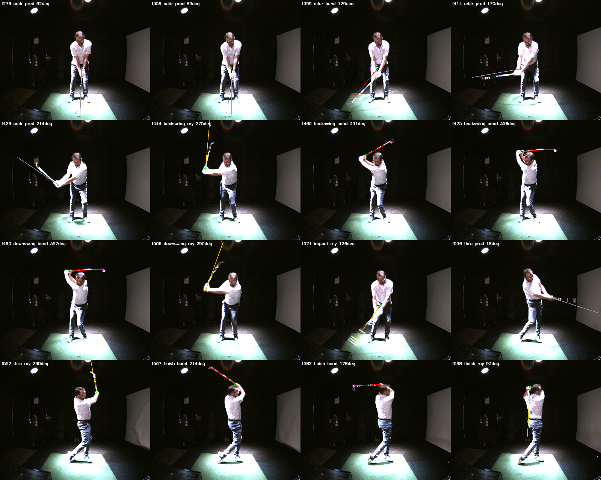
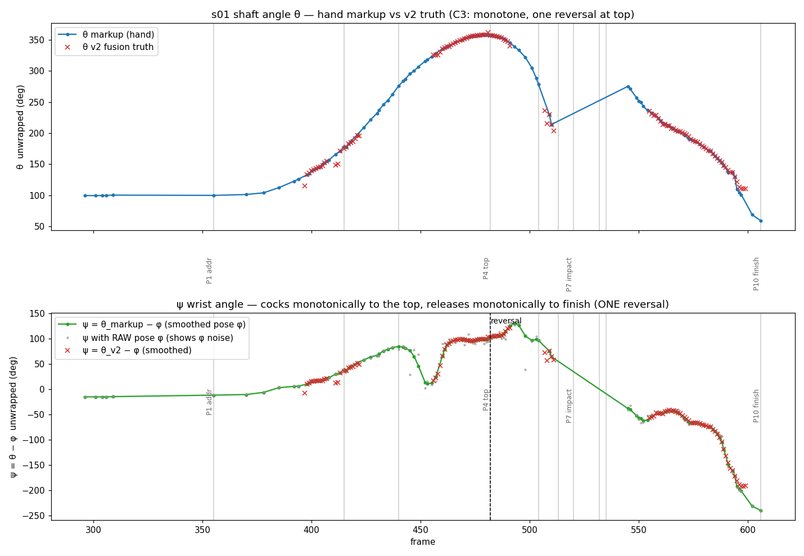
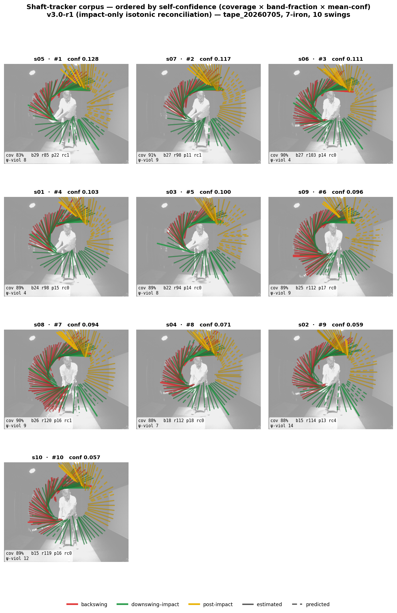
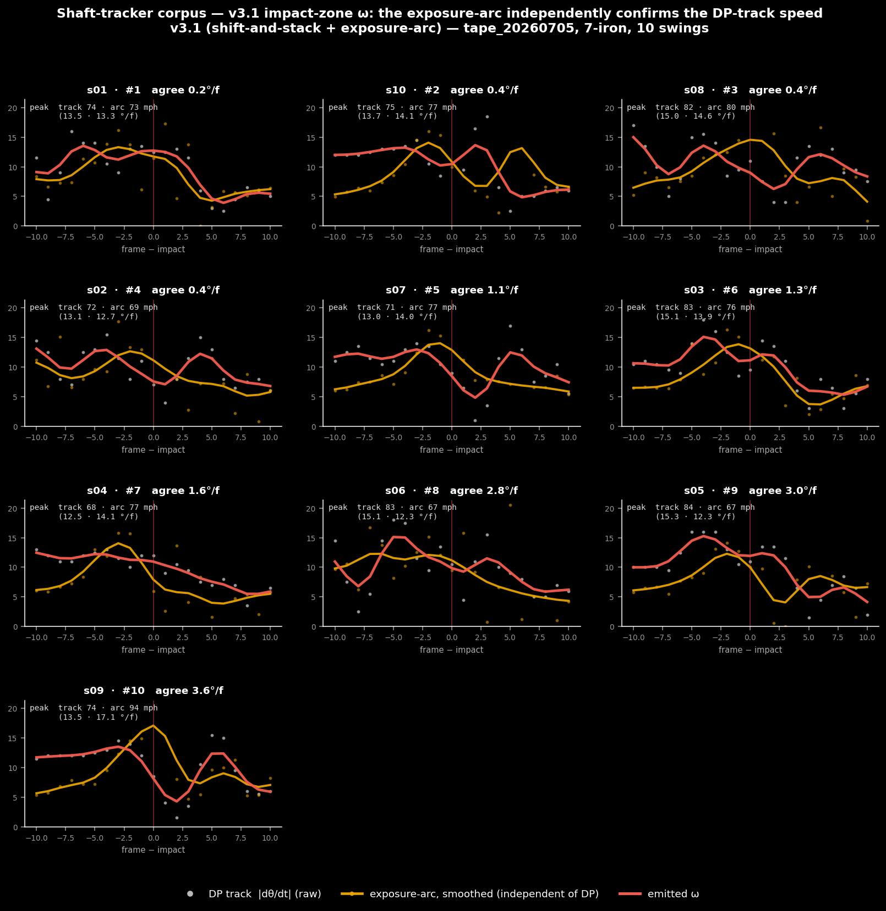
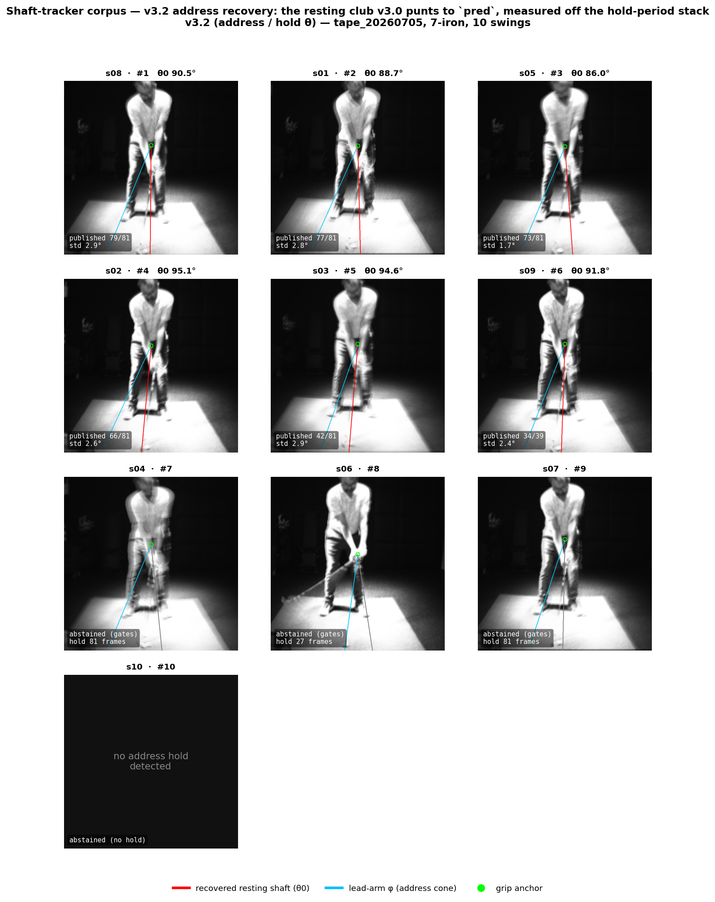

# Physics-Constrained Detection of a Golf Club from Fixed-Environment Video: Thirteen Phases, and What Each One Taught

*PinPoint shaftlab programme — research report covering the work from
inception (first drafted 2026-07-05; reorganised into this phase narrative
2026-08-10; corpus shape model added 2026-08-11; the bare-club phase added
2026-09-11). Empirical basis: hand-labelled swings 0008 and 0009, the c1
multi-club corpus (100 clubhead labels), the tape_20260704 pilot and
tape_20260705 instrumented corpora, the 2026-07-09 live-app corpus, and the
61-swing five-session production corpus, and the seven-swing unmarked 6-iron session
of 2026-09-09 with its 64 hand marks. Tooling: `tools/shaftlab/`,
`tools/swinglab/`. Supporting records live in `docs/design/` (the detector and
tracking designs) and `docs/implementation/` (the per-session build records
cited in the later phases).*

## Abstract

We report the full arc of a programme to measure a golf club from a single
fixed, face-on studio camera running at its hardware ceiling — 150 frames per
second, a 6.6 ms exposure, and a hitting area that must be blown out to light
the golfer. From that one view we recover, per frame, the shaft's image-plane
direction **θ**, its projected scale (which shrinks under foreshortening), and
the clubhead position: the raw inputs to every coaching metric the product
reports.

The work divides into thirteen phases, and the report is organised as their
narrative because the single most useful thing in it is not any one method but
the *sequence* — what each phase bought, and what it cost. In outline: a
confidently-wrong first tracker that had to be pulled from the product; a
long era of twenty-one individually-adjudicated fixes that took the passive,
markerless detector to a 2.5° median with no confidently-wrong frames; a taped
instrumented club built purely as a measuring instrument, which produced 1,033
verified truth samples in the fast phases where none had existed and promptly
corrected three things we believed about the passive detector; a physics-first
redesign built on the observation that *every* false detection in either
detector's history violates one of four elementary facts about a golf swing;
a fifth law — that the wrist angle is monotone with a single reversal — which
turns the well-tracked lead arm into a witness for the club through the impact
blur; an exposure-arc reading of motion blur that yields the impact zone's
first physical velocity measurement; and then four phases of production work
in which the method was made cheap, ported, anchored on the ball, and finally
graded on an axis nobody had graded before — not θ, but the *instants at which
θ is reported*. The thirteenth phase then removes the instrument's own crutch:
the retro-reflective tape, which the golfer could feel in the swing weight, was
found to have never been what made the shaft bright, and a bare steel club is
now measured better than the taped one was — 1.6° against 4.5° at the median —
by a segment lock on the steel's own two ends, a line re-registration for the
frames without one, and a head search that no longer assumes the pose anchor
lies on the shaft.

Two findings recur and are, we think, the report's durable contribution. The
first is methodological: honesty bought by *abstention* — refusing to measure
wherever counterfeits thrive — decays coverage monotonically, because the real
signal shares the conditions the junk exploits; honesty bought by
*discrimination*, using physical facts that no true club violates, recovers
that coverage instead of trading it away. The second is about validation: a
grading regime can pass its own clauses because its labels avoid the hard
frames, and — the sharper form we found last — because its labels are the wrong
*kind* of object entirely.

## 1. The problem

### 1.1 What we measure, and why a degree matters

The quantity at the centre of this report is **θ (theta)**: the direction the
club's shaft points *as the face-on camera sees it*, measured as an angle in
the image plane and taken from the **grip** — the point where the hands hold
the club, which a pose estimator locates for us in every frame. The absolute
zero of θ is arbitrary; what matters is θ(t), the shaft angle traced through
the swing, which *is* the swing as far as this one camera is concerned. Two
companion angles travel with it: **φ**, the direction of the lead **forearm**
— specifically the line from the lead elbow to the grip, read from the same
pose — and their difference **ψ = θ − φ**, the **wrist angle**, which is how
the club is hinged relative to that forearm. The precision matters, because φ
is a forearm and not a whole arm: the upper arm runs at its own angle, and the
two are separated by the elbow. Where this report needs those as well it calls
them **β** (lead shoulder to elbow) and **α** (lead shoulder to grip, the
whole-arm line), with **ε = φ − β** the elbow's opening; only φ enters the
tracker itself. Alongside the angles we recover
the shaft's *projected scale* (how many pixels correspond to one millimetre of
shaft), which shrinks whenever the club tilts toward or away from the lens —
the effect called **foreshortening** — and the **clubhead position** in the
image.

None of these is the deliverable a golfer actually sees; they are the *inputs*
to almost everything a coach reads. In PinPoint's shot-analyzer pipeline
([`docs/design/shot_analyzer_design.md`](../design/shot_analyzer_design.md)),
the shaft direction θ feeds **swing plane, shaft lean, club path, attack
angle, clubhead speed, and a face-angle proxy**; the lead-forearm angle φ feeds
**lead-arm flexion and the kinematic sequence**; and the wrist angle ψ = θ − φ
*is itself* the headline metric of a Wrist session — the flexion/extension and
radial/ulnar deviation a coach diagnoses. Each of these is then scored against
a reference band that is itself only a few degrees wide, which is exactly why
accuracy of a degree or two is not a nicety but the requirement: an error in θ
does not stay contained, it propagates straight into a number the golfer will
act on. A shaft angle that is casually 10° wrong is not a slightly worse
measurement — it is a *different diagnosis*.

There is a second axis, and the programme did not notice it for a long time.
The coaching metrics are not read from θ(t) as a continuous curve; they are
read at *named instants* — address, the top of the backswing, delivery,
impact — and the number the golfer sees is θ sampled at one of them. A
frame-perfect θ reported at the wrong instant is exactly as wrong as a bad
angle, and no per-frame accuracy statistic can see it. Phase 12 is the first
time we graded that axis.

### 1.2 Why the scene defeats ordinary vision

A coaching-studio capture system has to recover club motion from video that —
by commercial and physical necessity — is close to a worst case for ordinary
computer vision. Each difficulty below drove a design decision later.

- **The camera is already at its limit.** 150 frames per second is the fastest
  this camera runs. The exposure — 6.574 ms, recorded per-stream in the capture
  metadata — is essentially as long as the frame allows, because there simply
  is not enough light to shorten it. The studio's ceiling downlight has to blow
  out the hitting area to light the golfer properly, and there is a ring light
  around the lens. None of these are bugs to be fixed; they are the fixed
  reality. There is no hardware knob left to turn, so every improvement from
  here has to be algorithmic.

- **The shaft looks completely different depending on where it is.** Its
  appearance is *regime-dependent*, and this is the single fact that defeats
  naive detectors. Polished steel is a mirror: it reflects light *specularly*,
  throwing a bright highlight only when the angle happens to line up, and
  looking dark otherwise. Retroreflective bands, by contrast, bounce light
  straight back toward wherever it came from, so under the camera's own ring
  light they blaze, but only within a narrow cone. Put those two facts together
  with a changing pose and a changing background and the same shaft reads, from
  moment to moment, as: a bright line against dark trousers; a *dark* line
  against the blown-out mat (where white bands sit on white and vanish
  entirely); a row of separate blazing dashes when it is up in the light; or a
  smeared, bloom-merged bright smudge near the grip. A person fuses all of these
  into "that's the club" without effort. A detector built around a single
  brightness threshold cannot — whatever threshold it picks is wrong for most of
  the swing.

- **Near impact the club moves faster than the shutter can freeze.** At its
  peak the shaft sweeps roughly 15–20° *per frame* — about 2,200–3,000°/s — so
  within a single exposure it does not appear as a line at all but as a smeared,
  arc-shaped sector.

- **The scene is full of things that look like a club but aren't.** We call
  these *counterfeits*. Shadows, the edges of the mat, neon strips, a golf-bag
  shaft rack, creases in the trousers, the lines of the legs, highlights running
  down a sleeve, the quasi-periodic texture of a floral shirt, speckle on the
  mat — all of these form straight, club-shaped structures that persist frame to
  frame and that sail through the obvious sanity checks. The scene does not just
  add noise; it actively manufactures plausible fakes.

### 1.3 Two detectors, two masters

It is important to keep two things distinct throughout.

The **passive detector** uses no markers. It is the product path — it has to
run on whatever club the golfer walks in with, and when it cannot see the club
it has to say so honestly rather than guess.

The **instrumented detector** works on a specially taped club whose band
geometry we know exactly. It is not a product; it is a *measuring instrument*.
Its whole job is to generate ground truth for grading and tuning the passive
path — which means a single wrong entry from it silently poisons every
downstream decision we make. Because the instrument's errors are so much more
costly than a mere missed frame, both are held to the same rules.

### 1.4 What we hold ourselves to

Four goals organise the work:

- **Accuracy with honesty.** A shaft tracker whose *measured* tier can
  genuinely be trusted — around 2–3° median error, never confidently wrong —
  across every phase of the swing and every lighting condition in the studio;
  and a clubhead stage that inherits that trust through a frozen contract, so
  improving one stage cannot quietly break the other.
- **Dense truth.** Per-frame ground truth from the instrumented club,
  prioritising the downswing, impact and follow-through — the fast phases where
  the passive detector is blind *and* where hand-labelling is impossible,
  because the blur defeats human annotators just as thoroughly as it defeats
  the algorithm.
- **A defensible method.** Every reference implementation deterministic,
  classical and portable. Every acceptance rule traceable to a specific failure
  someone actually looked at. Synthetic data gates the machinery before real
  data is touched; a corpus gates any claim of generalisation.
- **A bridge to the product.** Carry what we learn from the instrumented lab
  club over to unmarked, everyday clubs — admitting machine-learning components
  only where classical methods have demonstrably run out of road.

And six rules govern how anything is allowed to be claimed. They were all
bought with a failure, and each is explained where it was learned:

- Output is split into **tiers** — *measured*, *predicted*, *absent* — and any
  detection we are not confident in is thrown away rather than emitted. A gap we
  admit to beats a number we secretly doubt.
- **Confidence has to track error**: at least two-thirds of genuinely-wrong
  frames must carry low confidence, and no more than 5% of high-confidence
  frames may be wrong.
- Results are reported as **mean, 90th percentile and %-bad, split by tier** —
  never as a lone median.
- Every numeric conclusion is **checked by eye at full resolution** before it is
  trusted.
- The code is **byte-for-byte deterministic**, which makes an exact re-run both
  a regression test and the contract for a port.
- Every promotion has to clear a **corpus gate** — many swings, not one good
  example.

### 1.5 The corpora, and what each one is for

Five bodies of data carry the results, and it matters which claim rests on
which.

- **Two hand-labelled swings.** Swing 0008 (51 shaft labels) and swing 0009 (18
  labels, chosen deliberately because it is pathological — an overhead wrap and a
  club left hanging). These grade the passive detector's early generations.
- **The multi-club corpus.** 100 clubhead labels across 10 uncropped swings shot
  in a new studio with 8 different club types — our first data with proper
  off-frame and crop-tier examples, and our first spread across many clubs.
- **The instrumented corpus.** Ten taped 7-iron swings from a single session,
  plus a pilot session the day before. This is the source of the dense
  fast-phase truth and of nearly every corpus gate in Phases 5 through 9.
- **The first live-app corpus.** Six swings captured end-to-end by the
  production application, which is what makes the Phase 10 boundary work a
  production claim rather than an exemplar one.
- **The production corpus.** 61 swings across five sessions, with 13–14 carrying
  hand-marked video truth. This is the basis of Phase 12, and the first corpus
  large enough for a defect on a *third* of the swings to be visible at all.
- **The unmarked 6-iron session.** Seven swings of a bare steel 6-iron in the
  blacked-out studio, 2026-09-09, every one hand-marked at P1–P10 (64 marks, of
  which 42 are *seen* — P1 to P6 — and 22 are *inferred*, because through impact
  the shaft is invisible and the mark is a line drawn from the hands to the
  clubhead). This is the gate population of Phase 13, standing in for the untaped
  7-iron the design had asked for: the loft is immaterial to the question.

Corpus discipline is strict for a reason we keep having to relearn: the
residuals from a *single* swing must never be allowed to choose a model form,
because that one swing might itself be atypical — off-plane, oddly lit,
whatever. Real decisions wait for a corpus gate. Even the guidance on how to
*capture* the video became a finding in its own right, in how to frame the shot
and how to manage the exposure strata.

## 2. Where the measurement stands today

Before the history, the destination. The single most important result is not
any one number but the *shape* of the numbers: no single detector covers the
whole swing, and the two detectors are blind and sighted in almost exactly
opposite places.

**What counts as good.** Three things, in order of importance. First, and
non-negotiable: **no confidently-wrong frames** — a high-confidence value that
is actually wrong becomes a false diagnosis the golfer acts on, which is
strictly worse than no measurement at all. Second: a **median error at or
below ~3°**, because the reference bands are only a few degrees wide. Third,
and genuinely last: **coverage** — the fraction of a phase that yields a
measured value rather than an honest prediction. Coverage is what we most want
to grow, but it is the one of the three we will trade: an admitted gap costs a
single frame's data, whereas a confident error costs the reader's trust in
*every* frame.

***Table 1.** Shaft-angle accuracy by detector generation. "Confidently wrong"
is the metric that matters most for a coaching tool, because a confident error
is the one that gets acted on.*

| Detector (shaft angle θ) | Best measured accuracy | Confidently wrong? | Strong phases | Blind / weak phases |
|---|---|---|---|---|
| Passive, first cut | mean 18.8°, no honesty signal | pervasive — one bad init poisons the whole swing | none reliably | wherever it mis-initialises |
| Passive, mid-fix-era prototype | median 2.9°, p90 7.1°, 5% >30° (swing 0008) | none | address → backswing | downswing / impact → predicted |
| Passive, end of the fix era | median 2.5°, **0% >30° in both tiers** (0008) | none | address → backswing, partial finish | downswing / impact → predicted |
| Instrumented, blob-ratio | median 1.1°, p90 3.4° | zero flips | club-up phases only | address (bands invisible), blur |
| Instrumented, multi-evidence fusion | band-tier 1.1–3.3°, ray-tier 0.4–0.8° | **zero adjudicated errors** | fast phases (down / through) | address, finish, impact ±10 fr |
| Instrumented, constraint system + global solve | band 0.3° (0% >15°), ray 1.7° (3% >15°), 10-swing corpus | **zero flips, all 10 swings** | fast phases at **96% / 83%** measured coverage | impact ±10 fr, address scale |
| Instrumented, exposure-arc velocity | *velocity*, not angle: an independent reading confirms the tracked ω-peak to **1.5°/fr median (3.6° max)** | n/a — corroborates, adds no new θ | impact ±10 fr **ω**: **71–92 mph** clubhead, every swing | still θ-ray-only at impact; scale at address |
| **Bare steel, segment lock + snap + head band** (Phase 13) | **1.6° / 4.5°** p50 / p90 vs hand marks on an unmarked 6-iron; head 21 px; the *taped* club as shipped scores 4.5° / 26 px on the same kind of mark | none — the four catastrophic marks were a phase-model collapse, since fixed | takeaway → top → delivery, every marked position ≤ 4.3° | impact is *unmeasurable* on a bare club (the shaft is invisible; the marks there are constructions); the daylight session's lead-arm tail |

***Table 2.** The same picture read phase by phase — which detector can
actually *measure* each part of the swing, and what the combination is fit
for.*

| Swing phase | Passive shaft θ | Instrumented θ truth | Best available truth | Grade (θ) |
|---|---|---|---|---|
| **Address** | measured, reliable (the passive detector's strongest phase) | absent — bands bloom or vanish on the blown mat | passive; **scale optically absent** | **Trustworthy** (θ) · scale **Blind** |
| **Takeaway / backswing** | measured, ~2–3° median | measured — band 1.1–3.3°, ray 0.4–0.8° | both, in agreement | **Trustworthy** |
| **Downswing** | predicted (blur-blind); predicted tier 13–22% >30° | **measured, 43–75% coverage** | instrumented fills the blind spot | **Usable (with review)** |
| **Impact (±10 fr)** | predicted only | fusion emits nothing; the constraint system's rays and the exposure-arc ω now do | constraint rays + measured ω | **Directional → Usable** |
| **Through** | predicted mostly | measured, 46–59% coverage | instrumented | **Usable (with review)** |
| **Finish** | measured ~52% (up from 32%); one surviving junk class | absent — abstained to zero | passive only | **Usable (with review)** |

**How to read the grades.** They rank what a *reader* should conclude a
phase's angle measurement is fit for, and they turn on coverage and
confident-error rate, not on median alone.

- **Trustworthy** — dense measured coverage, median ≤3°, zero confidently-wrong
  frames. Safe to feed straight into the coaching metrics.
- **Usable (with review)** — genuinely measured, but with partial coverage or a
  known surviving junk class a human reviewer must catch. Good to inform, not to
  auto-score unwatched.
- **Directional** — honest but thin: mostly the predicted tier. The broad
  trajectory is right; too sparse to derive a fine metric from.
- **Blind (honest gap)** — no reliable measurement exists; the system abstains
  and says so. A *hole, not an error*.
- **Confidently wrong** — a high-confidence number that is actually wrong. The
  single unacceptable state, the disease the whole programme was built to
  eliminate; no current phase earns it.

Two footnotes complete the picture, and both are results in their own right.

- **Cross-scoring the two detectors against each other corrected a number we
  had wrong** (Phase 4). The passive detector's *measured* tier is only **0.6%
  bad** (4 frames of 643) across the fast phases — not the 7% we had believed —
  while the 13–22% error lives entirely in its *predicted* tier, frame-exactly
  in the blur coast. Where it says "measured," it is almost always right; where
  it is guessing, it says so.
- **Both tables grade θ per frame, and that is not the whole of what the
  product reports.** A frame-perfect θ delivered at the wrong *instant* is
  exactly the confident error these grades forbid, yet no row above can see it,
  because the per-frame statistics average over precisely the axis at fault. The
  first grading of the instants themselves (Phase 12) found three independent
  defects there, and the θ tables were unaffected by every one of them.
- **The instrumented rows are no longer the ceiling.** Every "Instrumented"
  row above needed the tape; the last row does not, and it is better than the
  taped club *as the product ships it* on both direction and head position. The
  band tier's 0.3° remains the finest measurement in the table, and Phase 13
  kept it exactly — the one regression the corpus pass caught was the new
  machinery touching band-locked frames, and those are now left alone.

## 3. The programme in thirteen phases

The rest of the report is one section per phase, in the order they happened.
Each says what we set out to do, what worked, and what did not — the failures
being, in this programme, considerably more instructive than the successes.

| # | Phase | The move | What it bought | What it cost, or did not work |
|---|---|---|---|---|
| 1 | The confidently wrong tracker | ship a shaft tracker into the app before building a way to check it | the three founding rules of the programme | the tracker itself — reverted from the product |
| 2 | Twenty-one fixes | adjudicate each counterfeit and add a guard | median 2.5°, no confidently-wrong frames | coverage bled away with every guard; five fixes rejected outright |
| 3 | Building the instrument | a taped club with known band geometry as a truth generator | 1,033 verified truth samples in the fast phases | address and finish emissions abstained to zero |
| 4 | Grading detector against instrument | cross-score the two | a wrong figure corrected, a real failure found, a bias exposed | the clubhead stage's calibration turned out to be flattered |
| 5 | Physics first | promote four swing facts to constraints, solve the whole clip at once | downswing coverage 57% → 96%, zero flips | the reachability cone did not survive contact with pose noise |
| 6 | The wrist law | the arm as a witness for the club through the blur | the impact-blur bridge; a per-frame error signal | applied past impact it *degraded* a well-tracked follow-through |
| 7 | Reading the blur | stack de-rotated frames; read the exposure arc | the impact zone's first velocity measurement, 71–92 mph | zero band upgrades — the √N payoff is not available on taped clubs |
| 8 | The address hold | integrate the still hold on the grip anchor | a published resting angle on six of ten swings | four abstained, by design |
| 9 | Making it cheap | replace a raster veto with geometry; bound work to the moving span | 4.7× faster, output unchanged | nothing — both levers were free |
| 10 | The far end and the true start | anchor the club's far end on the ball; find the true motion onset | the honesty clause passes 9 of 10; the swing boundary corrected by ~400 ms | the onset clamp quietly became a pin (found two phases later) |
| 11 | The port and the pipeline | C++ port, then parallelise the production stages | numeric parity; 1.84× on the whole pipeline | INT8 quantisation and batched inference both measured as duds |
| 12 | Grading *when* | grade the instants, not the angles | three defects found; delivery within 5 ms of truth on every labelled swing | the θ path never moved — every one of these had been invisible |
| 13 | The bare club | lock on the steel's own two ends; re-register the line; search the head off the anchor | an unmarked club at 1.6° / 21 px, ahead of the taped one; a phase-model collapse and a lying trace found under it | the head placed from the terminus made the head worse; two snap guards rejected; the snap had been moving band-locked frames |
## 4. Phase 1 — The confidently wrong tracker, and the three rules it bought

The programme has a founding failure that shaped everything after it. An
early shaft tracker was ported to C++ and wired into the application's markup
panel *before* anyone had built a way to check it frame by frame. It produced
confidently wrong markups in the live app and had to be ripped back out.

Graded after the fact against hand labels, it was worse than it looked. On
swing 0009 it locked onto a shadow at the mat edge during address — reading
43° against a true ~98° — and, having no escape mechanism, stayed wrong for
the entire swing while reporting a healthy status the whole way. Its
all-frames mean error was 18.8°, with no honesty signal to warn anyone.

**What did not work, and what it bought.** Three rules came out of this phase
and have governed everything since.

- **Prove it on the exemplar first.** An algorithm is proven in a Python
  exemplar, with a human looking at real frames, before a single line of it is
  ported into the product. This rule is the direct residue of the reverted port.
- **The median lies.** The same era's validation proudly reported a "median
  error of 7.4°" — while 24% of frames were more than 30° wrong, at a
  confidence of 0.93–0.96. A median is dominated by the easy frames and says
  nothing about the tail, and the tail is where a coaching tool does its damage.
  Every report since splits by output tier and tests the confidence-honesty
  clauses explicitly.
- **Fixtures rot.** The "frozen" reference outputs from a later version turned
  out not to be reproducible once the video clips were re-prepared — a
  combination of encoding noise and detections sitting right on the edge of a
  gate. Awkwardly, fresh runs of the very same code were *better* than the
  numbers we had written down as the freeze. Fixtures are now re-frozen
  atomically, in the same reviewed commit as the code they belong to, and
  re-preparing a clip automatically invalidates its fixtures.

## 5. Phase 2 — Twenty-one fixes: the passive detector learns manners

### How the passive detector works

In each frame it gathers *oriented evidence* along candidate rays fanning out
from the grip — where the grip comes from a pose estimator that finds the
golfer's hands. The evidence combines a ridge response (a thin bright-or-dark
line) with an antiparallel edge pair the right width apart (the two sides of a
shaft). On top of the single-frame evidence sits a *tracking fan* — a Kalman
filter that predicts where the shaft should be next and only looks nearby,
plus a backward smoothing pass that cleans up the whole trajectory afterwards.
When the track is lost, the detector rescans the full circle to re-initialise,
with an escape mechanism so it cannot lock permanently onto the wrong thing.
Its output is tiered: a detection is labelled **measured** only when its
confidence is at least 0.5 and it persists in a run of at least four frames;
everything weaker is discarded and *replaced* by an honestly-labelled
prediction.

A second stage then answers a simpler-sounding question: how far out along
that direction does the club end? Where the first stage searches over *angle*,
the second searches over *distance* along the ray. The two are deliberately
decoupled by a **frozen contract**: stage two may read exactly five things
from stage one — frame index, grip position, shaft angle, tier, confidence —
and nothing else, and is developed against frozen files of stage-one output
rather than live stage-one code. Stage two measures the head by looking for
where the thin shaft line ends: a gap-tolerant terminus search on the axis,
edge pairs at several candidate widths, the same permanence veto stage one
uses, and a scoring step preferring heads at a plausible projected length —
that length coming from a per-swing *censored self-fit* ("censored" because
foreshortening hides part of the true length whenever the club tilts toward
the camera, so the fit must respect that it only ever sees a lower bound). An
arm-length floor throws out any "head" closer than the hands can hold. The
contract paid off concretely: later stage-one improvements flowed through to
changed — and gracefully improved — stage-two output with *zero* stage-two
code changes.

### The fix era, in four episodes

Twenty-one individually-adjudicated fixes were made over this period, each
motivated by a specific frame someone could point at and verified on that same
frame. (The programme labelled them F1–F21, and the complete before-and-after
ledger lives in
[`shaft_detection_exemplar_findings.md`](../design/shaft_detection_exemplar_findings.md);
Appendix A maps those labels to the names used here for anyone reading the old
design documents.) The *shape* of each episode matters far more than any
individual fix.

**Episode one — basic manners.** A *run-start gate* insists the evidence begin
near the hands, because "the club is attached to the hands" is the single most
useful fact in the whole system. An *edge-pair width prior* demands two
parallel edges the right distance apart, killing single edges like a mat
border. A *forearm plausibility sector* restricts the tracking fan to angles
near the lead arm — but only while tracking, never during a full-circle
re-init, because at the finish the club wraps around and the forearm
assumption breaks. *Wrong-lock escape* rescans and forces a re-init when a
distant peak decisively beats the current track twice. An *angular-speed sanity
clamp* rejects impossible spin rates: real clubs top out around 2,500°/s, and
the first version once cheerfully reported 62,000°/s. A *180°-flip test* checks
a ray and its exact opposite, crediting a bright clubhead blob at the far end
to decide which way round the club actually points. A *re-init confirmation*
caps confidence at 0.35 until three good measurements have followed, so a shaky
new lock cannot immediately claim certainty. And an *either-path acceptance*
rule admits a detection on either global support *or* a dense local run, so a
foreshortened club at the finish — whose evidence is spread thin over a long
ray — is not thrown out.

**Episode two — the still-hold programme.** The finish of a swing often ends
with the club held nearly still, and a single frame of a static, dimly lit club
is marginal evidence. The answer was *temporal stacking*: average several still
frames together to beat the noise down by roughly √K, then scan the cleaner
composite. This was the programme's first use of stacking, an idea that returns
in a much bigger form in Phase 7. It brought its own hazards. A static club has
exactly one angle, so measured outliers within a still window could be demoted —
a premise that later turned out to be false in a subtle way. A *scene-permanence
veto* rejects any candidate that already existed in a pre-swing snapshot, on the
logic that permanent structure (like neon strips) is not the club. The first
version of that veto used a snapshot of frame 0 — which *contained the club at
address* — and therefore vetoed the club every time it returned to its address
angle *at impact*, silently killing the entire downswing until a human noticed
by eye. The fix was to build the snapshot from a club-free median across the
whole clip. A clubhead-blob AND-test requires the far end to be *both* bright
*and* changed-from-the-scene. And a *quasi-static gate* confines all of these
hardened checks to near-still moments, because applied everywhere they
strangled the tracker's ability to recover mid-downswing.

**Episode three — killing distractors, driven by the multi-club corpus.** A
code audit turned up something embarrassing: both anti-distractor vetoes were
wired to fire only during quasi-static moments, which meant a fast-motion
re-init had *no protection at all* — and a `swing_seen` guard had been keeping
the permanence veto switched off through the entire backswing. Neither was
found by a metric; both were found by reading the code. The fixes made the
strict permanence veto apply at any speed (its first adjudicated kill was a
golf-bag shaft rack), built the permanence reference from the highest-motion
frames so it is guaranteed free of parked clubs at address *and* finish, and
resolved a genuinely four-way confusion at the finish: a club held over the
shoulder is legitimately close to the body *and* has no bright blob, whereas
junk running along the body line often *does* have a bright blob (from the
golfer's shoes), so the gate has to be conditioned on which situation it is in.

**Episode four — the five that did not work.** Each was ruled out by an A/B
test on the corpus and kept as a documented negative result.

- *Shaping confidence by kinematics* for fast-born segments failed because good
  segments and junk segments overlap on *every* kinematic statistic we could
  measure. They are distinguishable by content, not by motion.
- *Applying the forearm sector at fast flips* broke the takeaway, where the real
  club genuinely does lie near the forearm.
- A *shoulder-to-arm collinearity veto* never fired, because the locks it was
  meant to catch were scenery, not arms.
- *Blob rescue on the permanence veto* let junk back in, because the moving
  golfer makes everything look "changed."
- A *hold-density gate* collapsed real dark holds along with the junk.

### What worked

Measured against hand labels, the arc across this phase is real. The
mid-era prototype on swing 0008 produced a measured tier of 39 frames out of
51, with a 2.9° median, a 7.1° 90th percentile, and 5% of frames beyond 30°;
on the pathological swing 0009 it had zero confidently-wrong frames, correctly
declaring the broken follow-through as prediction rather than measurement. The
still-hold programme lifted finish-region measured coverage from 4% to 49% on
swing 0009 and from 19% to 37% on swing 0002. By the end of the phase the
detector reached a measured median of **2.5° on 0008 with 0% of frames beyond
30° in *both* tiers**; measured coverage rose from 57% to 63% and the finish
region from 32% to 52%; on the multi-club corpus the count of frames worse
than 30° dropped from 16 to 14; and one swing's "hang region" was corrected
from a confident 92.5° junk lock to a measured 65–69° on the genuinely-visible
shaft. The stage-two decoupling test confirmed the frozen contract held: with
stage-one fixtures changed and stage-two code untouched, stage two's head
medians were 18.8 px and 19.5 px on the two labelled swings with its honesty
clauses still passing.

### What did not work — and the observation the whole report is built on

One counterfeit class survived the phase outright: quasi-static finish
body-lines that get blob credit from bright shoes.

But the real finding is visible only when you stand back from the whole list.
The attachment-to-the-hands gate, the forearm sector, the four-way finish
resolution, the spin-rate bound, and the scene-versus-club vetoes are all
*piecemeal, reactive encodings of the same four physical fundamentals* that
Phase 5 promotes to first-class constraints. Every one of them was installed
only *after* its counterfeit had been caught and adjudicated. Not one was
derived, in advance, from the fact that we already know how a golf swing
works. Twenty-one fixes were, in effect, a slow rediscovery of four facts.

## 6. Phase 3 — Building the instrument: truth from a taped club

Hand labels have a structural limitation that turns out to matter enormously:
a human can only label a frame in which they can actually see the club. Our
hand labels are therefore systematically biased toward exactly the easy frames
— the ones detectors already handle — and away from the blurred fast frames
that are the whole problem. Grading a detector only on frames a human could
label flatters it. The instrumented club exists to break that bias.

### The club, and the two geometric facts that do the work

The instrumented 7-iron carries six 25 mm retroreflective bands at 308, 362,
560, 758, 808 and 854 mm from the butt — a spacing that groups them 2-1-3. The
hosel sits at 882 mm and the club is 940 mm long.

The first useful fact is *ratio preservation*. When a straight object is
photographed the projection is locally affine, and affine projections preserve
the *ratio* of distances measured along a line. So no matter how the club is
oriented in space, the bands' positions along the shaft map to image positions
by a single linear rule, `t = s·(r − r₀)` — which is exactly what lets us match
the pattern at any pose by solving for the scale `s` and offset `r₀`.

The second is *asymmetry*. The 2-1-3 grouping is not symmetric, so it breaks
the 180° ambiguity that would otherwise leave us unable to tell the butt end
from the head end. The asymmetry is not free, though: the three closely-spaced
tip bands (gaps of 46 and 50 mm) are nearly flip-ambiguous at realistic image
scales, needing about one pixel of positional discrimination to resolve — and
intensity alone cannot tell the flip at all.

### Capture, and a negative result about decode quality

The camera writes raw Bayer sidecar files (746 frames per swing), decoded with
exactly the same edge-aware demosaic the application uses, into lossless clips
— so that no lossy encoder stands between the sensor and the measurement, and
the per-stream exposure value carries straight from capture metadata into the
analysis. A controlled A/B then showed something worth recording: the
*compressed* path actually *helps* the slow phases (the encoder's denoising
cleans them up) and ties in the fast phases. The binding constraint is the
detector's robustness, not the fidelity of the decode. Chasing decode quality
would have been effort spent on the wrong thing.

### Generation one: matching the saturated blobs

The first truth generator thresholds the image at 235 to find saturated blobs,
groups them into connected components, uses RANSAC to find the collinear set
passing through the grip anchor, matches the 2-1-3 pattern with an
order-preserving affine ratio fit, tests the flip by position, and verifies
that the gaps within the group are genuinely dark. It achieves **1.1° median
error with zero flips** — but *only* where the bands bloom into discrete dots,
which is to say the club-up phases: 46–85 anchors per swing, 713 truth entries
in all. It was later found to be quietly contaminated at the address-waggle
frames, which is a story told in Phase 4.

### Generation two: fusing several kinds of evidence

This is where the design gets interesting, because it is built to see the
shaft the way a human does — through whichever physics happens to be available
in a given frame. Three evidence terms combine.

- A *polarity-aware ridge*. The shaft is brighter than dark cloth but *darker*
  than the blown-out mat, so a fixed "look for bright" rule is blind half the
  time. The ridge term takes the lateral maximum over dark backgrounds and the
  lateral minimum over blown backgrounds (a simple mean would wash a 2–3 px line
  out entirely once sub-pixel misalignment is accounted for), and it insists the
  sign of the contrast be *coherent* within each background segment, only
  allowed to flip where the background itself changes. This is the term that
  finally sees the dark-shaft-on-bright-mat regime.
- *Temporal evidence*. During still runs it stacks the pixel medians over the
  run (√N noise suppression again); during motion it subtracts the scene median
  so static clutter disappears and only the moving shaft and its blazing bands
  survive.
- *Dense profile machinery* for reading the band pattern robustly. It estimates
  local steel brightness from a percentile rather than a median, because the
  three tip bands sit so close together that they mask a median. It finds band
  peaks by their *prominence* within a bounded window rather than against any
  absolute baseline, because a sloped specular highlight will hallucinate peaks
  against any fixed threshold. And it scores band-assignment hypotheses on an
  (s, r₀) grid in which a hypothesis is penalised for every prominent peak it
  fails to explain.

Layered on top are *honesty mechanisms*, each earned by a specific adjudicated
failure: a forearm veto; interpolation guards across the impact gap (θ
genuinely sweeps more than 180° through impact in about 37 frames, so naive
interpolation across that gap is nonsense); and the load-bearing one,
*motion-verified corroboration* — a matched blob is believed only if it
actually travels with the hands, moving at least max(1.5 px, 0.25× the hand
displacement). No lone locks are allowed, and *no locks at all are allowed
during static periods*. The reasoning there is deep: in a hold there is no
motion to separate the real club from a counterfeit, and the counterfeits pass
every appearance-based test, so a static lock is fundamentally *unverifiable*
and is therefore never emitted. The whole machine is gated on a randomised
synthetic generator — a blown region with inverted contrast, bloom-saturating
steel, speckle, anchor noise, in both a harsh and an easy regime, where the
easy regime *requires* full locks and the harsh regime *requires* honest
abstention.

### What worked

- The **synthetic gate** passed cleanly: 26 of 26 band locks correct, maximum θ
  error 1.17°, scale error within 1.6%, zero flips, honest abstention wherever
  the bands were not discrete.
- **The fusion detector** achieved per-swing band-tier medians of 1.1–3.3° and
  ray-tier medians of 0.4–0.8°, with **zero adjudicated errors**, byte-identical
  determinism, coverage of 43–75% of downswing frames and 46–59% of
  through-swing frames, and **1,033 truth entries** — in the fast phases where
  no truth had existed before. It measures correctly through frames where the
  passive detector's own track is coasting about 160° wrong.

### What did not work

The cost of buying honesty through abstention shows up plainly here, and it is
the observation that drives Phase 5. Each guard removed a class of junk *and*
removed real coverage: the finish and address emissions fell **all the way to
zero**, and the stacked still tier had to be cut entirely after whole address
runs self-corroborated a shirt-texture counterfeit at a self-consistent but
wrong scale.

A pilot session on the day before the main corpus also asked what the tape
does to the *passive* detector, since taping could in principle help or hurt.
The answer: it helps address and backswing (grazing light and extra contrast
give the tracker more to grab), leaves the downswing unchanged (blur destroys
the bands there as thoroughly as everything else), and *hurts* the finish. That
last effect is instructive. The still-hold logic from Phase 2 — "a still club
has one angle" — sees the two distinct θ clusters a banded club can produce
inside a single grip-still run and demotes both, because it assumes a still
grip means a static club. The taped pilot falsified that premise outright: a
still grip is not the same as a static club.

## 7. Phase 4 — Grading the detector against the instrument

This is where the dense truth earned its keep, in four distinct ways. Three of
them are corrections to things we believed.

**A correction.** The contamination in the first-generation truth had inflated
a figure we had been quoting: "the passive detector's measured tier is 7% bad
in the fast phases." Against the clean fusion truth the real number is **4 bad
frames out of 643 — 0.6%** — and 9 of the 10 swings have zero.

**A discovery.** Those 4 bad frames are a *genuine* failure of the measured
tier: during one takeaway the detector confidently tracks a leg shadow while
the banded club is plainly visible. This is the first machine-documented
failure of that tier. Its hand-label record had been clean — precisely because
a human labelling those frames could see the real club and never labelled the
shadow.

**A localisation.** The *predicted* tier is 13–22% bad (worse than 30°) on 6 of
the 10 swings, and the errors land frame-exactly in the blur-zone coast,
telling us precisely where prediction is being asked to do too much.

**A label-distribution finding, and it is the important one.** The clubhead
stage *passes* its honesty clauses on the 51 + 18 hand labels, yet *fails*
them on 7 of 10 swings against the dense fast-phase truth — high-confidence-bad
running 9–34% against the ≤5% clause, with per-swing length-error means as
large as −215 px implicating the censored self-fit. The reason is the
structural bias named above: hand labels can only be placed where a human can
see the club, which is exactly where the detector already succeeds, so the
prior validation was systematically easy. The dense truth removes that bias —
and the moment it does, a stage that looked calibrated turns out not to be.

**What this phase cost.** Nothing was built here; three beliefs were destroyed.
That is the return on an instrument, and it is why the instrumented programme
was worth its considerable expense.
## 8. Phase 5 — Physics first: four laws and one global solve

Standing back from both detectors, one pattern is impossible to miss: every
surviving counterfeit, and every historical one, violates some physical fact
about a golf swing that the methods never encoded up front. This phase
promotes four such facts to *constraints* checked *before* the evidence
engines ever run, so that a physically impossible candidate is rejected on
principle rather than out-scored on evidence.

### The four laws

- **Attachment — the club stops at the hands.** The club is held in the hands,
  so its evidence must *stop* within about 260 mm behind the grip. A line whose
  support continues on *behind* the butt — a trouser crease, a screen edge, a
  shaft shadow — is scene structure, and is vetoed no matter how well it scores.
  This is the full-strength version of Phase 2's run-start gate, which had only
  the weak form ("the ray passes within 80 px of the anchor") that every
  counterfeit it ever caught had already passed.

- **Free space — the club is not inside the golfer.** From takeaway through
  follow-through the club is out in free space, not overlapping the body. Using
  the eight body joints the pose estimator already produces each frame, we build
  a body polygon (with a margin, smoothed in time to survive blur-degraded pose
  frames), and during those phases any candidate mostly *inside* that polygon is
  vetoed. At address, impact and finish — the phases where the club genuinely
  does overlap the body — body evidence is admitted, but is never sufficient on
  its own. This systematises Phase 2's body gates.

- **One reversal — the swing turns back exactly once.** We segment the swing
  into its phases (still → takeaway → backswing → top → downswing → impact →
  through → finish) from the hand trajectory *alone*, with no club detection
  required, and detect the swing's chirality once per swing from that same
  trajectory, so no handedness is hard-coded. Because we then know the sign of
  θ's rotation within each phase, a 180° flip becomes *structurally impossible*
  rather than something filtered out statistically, and bridging across an
  outage becomes a monotone, bounded-rate sweep instead of a naive
  interpolation. This subsumes the wrong-lock escape, the flip test and the
  interpolation guards.

- **Arm coupling — the club and the lead arm form a double pendulum.** With the
  lead arm's direction known from the pose and θ being what we are solving for,
  the wrist angle between them is anatomically bounded and evolves smoothly.
  That gives a per-frame *reachable cone* and a smoothness prior on the wrist
  angle — the full form of the forearm sector.

Underneath, a single global estimator — dynamic programming (a Viterbi search)
over a grid of θ values across the *whole* clip, with transition costs from the
one-reversal and arm-coupling laws and emission costs from the unchanged,
already-validated evidence engines — replaces the old local, frame-by-frame
corroboration. The evidence engines survive intact; they simply become emission
terms inside a globally-consistent, physically-constrained solution.

Why this had to become global is epistemic, not architectural. A single
heavily-blurred frame is genuinely ambiguous in isolation; no local rule can
resolve it *honestly*, which is exactly why the Phase 2 and Phase 3 guards
abstained. But that same frame, embedded in a trajectory required to be
physically continuous, frequently has only one reading consistent with the
frames either side of it. Global estimation converts "I cannot tell in this
frame" into "only this value is consistent with the swing" — and that converted
certainty is precisely the coverage the local guards had been throwing away.

### What worked

- **The synthetic machinery gate** — a generated swing with known ground truth
  and three planted counterfeits (a trouser crease, a bright lead-arm line and
  static mat speckle) — passes: mean θ error 1.65°, **zero flips**, the
  hands-only phase model recovering takeaway, top and impact correctly, and, the
  point of the exercise, **not one planted counterfeit ever locked**. The
  arm-line is rejected by the arm-coupling veto on every frame. This proves the
  constraint logic in isolation, before any real pixel is involved.
- **The ten-swing corpus gate**, run on the same swings that produced the
  fusion truth and graded against it, carries the result in two numbers.
  **Coverage of the fast phases roughly doubled** — the measured fraction rose
  from 57% to **96%** in the downswing and from 54% to **83%** through impact —
  and it did so **without a single flip anywhere in the ten swings**. Read by
  tier, what the system publishes is clean: the band tier has a median error of
  **0.3°** with **zero** frames worse than 15°, and the θ-only ray tier a median
  of **1.7°** with 3% worse than 15°, inside the ≤5% honesty budget. The larger
  residual error near address lives *entirely* in the predicted tier — the
  honest bridges, never written to truth. The rerun is byte-identical, and a
  standing counterfeit-regression suite — every historical false positive
  re-checked — comes back clean, including the impact "streak-flip" that the
  fusion detector could only avoid by staying silent.

This is the phase that settles the central hypothesis. The prediction was
falsifiable and specific: constraints-first should recover the coverage
abstention had thrown away *while readmitting zero junk*. It did.

***Figure 1.** Shaft tracking on corpus swing s03 (face-on, instrumented
7-iron). The line is the estimated shaft, coloured by confidence tier: **red =
band** (the tape pattern locked — yields angle, scale and head position, drawn
as the magenta circle), **amber = ray** (a verified straight line — angle
only), **grey = predicted** (bridged by the physics, deliberately excluded from
the published truth). The green dot is the supplied grip anchor. Note the red
band lock at **address** (top row) — the club pointing down at the ball, a
region the fusion detector abstained from entirely — and the continuous,
single-reversal trajectory carrying the line correctly through the fast,
blurred downswing and impact and on into the finish.*

### What did not work

Three things the design got optimistically wrong, recorded because they are
exactly the parts a re-implementer will be tempted to "restore".

- **The reachable cone is *wide*, not "a few tens of degrees".** The
  reachability argument assumed the lead-arm direction was clean. On real
  captures it jumps by up to ~87° frame-to-frame at the top and in the blur
  zone. So in practice the arm direction is heavily smoothed and the cone kept
  deliberately wide, and it is switched *off* at address and finish, where the
  wrist angle is genuinely unbounded. Arm coupling survives only as a hard veto
  on the shaft pointing *into* the forearm and a soft removal of the reverse
  half-circle; the real search-space collapse is done by the one-reversal law's
  bounded-rate transitions, not by the cone.
- **Strong evidence must *anchor* the global solution, not merely feed it.** A
  band lock had to be turned into a negative-emission well that the trajectory
  is pulled into, forcing the solve through the true wrapping path. Without it,
  a correct band angle and a competing bright ridge tie on cost and the
  smoothness term routes the solution down the flatter *wrong* branch across the
  evidence-free impact gap — which is exactly how the through-swing and finish
  came out ~90° wrong until the well was added.
- **Honesty has to be enforced at the output, not assumed.** Bridged frames are
  never written into the truth files; a θ-only ray is admitted only when its
  evidence clearly beats the reverse direction *and* is corroborated; address
  holds abstain.

Two caveats also keep the headline result in proportion. This is still the
*instrumented* path — one golfer, one club, one session, with retroreflective
tape doing much of the work in the band tier. And the one phase the constraint
system does not turn from predicted into measured is θ right at impact,
together with the scale at address. Those two holes are the explicit targets of
Phase 7.

## 9. Phase 6 — The wrist law: the arm as a witness through the blur

The four laws of Phase 5 were the facts the fix history had already,
implicitly, rediscovered. Standing back once more surfaced a fifth — really the
*substantive* half of arm coupling, which the as-built had shrunk to a wide
guardrail.

The double pendulum does not merely bound the wrist angle ψ = θ − φ; it makes
ψ **monotone**. From address to the top the wrist cocks: ψ moves one way only,
the interior arm–shaft angle closing from roughly 180° to 90°. At transition it
reverses exactly once. From transition through impact it releases: ψ moves the
other way only. Un-hinging in the backswing, or re-hinging in the downswing, is
anatomically impossible. This is the one-reversal law again, but on the *wrist*
rather than the shaft — and because θ = ψ + φ with the lead arm carrying its own
motion, "ψ is one-sided per phase" is strictly stronger than "θ is one-sided per
phase": it constrains the shaft's rotation *relative to the measured arm*.

The prize is what that buys in the blur. In the impact zone, where the shaft is
unmeasurable and the estimator otherwise free-runs on smoothness, the lead arm
remains well tracked — larger, slower, less blurred — so a bounded monotone
rail pins θ = ψ + φ from the arm exactly where the club cannot be seen.

### Verifying the law before building anything

The law was tested the way this programme tests everything: on real frames a
human looked at. On corpus swing s01 the shaft was hand-marked wherever it was
unambiguous (121 labels of grip and head, with honest gaps left through the
impact blur rather than guessed), giving an *independent* θ witness
uncorrelated with both the pose and the fusion truth. Two results follow, and
they separate cleanly.

The first is a cross-check of the truth itself. Where the hand markup and the
fusion truth both exist (78 frames), the two θ values agree to a **median of
0.01° (p90 3.4°)** — two independent methods, one manual and one algorithmic,
landing on the same angle.

The second is the law. Computing ψ frame by frame yields a textbook tent
(Figure 2): ψ cocks monotonically from about −15° at address to about +100° at
the top, reverses once, and releases monotonically to the finish. It is monotone
on **55 of 58 backswing steps and 53 of 56 downswing steps**, and every one of
the six exceptions falls on a frame where the pose arm direction glitched — not
on a real wrist reversal. The decisive observation is the separation of the two
panels: the θ trajectory, which owes nothing to φ, is *pristinely* monotone with
a single reversal, so all the scatter in ψ is pose noise, which jumps a median
of only 1.6°/frame but spikes to 87° on 17 frames clustered — predictably — at
the top and through impact. The physics is clean; the noise lives entirely in
the arm estimate. One further detail is a coaching quantity in its own right: ψ
peaks a few frames *after* the hand-top — the release lag — which is why the
constraint must give the reversal a window rather than pin it to the phase
model's top.

***Figure 2.** s01, hand markup versus fusion truth. **Top:** shaft angle θ
(unwrapped) — the two independent witnesses coincide (median 0.01°), a clean
single-reversal arc. The straight segment across f510–545 is the bridge over
the impact-blur gap the human could not label. **Bottom:** ψ = θ − φ with
robustly-smoothed pose φ (green) — a textbook tent, cocking monotonically to
the top, releasing monotonically to the finish, one reversal. Grey dots are ψ
computed with the **raw** pose φ, exposing the noise the rail must survive; the
red × is ψ from the fusion truth. Vertical lines mark the P-positions; the
dashed line is the hand-top — note ψ peaks slightly later, the release lag.*

### What worked, after two changes of form

Building it changed the design twice, and both changes are general.

First, a *per-frame* penalty on the sign of Δψ fires on the pose noise floor:
on real data 25–62% of backswing steps show a small (≈2–4°) apparent reversal
that is pure estimation noise, visible even on hand-marked θ. The one-reversal
law is a property of the *trend*, not of each discrete step, so a violation is
best read not as a fact to penalise but as a *measurement of error*. The
penalty was therefore replaced by its dual: treat monotone ψ as ground truth
and **fit** it — per-phase weighted robust isotonic regression,
Pool-Adjacent-Violators with a Huber reweight — reading the error off the
residual. The residual becomes a per-frame arm-error and confidence map; where
the shaft is blurred the arm supplies θ; and a well-measured frame anchors
itself, because its fit passes through it, so the reconciliation cannot corrupt
a good measurement.

Second, the corpus exposed the law's *domain*, which is the more interesting
failure and is set out below.

The narrowed form was gated through synthetic machinery, then the single swing,
then the corpus. The synthetic gate renders a full double-pendulum swing with a
deliberate evidence blackout — the shaft made invisible through a short span,
leaving only a bright decoy line held at a *fixed* angle so that, because the
arm keeps releasing under it, the decoy implies a wrist that *re-hinges*: an
anatomically impossible counterfeit the fit must reject. It does.

### What did not work: the law has a domain, and overrunning it costs accuracy

A first cut reconstructed the entire release from the arm wherever the shaft
was not band-locked. Across ten swings it cut the release re-hinge count on the
output track from 104 to 35, held flips at zero and determinism byte-identical,
took the impact-blur error population (worse than 15°) from one frame to none,
and left every phase median unchanged — **but it regressed the follow-through**,
pushing the through-phase p90 error from 3.9° to 5.5° and dropping
through-phase coverage from 678 to 649 measured frames.

The regression was not diffuse. It lived almost entirely on frames roughly
thirty to forty-five past impact, where the shaft has returned sharp and is
tracked *well* but the lead arm is folding and its pose estimate degrades — so
reconstructing θ from the arm there imports the arm's error into a club
measurement that was already correct.

The physics explains it exactly. ψ is not a single tent but a **double
reversal**: it cocks to the top (reversal one), releases to ≈0 at impact, and
then — as the arms decelerate into the follow-through — the wrists **re-hinge
passively under centripetal load** (reversal two). Between the two, through and
just past impact, the dominant motion is not hinge at all but **forearm
rotation about the shaft's long axis** — a third rotational degree of freedom a
face-on view cannot see, the shaft being axially symmetric so that rolling it
does not move the line. A one-reversal law imposed all the way to the finish
therefore fights both a real second reversal and a rotation it cannot
represent.

The fix follows directly: bound the reconstruction to the impact blur alone —
the one span that is simultaneously hinge-valid and shaft-lost — and past it
keep the measured shaft, recording the residual as a signal rather than acting
on it.

***Table 3.** The reconciliation, gated three ways across the ten-swing corpus
against the fusion truth. The middle column is the over-reaching first cut; the
right column is the bounded form that shipped.*

| metric (10 swings, vs fusion truth) | rail off | rail on: impact+through | **rail on: impact only** |
|---|---|---|---|
| through-phase p90 θ-error (°) | 3.9 | 5.5 | **3.9** — recovered to baseline |
| through-phase coverage (band+ray of 820) | 678 | 649 | **671** — 22 of 29 restored |
| down-phase frames worse than 15° (impact blur) | 1 | 0 | **0** — kept |
| release re-hinge count (output track) | 104 | 35 | **84** |
| flips (err > 90°) / determinism | 0 / — | 0 / identical | **0 / byte-identical** |

The re-hinge count rising from 35 back to 84 is the mechanism working, not
failing. The 35 was bought by *flattening a real motion* — the passive second
reversal and the forearm roll of the follow-through — which is the very act
that corrupted the through-phase accuracy. The bounded form flattens only the
roughly twenty spurious re-hinges of the impact blur and lets the physical
follow-through motion stand, where it now surfaces as a residual: a
release-complete and roll-onset signal, not an error to be corrected.

On the single swing the effect is almost invisibly surgical: the reconciliation
changes the shaft angle on **two frames** — both in the impact blur, where max
error drops from 15.7° to 11.5° — and otherwise leaves the track byte-identical.
The durable by-product is the residual map itself: a physically-grounded,
per-frame confidence signal on the shaft angle, a lever to calibrate the pose
model against an invariant it must obey, and — in the follow-through — the first
observable trace of the roll dimension a face-on camera cannot otherwise see.

We also tested whether that residual discriminates the θ-degraded frames that
produce the surviving clubhead errors. **It does not**: on the corpus the bad
frames' residual median is 0.0 against 2.9 for good frames — the reconciliation
absorbs exactly the errors one would want it to flag. Using the wrist rail as a
θ-trust signal is a dead end, and whatever guards the far end against a degraded
ray must come from elsewhere.

***Figure 3.** The tracker across the ten-swing corpus (instrumented 7-iron),
one panel per swing, ordered by self-confidence (coverage × band-fraction ×
mean-conf) — most confident first (s05) to least (s10). Each panel overlays
every swing-arc frame's shaft on a faint address frame. **Colour encodes swing
phase** — red backswing (address→top), green downswing-and-impact, yellow
follow-through — while **line style encodes honesty**: solid where the shaft is
*estimated* from evidence, dashed where it is *predicted*. (This differs from
Figure 1, where colour was the confidence tier.) Per-panel text gives coverage,
the tier breakdown, and the release violation count — the retained
follow-through re-hinge and roll signal, deliberately not flattened. The dashed
segments concentrate at the top of the follow-through; the consistent fan
geometry down the ranking is the visual echo of the near-uniform 88–91%
coverage and sub-degree medians.*

**Since measured at corpus scale (2026-08-11).** The law above was verified on
one hand-marked swing, which is the right way to test a physical claim but says
nothing about how much a *population* of swings varies around it. Running the
same angles — plus the arm segments φ had been standing in for — across the
61-swing production corpus — every swing time-warped
onto a common axis anchored on its own event ladder, so the top of one lines up
with the top of another — gives the law a median and a band (Figure 4), and with
it the first measurement of the quantity an arm-witness estimator actually
depends on: how tightly ψ is determined once the swing's progress is known.

The answer is that it is determined about twice as tightly as θ itself. Across
the corpus the p10–p90 width is **53.5° for θ and 25.1° for ψ**, so subtracting
the forearm removes rather more than half the spread — which is the
arm-as-witness premise stated as a number rather than an argument. Reading the
whole arm instead of the forearm is no better (θ − α at 28.3°), confirming the
tracker's choice of φ, though the two are close enough that a model using both
would likely beat either. The most repeatable signal in the set is not an
arm-to-shaft residual at all but the **upper arm β, at 17.3°** — slower,
larger, and better posed than the forearm, and therefore the natural first term
of any estimator that has to work where the shaft is lost. One further reading
is a check on the whole construction rather than a result: the elbow ε sits at
about −5° at address, which is a straight lead arm, and folds to +55° through
the finish. That is anatomy falling out of the keypoint conventions, not a fit.

Two limits keep this in proportion. The band mixes the golfer's own
repeatability with the tracker's error and cannot yet separate them — that needs
either the truth-marked subset as a reference or a second athlete. And the
width through the backswing carries tempo variance as well as shape variance,
because only address, top, impact and finish are warped on; anchoring
additionally on the shaft- and arm-parallel positions tightens θ to 33.0° and ψ
to 19.0°, at the cost of defining away exactly the timing differences one might
want to measure.

***Figure 4.** The corpus shape model across 61 production swings (five
sessions), every swing warped onto a common axis whose anchors — address, top,
impact, finish — sit at the corpus-median tempo. Each panel draws the **median**
with the **p25–p75** and **p10–p90** bands; individual swings run faint behind
the first and last panels. **Top:** the shaft angle θ, referenced to its own
value at impact, a clean single-reversal arc. **Second:** the three lead-arm
directions — forearm φ, upper arm β, whole arm α — which separate through the
backswing exactly as the elbow opens. **Third:** the residuals an arm-witness
estimator would be built on, θ − φ and θ − α; the tighter band is the better
predictor, and both are far tighter than θ itself. **Bottom:** the elbow ε,
near zero at address and folding through the finish. The strip beneath gives
the number of swings standing behind each point. Generated by
`tools/swinglab/theta_psi_model.py`, which also emits the model and the
per-swing deviations as data series.*

**The law, turned into a predictor (2026-08-11).** The tracker has always
carried a version of this: it predicts the club as the arm plus a stereotyped
wrist-cock offset, and uses that prediction to centre the blur-wedge search. The
offset table was authored by hand and never fitted, and graded against the
hand-placed labels it proved biased by −9.1° with a p10–p90 residual of 74.3°.
Fitting it helps, and re-indexing it helps more. Measured over all
measured-tier samples, the hand-authored curve sits at 51.6°; fitting it on its
own swing-progress axis takes it to 29.6°; re-indexing on **seconds before
impact** takes it to 17.4°, because release is an event at a fixed time before
impact rather than at a fixed fraction of the swing. The fitted curve reproduces
the one-reversal law without being asked to, which is mild evidence the law is in
the data rather than in our assumptions.

A caution belongs with those figures, because we got them wrong once. Scored
only against the hand-placed labels, refitting the progress axis appears to
achieve *nothing* — and that is an artefact of where the labels are. They
cluster in the transition region, where a human can see the shaft, and the
progress axis is anchored on the top, the noisiest event in the ladder; both
curves are then sitting on that axis's floor. The label-selection bias of Phase
4 is not only a historical finding.

What ships is a lookup table, and it is worth being plain that a table is an
empirical curve rather than a model. The curve *can* be written down — a product
of two logistics, one for the cock and one for the release, with seven
parameters — and that form is unbiased and beats the shipped table two to one,
though it gives up about 12° to the table because the real curve has a dip and a
second peak through the transition that no product of logistics can express. The
parametric fit is therefore carried as the curve's *interpretation* rather than
its implementation, and it reads a swing in terms a coach would recognise: this
golfer releases 38 ms before impact over a 14 ms window, spending 85% of a 91°
lag — figures stable to under a millisecond when any swing is dropped from the
fit.

The corpus A/B then refused it, and the reason is the most interesting thing in
the episode. The table has two consumers: it centres the blur-wedge search, and
its time derivative triggers that search. The hand-authored curve declined
steadily from the top to the finish, contributing rate across the whole
downswing; the fitted curve holds its lag flat and dumps it in 140 ms, which is
what a wrist does, so it contributes rate only at the release. Frames clearing
the trigger fall by 30%, wedge stamps by 38%, and P5/P6/P8 recall with them. The
fitted table starves the trigger *by being right* — the threshold had been
calibrated against a curve whose error happened to help. The model stays dark
until the trigger is separated from the centre. The derivation, the forms that
lost, and the full A/B are in [wrist_cock_model.md](wrist_cock_model.md).

## 10. Phase 7 — Reading the blur: stacking, and the exposure arc

Two ideas aimed at the one hole the constraint system left: θ right at impact.

**Rotation-compensated shift-and-stack** is a trick borrowed from astronomy,
where faint moving objects are recovered by shifting a stack of exposures to
follow the object's known motion so its light adds up coherently while
everything else blurs away. Here the club rotates about the (moving) grip
pivot, so for a window of frames and a set of rotation hypotheses drawn from
the physics prior, we register every frame on the grip anchor, rotate each
frame backward by the integral of the rotation about that pivot, and stack.
Under the *correct* hypothesis the club's pixels line up and integrate
coherently — gaining roughly √N in signal-to-noise — while the body and
background, which do not share that motion, smear into arcs. The still-stack of
Phase 2 was simply the zero-rotation special case of this.

**Exposure-arc tomography** is new, and worth dwelling on. The measured *duty
cycle* — the fraction of each frame during which the shutter is actually open —
is 98.1% (6.574 ms open out of a 6.699 ms frame period). That number has a
lovely consequence: the arc the club sweeps while frame *t*'s shutter is open
ends, to within 1.9% of a frame, exactly where frame *t+1*'s begins.
Consecutive frames' motion streaks therefore *tile the swing arc contiguously*.
Motion blur, in other words, is not noise to be fought — it is a nearly gap-free
continuous recording of θ(t). Three measurements fall out: the leading and
trailing *edges* of a band's streak are θ samples at known sub-frame moments,
effectively doubling temporal resolution exactly where θ moves fastest; a
streak's arc-length divided by the band's width gives the club's speed for that
frame, from that *single* frame, with no differencing at all; and checking that
each frame's streak sector continues smoothly into the next validates or
rejects a whole window of frames at once.

### What worked

**The machinery is proven on synthetic ground truth.** On a generated swing
whose rotation profile is known exactly, re-exposed at the real camera's
near-unity duty cycle so every frame carries a genuine streak, the exposure-arc
recovers the profile: the emitted peak lands within 9% of truth and the
independent exposure-arc peak within 1%, with zero flips. The per-frame streak
width carries a single-frame noise of about 2.6°/frame, which is exactly why
the *profile*, not any one frame, is what we read.

**On the real corpus it yields the impact zone's first physical velocity
measurement.** Across all ten swings the shaft's angular-velocity peak, read
from the tracked θ, is 13–17°/frame — a clubhead speed of **71–92 mph**, every
swing squarely in the range a 7-iron should produce. The result is the *second*,
independent measurement: an exposure-arc reading that never touches the tracker
— it measures only the width of the single-frame motion streak about the grip —
confirms that peak to a **median of 1.5°/frame and a worst case of 3.6°/frame**
across the corpus, on a smooth curve that rises to a bell at impact and decays
through the follow-through. Two methods that share no machinery — one a global
fit over the entire clip, one a within-frame blur measurement — agree on the
same physical curve. That agreement *is* the result: the impact-zone velocity is
real, not an artefact of the estimator's own smoothing.

The lasting value is less the number than the *cross-check it licenses*. The
programme's recurring anxiety is that self-consistent vision can be
self-consistently wrong — the first-generation truth was, and the leg shadow
passed every appearance and motion test we had. The exposure-arc owes nothing
to the tracker, so a lock whose implied spin rate is impossible for a human
swing can be flagged with no external instrument at all. It converts "the
tracker says so" into "two unrelated physics say so."

***Figure 5.** Impact-zone angular speed across the ten-swing corpus, one panel
per swing, ordered by peak agreement between the two measures — tightest first
(s01, 0.2°/frame) to loosest last (s09, 3.6°/frame). Grey dots are the tracked
per-frame speed (noisy); the gold line is the **exposure-arc** reading — the
within-frame streak extent, which never touches the tracker — lightly smoothed;
the red line is the emitted value. The vertical mark is impact. Both rise to a
bell at impact at physically plausible clubhead speeds and, sharing no
machinery, confirm the same peak. Where they diverge most (s09, s05) it is the
noisier exposure-arc, not the tracker, that wanders.*

### What did not work — and why the negative result is the more instructive half

The design hoped the stacked composite would sharpen the blurred bands enough
to re-lock the band pattern and so *upgrade* impact-zone rays into full band
measurements. On this corpus it does not: **exactly zero ray-to-band upgrades
on nine of the ten swings** (the tenth recovers one, a genuine still-address
band).

The reason, once seen, is obvious. The astronomy trick pays off when the
per-frame signal is *weak* and needs √N frames to climb out of the noise. Here
the retroreflective tape at a near-full-frame exposure makes every single
frame's streak already bright; stacking a short window of de-rotated frames is
then limited not by noise but by the *pose grip anchor's jitter* — and because
registering on the grip and then rotating about it maps the rigid club onto
itself *exactly*, the residual misalignment is purely that anchor noise, which
*broadens* the composite rather than sharpening it.

So on the taped path the composite's role is adjudication, not measurement: it
shows the club integrating into one coherent streak lying along the tracked θ
while the legs and mat smear into arcs — a direct visual confirmation that the
tracked angle really is on the club through the blur — and the product is the
velocity curve, not a new tier of θ.

The stacking's latent power is therefore held deliberately in reserve for the
regime it was actually built for: the *passive*, un-taped club, where the
per-frame signal genuinely is weak and coherent integration may be the only way
to see the shaft at all. The demonstration that the de-rotation geometry is
exact — the rigid club maps onto itself under grip-registration plus
rotation-about-grip — is what tells us that integration will be limited only by
how well we can register the pivot, which is a tractable engineering problem
rather than a physical wall.

## 11. Phase 8 — The address hold

One region the full-swing tracker deliberately leaves as an unpublished bridge
is the *address hold* — the resting club before takeaway. The constraint system
punts it to prediction for a principled reason: a static bright or dark line at
the hands is the exact regime the passive detector was fooled by, with a
trouser crease, the trailing leg and its shadow on the blown mat, and the mat
edge all available as look-alikes, and none of them motion-verifiable.

This phase measures that resting angle and publishes it *only when it survives
the honesty gates*. Its lever is the long near-still hold itself: registering
every hold frame on the grip anchor and averaging integrates the rigidly
attached club into one sharp line while the swaying body, legs and shadows —
which move relative to the grip — smear away. It is the same stacking idea as
Phase 7, applied to a stationary rather than a rotating club. A tight cone about
the smoothed lead-arm direction and a down-sector gate then reject the leg and
crease counterfeits, and a stability test rejects any hold whose angle will not
hold still.

### What worked, and what abstained

Across the corpus the behaviour is exactly the honest split the design intends.
On **six of the ten swings** it recovers a stable resting shaft — θ₀ in the
86–95° range, angular stability under 3° over 34–79 stacked frames — and
publishes it as a new tier, upgrading the address from bridge to measurement.

On the other four it *abstains*: three where a hold is found but the gates
reject it (one "hold" is in fact mid-motion; two stack to an indistinct club),
and one where no stable address hold exists to measure at all. Nothing is
published that the gates do not clear. The abstention is not a failure but the
mechanism working — the same discrimination-not-fabrication discipline that
governs the rest of the pipeline, applied to the one phase most hostile to a
static measurement.

***Figure 6.** The address recovery across the ten-swing corpus, one panel per
swing, ordered by how much of the hold was published (most first). Each panel is
the hold-period **stack** — the address integrated on the grip anchor, so the
still club sharpens while the swaying body and legs blur — with **red = the
recovered resting shaft**, **blue = the lead-arm direction** (the tight address
cone), **green = the grip anchor**. Panel text gives θ₀, the published-frame
count and the angular stability for the six published swings; the four that
abstain are labelled by why — *gates* (a hold was found but rejected) or *no
hold* (none detected). The red line sits along the actual club, visible in each
published stack running down to the ball.*
## 12. Phase 9 — Making it cheap

Accuracy is only half of what decides whether a method can ship; the other half
is what it costs to run. We measured the wall-clock cost of every stage on all
ten corpus swings, splitting each run into *frame decode* — an I/O cost that
vanishes with live camera frames — and *compute*, the algorithm itself.

***Table 4.** Per-iteration compute on the ten-swing taped corpus (studio
machine, single-threaded Python; mean ± sd, seconds). "Processes" is the span
each stage actually touches.*

| iteration | processes | total (s) | decode (s) | compute (s) |
|---|---|---|---|---|
| constraint system + global solve | whole swing (745 fr) | 70.03 ± 0.22 | 5.03 ± 0.01 | **65.0** |
| the same, plus the wrist reconciliation | whole swing | 69.93 ± 0.24 | 5.03 ± 0.02 | **64.9** |
| exposure-arc velocity | impact ±10 fr | 2.40 ± 0.01 | 0.21 ± 0.01 | **2.19** |
| address recovery | hold, 27–81 fr | 3.31 ± 1.53 | 0.25 ± 0.11 | **3.06** |

Two facts stand out immediately. **The wrist reconciliation — the whole of
Phase 6 — costs one millisecond**: the totals are indistinguishable, and the
wrapped call measures 0.001 s. The physics we added to fix the follow-through
is, to the running system, free. And the companions are cheap and bounded to
their zones.

Where, then, does the tracker's ~65 s go? Not where a physics-first design
might be feared to spend it.

***Table 5.** Where the full-swing tracker spends its time, by category (mean ±
sd over ten swings; "residual" is the global solve, tiering and glue).*

| compute stage | time (s) | share of total |
|---|---|---|
| **body-mask dilation** (the free-space veto) | 37.73 ± 0.14 | **54%** |
| **evidence engines** (band match + ridge sweep) | 21.87 ± 0.18 | **31%** |
| frame decode (I/O) | 5.03 ± 0.02 | 7% |
| global solve + tiering | 5.29 ± 0.02 | 8% |
| phase model (hands-only) | ≈ 0.001 | < 1% |
| wrist reconciliation | 0.001 | < 1% |

More than half the entire runtime was a single morphological operation:
dilating the body polygon by a 69-pixel kernel over a full-resolution mask,
once per frame, to build the free-space veto region. Another third is evidence
sampling. The dynamic program that ties the whole method together, the phase
model and the wrist fit — the parts that *are* the contribution — together
account for under a tenth. At roughly 87 ms per frame the tracker was about
thirteen times slower than the 6.7 ms frame period.

This is the most favourable cost profile a method could present, because the
two dominant costs are exactly the embarrassingly-parallel, per-pixel image
operations that SIMD, a GPU or careful C++ accelerate by one to two orders of
magnitude, while the one inherently-sequential part — the Viterbi recursion —
is already cheap and needs no attention at all. *The deciding is nearly free;
the runtime went to seeing.*

### What worked: two levers, both free

**The free-space veto never needed a bitmap.** It asks only whether a candidate
ray lies majority-inside the body, which is a point-in-polygon question. The
veto is now purely geometric — the hull of the same smoothed joints as outward
half-planes, a ray vetoed when a majority of its sample points fall inside, six
dot products per point with no raster and no dilation.

***Table 6.** The geometric veto against the original rasterised-and-dilated
mask, A/B across the ten-swing corpus. The geometric form is now the default;
the raster form is retained behind a flag as a byte-oracle for the port.*

| metric (geometric vs raster) | value |
|---|---|
| median θ-error vs fusion truth — delta | **+0.000 ± 0.000°** |
| tier changes (of ~7,000 frames) | 6 |
| net coverage change | −2 frames |
| wall time | 70.7 ± 0.2 s → 34.8 ± 1.0 s (**2.03×**) |

Even the six differing frames are not a modelling difference but raster
pixel-quantisation: on each, a ray sample point falls within a pixel of the
dilated boundary, where the raster path classifies it against an
integer-snapped mask while the geometric test uses exact floats — a sub-pixel
disagreement in which the geometry is, if anything, the more correct.

**Most of the remaining work was spent on frames where nothing moves.** A clip
runs about 745 frames but only ~140 are the club in motion; the rest is the
golfer held at address and posed at finish. The phase model already locates
that moving span from the hands alone — before, and independently of, any image
work — so bounding the expensive per-frame operations to the span between
takeaway and finish, plus a 100 ms settling collar each side, costs nothing to
decide and skips roughly 80% of the frames.

***Table 7.** Swing-span bounding against an unbounded oracle. The gate is
accuracy on the swing, not byte-identity: the holds change intentionally.*

| metric (bounded vs unbounded) | value |
|---|---|
| median θ-error vs fusion truth on swing frames — delta | **−0.063 ± 0.219°** |
| swing tier changes (per swing, all ten) | **0** |
| swing θ-delta vs oracle — corpus max | 5.0° (3 takeaway frames, one swing) |
| wall time | 34.3 ± 0.3 s → 14.8 ± 0.3 s (**2.31×**) |

Together: **4.7× faster than the original build, with the swing untouched** —
70 s down to 14.8 s.

With both levers in place, a line-level profile locates the remaining cost
exactly, and corrects one attribution along the way. What the coarse
function-wrapping of Table 5 lumped as an 8% "solve + tiering" residual is, at
the line level, almost none of it the dynamic program: the entire Viterbi
shift-loop measures 0.2 s, under 1% of the run — the residual was frame decode
and one-time background construction the wrapping had not separated. Frame
decode is now the single largest term, but it is the one cost that vanishes
entirely against live camera frames. The evidence engines are the dominant
*compute*, and within them one line dominates.

***Table 8.** Inside the ridge sweep, by sampled statistic — line-level shares,
host-independent as ratios.*

| ridge-sweep sample | statistic | share of the sweep |
|---|---|---|
| **background** (±9–12 px offsets) | **median** | **54%** |
| on-line max | max | 15% |
| on-line min | min | 14% |
| on-line mean | mean | 10% |

The median forces a full selection-partition on every call, where the
neighbouring reductions are cheap. Everything else — the solve, the four laws,
the reconciliation, the phase model — remains together under a fiftieth of the
whole. The profile is exactly the shape a port wants: one embarrassingly
parallel image kernel to accelerate, and a specific line within it to attack
first.

**Nothing in this phase failed.** It is the only phase in the programme of
which that is true, and the reason is worth naming: both levers replaced an
implementation with a cheaper implementation of the *same* decision, so there
was no accuracy to trade. Every other phase in this report changed what the
system decides.

## 13. Phase 10 — The far end and the true start

Two production changes landed on 2026-07-09, both in the C++ that ships (the
Python exemplar having been retired as the development substrate), and both
about *ends*: where the club stops, and where the swing starts.

### The ball as the club's far-end anchor

The whole constraint system anchors the club at *one* end — the butt, held in
the hands — and infers the other. Yet the detector already runs a reliable ball
detector on the same face-on frames, in the same coordinate space, and a golf
ball at rest is a fixed landmark that the clubhead is *presented to* at exactly
two instants: address and impact. Those are the two phases this programme
measures worst.

The grip-to-ball distance at address, measured per swing and per camera, is the
*load-bearing length reference* the censored self-fit never managed to be. It
bounds the radial search from both ends — an annulus ceiling at 1.15× the
estimated length and a hard floor at 0.8× in quasi-still and impact frames —
centres a prior on still frames only (moving frames run prior-free, so the
temporal filter is never fed its own prediction), and supplies a universal
measurement-acceptance floor at 0.5×, which is the original design's own
plausible-annulus clause of [0.5, 1.15], unported in the first cut and
reinstated when the corpus demanded it. The floor is
additionally *phase-ramped* — tighter at takeaway and at impact, relaxing
toward the top and mirrored back — on the physics this report has used
throughout: face-on, the projected club is near full length at takeaway and
impact, and foreshortening develops toward the top. The self-fit length model
was retired unported.

**What worked.** The acceptance bar was the clause the clubhead stage had
*failed* in Phase 4, re-run on the same dense truth: no more than 5% of
confident samples worse than 40 px. The production path now **passes on 9 of 10
swings**, with measured-tier median errors of 0.8–2.4 px per swing. The tenth
is not a far-end failure at all — its residuals are pure shaft-angle quality,
8.5–11.5° of ray error carrying a radial error of 2 px. The θ path is
bit-identical with the head pass on or off, and the head pass costs 6–15% of
the shaft stage.

**What did not work, and had to be fixed on the way.** Three corpus-driven
iterations, each a finding in its own right.

- **The measured length can be poisoned before the swing starts.** Setup frames
  — club leaning, golfer arranging — contaminated the measurement window, and an
  order-dependent chain gate let a single early mis-lock seed the rest. The fix:
  measure over the late address hold only, gate samples with a two-pass
  median-position test, and *abstain* below five admissible samples. Honest
  absence over a poisoned scale.
- **The ball detector itself can mis-lock.** On one session it locked ~150 px
  above the true ball. A golf-prior gate now refuses implausible locks — the ball
  must sit below the ankle line and between the feet — with a per-swing
  diagnostic so the abstention is visible rather than silent.
- **In the early backswing, confidence anti-correlates with accuracy.** With no
  ball and no floor, moving-frame blur streaks let the terminus lock short
  (radial 100–160 px against ~350 px truth) while the temporal filter's
  confidence *rose* as it converged on the counterfeit — 26 of the 28 surviving
  confident-bad labels sat in a narrow band early in the backswing. The ramped
  floor removes the candidates; a residual confidence cap of 0.45 across
  takeaway-to-top removes the remaining false confidence, deliberately trading
  early-backswing confident coverage for honesty. Confident head claims are reserved for the
  delivery phase, where the coaching metrics actually consume them.

With the length reference measured and the honesty clause passing, the binding
constraint on the far end is no longer its own calibration but **shaft-angle
quality in the fast phases**. The far end is now, in the truest sense, waiting
on the near end.

### The true motion onset

The phase model triggers the swing on smoothed grip speed crossing a single
high threshold. That threshold answers "when is the grip moving *fast*?" when
the boundary we need is "when did it *start* moving?" — and through the takeaway
the club rotates about the wrists while the grip barely translates, so the
crossing lands systematically mid-takeaway. On a fresh six-swing corpus captured
live by the production app, the detected boundary sat only ~550 ms before impact
while the true motion onset sat 940 ± 45 ms before it. The label boundary, the
evidence span, the reported Address landmark and the ball anchor's search domain
all inherited a 130–420 ms truncation of the takeaway.

Three measurements replace the single threshold. A *dual-threshold hysteresis*:
the high-threshold run still finds the swing, then the boundary walks back to
the first frame below a low threshold — on the corpus the takeaway ramp never
dips below 1.6 px/frame once started, so the walk-back is stable against the
address hold's pose jitter. A *lead-arm witness*: the smoothed forearm direction
moves before the grip does (the physical statement of the lag), so a sustained
onset in the arm angle, walked back from the same anchor, takes the earlier of
the two. And an *impact-anchored clamp* bounding the onset into
[impact − 1.6 s, impact − 0.55 s], pinning any walk-back failure to a
physiologically-wide prior.

**What worked.** The boundary correction is unambiguous: onset-to-impact moved
from 545–804 ms to **917–1017 ms on all six swings**, inside the [850, 1150] ms
acceptance band, with backswing-labelled frames roughly uniform at ~100 (from
40–81). The
recovered early takeaway now carries the backswing transition band and the ray
tier instead of an address-throttled predicted hold, and on five of six swings
frames in the recovered zone converted from predicted to measured ray locks. The
tracked swing itself did not move: measured-tier θ outside the recovered zone
agrees with baseline to p90 ≤ 1.3° on every swing, with no new discontinuity.

The same correction breaks the pose pass's chicken-and-egg on the camera-only
path (the span needs grip motion, grip motion needs pose): a coarse pass at
one-twelfth stride over the whole window feeds the onset estimator — verified
within ±30 ms of the full-resolution boundary on five of six swings, +133 ms
worst, covered by a 150 ms pad — and the dense pose fill then runs only inside
the detected span.

**What did not work.** The trade-off is coverage arithmetic: the honest span is
a larger denominator while the two-pass pose thinned posed frames from 310 to
271, so coverage rose on three swings (+0.026 to +0.054) and fell on three
(−0.031 to −0.056, materially on one). The remedy is a denser pose budget
inside the recovered span, not a boundary change. Heavy evidence frames also
rose about 10% (195 → 216 on the reference swing) — the price of a correct span
that the old 400 ms address collar had been accidentally underpaying.

And the third measurement — the impact-anchored clamp — carried a defect that
took two more phases to surface. It was designed as a rarely-touched backstop;
on the larger corpus of Phase 12 it turned out to be a *load-bearing surface*,
with eleven swings sitting at its near edge to the microsecond. A prior that is
being hit is not a prior; it is a fabricated measurement wearing a plausible
number.

## 14. Phase 11 — The port, and the pipeline

The port anticipated by the compute work was built, and the projections could
then be graded against measurement.

The tracker — constraint system, global solve, wrist reconciliation, with the
address companion and the ball anchor — was ported into the production analyzer
and validated for numeric parity against the Python exemplar on one swing:
**median and p90 |Δθ| = 0.000°, tier kinds 100% identical**. The predicted
"specific line to attack first" — the ridge sweep's median background sample,
54% of the sweep — was absorbed by the port itself: the C++ samples the four
lateral offsets through a branch-free four-element median with no
selection-partition and no allocation, and the raster veto never crossed the
language boundary at all. The shaft *compute* thus arrived in C++ already at the
low-single-digit seconds projected.

**What the port did not deliver by itself was the machine.** Profiling the full
production re-analysis pipeline found the three stages — offline pose, ball,
shaft — running strictly sequentially, with the shaft stage at ~18% CPU
utilisation and ball at ~20%: essentially serial code on a twelve-thread
machine, with the same frozen frame decoded once by pose, once by ball, and two
to five times *within* the shaft stage across its five internal passes.

The remedy was execution engineering, not algorithm work, and it was gated the
only honest way: the analysis output is required to be **byte-identical** to the
serial baseline — the pipeline is deterministic, so any difference is a real
regression. Three changes shipped together: a decode-once frame cache for the
shaft stage, a parallel loop over the per-frame evidence work (each frame
writing only its own indexed slots — the audit found a single shared
accumulator, made per-frame), and, for ball and pose, the same fetch/compute
split, with pose's decode and preprocess moved to a producer thread that hides
behind inference.

***Table 9.** The production pipeline before and after parallelisation — one
746-frame swing (1280×1024 Bayer, 149 fps), development laptop, swing streamed
from local NVMe. Output byte-identical in every cell.*

| stage | serial (s) | parallel (s) | speed-up |
|---|---|---|---|
| offline pose (CPU) | 25.0 | 20.8 | 1.20× |
| ball (temporal matched filter) | 10.3 | **1.1** | **9.3×** |
| shaft (tracker + companions) | 10.8 | **3.1** | **3.5×** |
| **total** | **46.1** | **25.0** | **1.84×** |

**Two negative results, recorded so they are not re-attempted.** Dynamic INT8
quantisation of the pose model measured only **1.28×** on this CPU (82 → 64 ms
per frame — the chip lacks the relevant instruction set, so int8 matrix multiply
barely pays; the lever remains live for hardware that has it). And batching pose
inference is a wash: batch-4 measured *slower* per frame (88.6 ms) than
single-frame runs (82.0 ms) at the same thread count. The pose stage — now 83%
of the remaining wall time — is bounded by fp32 CPU inference itself, and its
real lever is not on this machine at all: the studio PC runs the pose model
under CUDA, where ~82 ms/frame becomes single-digit milliseconds.

The remaining term is storage, and it sharpens the earlier claim that decode
does not count against the real-time path.

***Table 10.** The same analysis, by where the swing's ~1 GB raw stream lives.
The network cost lands almost entirely in the first stage that touches every
frame.*

| storage | total (s) | of which network read |
|---|---|---|
| local NVMe | 25.0 | — |
| gigabit wired share (116 MB/s) | 31.7 | ~7 s |
| Wi-Fi share (41 MB/s) | 38.9 | ~14 s |

With the stages parallelised, storage leaves the critical path entirely once
sequential reads exceed roughly 300–400 MB/s; against live capture the frames
are already in memory and the question does not arise.

The structural point of Phase 9 survives contact with the port intact, and
gains a coda. The design's complexity stayed cheap in C++ exactly as it was in
Python; the runtime went to generic image work and — the coda — to *serial
execution and repeated I/O that no profile of the algorithm alone would show*.
The 4.7× the exemplar earned from two algorithmic levers was followed in
production by 3.5× on the same stage from execution engineering with provably
identical output. Both kinds of speed were available; neither substitutes for
the other.

## 15. Phase 12 — Grading *when*, not just *what*

Everything above grades θ. This phase grades the *instants at which θ is
reported*, and it is the first time the programme did so. It began as the other
half of the ball anchor — the ball read as a *direction* rather than a length,
"the real shaft points at the ball" — which turned out to be far more useful as
a probe than as a measurement. Five changes landed in one day's chain on
2026-08-10, each found by the previous one's residual.

The empirical basis is a 61-swing production corpus across five sessions,
pose-pinned so that byte-identity claims are meaningful, of which 13–14 swings
carry hand-marked video truth. Every change landed dark behind a key and was
gated identically: a byte-identity run of the dark arm against the pre-change
binary (61 of 61 in every case), then a live A/B, then a separate default-flip
commit whose pure-defaults run had to reproduce the gated arm exactly. That
discipline is what makes "the θ results above are unaffected" a measurement
rather than an assurance — and it held for all five changes, while the event
ladder moved on a third of the corpus.

### A definitional defect

The delivery position — the last time the shaft is parallel to the ground
before impact — was located as the *first* horizontal transit of θ in the
window after the top. On swings with a shallow top, the elevation fold's θ≈0
dip immediately after the top *is* that first transit, so delivery was being
reported roughly 140 ms early: a phantom, at a plausible-looking angle, on
seven of the labelled swings. Delivery is *definitionally* the final parallel
before impact, so the fix was a definition, not a threshold: take the last
crossing. With it, and four evidence defaults promoted in the same change,
**every labelled delivery lands within 5 ms of truth, 11 of 11**, at a median
truth-shaft elevation of 1.6°. The phantoms were never a detection failure; the
detector had been right and the question wrong.

### The ball as the arbiter of impact

The impact arbiter locates the sub-frame instant at which the reconciled θ(t)
crosses the grip-to-ball direction of the address ball cluster — a
hysteresis-confirmed zero crossing, interpolated between valid frames so
coverage gaps cannot fake one, with a raw-step guard so the ±180° seam (which
steps ~340°) can never be mistaken for a transit. It then *arbitrates* rather
than replaces: abstain with no geometry, adopt with no anchor, override when
the two disagree by more than 100 ms, and — behind a key that measurement left
dark — retime to the sub-frame instant when they corroborate.

Two design corrections were forced mid-session, and both generalise. The search
window had to be **anchor-centred (±600 ms), never the phase model's own
bounds**,
because those bounds are corrupt in exactly the swings where rescue is needed.
And the arbiter had to compare the geometry against the **emitted** impact
rather than the raw anchor — the raw anchor corroborated happily while the
emitted value, dragged by a downstream clamp, sat 234 ms away. *A corroborating
reference can be the wrong reference; arbitrate the value the consumers
actually receive.*

### What the arbiter proved was not the problem

The lead that motivated the geometry held that three truth swings lacked a
delivery position because their impact anchor was bad. Both halves were
measured false: the anchor was sound to within a constant, and fixing the
impact instant did *not* recover their delivery.

What the probe found instead was a **collapse of the phase model itself**. On
15 of 61 swings the two-longest-run derivation put the top of the backswing
within 120 ms of impact — often within 7 ms of it — which is not a marginal
call but a physical impossibility, and a downstream clamp then dragged the
emitted impact 234–362 ms past the bogus top. The repair is gated on that
impossibility (fire only when impact minus top is under 120 ms; healthy tops
sit ≥ ~200 ms before impact, so the separation is structural rather than tuned)
and re-derives the top inside [impact − 600 ms, impact − 120 ms] using the
model's own existing rules — grip apex to localise, smoothed-speed minimum to
pin the dwell — now bounded away from the finish hold.

Repairing at the *source* rather than at the consumer is what made it cheap:
the clamp becomes inert automatically, and every mid-pipeline consumer the
impact fix had been forced to skip — the per-frame phase labels feeding the
solve, chirality, the blur band, the tier windows, the wrist reconciliation, the
event ladder, tempo and the position windows — is healed without being touched.

### A prior that had quietly become a pin

With the top and impact sane, five repaired swings reported a
backswing-to-downswing tempo ratio below 1.0 — physically impossible, and
previously invisible because the number had been either absent or absurd (85.8,
103.5). The cause was Phase 10's impact-anchored clamp: eleven swings sat at its
near edge, at impact − 0.549 s *to the microsecond*.

The repair re-seeds the onset walk-back from the backswing run the ranking had
lost, and it is gated on the pin itself, which is the load-bearing detail. Two
earlier iterations were measured and rejected: an unconditional reseed traded
the near-edge pin for the far-edge one on eight swings, and even with a correct
candidate it *regressed* two swings whose onsets were already sane, because the
mis-picked horizon those swings inherited was accidentally load-bearing — the
grip's address position is revisited at impact, and only a downswing-inclusive
veto window sees that revisit. *Gate a repair on the pathology's signature, not
on its precondition.* Six swings converted cleanly (takeaway 0.84–1.03 s before
impact, tempo 2.0–3.1); five rail honestly at the far edge with plausible-high
ratios of 4.1–6.1, replacing fabricated 0.2 s backswings.

### The last defect was in the instrument that supplies the anchor

The impact anchor the tracker consumes is an acoustic timestamp, and the
geometry was precise enough to grade it. Sweeping every truth swing carrying
both an anchor and a video mark: **13 of 13 early, mean −17.1 ms, sd 3.3 ms** —
a constant, not a scatter, and one that moves the reported impact frame by two
to three frames at 150 fps. The cause was a fixed 20 ms back-date standing in
for a device latency that the detector's own sample-counting reconstruction
already removes, while the one delay that is physically real — the travel of
sound from the hitting strip to the microphone — was not modelled at all. The
fudge was replaced by those two quantities measured separately, the travel
derived from the microphone distance at 343 m/s, and captures predating the
split are corrected deterministically on load.

The standard deviation is the load-bearing number: because the bias is constant
to ±3.3 ms while the geometric crossing scatters ±15 ms, the correct use of the
geometry here is as a *detector* of the bias, not as a replacement for the
instrument — which is why the sub-frame retime path stays dark, and would only
re-audition behind a crossing model good to about ±5 ms.

### What worked

***Table 11.** The positions the tracker can honestly report, across the five
changes — 61-swing production corpus, pose-pinned. The θ path is byte-identical
in every column; only the reported instants move. The two positions counted are
the shaft-parallel instants in the downswing; the tempo ratio is included
because it is the most direct readout of whether the address, top and impact
instants are mutually consistent, and 1–6 is the physiologically plausible
band.*

| after | delivery emitted | the earlier parallel emitted | tempo ratio in the 1–6 band |
|---|---|---|---|
| baseline | 19/61 | 11/61 | — (mostly absent, or absurd: 85.8, 103.5) |
| delivery crossing + blur wedge | 46/61 | 46/61 | — |
| impact geometry | 46/61 | 46/61 | — (nine fabricated ratios withdrawn) |
| phase-model repair | **59/61** | **59/61** | 56/61 |
| onset reseed | 59/61 | 59/61 | **60/61** |

*A note on the third row. Nine swings **lost** a tempo figure at the impact
step, and that is the result rather than a regression: those nine had been
computed from the bogus impact, with ratios near 116. Withdrawing a fabrication
reads, in any coverage statistic, exactly like losing coverage — which is why an
emission count is only meaningful read next to a truth column.*

***Table 12.** The same chain against hand-marked video truth. The last two rows
grade the capture instrument rather than the tracker.*

| truth check | before | after |
|---|---|---|
| labelled delivery within 5 ms | 7/11 | **11/11** (errors 0.000–0.005 s) |
| impact on the three gross swings | +234, +248, +362 ms | **−10.2, −13.4, −6.7 ms** |
| impact on the eleven sane swings | — | untouched (arbiter resolves "kept") |
| acoustic anchor vs video truth | 13/13 early, mean −17.1 ms | mean −0.0 ms, max \|err\| 5.1 ms |
| emitted impact vs marked frame | — | **≤ 6.8 ms (one frame) on 12/13**, 8 exactly on it |

*The thirteenth swing is an isolated ladder failure on one capture, shown by a
four-point sweep of the anchor value to be independent of the anchor and so
outside what this calibration can address.*

### What did not work

The sub-frame retime path was built and measured not-green: it fires on 6 of 11
labelled swings and improves the mean absolute error from 18.3 to 15.9 ms, but
scatters from −20 to +19 ms. It ships disabled. Geometric precision of about
±15 ms is decisive at the 100 ms override scale and useless at the 20 ms
calibration scale, and pretending otherwise would have replaced a constant,
correctable bias with an uncorrectable scatter.

### What now binds

Two residuals, both of them signal rather than logic. Two swings still emit no
delivery position despite an otherwise sane ladder, because there is no
horizontal θ crossing to find in the correct window — downswing θ sparsity on an
under-lit session, the same frontier that starves the address-ball cluster
there. And five swings rail honestly at the onset clamp's far edge: their
pre-takeaway creep never dips below the low threshold and never revisits the
address position inside the veto window, so no walk-back start yields a
resolvable settle, and the clamp reports a plausible-high tempo instead of a
fabricated one.

Both are the same statement in different phases — the boundary is now correct
wherever the image contains the evidence to place it, and where it does not,
the system says so.
## 16. Phase 13 — The bare club

Every accurate number in this report before now was measured on a club wearing
retro-reflective tape. The tape was built as an *instrument* (Phase 3): it was
never meant to be what the customer's club wore, and the design documents had
always carried the untaped club as the strategic destination — the bridge, as
§19 still put it before this phase, "from taped lab clubs to the unmarked clubs
a customer actually owns", to be crossed by a learned component. This phase
crossed it without one, and the reason it could is the report's next negative
result: **the tape was never what made the shaft bright.**

The trigger was mechanical, not optical. Five bands of tape on a 7-iron
"drastically alter the swing weight", in the golfer's words, and the swing with
them. The swingweight fulcrum sits 356 mm from the butt; the grip-side bands add
almost nothing, but the three at the tip, 758–854 mm out, are precisely the
change a player feels. The protocol's claim that the tape had "no swing-feel
effect" had never been tested. So the question was put directly: could the same
level of detection be had with no tape at all, from the steel's own reflection?

### What the tape actually provided

The first move was a measurement, not a design: probe the bare steel *between*
the bands on the taped corpus itself — 83 swings, 21,635 frames — using the
ridge-sweep evidence the tracker already scores. In the lit arc bare steel
saturates at 255 exactly as tape does; at the top of the backswing, in the dark
arc, it reads 35–90 over a 6–8 background where the bands read ~227 — a
continuous line the evidence engine credits at 60–85 of a 90 clip in every phase
but delivery (34). The brightness was never the tape's.

What the tape uniquely provided, read off the code rather than the pixels, was
four things: a **per-frame metric scale** and **butt offset** from the known band
spacing; the **pin** that anchors the dynamic-programming solve to the band's
direction; the **near-a-band clause** that alone lets a static frame — address
hold, held finish — publish at all; and the **dense truth supply** of Phase 3.
Not signal. A metric anchor, a pin, a publication licence, and a ruler.

Two confounds had to be named before anything was graded, because both had
already misled us. The only untaped full-resolution video in the library was a
July session shot in a *daylight* room, while every taped session was blacked
out — so the two bound the design from opposite sides and cannot be compared
directly. And the corpus's own club labels were unreliable: the July "driver"
sessions turned out, by their band-tier frames and iron head, to be the taped
7-iron. Every result below is classified by evidence, never by label.

### The steel's own two ends

The replacement for the band's ruler is the steel itself. A bare shaft has two
landmarks the image can resolve: where the steel begins — the grip end, or,
when the hands cover it, the *hands' edge* — and where it ends at the hosel.
Between them the club is a straight bright run of known millimetres, so a run
found along a ray gives a scale and a butt offset the same way the bands did.
This is the **segment lock**, and it was built the way Phase 5 taught: engine
first, pinned bit-for-bit against the existing ridge score, then graded on the
taped corpus where the band lock is a 0.3° reference *for the same frames*,
before any unmarked club was looked at.

That grading failed its first targets, and the corpus located both design
errors on the same day. Locating the segment *before* the solve let a trouser
crease or an arm with support 1.0 win the candidate pick, and the direction
disagreed with the band on 28% of frames; and the grip-end landmark simply does
not exist on the club in question — a light grip, hands covering it — so the
scale was off by 28%. The change of shape was to probe *along the solve's own
direction, after it* (the solve already sits 0.2° from the band; it does not
need the segment's help to point, only to measure), and to accept the hands'
edge as the onset at a measured offset. With that: direction 1.0° / 1.4°
against the band, terminus −1 px, scale 6.2% at the median, and a full lock on
40% of the taped corpus's span frames — 57% once the consumers were wired —
against the band lock's 26%. On the marked club the bare steel is already the
more available ruler.

Then the unmarked club. The first attempt at its address was instructive: 30%
of the address hold locked, which looked like a result until the probe was
drawn — it was the trouser crease, because the solve's direction at address is
a 90° clamp and a probe along a clamp locks whatever is under it. The address
probe now points at the ball, the one thing at address that the real shaft
points at and the leg does not (§19 had listed this as unbuilt), and the honest
address rate is 6–9% on both clubs: bare steel on a lit mat has no contrast.

### Three things the taped club had hidden

The segment lock made the bare club *measurable*; three further changes made it
*good*, and each of them had been standing in plain sight on the taped club
where a band lock covered for it.

**The drawn line was not on the club.** The pose estimator's grip anchor sits
39 px from the shaft axis at the median, so every line the tracker drew started
off the club. A line re-registration pass — search a perpendicular offset and a
small rotation for the line that maximises the ridge integral — had been in the
code since the first design and never turned on. Widened to 45 px and 10° to
match the anchor's actual error, it took the 6-iron from 5.5° to 1.8° at the
median, and the untaped 7-iron from 4.0° to 2.9°. It is switched off through
impact and follow-through, where the shaft is a fan and a re-registration onto
whatever ridge exists made things worse (9.6° → 12.4°).

**The head search never looked at the club.** On a bare club the terminus walk
stopped 60–80 px short of the head, at the last lit steel, on every frame. A
diagnostic dump of one top-of-backswing frame showed why: the walk ran along
the solve's ray from that off-axis anchor and *hit nothing beyond the hands* —
the ray did not pass through the club. A lateral band of ±30 px, sampled at 8 px
steps (cheaper *and* better than 4), found a continuous run to 291 px on the
same frame, where the mark's head sits. Head error 58 → 29 px.

**The full search was three quarters of the cost.** The widened re-registration
is 3,731 line integrals per sample; a coarse grid at 2 px and 1° followed by the
full grid within ±6 px and ±2° of the best coarse cell is ~580, and on all seven
swings the output is byte-identical. The whole stack costs +0.5 s on a 5 s
swing, of which the head band is the larger part.

### What worked

***Table 13.** The bare club against the taped one, hand-marked video truth,
seen frames (P1–P6), sole-to-hosel convention removed. The "as shipped" row is
the production tracker of 2026-09-09 on each club; the taped club's four
band-tier marks alone score 0.4°.*

| club, configuration | direction p50 / p90 | head p50 / p90 | marks |
|---|---|---|---|
| taped 7-iron, as shipped | 4.5° / 9.7° | 26 / 106 px | 36 |
| taped 7-iron, new stack + band | 2.3° / 9.6° | 17 / 55 px | 36 |
| untaped 7-iron (daylight), as shipped | 4.0° / 15.0° | 43 / 129 px | 60 |
| untaped 7-iron (daylight), new stack | 3.0° / 13.6° | 29 / 139 px | 60 |
| **unmarked 6-iron, new stack** | **1.6° / 4.5°** | **21 / 102 px** | 38\* |

*\*38 of 42, for a reason that is itself a finding — see below.*

The two halves of the stack do separable jobs, and they were graded apart
because a combined number would have hidden it: the segment lock and the head
band own the *head* (39 → 26 px, measured-head marks 8 → 15) and move the
direction not at all, while the re-registration owns the *direction* (5.5° →
1.6°) and does nothing for the head. The direction gain is concentrated where
the club is hardest to see: all seven marks at the top of the backswing go from
6.0–9.3° to 0.0–3.3°.

The design's gate for switching the stack on by default was met on the 6-iron:
downswing measured coverage 100% (≥ 90 required), through-impact 84.9% (≥ 75),
finish frames published on every swing, direction 1.6° / 4.5° against a ≤ 2° /
≤ 6° bar, every swing valid. It ships on; a customer's bare club is now measured
better than our own instrument was.

***Table 14.** The no-regression pass the flip owed the taped corpus, run
afterwards: 61 pinned-pose swings, the last pre-flip commit as baseline, three
configurations on one grip track per swing.*

| baseline → new default | baseline | new |
|---|---|---|
| θ vs the band lock, 1,015 band frames, p50 / p90 | 0.26° / 0.49° | **0.26° / 0.49°** |
| measured coverage, mean | 0.910 | **0.938** |
| hand-mark seen frames (639), p50 / p90 | 0.7° / 28.3° | 0.5° / 28.7° |
| Takeaway vs marked P1 (20), \|err\| p90 | 345 ms | **179 ms** |
| Top vs P4 (14) · Impact vs P7 (14), \|err\| p90 | 58 ms · 7 ms | 58 ms · 7 ms |
| published tracks byte-identical with every new key off | — | 56 / 61 |

### What was under it

Four of the 6-iron's 42 seen marks scored 60–160°, bit-identical with every new
key off, and the gate report filed them as pre-existing failures of the solve.
They were not. On every one the solve was *right* — 183° against a marked 177°
— and the segment lock agreed with it; the published direction was 25°. Between
the solve and the sample the **phase model** had labelled the entire backswing
as Downswing: its two-longest-runs ranking had seated a ten-frame address
*fidget*, 2.1 s before impact, beside the downswing run, because the backswing
run never formed on a slow one-piece takeaway over a lerped grip. The top of
the backswing became the speed minimum between the two — a frame in the
address hold — and the solve, held to a downswing's transition kernel, walked
the backswing the wrong way. The Phase 12 repair could not see it: its gate is
*top too close to impact*, and this top was two seconds away.

That it had never been seen is the phase's most consequential finding, and it
is a tooling error of the class §17.2 already catalogues — recurring. The
development tool's trace re-ran the pose: a second, independent inference,
plain full-window, where production poses two-pass and span-bounded. Two grip
tracks built two phase models; the trace's had a backswing run and a perfect
solve beside a broken result, on every camera-only swing, by construction. The
"trace disagrees with the persisted ladder, producer unlocated" lead that
Phase 12 had left open was this. The trace now reuses the analyzer's own pose,
and a traced run costs one inference instead of two.

Two guards fixed the collapse: a run that *ends* before the onset clamp's far
edge lies wholly in the address hold and can never be the takeaway, so it is
dropped before the ranking (the mirror of the existing late-side clamp); and a
top that lands at or before the onset is re-derived, bounded below by the onset
— an invariant nobody had checked. On the two swings the clamp removes the
fidget, the ranking falls to one run, and the Phase 12 repair does the rest.
The 6-iron's p90 across all 42 marks went from 19.6° to 4.5°, the figure the
gate report had only been able to reach by excluding four marks.

Three further defects came out in the same pass, each a Phase 12 residual
answered. The impact geometry's override had been two-sided, and on one swing
it replaced an anchor 7 ms from truth with a crossing the solve reached 38
frames late through the blur; both documented anchor failures leave the true
impact at or *before* the emission, so the override can only pull earlier now
(+254 → −7 ms). The five swings railing at the onset clamp's far edge were
railing because the reseed's fallback walked back to a stillness the lerped grip
never reaches — it now hands the walk-back the *end* of the backswing motion and
lets the no-return scan find the takeaway (Takeaway |err| p90 345 → 179 ms).
And the no-regression pass itself caught the one thing the hand marks could
not: the re-registration had been moving *band-locked* frames — θ against the
band lock 0.49° → 3.18° at p90, on every taped swing — because a mark made by
eye has more noise than that. The band lock is a direct measurement; the snap
is for frames without one; band frames are now excluded, and Table 14's first
row reads unchanged to the hundredth.

### What did not work

Placing the head from the segment's terminus made the head *worse* (73 px
against 58) and is off. The projection prior on the head pass, on its own, moved
nothing on a bare club — the walk never offered the clubhead's blob as a
candidate, so a prior that pulled the right way had nothing to pull. A ridge
term for bloomed steel was added on the way and not needed. Two guards against
the re-registration's one tail — on the daylight session it lands on the *lead
arm* at the top and the leg at address, a parallel bright ridge 30–40 px from
the shaft with the same line confidence — were tried and rejected: a confidence
margin, because good and bad moves gain the same 0.1–0.2; a body-hull refusal,
because the arm is not in the hull and the p90 got worse. A guard that works
needs the elbow keypoint inside the tracker, which is not passed today. The
tail costs 15 of 60 marks on that one daylight session and nothing on either
blacked-out session, which is an argument about lighting as much as about
guards.

The design had also asked for a new capture — the same 7-iron, untaped, in the
blacked-out room — before the flip. The bare 6-iron stood in for it: the loft is
immaterial to whether steel can be found, and re-shooting for it would have
bought nothing. The lesson is the same as Phase 12's about the microphone —
the cheapest experiment is sometimes the one you decline to run.

### What now binds

Impact is *unmeasurable* on a bare club at this exposure, and the report should
say so plainly: from P7 to P10 the shaft is a fan, the marks there are lines
drawn from the hands to the clubhead, and the detector builds its line the same
way, so the 9.4° "agreement" on those frames is two constructions coinciding,
not evidence. The impact-zone metrics are neither improved nor validated by
this phase. The daylight tail stands until the elbow is in the tracker. And the
collapse was decided by *pose variance* — the persisted library, analysed on a
different host, shows none of it on the same two swings, while a third swing
there carries a ladder half a second early throughout — which is the sharpest
statement yet of the limit §18 already names: the guarantee is about the code,
not about a re-run.

## 17. What the whole history says

### 17.1 Honesty by abstention versus honesty by discrimination

This is the central methodological finding, and it only becomes visible when
you look at the entire history at once.

Both detector families walked the same road. Start with a generic evidence
engine. It picks up a counterfeit. You adjudicate the counterfeit and add a
guard against it. The guard costs you some real coverage. Then another
counterfeit appears, and you repeat. The guards — permanence vetoes, quorums,
motion corroboration, stillness gating — all work the same way: they refuse to
measure under the conditions the junk exploits. But *real signal shares those
same conditions*, so coverage decays monotonically as robustness rises. We
watched it happen twice: the fusion detector's finish and address emissions
went to zero (Phase 3), and earlier the passive detector's hardened gates
strangled the downswing recovery until they were confined to the regime where
they were needed (Phase 2). Buying honesty by *abstaining* inevitably abstains
you into sparsity.

Physical constraints do something categorically different: they discriminate
*within* those conditions. Every counterfeit we catalogued — shadow, mat edge,
neon, bag rack, trouser crease, leg line, arm, shirt texture, speckle
constellation — fails at least one of the four laws, while no true club
configuration fails any of them. The passive fix history is itself the
strongest evidence: its most durable fixes are *exactly* the four fundamentals,
discovered one adjudication at a time.

Walk the catalogue through the laws and it becomes concrete. The trouser
crease, the screen edge and the shaft shadow are each a line whose support
continues *behind* the butt of the club, so **attachment** vetoes all of them
on the single ground that a club cannot have evidence extending past the hands
that hold it. The leg shadow the measured tier actually tracked — the one
genuine measured-tier failure dense truth exposed — sits *inside the golfer's
body* during the takeaway, a phase when the real club is out in free space, so
**free space** rejects it. The impact-zone flips, where mutually-consistent
wrong locks chained flipped rays together, become *structurally impossible*
under **one reversal**, because the sign of the club's rotation in each phase
is known in advance from the hand trajectory. And the arm locks, with the whole
four-way forearm confusion that two separate fixes fought by hand, are
subsumed by **arm coupling**. The static scenery that is *not* on the body —
neon strips, the bag rack — is the one family the four do not each catch
directly; it is handled by the permanence machinery, reinforced by the
free-space schedule, since during the swing the club is out where that scenery
is not.

The point is not that the four laws are magic. It is that they are a *small*
set of facts, each excluding a large family, and — unlike a guard — excluding it
while leaving the real measurement in that same phase perfectly measurable.

### 17.2 The catalogue of errors, by kind

It is worth cataloguing the failures deliberately, because the *pattern* of
them is one of the report's main results. They fall into four groups.

**Detector-era errors.** The confidently-wrong lock class, where one bad
initialisation with no escape poisons an entire swing. The premature port,
reverted, which is the origin of the exemplar-first rule. "The median lies" —
24% of frames beyond 30° hiding behind a 7.4° median at confidence 0.93+. The
permanence snapshot taken from frame 0, which *contained the address club* and
therefore silently vetoed the whole downswing, because the club returns to its
address angle at impact. Gates wired behind a quasi-static condition, leaving
fast-motion re-initialisations entirely unguarded, and a flag that disabled the
permanence veto for whole backswings — both found by code audit, not by any
metric. Non-reproducible frozen fixtures. The "a still grip means a static
club" premise, falsified by the taped pilot. And the five rejected fixes of
Phase 2, kept as documented negative results.

**Instrument-era method errors** (each now a named regression case). The
tip-trio flip ambiguity, which positional RMS can discriminate but intensity
cannot. A top-N-by-area blob cap that discarded real 1–25 px² band specks
because they ranked 58th–132nd by size. Admitting 60 proximity-sorted blobs,
which made junk affine fits combinatorially dominant — with only four bands, the
median error blew out to 112°. A median local-steel estimate that the tip group
masks. A scalar-baseline peak extractor that hallucinated about 26 peaks per ray
on sloped specular steel. A swing-median scale gate that was *physically* wrong,
because the scale genuinely halves under foreshortening, so a gate assuming a
constant scale destroyed real finish locks while nearby junk survived. Streaked
band centroids drifting off the shaft line for about two frames around impact,
where mutually-consistent wrong locks passed corroboration and chained flipped
rays together. Motion thresholds — first rate-scaled, then absolute — each of
which leaked on slow waggle until a noise-floored proportional form fixed it.
And the formal conclusion that static-period locks are simply unverifiable.

**Tooling errors.** The synthetic generator read background values *from the
image it was drawing into* — a feedback loop that manufactured phantom echo
peaks after every band, and two whole tuning cycles were spent fitting
detectors to that artifact. The lesson: synthetic gates need their own
adjudication. Render the synthetic data and look at it. Later, the same class
recurred in production tooling: the development tool writes its per-frame trace
by running the tracker a *second* time, and on jitter-sensitive swings that
re-run diverges from the shipping analysis — a divergence that was, for one
session, misdiagnosed as a defect in the delivered result. A diagnostic that
re-executes the pipeline is not observing the pipeline. Phase 13 found the same
error a level deeper and living longer: the trace re-ran the *pose* as well,
in a different scan mode, so it had been tracing a different swing than the
one shipped on every camera-only capture since the tool was written — and a
collapsed phase model hid behind a perfect trace for a month.

**Epistemic errors — the mistakes of belief.** "There is no ring light present"
was confidently inferred from the absence of saturated blobs at address, and
was simply wrong, corrected only by full-resolution pixel inspection after
someone challenged it. The first-generation truth was trusted for scoring
before cross-detector disagreement exposed its contamination — which taught us
that truth generators must be validated *adversarially against each other*, not
merely against the consumer that eats their output. All the corpus accuracy
figures use the passive measured tier as a cross-check referee, and the
leg-shadow case proves that referee is itself imperfect, so "zero errors"
formally means zero *adjudicated* errors under a visually-verified but fallible
referee.

And the label-selection bias of Phase 4 stands as a standing warning: a
validation regime can pass its own clauses simply because its labels avoid the
hard frames. Phase 12 adds its sharper form — a validation regime can also pass
its own clauses because its labels are the wrong *kind* of object. Every clause
in this report scores θ per frame; the product reports θ at named instants; and
three defects lived undisturbed for the whole programme in the gap between
those two sentences, invisible to statistics that are bit-identical across all
of them.

Phase 13 adds two more members of the family. **The percentile artefact:** four
catastrophic marks, unchanged by a change that compressed every other mark
around them, made the p90 *rise* — a regression that was nothing but the
distribution tightening onto its fixed outliers. Read a tail per mark against
the baseline on the same frames before calling it a regression. And **the
yardstick that cannot see the regression it is asked about:** a hand mark has
two to four degrees of noise, so it cleared a change that had moved the taped
club's band-locked frames by three; only the band lock itself, the 0.3°
reference, could see that, and the pass that used it was the one the flip had
shipped without. A validation regime can also pass because its labels are the
right kind of object at the wrong *precision*.

## 18. Limitations and threats to validity

Honesty about the results demands honesty about their limits.

The data is narrow: one athlete, one studio geometry, right-handed only. The
instrumented corpus is a single club on a single day; the multi-club corpus has
breadth across clubs but only clubhead labels. The pose anchor is both an input
*and* a bias — forcing the ray to pass through the anchor demonstrably
disadvantaged the true ray at address, and the lateral fitting meant to fix
that is designed but not yet validated. The truth heads are on-axis
extrapolations at 940 mm, which differ *by definition* from the visual centroid
that the clubhead stage targets, and that gap bounds how hard that stage can
honestly be pushed against them. Address-phase scale truth is *optically
absent* at this exposure — the bands either bloom or vanish — and no algorithm
can recover information the data does not contain. The hand-label and
instrumented-truth regimes disagree about clubhead calibration, and until a
labelled hard-frame subset exists, part of that gap could in principle be
truth-definitional rather than a real miscalibration. And determinism is
verified per-machine; cross-platform bit-equality is still untested.

The event-timing results of Phase 12 carry their own, narrower limits. The
instant-level truth is thin — 13–14 hand-marked swings against 61 analysed — so
the corpus-wide emission counts are coverage statistics, not accuracy ones, and
only the labelled subset speaks to accuracy. The geometric impact arbiter
inherits every failure mode of the address-ball cluster it reads, and abstains
rather than degrades when that cluster is absent, which it was on two swings.
The acoustic calibration rests on video marks made by one person on one rig,
and its legacy correction assumes the default microphone distance for captures
that never recorded one. And the byte-identity gating that underwrites "the θ
path did not move" holds only under pinned pose: with live pose the inference
jitter alone can move an event by tens of milliseconds, so the guarantee is
about the code, not about a re-run.

Phase 13's limits are the narrowest of all. One athlete, one bare club, seven
swings, one evening's marks; the daylight session is the only untaped video
from another lighting regime and it carries the phase's one known tail. The
bare club's impact zone has no truth of the right kind at this exposure, so
nothing this phase claims extends past P6. The band-lock yardstick that
protects the taped corpus does not exist on a bare club, so the bare club's
regressions can only ever be caught by hand marks — the very instrument shown
here to be too coarse for a three-degree defect. And the phase-model collapse
was decided by which pose a given host produced: the fix is graded on the pose
that collapsed, and the library, analysed elsewhere, never showed it on those
swings and shows a different collapse on another.

## 19. Future work

Two proposals from the original design remain unbuilt, and both are named here
rather than in a phase because neither has been graded.

**The wrist IMU as the one witness that owes nothing to the pixels.** Every
swing we capture already records a wrist-worn inertial unit, time-aligned to
the video with a known latency, and we do not use it. It offers three things
vision cannot get on its own: a club-independent instant for the top of the
swing, which independently corroborates the one-reversal law; an angular-rate
prior that collapses both the solve's transition model and the stacking
hypothesis set from tens of candidates to a handful; and — the real value —
*independence*. Everything in this report is still vision reasoning about
vision, and the catalogue of epistemic errors is a standing warning about how
far self-consistent vision can fool itself. A vision lock whose implied spin
rate contradicts the IMU can be quarantined, which is the only mechanism in the
design that breaks the closed loop in which vision validates vision. The
coupling must be strictly one-directional — the IMU conditions the *search*, but
the truth is never fitted to the IMU — as a deliberate epistemic firewall.

**A small learned component, kept on a short leash.** A heatmap keypoint
network localising the clubhead's heel, toe and hosel, evaluated *only* inside
the physics-defined region of interest, was to be the bridge from taped lab
clubs to the unmarked clubs a customer actually owns. Phase 13 crossed that
bridge classically for the *shaft*; what remains for a learned component is the
*head* — the bare club's head sits at 21 px against the taped club's 17, its
p90 is a hundred pixels, and the terminus walk still stops at the last lit
steel more often than at the clubhead. It would be trained on a data flywheel — the stripe
truth supplying weak labels, a stratified human adjudication promoting a subset
to gold, and blur augmentation synthesised from the *measured* angular
velocity so the hard training examples match this camera's physics rather than
a generic smear. Two additions are our own: a *physics-consistency loss* (the
heel must lie on the truth ray at the hosel radius; the heel-to-toe axis must
fall within the club's loft and lie bounds), and *conformal calibration*, which
converts the honesty clause from something we audit after the fact into a
finite-sample coverage guarantee enforced by construction. We deliberately keep
shaft angle and phase segmentation *unlearned* — the classical methods plus
physics already deliver about 1° with zero flips, and a network there would add
risk without adding accuracy.

The remaining items, in rough gate order:

- **The elbow inside the tracker.** The re-registration's only tail — the lead
  arm at the top, the leg at address, on the daylight session — needs a guard
  that refuses a snapped line running along the forearm, and the forearm is not
  passed to the tracker today (only the hand direction and eight body joints
  are). Confidence margins and body-hull refusals were both measured not to
  work; distance to the elbow is the one test left that the counterfeit fails
  and the shaft does not.

- **The bare club's impact zone.** Phase 13 stops at P6 because past it the
  bare shaft is a fan and no mark of the right kind exists. The exposure-arc
  reading of Phase 7 and the blur wedge are the only instruments that see that
  zone, and neither has been graded on a club without bands.

- **Re-analysing the library on the fixed phase model.** One persisted swing
  carries a ladder half a second early throughout; the collapse Phase 13 found
  is pose-dependent, so the library should be re-run and re-scanned rather than
  assumed clean.

- **The still-hold redesign** in the passive tracker — cluster the still-run
  measurements, or split runs at confident θ jumps — to retire the falsified "a
  still grip means a static club" premise, corpus-gated against the existing
  fixtures.

- **The per-sample evidence estimator, for the under-lit studio.** The frontier
  Phase 12 arrives at is a session shot under low light, where the downswing
  yields too few θ samples to place a position at all. It is worth being precise
  about where that headroom can and cannot come from, because the obvious
  answers are mostly already spent. The detector's signal-to-noise does not come
  from per-pixel enhancement; it comes from integrating along a ray whose
  position is *known* from the grip anchor — 150-odd samples, so of order √150 on
  independent noise — and the angular search is already an anchored Radon
  transform evaluated at every candidate θ, with the blur fan already read as a
  plateau in that same space. A directional filter bank, a vesselness score or a
  structure tensor would each *replace* a fine-grained oriented matched filter
  with a coarser one, and each is a dense multi-scale per-pixel operation of
  exactly the kind Phase 9 spent its effort removing. There is a subtler
  objection that any such experiment must measure rather than assume: those
  filters smooth *along* the structure, so their output feeds the line integral
  samples that are no longer independent — per-pixel contrast rises while the
  effective sample count falls, and the net can be negative. What is genuinely
  untested is smaller and more local. The per-sample estimator is currently ad
  hoc — a three-sample mean on the ray against a four-sample median at ±9/±12 px
  — where a matched kernel across the ray normal at the shaft's known half-width
  is the one change that raises per-sample contrast without correlating anything
  along the direction of integration. Two cheaper refinements sit beside it:
  weighting the blur plateau's bins by an explicit transparency estimate, which
  the fixed studio background and the existing scene-median channel make nearly
  free; and — should overlapping fans ever prove ambiguous — deconvolution
  performed in *polar* coordinates about the grip, where a rotational blur is to
  first order a shift-invariant one-dimensional blur along θ, rather than in the
  image plane, where a single linear point-spread function is correct at exactly
  one radius. Its gate is the under-lit session's own two swings converting to a
  placed delivery position with the other sessions byte-identical. But the
  precondition comes first, and it is a measurement, not a build: establish the
  per-sample contrast-to-noise on the under-lit session against a well-lit one,
  and settle whether the loss is photometric at all. Phase 12's own lesson
  applies with some force — the last defect in that chain was fixed by a metre of
  air and a discarded constant, and for a session that is dark because the lights
  were down, gain and exposure at capture may simply dominate anything the
  estimator can recover afterwards.

- **Sub-frame θ from the streak edges.** Phase 7 read the exposure arc for
  *speed*; the same near-unity duty cycle gives, in principle, θ samples at the
  instants the shutter opened and closed, doubling temporal resolution precisely
  where θ moves fastest. The velocity reading is built; the angular tomography
  is the natural next reading.

- **Clubhead re-calibration** against the dense truth, and then **conformal
  honesty** across all stages — turning the honesty clauses from audits into
  guarantees.

- **Metric grounding.** The detected ball plus the address hosel give a
  per-session millimetres-per-pixel scale, converting the projected scale into an
  absolute foreshortening measure and letting us pool measurements across
  sessions — the far-end anchor of Phase 10, read for scale rather than angle.

- **The address half of the ball anchor — built for the segment probe, not yet
  for the solve.** Phase 13's address probe points at the ball, which is what
  retired the trouser-crease lock; the solve's own address direction is still a
  clamp. Reading the ball into the solve at address is the remaining half.

- **Broader corpora**: multi-club, left-handed, and hard-frame-labelled.

## 20. Conclusion

Across two detector families, three generations of method, thirteen phases and
roughly two dozen adjudicated counterfeits, the evidence supports a single
conclusion. In a fixed, hostile capture environment, the discriminative power
that generic computer vision lacks is available *for free* in the physics of
the golf swing — and both of our detectors had been rediscovering that physics
the hard way, one post-mortem at a time.

Generic evidence engines are necessary, and ours are genuinely validated: the
passive measured tier is 2.5° with 0% bad on hand labels, and the instrumented
band tier is about 1° with zero flips. But on their own, without physical
constraints baked in a priori, they face an unhappy choice: leave the
constraints out and they hallucinate counterfeits; guard against the
counterfeits and they abstain themselves into sparsity. The instrumented-truth
corpus we built — 1,033 verified fast-phase samples in the region where truth
never existed before — has already repaid its cost several times over. It
corrected a wrong conclusion about the passive detector, documented the
first-ever failure of that detector's most-trusted tier, exposed a
label-selection bias that had quietly flattered *all* of our prior validation,
and converted the clubhead stage's miscalibration from a vague impression into
a precise, per-frame measurement.

The last phase extends the same argument one level outward, and it is the note
to end on. Having spent the programme establishing that elementary swing
physics discriminates where generic vision cannot, we found the identical
pattern in the layer *above* the tracker: a delivery position located by the
wrong crossing, a top of the backswing placed within 7 ms of impact, an address
manufactured at a clamp's edge, and an impact back-dated by a latency that no
longer existed — four confident numbers, none of which survives contact with a
physical fact as elementary as "the downswing takes longer than a hundredth of
a second." The pattern held right down to the microphone, where the fix was not
an algorithm but a metre of air, measured. And it held for the method too,
since that layer stayed broken for as long as it did only because our whole
validation apparatus graded θ per frame and nothing graded *when*.

Physics-first is not a property a detector acquires once. It is a question to
be asked again at every layer that consumes the one below.

The thirteenth phase closes the loop the third one opened. We built a taped
instrument because bare steel was assumed too faint to measure, and the
instrument's first job, in the end, was to prove that assumption false: the
brightness had been the steel's all along, and what the tape had really
supplied was a ruler and a pin. Replacing those with the steel's own two ends,
a line that is actually on the club, and a head search that looks where the
club is, a customer's unmarked club is now measured better than the instrument
was. And the phase's most important finding was, once more, not in the
detector: a phase model with no backswing in it, and a diagnostic that had been
watching a different swing than the one it reported on. The tape came off; the
question stayed the same.

## Appendix A — the old fix and constraint labels

Earlier drafts of this report, and the design documents it draws on, refer to
individual changes by code. Those codes are retired from the narrative because
they carry no meaning to a reader, but the mapping is recorded here for anyone
working through the original records.

**The four constraints** (Phase 5), formerly C1–C4:

| old | name used here | the physical fact |
|---|---|---|
| C1 | attachment | the club is held in the hands, so its evidence stops at the butt |
| C2 | free space | between takeaway and follow-through the club is not inside the body |
| C3 | one reversal | the swing turns back exactly once, with a known chirality |
| C4 | arm coupling | club and lead arm form a double pendulum — a bounded wrist angle, and (its stronger form, Phase 6) a monotone one |

**The passive fix ledger** (Phase 2), formerly F1–F21. The complete
before-and-after table lives in
[`shaft_detection_exemplar_findings.md`](../design/shaft_detection_exemplar_findings.md);
the fixes named in this report map as follows.

| old | what it did |
|---|---|
| F1 | run-start gate — evidence must begin near the hands |
| F2 | edge-pair width prior |
| F3 | forearm plausibility sector, tracking only |
| F4 | wrong-lock escape and forced re-initialisation |
| F5 | angular-speed sanity clamp |
| F6 | 180°-flip test with clubhead-blob credit |
| F7 | re-initialisation confidence cap |
| F8 | either-path acceptance (global support or dense local run) |
| F9 | the measured / predicted / absent tiering itself |
| F10 | still-frame temporal stacking |
| F11 | still-window outlier demotion — the premise later falsified by the taped pilot |
| F12 | scene-permanence veto (and its frame-0 snapshot bug) |
| F13 | clubhead-blob AND-test |
| F14 | quasi-static gating of the hardened checks |
| F16, F21 | body-overlap gates and the four-way finish resolution |
| F19 | permanence veto applied at any speed |
| F20 | permanence reference built from the highest-motion frames |

Other codes that appear in the design documents: the clubhead stage's own
`Hn` fix series; `M0`–`M4` for the length-model forms; `E1`/`E2` for the band-match
and ridge-sweep evidence engines; and version numbers `v1`–`v3.4`, which this
report replaces with the phase names above.
